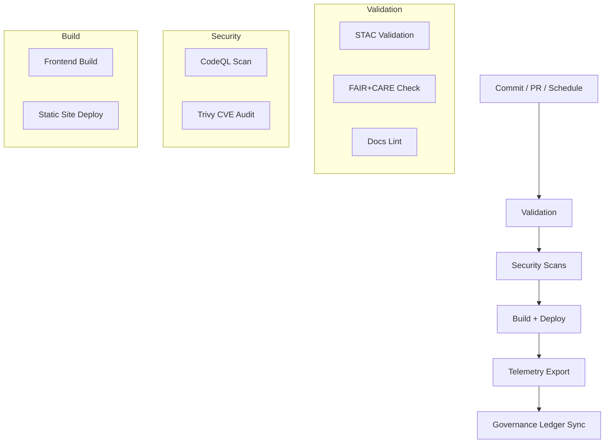

<div align="center">

# ⚙️ **Kansas Frontier Matrix — GitHub Infrastructure & CI/CD Architecture**  
`.github/ARCHITECTURE.md`

**Purpose:**  
Define the **automated governance, validation, and deployment pipelines** that power the Kansas Frontier Matrix (KFM) under **FAIR+CARE ethics**, **MCP-DL v6.3 reproducibility**, **SLSA provenance**, and **ISO 50001/14064** sustainability.  
This infrastructure guarantees that every commit, dataset, and model meets traceable FAIR+CARE and security standards with **automated auditing** and **immutable provenance**.

[](../docs/README.md)
[](../LICENSE)
[](../docs/standards/faircare.md)
[]()

</div>

---

## 📘 Overview
The **GitHub CI/CD Infrastructure** governs **validation, build, deployment, security scanning, and telemetry** for KFM.  
Each workflow runs in hardened GitHub Actions runners and publishes:
- **Auditable artifacts** (STAC/DCAT validations, FAIR+CARE ethics checks, AI audits)  
- **Telemetry snapshots** for energy, performance, and compliance  
- **Immutable SBOM & provenance manifests** (SPDX + release manifest)  

All workflows update the **FAIR+CARE Council Governance Ledger** for end-to-end transparency.

---

## 🗂️ Directory Layout
```plaintext
.github/
├── ARCHITECTURE.md                 # CI/CD architecture documentation (this file)
├── README.md                       # Automation overview
│
├── workflows/                      # Active GitHub Actions workflows
│   ├── stac-validate.yml           # STAC 1.0.0 validation (collections + items)
│   ├── faircare-validate.yml       # FAIR+CARE + data contract enforcement
│   ├── docs-lint.yml               # Markdown / YAML / JSON validation
│   ├── codeql.yml                  # Static code analysis (SARIF)
│   ├── trivy.yml                   # Container + dependency CVE scanning
│   ├── build-and-deploy.yml        # Frontend build + static deployment
│   ├── stac-dcat-bridge.yml        # STAC ↔ DCAT schema synchronization
│   ├── telemetry-export.yml        # Aggregates CI/CD + sustainability metrics
│   └── ai-model-audit.yml          # AI model bias / drift / explainability audit
│
├── ISSUE_TEMPLATE/                 # Standardized GitHub Issue Forms
│   ├── data_submission.yml         # STAC/DCAT dataset submission (YAML Issue Form)
│   ├── feature_request.yml         # Feature proposals
│   ├── bug_report.yml              # Reproducible defect reports
│   └── governance_form.yml         # FAIR+CARE Council review template
│
├── pull_request_template.md        # PR validation + FAIR+CARE checklist
├── dependabot.yml                  # Dependency hygiene + auto-updates
├── SECURITY.md                     # Vulnerability disclosure + patch policy
└── FUNDING.yml                     # Optional funding / sponsorship
```

---

## ⚙️ CI/CD Workflow Responsibilities
| Workflow | Description | Trigger | Output Artifact |
|---|---|---|---|
| `stac-validate.yml` | Validates STAC 1.0 / DCAT 3.0 metadata & structure | PR / Push | `reports/self-validation/stac/summary.json` |
| `faircare-validate.yml` | FAIR+CARE ethics & data-contract checks | PR / Push | `reports/fair/faircare_summary.json` |
| `docs-lint.yml` | Lints Markdown, YAML front-matter, JSON schemas | PR / Push | `reports/self-validation/docs/lint_summary.json` |
| `codeql.yml` | Static security analysis (SARIF) | PR / Schedule | `reports/security/codeql/*.sarif` |
| `trivy.yml` | CVE scan on images & lockfiles | PR / Push | `reports/security/trivy/*.json` |
| `build-and-deploy.yml` | Builds & deploys the web client/docs | After validations | `reports/build/build_metrics.json` |
| `stac-dcat-bridge.yml` | STAC↔DCAT synchronization + diffs | Schedule / Release | `releases/*/metadata-bridge.meta.json` |
| `telemetry-export.yml` | Aggregates CI/CD + sustainability metrics | Post-build | `releases/v10.0.0/focus-telemetry.json` |
| `ai-model-audit.yml` | AI bias/drift/explainability + model cards | Schedule / Model Commit | `reports/audit/ai_model_faircare.json` |

> All artifacts are hashed and referenced by `sbom.spdx.json` and `manifest.zip` for **SLSA provenance**.

---

## 🧮 CI/CD Automation Flow


---

## 🔒 Security & Compliance
| Control | Mechanism | Frequency | Policy |
|---|---|---|---|
| Static Code Analysis | CodeQL | On push + weekly | Fail PR on CRITICAL; SARIF review required |
| CVE Scan | Trivy | On Dockerfiles + lockfiles | Block merge on CRITICAL CVEs |
| Dependencies | Dependabot | Weekly | Auto-PRs with reviewer assignment |
| Secrets | GitHub Encrypted Secrets | Continuous | Rotation; no plaintext in repo |
| Branch Protection | Required Checks | Always | 2 approvals + green CI + signed commits |
| License Audit | SPDX Export | Each Release | SBOM validation + attestation |

**Disclosure Policy:** See `.github/SECURITY.md` for coordinated reporting, patch SLAs, and backport policy.

---

## ⚖️ FAIR+CARE & Governance Integration
| Layer | Enforcement | Standard |
|---|---|---|
| FAIR | STAC/DCAT metadata validation & catalog integrity | `stac-validate.yml` / `stac-dcat-bridge.yml` |
| CARE | Cultural sensitivity, consent & context | `governance_form.yml` + reviewer gates |
| MCP-DL | Docs-as-Code, telemetry, provenance | `docs-lint.yml` + `telemetry-export.yml` |
| ISO 50001 / 14064 | Energy & carbon management | Telemetry export + sustainability LCA |
| SLSA / SBOM | Supply-chain integrity & attestation | `sbom.spdx.json`, `manifest.zip` |

**Ledgers & Reports (immutable):**
- `docs/reports/audit/github_workflows_ledger.json`  
- `docs/reports/audit/governance_ledger.json`  
- `docs/reports/audit/ai_model_audit.json`  

---

## 📊 Telemetry Reporting
KFM aggregates CI/CD performance and sustainability metrics into:
- **Telemetry Snapshot:** `releases/v10.0.0/focus-telemetry.json`  
- **Dashboards:** `docs/reports/telemetry/*.json`

### Metrics Captured
| Metric | Description |
|---|---|
| `workflow_duration_sec` | Per-workflow run time |
| `build_energy_wh` | Energy used during build (ISO 50001) |
| `carbon_gco2e` | Estimated CO₂e (ISO 14064) |
| `faircare_score` | FAIR+CARE compliance score |
| `security_pass_rate` | % runs without CRITICAL CVEs |

---

## 🧠 Governance Workflow
Every CI/CD cycle:
1. **Signs SBOM & Release Manifest** (SPDX + checksums).  
2. **Uploads Attestations** to Governance Ledger.  
3. **Executes FAIR+CARE Audit** with reviewer gates when required.  
4. **Exports Telemetry** for sustainability and ethics reporting.  

All logs are **append-only** and linked to commit SHAs for verifiable provenance.

---

## 🗺️ Cross-References
- [Automation Overview](README.md)  
- [FAIR+CARE Framework](../docs/standards/faircare.md)  
- [System Architecture](../src/ARCHITECTURE.md)  
- [Docs Index](../docs/README.md)

---

## 🕰️ Version History
| Version | Date | Author | Summary |
|---|---|---|---|
| v10.0.0 | 2025-11-09 | A. Barta | Upgraded automation flow; added AI audit pipeline, ISO 50001 telemetry, SLSA/ SBOM provenance alignment, and governance ledger sync. |
| v9.7.0 | 2025-11-05 | A. Barta | Added security posture, governance mapping, telemetry artifacts. |
| v9.5.0 | 2025-10-20 | A. Barta | Integrated STAC↔DCAT bridge and FAIR+CARE automation. |
| v9.0.0 | 2025-06-01 | KFM Core Team | Initial CI/CD architecture documentation. |

---

<div align="center">

**© 2025 Kansas Frontier Matrix — MIT / CC-BY 4.0**  
Automated under **Master Coder Protocol v6.3** · FAIR+CARE Certified · Diamond⁹ Ω / Crown∞Ω Ultimate Certified  
[Back to Automation Overview](README.md) · [Governance Charter](../docs/standards/governance/ROOT-GOVERNANCE.md)

</div>