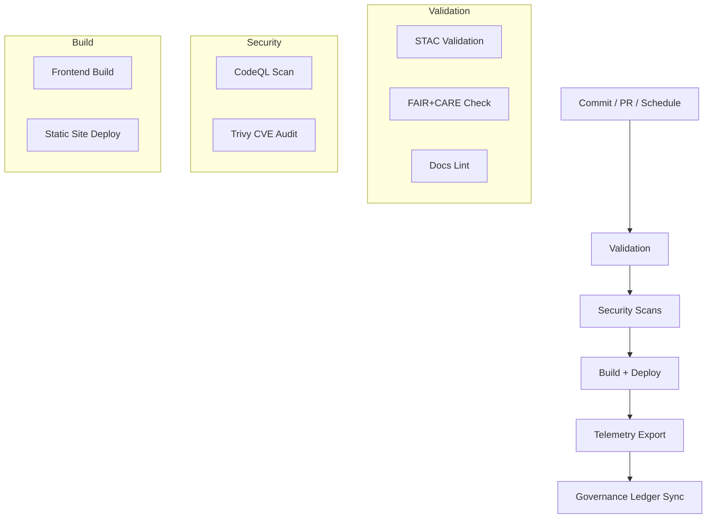

<div align="center">

# ⚙️ **Kansas Frontier Matrix — GitHub Infrastructure & CI/CD Architecture**  
`.github/ARCHITECTURE.md`

**Purpose:**  
Define the **automated governance, validation, and deployment pipelines** that power the Kansas Frontier Matrix (KFM) under **FAIR+CARE ethics**, **MCP-DL v6.3 reproducibility**, and **ISO 50001** sustainability.  
This infrastructure ensures every commit, dataset, and model meets traceable FAIR+CARE and security standards with automated auditing.

[](../docs/README.md)
[](../LICENSE)
[](../docs/standards/faircare.md)
[]()

</div>

---

## 📘 Overview

The **GitHub CI/CD Infrastructure** governs validation, build, deployment, and telemetry collection for KFM.  
Each workflow executes inside a secure GitHub Actions environment and publishes:
- **Auditable artifacts** (STAC, DCAT, FAIR+CARE reports)
- **Telemetry dashboards**
- **Immutable SBOM and provenance manifests**

All workflows integrate with the **FAIR+CARE Council Governance Ledger** for complete transparency.

---

## 🗂️ Directory Layout

```plaintext
.github/
├── ARCHITECTURE.md                 # CI/CD architecture documentation (this file)
├── README.md                       # Automation overview
│
├── workflows/                      # Active GitHub Actions workflows
│   ├── stac-validate.yml           # STAC 1.0.0 validation (collections + items)
│   ├── faircare-validate.yml       # FAIR+CARE and data contract enforcement
│   ├── docs-lint.yml               # Markdown + YAML + JSON validation
│   ├── codeql.yml                  # Static code analysis for vulnerabilities
│   ├── trivy.yml                   # Container dependency and CVE scanning
│   ├── build-and-deploy.yml        # Frontend build + site deployment
│   ├── stac-dcat-bridge.yml        # STAC ↔ DCAT schema synchronization
│   ├── telemetry-export.yml        # Aggregates metrics into telemetry dashboards
│   └── ai-model-audit.yml          # FAIR+CARE validation for AI models
│
├── ISSUE_TEMPLATE/                 # Standardized GitHub Issue Forms
│   ├── data_submission.yml         # STAC/DCAT dataset submission
│   ├── feature_request.yml         # Feature proposals
│   ├── bug_report.yml              # Defect reports
│   └── governance_form.yml         # FAIR+CARE Council review template
│
├── pull_request_template.md        # PR validation and FAIR+CARE checklist
├── dependabot.yml                  # Dependency hygiene + auto updates
├── SECURITY.md                     # Vulnerability disclosure + patch policy
└── FUNDING.yml                     # Optional funding / sponsorship declaration
```

---

## ⚙️ CI/CD Workflow Responsibilities

| Workflow | Description | Trigger | Output Artifact |
|-----------|--------------|----------|-----------------|
| `stac-validate.yml` | Validates STAC 1.0 metadata and structure | PR / Push | `reports/self-validation/stac/summary.json` |
| `faircare-validate.yml` | FAIR+CARE ethics + data contract validation | PR / Push | `reports/fair/faircare_summary.json` |
| `docs-lint.yml` | Lints documentation and YAML metadata | PR / Push | `reports/self-validation/docs/lint_summary.json` |
| `codeql.yml` | Static security analysis | Scheduled / PR | `reports/security/codeql/*.sarif` |
| `trivy.yml` | Dependency vulnerability scanning | PR / Push | `reports/security/trivy/*.json` |
| `build-and-deploy.yml` | Builds & deploys frontend / docs | After validations | `reports/build/build_metrics.json` |
| `stac-dcat-bridge.yml` | STAC ↔ DCAT synchronization | Scheduled / Release | `releases/*/metadata-bridge.meta.json` |
| `telemetry-export.yml` | Aggregates system telemetry | Post-build | `releases/v10.0.0/focus-telemetry.json` |
| `ai-model-audit.yml` | Audits AI models for bias/fairness drift | Scheduled / Model Commit | `reports/audit/ai_model_faircare.json` |

---

## 🧮 CI/CD Automation Flow



---

## 🔒 Security & Compliance

| Control | Mechanism | Frequency | Policy |
|----------|------------|------------|---------|
| Static Code Analysis | CodeQL | On push + weekly | Fail on CRITICAL issues |
| CVE Scan | Trivy | On Docker + lockfiles | Block CRITICAL vulnerabilities |
| Dependencies | Dependabot | Weekly | Auto-updates w/ review |
| Secrets | GitHub Secrets | Continuous | Encrypted + rotated |
| Branch Protection | Required Checks | Always | 2 reviews + green CI |
| License Audit | SPDX Export | Each Release | SBOM validation |

**Disclosure Policy:**  
All vulnerabilities are reported and tracked in `.github/SECURITY.md`.

---

## ⚖️ FAIR+CARE + Governance Integration

| Layer | Enforcement | Standard |
|--------|--------------|----------|
| FAIR | STAC/DCAT metadata validation | `stac-validate.yml` |
| CARE | Cultural data oversight + review forms | `governance_form.yml` |
| MCP-DL | Documentation and telemetry integration | `docs-lint.yml`, `telemetry-export.yml` |
| ISO 50001 | Energy + sustainability tracking | `telemetry-export.yml` |
| SLSA | Provenance + SBOM verification | `sbom.spdx.json`, `manifest.zip` |

**Ledgers & Reports:**  
- `docs/reports/audit/github_workflows_ledger.json`  
- `docs/reports/audit/governance_ledger.json`  
- `docs/reports/audit/ai_model_audit.json`  

---

## 📊 Telemetry Reporting

KFM aggregates CI/CD performance and sustainability metrics into:
- **Telemetry snapshot:** `releases/v10.0.0/focus-telemetry.json`
- **Dashboard analytics:** `docs/reports/telemetry/*.json`

### Metrics Captured
| Metric | Description |
|---------|--------------|
| `workflow_duration_sec` | Time for each CI/CD workflow run |
| `build_energy_wh` | Energy used during site build |
| `carbon_gco2e` | CO₂ output (ISO 50001) |
| `faircare_score` | FAIR+CARE compliance score |
| `security_pass_rate` | % of scans passing without CRITICAL CVEs |

Telemetry visualizations available in Grafana dashboards under `/docs/reports/telemetry/`.

---

## 🧠 Governance Workflow

Each CI/CD run:
1. Signs its SBOM and manifest.  
2. Uploads checksum to Governance Ledger.  
3. Triggers FAIR+CARE audit workflow.  
4. Records telemetry + ethics certification.  

All logs are immutable and linked to versioned commits for provenance validation.

---

## 🕰️ Version History

| Version | Date | Author | Summary |
|----------|------|---------|----------|
| v10.0.0 | 2025-11-08 | A. Barta | Upgraded automation flow, added AI audit pipeline, ISO 50001 telemetry, and SBOM provenance alignment. |
| v9.7.0 | 2025-11-05 | A. Barta | Added security posture, governance mapping, and telemetry artifacts. |
| v9.5.0 | 2025-10-20 | A. Barta | Integrated STAC↔DCAT bridge and FAIR+CARE automation. |
| v9.0.0 | 2025-06-01 | KFM Core Team | Initial CI/CD architecture documentation. |

---

<div align="center">

**© 2025 Kansas Frontier Matrix — MIT / CC-BY 4.0**  
Automated under **Master Coder Protocol v6.3** · FAIR+CARE Certified · Diamond⁹ Ω / Crown∞Ω Ultimate Certified  
[Back to Automation Overview](README.md) · [Governance Charter](../docs/standards/governance/ROOT-GOVERNANCE.md)

</div>
