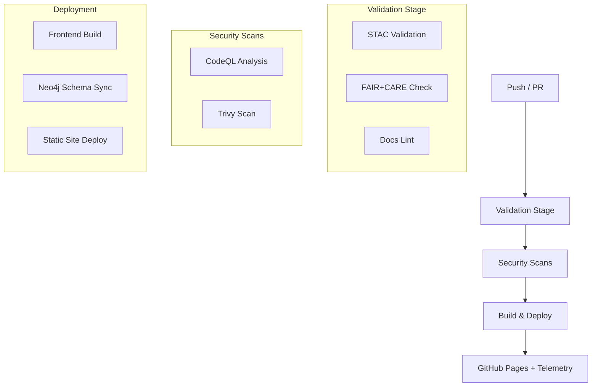

<div align="center">

# ⚙️ **Kansas Frontier Matrix — GitHub Infrastructure & CI/CD Architecture**
`.github/ARCHITECTURE.md`

**Purpose:** Describe the continuous integration and governance systems that automate, validate, and deploy the Kansas Frontier Matrix (KFM) ecosystem through GitHub Actions and repository-level architecture.

[](../docs/README.md)
[](../LICENSE)
[]()
[](../docs/standards/faircare.md)
[]()

</div>

---

## 🧩 Overview

The `.github/` directory orchestrates **automation, governance, and reproducibility** for the Kansas Frontier Matrix monorepo.  
It defines how the repository validates documentation, enforces FAIR+CARE compliance, secures its dependencies, and deploys the KFM web app.

KFM’s **CI/CD architecture** is powered by **GitHub Actions**, **GitHub Pages**, and **pre-commit hooks**, ensuring every commit maintains the Diamond⁹ Ω / Crown∞Ω standards for documentation and data integrity.

---

## 🧱 Repository Automation Layers

KFM employs three tiers of GitHub-based automation:

| Layer | Function | Toolchain |
|--------|-----------|-----------|
| **Validation** | Ensures correctness of data, code, and docs. | `stac-validate.yml`, `faircare-validate.yml`, `docs-lint.yml` |
| **Security** | Scans dependencies, containers, and workflow files. | `codeql.yml`, `trivy.yml` |
| **Deployment** | Publishes builds and telemetry dashboards. | `build-and-deploy.yml`, `pages-deploy.yml` |

---

## 🧮 Core CI/CD Workflows

Located in `.github/workflows/`, each workflow is modular and reusable across environments.

### 1. 🧪 `stac-validate.yml`
**Purpose:** Validate all datasets against the [STAC 1.0.0](https://stacspec.org) schema.

**Key Tasks:**
- Run `pystac validate data/stac/`  
- Check JSON formatting, metadata consistency, and links.  
- Upload validation reports to `reports/self-validation/`.

**Triggers:**  
- `push` or `pull_request` events affecting `data/stac/**`  
- Manual runs for re-validation.

---

### 2. 🌍 `faircare-validate.yml`
**Purpose:** Enforce FAIR (Findable, Accessible, Interoperable, Reusable) + CARE (Collective Benefit, Authority to Control, Responsibility, Ethics) principles.

**Runs:**
- `python tools/validate_data.py --faircare`
- Generates reports under `reports/fair/**`.

**CI Gates:**  
PRs fail automatically if datasets lack licensing, provenance, or care annotations.

---

### 3. 📘 `docs-lint.yml`
**Purpose:** Verify all Markdown and YAML documentation consistency.

**Checks:**
- Enforce headers, badges, and horizontal rules per `docs/standards/markdown_rules.md`.
- Confirm front-matter schema correctness.
- Run markdownlint and yamllint.

**Applies To:**  
All files under `/docs`, `/src/**/README.md`, `/data/**/README.md`.

---

### 4. 🛡️ `codeql.yml`
**Purpose:** Analyze source code for vulnerabilities or code-quality issues.

**Scope:**  
- Python (ETL, API, pipelines)
- JavaScript/TypeScript (frontend)

**Workflow:**  
Uses GitHub’s `codeql-action/analyze` with weekly schedule.  
Outputs reports to `reports/security/codeql/`.

---

### 5. 🔍 `trivy.yml`
**Purpose:** Container and dependency vulnerability scanning.

**Process:**
- Scans Docker images (`Dockerfile`, `docker-compose.yml`)
- Reports vulnerabilities and severity.
- Artifacts archived under `reports/security/trivy/`.

**Policy:**  
Fails CI if any `CRITICAL` vulnerabilities are detected.

---

### 6. 🚀 `build-and-deploy.yml`
**Purpose:** Build and deploy the KFM website (React + MapLibre frontend) to GitHub Pages.

**Steps:**
- Build React app with Node.js.
- Generate static assets from `web/build/`.
- Deploy to `gh-pages` branch.
- Attach build telemetry JSON (`focus-telemetry.json`).

**Trigger:**  
Runs on successful validation and security workflows.

---

### 7. 🧭 `stac-dcat-bridge.yml`
**Purpose:** Synchronize metadata between **STAC** and **DCAT 3.0** catalogs.

**Logic:**
- Transforms STAC Items into DCAT Datasets for semantic search.
- Validates with JSON Schema (`schemas/dcat-v3.json`).
- Exports results to `releases/v*/metadata-bridge.meta.json`.

---

## 🧩 Issue & PR Templates

All templates reside in `.github/ISSUE_TEMPLATE/` and enforce consistent metadata for community governance.

| Template | Description |
|-----------|-------------|
| `data_submission.yml` | Structured form for submitting new datasets (requires license, source, bounding box). |
| `feature_request.yml` | Proposal template for adding features or visualizations. |
| `bug_report.yml` | For tracking and reproducing software issues. |
| `governance_form.yml` | For documenting policy or ethical reviews (FAIR+CARE compliance). |

**Pull Request Template:** `.github/pull_request_template.md` — requires summary, validation logs, and governance sign-off.

---

## 🧬 Pre-Commit Hooks

Pre-commit hooks (defined in `.pre-commit-config.yaml`) run locally before commits:

- Check JSON/YAML syntax (`jsonlint`, `yamllint`)
- Enforce Markdown style guide
- Verify data contracts (`data_contract_ref`)
- Confirm valid SPDX license identifiers in headers

Developers should install pre-commit locally:
```bash
pip install pre-commit
pre-commit install
```

---

## 🧾 Automation Flow Diagram



---

## 🧠 Governance Integration

Each workflow embeds **governance checkpoints** ensuring data and code comply with MCP standards:

| Checkpoint | Description | Trigger |
|-------------|--------------|----------|
| `data-contract-validation` | Ensures every data layer has matching schema and license. | Pre-merge |
| `audit-log-generation` | Creates a provenance log (`audit/ledger.json`) per build. | Post-merge |
| `sbom-generation` | Builds SPDX bill of materials for every release. | Tag push |
| `telemetry-push` | Sends anonymized pipeline metrics to `releases/v9.7.0/focus-telemetry.json`. | On release |

All logs and manifests are archived in the `releases/` directory for long-term reproducibility.

---

## 🧾 Governance & Provenance Files

| File | Purpose |
|------|----------|
| `.github/ARCHITECTURE.md` | This document, defining CI/CD architecture and validation layers. |
| `.github/workflows/` | YAML workflows for automation and governance. |
| `.github/ISSUE_TEMPLATE/` | Contributor-facing forms for structured collaboration. |
| `.github/pull_request_template.md` | Standardized PR submission checklist. |
| `.github/dependabot.yml` | Automatic dependency updates and alerts. |
| `.github/FUNDING.yml` | Open collective or sponsor links. |

---

## 🔒 Security & Access

- **Branch Protection:** `main` requires 2 reviews and all CI checks to pass.  
- **Secret Management:** Environment secrets stored in GitHub Encrypted Secrets (e.g., API keys, deploy tokens).  
- **SBOM & SLSA:** Every deployment attaches an SPDX SBOM manifest and a SLSA provenance attestation.  
- **Vulnerability Alerts:** Dependabot monitors all packages and triggers alert PRs weekly.

---

## 📊 Telemetry and Reporting

KFM maintains continuous performance and compliance telemetry:
- Build status and duration.
- Dataset validation counts.
- FAIR+CARE compliance score.
- AI model reproducibility metrics.

Reports are generated in `releases/v9.7.0/focus-telemetry.json` and visualized in the governance dashboard.

---

## 🕰️ Version History

| Version | Date | Author | Summary |
|----------|------|---------|----------|
| v9.7.0 | 2025-11-05 | A. Barta | Established unified GitHub automation architecture and validation flow. |
| v9.5.0 | 2025-10-20 | A. Barta | Added STAC/DCAT synchronization and CI telemetry export. |
| v9.3.1 | 2025-09-05 | KFM Core Team | Expanded FAIR+CARE and Markdown lint workflows. |
| v9.0.0 | 2025-06-01 | KFM Core Team | Initial CI/CD automation setup with validation pipelines. |

---

<div align="center">

**© 2025 Kansas Frontier Matrix — MIT / CC-BY 4.0**  
Automated under **Master Coder Protocol v6.3** · FAIR+CARE Certified · Diamond⁹ Ω / Crown∞Ω Ultimate Certified  
[Return to Main README](../README.md) · [Contributing Guide](../CONTRIBUTING.md)

</div>
