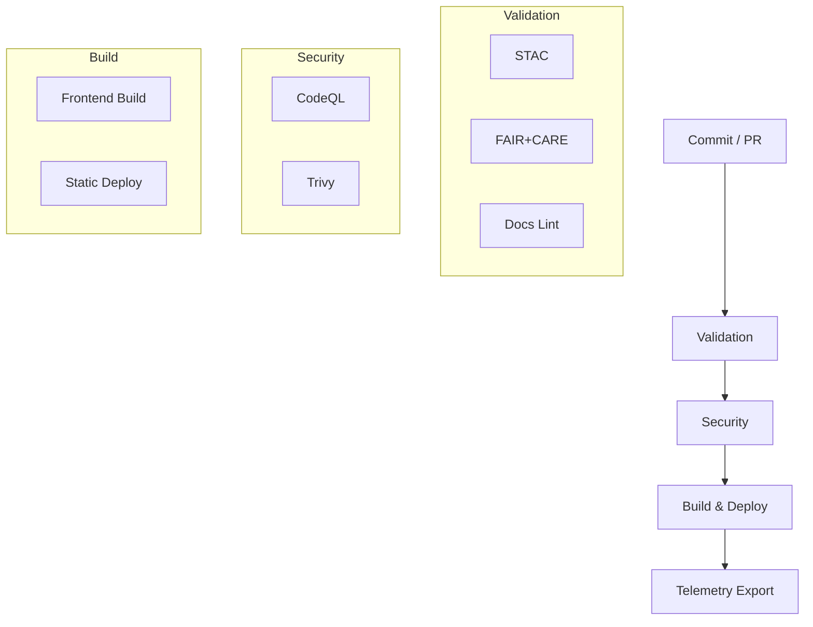

<div align="center">

# ⚙️ **Kansas Frontier Matrix — GitHub Infrastructure & CI/CD Architecture**
`.github/ARCHITECTURE.md`

**Purpose:** Describe the repository-level automation and governance systems — validation, security, build/deploy, telemetry — that guarantee **MCP v6.3** reproducibility and **FAIR+CARE** data ethics for KFM.

[](../docs/README.md)
[](../LICENSE)
[](../docs/standards/faircare.md)
[]()

</div>

---

## 📘 Overview

This document details the **CI/CD architecture** that validates datasets and docs, scans security, deploys the site, and exports telemetry.  
All runs are **artifacted**, **checksummed**, and **ledgered** for long-term auditability, with SBOM & manifest references per release.

---

## 🗂️ Directory Layout (CI/CD & Governance)

```
.github/
├── ARCHITECTURE.md                 # This file
├── README.md                       # High-level automation overview
│
├── workflows/
│   ├── stac-validate.yml           # STAC validation (Items/Collections)
│   ├── faircare-validate.yml       # FAIR+CARE + contracts validation
│   ├── docs-lint.yml               # Markdown/YAML/JSON structure checks
│   ├── codeql.yml                  # Static code analysis
│   ├── trivy.yml                   # Container & dependency CVE scanning
│   ├── build-and-deploy.yml        # Frontend build + deploy
│   ├── stac-dcat-bridge.yml        # STAC ↔ DCAT metadata sync
│   └── telemetry-export.yml        # Telemetry aggregation
│
├── ISSUE_TEMPLATE/
│   ├── data_submission.yml         # Dataset/STAC submission
│   ├── feature_request.yaml        # Feature proposals
│   ├── bug_report.yaml             # Defect reports
│   └── governance_form.yml         # FAIR+CARE review form
│
├── pull_request_template.md        # PR validation checklist
├── dependabot.yml                  # Dependency updates
├── SECURITY.md                     # Vulnerability disclosure
└── FUNDING.yml                     # (Optional) sponsorship
```

---

## 🧩 CI/CD Workflows — Responsibilities & Triggers

| Workflow | Enforces | Typical Trigger | Artifacts |
|----------|----------|------------------|-----------|
| `stac-validate.yml` | STAC 1.0.0 spec, link integrity | PR/Push on `data/stac/**` | `reports/self-validation/stac/_summary.json` |
| `faircare-validate.yml` | FAIR+CARE, data contracts | PR/Push on `data/**` | `reports/fair/faircare_summary.json` |
| `docs-lint.yml` | Markdown/YAML/JSON conventions | PR/Push on `docs/**` | `reports/self-validation/docs/lint_summary.json` |
| `codeql.yml` | Static code security | Scheduled + PR | SARIF under `reports/security/codeql/` |
| `trivy.yml` | Container/dependency CVEs | PR/Push on Docker/lockfiles | `reports/security/trivy/*.json` |
| `build-and-deploy.yml` | Build & deploy pages | After validations | `docs/reports/telemetry/build_metrics.json` |
| `stac-dcat-bridge.yml` | STAC↔DCAT export | Scheduled + release | `releases/*/metadata-bridge.meta.json` |
| `telemetry-export.yml` | Metrics aggregation | Every build | `releases/v9.7.0/focus-telemetry.json` |

---

## 🧮 Automation Flow



---

## 🔒 Security Posture

| Control | Mechanism | Policy |
|--------|-----------|--------|
| Static Analysis | CodeQL | Scheduled + push |
| CVE Scanning | Trivy | Fail on CRITICAL |
| Dependency Hygiene | Dependabot | Weekly PRs |
| Branch Protection | GH Rules | 2 reviews + green CI |
| Secrets | GH Encrypted Secrets | No plaintext; rotate |

**Disclosure:** See `.github/SECURITY.md`.

---

## ⚖️ Governance & Ethics Integration

All automation integrates **FAIR+CARE** and **MCP** standards:

| Layer | Standard | Enforcement |
|------|----------|-------------|
| FAIR | F/A/I/R metadata rules | `faircare-validate.yml` |
| CARE | Council review workflow | `governance_form.yml` |
| MCP | Docs-as-code, telemetry, provenance | Docs lint + telemetry export |
| SLSA | Supply chain attestation | SBOM + manifest per release |

**Ledgers:**  
`docs/reports/audit/{governance-ledger.json, github-workflows-ledger.json, ai_models.json, release-manifest-log.json}`

---

## 📊 Telemetry & Reporting

**Single-file** telemetry snapshot: `releases/v9.7.0/focus-telemetry.json` consolidates:
- Success/failure rates and durations (per workflow)  
- FAIR+CARE compliance metrics  
- STAC/DCAT validation counts  
- SBOM/manifest refs  
- Author/commit metadata

Dashboard feeds: `docs/reports/telemetry/*.json`.

---

## 🗺️ Cross-References

- [Automation Overview](README.md)  
- [System Architecture](../src/ARCHITECTURE.md)  
- [Contributing Guide](../CONTRIBUTING.md)  
- [FAIR+CARE](../docs/standards/faircare.md) · [Markdown Rules](../docs/standards/markdown_rules.md)

---

## 🕰️ Version History

| Version | Date | Author | Summary |
|----------|------|---------|----------|
| v9.7.0 | 2025-11-05 | A. Barta | Alignment pass; added workflow matrix, security posture, and telemetry mapping. |
| v9.5.0 | 2025-10-20 | A. Barta | Integrated STAC↔DCAT bridge and FAIR+CARE automation. |
| v9.0.0 | 2025-06-01 | KFM Core Team | Initial CI/CD architecture documentation. |

---

<div align="center">

**© 2025 Kansas Frontier Matrix — MIT / CC-BY 4.0**  
Automated under **Master Coder Protocol v6.3** · FAIR+CARE Certified · Diamond⁹ Ω / Crown∞Ω Ultimate Certified  
[Back to Automation Overview](README.md) · [Governance Charter](../docs/standards/governance/ROOT-GOVERNANCE.md)

</div>
