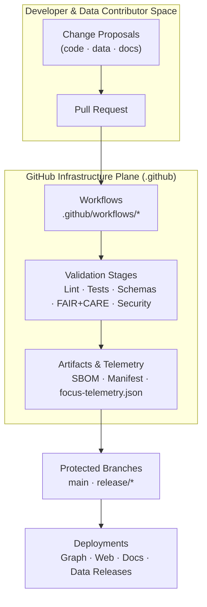
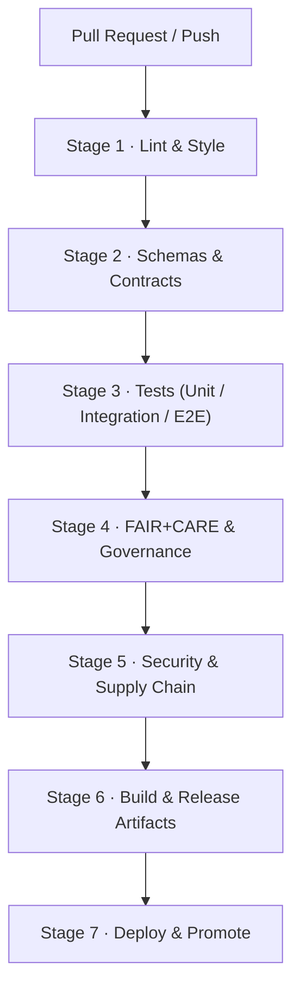

<div align="center">

# ⚙️ **Kansas Frontier Matrix — GitHub Infrastructure & CI/CD Architecture**  
`.github/ARCHITECTURE.md`

**Purpose**  
Define the **complete autonomous GitHub infrastructure architecture** for the Kansas Frontier Matrix (KFM) — including CI/CD pipelines, validation workflows, governance automation, telemetry export, SBOM/manifest integrity verification, documentation linting, and FAIR+CARE-compliant operational safeguards.

[](../docs/kfm_markdown_protocol_v11.md)  
[](../docs/standards/faircare.md)  
[](../LICENSE)

</div>

--- ✦ ---

## 📘 1. Overview

The `.github/` directory hosts KFM’s **automated governance and CI/CD engine**.  
This architecture file describes **how** GitHub:

- Validates **code, data, docs, schemas, and governance metadata**  
- Enforces **FAIR+CARE, sovereignty, and security rules**  
- Builds and publishes **releases, web/apps, and data catalogs**  
- Produces **SBOMs, manifests, and telemetry** for governance and observability  
- Protects **protected branches and production environments** via strict checks  

Where `.github/README.md` provides a **high-level overview**, this document is the **deep technical blueprint** for the CI/CD and governance automation.

--- ✦ ---

## 🧱 2. Infrastructure Context in the KFM Stack



GitHub infrastructure is the **gatekeeper**:

- All changes must pass through **Hub** before landing in **protected branches**.  
- All deployments consume **artifacts** and **telemetry** produced here.  

--- ✦ ---

## 🗂️ 3. Directory Structure (Infrastructure View)

```text
.github/
│
├── ARCHITECTURE.md                 # This CI/CD & governance architecture blueprint
├── README.md                       # High-level GitHub infrastructure overview
│
├── workflows/                      # GitHub Actions workflows (CI/CD + governance)
│   ├── ci.yml                      # Main CI: lint, tests, schemas, build
│   ├── docs_validate.yml           # KFM-MDP v11 markdown + front-matter validation
│   ├── stac_validate.yml           # STAC Item/Collection validation
│   ├── dcat_validate.yml           # DCAT dataset validation
│   ├── faircare_validate.yml       # FAIR+CARE & governance compliance validator
│   ├── telemetry_export.yml        # Telemetry bundling for releases
│   ├── sbom_verify.yml             # SBOM integrity & checksum validation
│   ├── site.yml                    # Web/docs deployment workflow
│   ├── security_audit.yml          # Dependency & vulnerability scanning
│   └── data_pipeline.yml           # ETL/data workflow test & trigger orchestration
│
├── ISSUE_TEMPLATE/                 # Governance-aware issue templates
│   ├── bug_report.md
│   ├── feature_request.md
│   └── data_issue.md
│
├── PULL_REQUEST_TEMPLATE.md        # Governance checklist & metadata requirements
├── CODEOWNERS                      # Ownership map & review boundaries
├── dependabot.yml                  # Dependency update automation
└── SECURITY.md                     # Security & vulnerability disclosure policy
```

--- ✦ ---

## 🔁 4. CI/CD Stage Architecture (v11)

### 4.1 Stage Diagram



Each stage is implemented by one or more workflows and **all must succeed** before deployment or merge to protected branches.

---

### 4.2 Stage 1 — Lint & Style

**Workflows:** `ci.yml`, `docs_validate.yml`  

Checks:

- ESLint & Prettier (web + TypeScript)  
- Stylelint (CSS/Tailwind, design tokens)  
- Python/other language linters (where configured)  
- Markdown validation:
  - KFM-MDP v11 rules  
  - Required YAML front-matter keys  
  - Single outer fence integrity conventions  
  - No forbidden patterns (e.g., broken Mermaid fences)  

Failure → status checks red, PR cannot be merged.

---

### 4.3 Stage 2 — Schemas & Contracts

**Workflows:** `ci.yml`, `stac_validate.yml`, `dcat_validate.yml`  

Responsibilities:

- **STAC** validation: Items, Collections, and Catalogs  
- **DCAT** validation: dataset descriptors and distributions  
- **Telemetry** schemas: `schemas/telemetry/*`  
- **JSON-LD** contexts: `schemas/jsonld/*`  
- **Story Nodes & Focus Mode** schemas  
- ETL **pipeline contract** JSON/YAML schemas  

This guarantees that **all structured artifacts** are machine-readable and consistent.

---

### 4.4 Stage 3 — Tests (Unit → Integration → E2E)

**Workflows:** `ci.yml`, `data_pipeline.yml`  

Coverage:

- Unit tests for:
  - ETL utilities (`src/pipelines/*`)  
  - Graph adapters  
  - Web utilities and hooks  

- Integration tests for:
  - API ↔ graph interactions  
  - ETL ingestion + graph writes  
  - Story Node generation and retrieval  

- E2E tests:
  - Selected user journeys in the web UI  
  - Focus Mode interactions (where feasible)  

- A11y tests:
  - Automated accessibility checks on key pages  

Any failing test → **no merge, no release**.

---

### 4.5 Stage 4 — FAIR+CARE & Governance

**Workflow:** `faircare_validate.yml`  

Enforces:

- CARE labels for datasets and analyses  
- Sovereignty & masking rules for cultural/Indigenous/archaeological assets  
- FAIR metadata completeness and quality (F1–A1–I1–R1)  
- Governance annotations for Story Nodes and Focus Mode outputs  
- Required provenance and licensing fields for new data additions  

Results feed:

- Governance dashboards  
- Decision logs in the governance ledger  
- PR comments explaining violations  

---

### 4.6 Stage 5 — Security & Supply Chain

**Workflows:** `security_audit.yml`, `sbom_verify.yml`, `dependabot.yml`  

Includes:

- Dependency vulnerability scanning (GitHub advisories/OSV)  
- SBOM verification against `sbom.spdx.json`  
- Checksums for critical artifacts (manifest entries vs actual)  
- SLSA-like provenance for artifacts and workflow runs  
- Policy gating for Dependabot PRs (must pass tests + security review)  

No clean security stage → **no deployment**.

---

### 4.7 Stage 6 — Build & Release Artifacts

**Workflows:** `ci.yml`, `telemetry_export.yml`, `site.yml`  

Outputs:

- Web frontend bundles  
- Docs site (if separate build)  
- `manifest.zip` listing assets and checksums  
- `sbom.spdx.json` for code dependencies  
- `focus-telemetry.json` summarizing CI, governance, and performance metrics  

Artifacts are uploaded and attached to:

- GitHub Releases  
- External storage / deployment endpoints as configured  

---

### 4.8 Stage 7 — Deploy & Promote

**Workflow:** `site.yml` + environment-specific workflows  

Deployment path:

- `dev` → `staging` → `production` environments  
- Promotion gated by:
  - Successful CI stages  
  - Manual approvals for sensitive changes  
  - Environment protection rules (secrets, approvals)  

--- ✦ ---

## 🧩 5. Workflow Responsibility Matrix

| Workflow                 | Primary Role                                         | Stages Covered                        |
|--------------------------|------------------------------------------------------|---------------------------------------|
| `ci.yml`                 | Core CI: lint, test, build, basic schemas           | 1, 2, 3, 6                            |
| `docs_validate.yml`      | Markdown + YAML front-matter + MDP v11 checks       | 1                                     |
| `stac_validate.yml`      | STAC Items/Collections validation                    | 2                                     |
| `dcat_validate.yml`      | DCAT datasets validation                             | 2                                     |
| `faircare_validate.yml`  | FAIR+CARE & governance enforcement                   | 4                                     |
| `security_audit.yml`     | Vulnerability scanning & workflow hardening          | 5                                     |
| `sbom_verify.yml`        | SBOM generation and checksum validation              | 5, 6                                  |
| `telemetry_export.yml`   | Telemetry collation into `focus-telemetry.json`     | 6                                     |
| `site.yml`               | Frontend/docs build + deploy                         | 6, 7                                  |
| `data_pipeline.yml`      | Data/ETL orchestration and integration testing       | 3                                     |

--- ✦ ---

## 🧩 6. Governance Hooks: Issues & PRs

### Issue Templates

The templates enforce **structured, governance-aware reporting**:

- `bug_report.md` → impact, repro steps, severity, affected components  
- `feature_request.md` → user story, a11y & governance impact, performance considerations  
- `data_issue.md` → dataset identifiers, CARE classification, sovereignty & license issues, requested action  

### PR Template

The PR template requires contributors to specify:

- CARE classification & sensitivity level  
- Provenance and licensing for new/changed data  
- A11y considerations  
- Impact on telemetry, schemas, and ontologies  
- Required reviewers (including governance delegates when needed)  

PRs that skip these fields are **not compliant** with KFM v11 workflow expectations.

--- ✦ ---

## 🔐 7. Security Architecture & Branch Protection

Security principles:

- Protected branches for `main` and `release/*` with required checks  
- CODEOWNERS-enforced review for:
  - `.github/**`  
  - `schemas/**`  
  - `docs/standards/**`  
  - `src/pipelines/**`  

- Restricted permissions for:
  - Environment secrets  
  - Workflow dispatch triggers  
  - Release creation  

Security policies live in `SECURITY.md` and are **enforced via workflows** where possible.

--- ✦ ---

## 📊 8. Telemetry & Observability from CI

GitHub CI is a core source of observability:

- Job-level metrics (success/failure, duration)  
- Test pass/fail counts and coverage signals  
- Schema/gov/security failure categories  
- Energy & carbon approximations per job (when instrumented)  
- A11y coverage metrics  

These feed into:

```text
releases/<version>/focus-telemetry.json
```

and are used by:

- Governance dashboards  
- Reliability and sustainability reports  
- Focus Mode internal introspection Story Nodes  

--- ✦ ---

## 🛟 9. Failure Modes & Recovery

Common failure classes:

- **Lint/format failure** → developer fixes style/format and re-pushes.  
- **Schema/gov failure** → requires metadata corrections or governance review.  
- **Test failure** → bug fix, test correction, or infrastructure fix.  
- **Security failure** → dependency updates or workflow hardening.  

Recovery patterns:

- Small, focused PRs that address specific failure categories  
- Governance notes added to PR (and governance ledger if needed)  
- Re-running failed workflows only after code/config changes  

--- ✦ ---

## 🧾 10. Release & Artifact Lineage

Every release is accompanied by:

- SBOM + checksums (`sbom.spdx.json`, `manifest.zip`)  
- Governance & telemetry bundle (`focus-telemetry.json`)  
- STAC/DCAT exports and catalogs  
- Tagged Git commit and SLSA-style attestation  

`event_source_id: "ledger:.github/ARCHITECTURE.md"` records that **changes to this architecture** are logged in the governance ledger, ensuring:

- Traceable evolution of CI/CD governance  
- Auditable history for compliance or incident review  

--- ✦ ---

## 🕰️ 11. Version History

| Version  | Date       | Summary                                                                                                      |
|---------:|-----------:|--------------------------------------------------------------------------------------------------------------|
| v11.0.0  | 2025-11-19 | Upgraded to KFM-MDP v11; integrated DCAT validation, expanded telemetry & governance metadata, hardened CI. |
| v10.4.1  | 2025-11-16 | Extended governance/AI metadata, clarified workflow roles, and tightened security checks.                    |
| v10.4.0  | 2025-11-15 | Major CI/CD architecture rewrite for KFM v10.4; governance-first pipeline introduced.                        |
| v10.3.2  | 2025-11-14 | Added telemetry bundling, STAC validation, and basic FAIR+CARE checks.                                       |
| v10.0.0  | 2025-11-10 | Initial GitHub CI/CD architecture baseline.                                                                  |

--- ✦ ---

<div align="center">

© 2025 Kansas Frontier Matrix — MIT License  
⚙️ GitHub Infrastructure & CI/CD Architecture · Diamond⁹ Ω / Crown∞Ω Certified  
FAIR+CARE Compliant · Sovereignty-Aware · MCP-DL v6.3 · KFM-MDP v11.0 · KFM-OP v11.0  

[Back to GitHub Infrastructure Overview](README.md) ·  
[Back to Repository Architecture](../ARCHITECTURE.md) ·  
[Governance Charter](../docs/standards/governance/ROOT-GOVERNANCE.md)

</div>