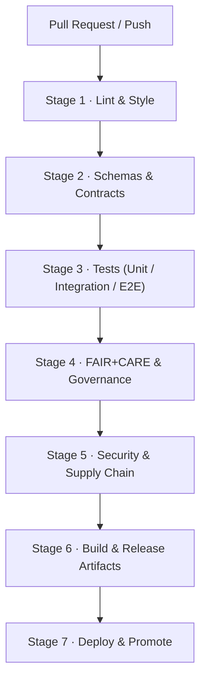

<div align="center">

# ⚙️ **Kansas Frontier Matrix — GitHub Infrastructure & CI/CD Architecture**  
`.github/ARCHITECTURE.md`

**Purpose**  
Define the **complete autonomous GitHub infrastructure architecture** for the Kansas Frontier Matrix (KFM) — including CI/CD pipelines, validation workflows, governance automation, telemetry export, SBOM/manifest integrity verification, documentation linting, and FAIR+CARE-compliant operational safeguards.

[](../docs/standards/kfm_markdown_protocol_superstandard.md)  
[](../docs/standards/faircare/FAIRCARE-GUIDE.md)  
[](../LICENSE)

</div>

---

# 📘 1. Overview

The `.github/` directory hosts KFM’s **automated governance and CI/CD engine**.  
This architecture file describes how GitHub:

- Validates **code, data, docs, schemas, and governance metadata**  
- Enforces **FAIR+CARE, sovereignty, and security rules**  
- Builds and publishes **releases, web/apps, and data catalogs**  
- Produces **SBOMs, manifests, and telemetry** for governance and observability  
- Protects **protected branches and production environments** via strict checks  

Where `.github/README.md` provides a **high-level overview**, this document is the **deep technical blueprint** for CI/CD and governance automation.

---

# 🧱 2. Infrastructure Context in the KFM Stack

```mermaid
flowchart TD
    subgraph Dev ["Developer & Data Contributor Space"]
        A["Change Proposals<br/>(code · data · docs)"] --> B["Pull Request"]
    end

    subgraph Hub ["GitHub Infrastructure Plane (.github)"]
        B --> C["Workflows<br/>.github/workflows/*"]
        C --> D["Validation Stages<br/>Lint · Tests · Schemas · FAIR+CARE · Security"]
        D --> E["Artifacts & Telemetry<br/>SBOM · Manifest · focus-telemetry.json"]
    end

    E --> F["Protected Branches<br/>main · release/*"]
    F --> G["Deployments<br/>Graph · Web · Docs · Data Releases"]
````

The GitHub infrastructure plane is the **gatekeeper**:

* All changes must pass through **Hub** before landing in **protected branches**.
* All deployments consume **artifacts** and **telemetry** produced here.

---

# 🗂️ 3. Directory Structure (Infrastructure View)

```text
.github/                               # GitHub infrastructure plane
│
├── ARCHITECTURE.md                    # This CI/CD & governance architecture blueprint
├── README.md                          # High-level GitHub infrastructure overview
│
├── workflows/                         # GitHub Actions workflows (CI/CD + governance)
│   ├── ci.yml                         # Main CI: lint, tests, schemas, build
│   ├── docs_validate.yml              # KFM-MDP v11 markdown + front-matter validation
│   ├── stac_validate.yml              # STAC item/collection validation
│   ├── dcat_validate.yml              # DCAT dataset validation
│   ├── faircare_validate.yml          # FAIR+CARE & governance compliance validator
│   ├── telemetry_export.yml           # Telemetry bundling for releases
│   ├── sbom_verify.yml                # SBOM integrity & checksum validation
│   ├── site.yml                       # Web/docs deployment workflow
│   ├── security_audit.yml             # Dependency & vulnerability scanning
│   └── data_pipeline.yml              # ETL/data workflow test & trigger orchestration
│
├── ISSUE_TEMPLATE/                    # Governance-aware issue templates
│   ├── bug_report.md                  # Bug reports (code, data, docs)
│   ├── feature_request.md             # Feature & enhancement proposals
│   └── data_issue.md                  # Dataset issues + CARE classification
│
├── PULL_REQUEST_TEMPLATE.md           # Governance checklist & metadata requirements
├── CODEOWNERS                        # Ownership map & review boundaries
├── dependabot.yml                    # Dependency update automation
└── SECURITY.md                       # Security & vulnerability disclosure policy
```

---

# 🔁 4. CI/CD Stage Architecture (v11)

## 4.1 Stage Diagram



All stages are enforced, and failures in any stage **block** merges or deployments.

---

## 4.2 Stage 1 — Lint & Style

**Workflows:** `ci.yml`, `docs_validate.yml`

Checks include:

* ESLint, Prettier, and TypeScript for frontend
* Stylelint for stylesheets
* Python linting (e.g., `ruff`/`flake8`/`black`), as configured
* Markdown linting:

  * KFM-MDP v11 conformance
  * Required YAML front-matter keys and formats
  * Code fence integrity and safe mermaid usage

Lint failures → red status checks → no merge.

---

## 4.3 Stage 2 — Schemas & Contracts

**Workflows:** `ci.yml`, `stac_validate.yml`, `dcat_validate.yml`

Validates:

* STAC Items & Collections (`schemas/stac/*`)
* DCAT Datasets (`schemas/dcat/*`)
* Telemetry payloads (`schemas/telemetry/*`)
* JSON-LD contexts (`schemas/jsonld/*`)
* Story Node v3 & Focus Mode schemas
* Data contract schemas for pipelines

Ensures all structured artifacts are machine-readable and consistent.

---

## 4.4 Stage 3 — Tests (Unit → Integration → E2E)

**Workflows:** `ci.yml`, `data_pipeline.yml`

Coverage:

* Unit tests for ETL utilities, graph adapters, and web code
* Integration tests (API ↔ graph ↔ data)
* E2E tests for critical user flows
* A11y tests for key UI paths

Any fails → PR cannot be merged, no release.

---

## 4.5 Stage 4 — FAIR+CARE & Governance

**Workflow:** `faircare_validate.yml`

Enforces:

* CARE classification for sensitive datasets
* Sovereignty & masking rules (e.g., H3 generalization for heritage locations)
* FAIR metadata completeness and quality
* Provenance & licensing completeness
* Governance and ethics policy mappings

Governance failures require explicit FAIR+CARE Council and/or delegate review.

---

## 4.6 Stage 5 — Security & Supply Chain

**Workflows:** `security_audit.yml`, `sbom_verify.yml`, `dependabot.yml`

Covers:

* Dependency scanning and vulnerability checks
* Workflow security / minimal permission scanning
* SBOM verification against `sbom.spdx.json`
* SLSA-style attestations and signature checks

Security must pass before any deployable artifacts are produced.

---

## 4.7 Stage 6 — Build & Release Artifacts

**Workflows:** `ci.yml`, `telemetry_export.yml`, `site.yml`

Outputs:

* Web bundles (React + MapLibre + Cesium)
* Docs site build (if separate)
* `manifest.zip` (file listings + checksums)
* `sbom.spdx.json` (software bill of materials)
* `focus-telemetry.json` (CI + governance + performance metrics)

Only after successful completion of earlier stages.

---

## 4.8 Stage 7 — Deploy & Promote

**Workflow:** `site.yml` plus environment-specific workflows

Implements:

* Deployments to dev → staging → production as configured
* Environment protections (approvals, secrets, access control)
* Post-deploy smoke tests (where configured)

Deployment is allowed only for commits that passed all previous stages.

---

# 🧩 5. Workflow Responsibility Matrix

| Workflow                | Primary Role                                       | Stages Covered |
| ----------------------- | -------------------------------------------------- | -------------- |
| `ci.yml`                | Core CI: lint, tests, schema checks, build         | 1, 2, 3, 6     |
| `docs_validate.yml`     | Markdown + front-matter + MDP v11 validation       | 1              |
| `stac_validate.yml`     | STAC Item/Collection validation                    | 2              |
| `dcat_validate.yml`     | DCAT dataset validation                            | 2              |
| `faircare_validate.yml` | FAIR+CARE and governance validation                | 4              |
| `security_audit.yml`    | Dependency and workflow security scanning          | 5              |
| `sbom_verify.yml`       | SBOM creation and integrity/attestation validation | 5, 6           |
| `telemetry_export.yml`  | Telemetry bundling into `focus-telemetry.json`     | 6              |
| `site.yml`              | Web/docs build and deploy                          | 6, 7           |
| `data_pipeline.yml`     | Data/ETL orchestration and integration tests       | 3              |

---

# 🧩 6. Governance Hooks: Issues & PRs

## 6.1 Issue Templates

Templates in `ISSUE_TEMPLATE/` enforce structured, governance-aware reporting:

* `bug_report.md`

  * System area, repro steps, severity, environment

* `feature_request.md`

  * User story, benefits, a11y impact, governance considerations

* `data_issue.md`

  * Dataset IDs, CARE classification, sovereignty / licensing, requested action

## 6.2 Pull Request Template

The PR template requires:

* CARE/sensitivity classification for the change
* Provenance & licensing for data- or content-related changes
* Impact assessment on schemas, ontology, and telemetry
* A11y considerations for any UI changes
* Identification of required reviewers (CODEOWNERS, governance delegates)

PRs missing this information are considered incomplete.

---

# 🔐 7. Security Architecture & Branch Protection

CI/CD security model:

* Protected branches (`main`, `release/*`) with mandatory checks
* CODEOWNERS-enforced reviews for `.github/**`, `schemas/**`, `docs/standards/**`, `src/pipelines/**`
* Restricted secrets and environment credentials
* Security tests integrated into the CI pipeline
* Formal security policy and disclosure process in `.github/SECURITY.md`

Security and governance concerns are closely aligned to prevent both technical and informational harm.

---

# 📊 8. Telemetry & Observability from CI

CI workflows are a key source of observability:

* Job duration, success/failure statistics
* Validation and governance failure counts
* Energy and carbon approximations (where instrumented)
* A11y and test coverage signals

Telemetry is consolidated into:

```text
releases/<version>/focus-telemetry.json
```

and fed into:

* Governance dashboards
* Reliability & sustainability reports
* Focus Mode “system introspection” narratives

---

# 🛟 9. Failure Modes & Recovery Patterns

Common failure modes:

* Lint / style violations → fix code or docs formatting and re-run
* Schema/metadata issues → correct STAC/DCAT/telemetry/Story Node metadata
* Test failures → fix logic or tests, ensure reproducibility
* FAIR+CARE violations → adjust data or workflows, consult FAIR+CARE Council if needed
* Security findings → update dependencies, adjust workflows or secrets management

Recovery patterns:

* Small, targeted follow-up commits or PRs
* Clear PR notes indicating which class of failure is being addressed
* Governance log entries if policy exceptions are temporarily granted

---

# 🧾 10. Release & Artifact Lineage

Every release is accompanied by:

* SBOM (`sbom.spdx.json`)
* Manifest (`manifest.zip`)
* Telemetry bundle (`focus-telemetry.json`)
* SLSA-style attestation (`slsa-attestation.json`)

`event_source_id: "ledger:.github/ARCHITECTURE.md"` ensures that modifications to this architecture document are tracked in the governance ledger, supporting:

* Traceable evolution of CI/CD and governance practices
* Auditable history for compliance or incident response

---

# 🕰️ 11. Version History

| Version |       Date | Summary                                                                                                     |
| ------: | ---------: | ----------------------------------------------------------------------------------------------------------- |
| v11.0.0 | 2025-11-19 | Upgraded to KFM-MDP v11; integrated DCAT validation, expanded telemetry & governance metadata, hardened CI. |
| v10.4.1 | 2025-11-16 | Extended governance/AI metadata, clarified workflow roles, improved security checks.                        |
| v10.4.0 | 2025-11-15 | Major CI/CD architecture rewrite for KFM v10.4; governance-first pipeline introduced.                       |
| v10.3.2 | 2025-11-14 | Added telemetry bundling, STAC validation, and FAIR+CARE baseline checks.                                   |
| v10.0.0 | 2025-11-10 | Initial GitHub CI/CD architecture baseline.                                                                 |

---

[GitHub Infrastructure Overview](README.md) · [Repository Architecture](../ARCHITECTURE.md) · [Governance Charter](../docs/standards/governance/ROOT-GOVERNANCE.md)

```
