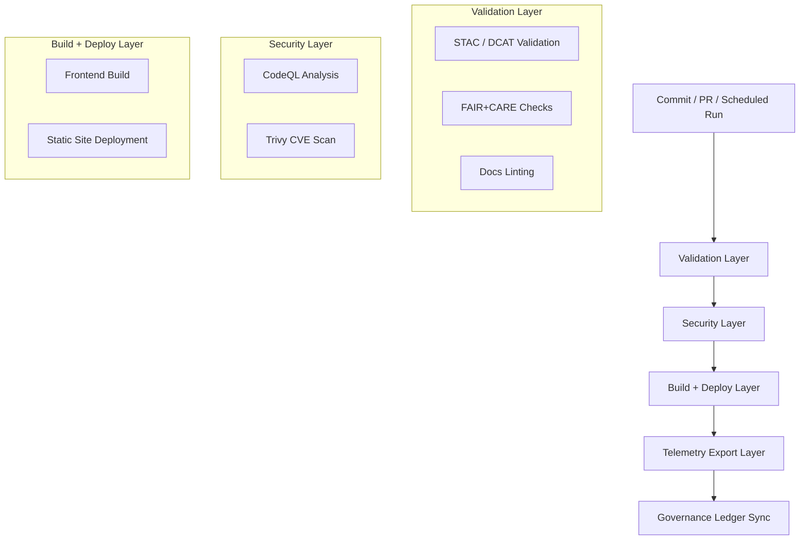

<div align="center">

# ⚙️ **Kansas Frontier Matrix — GitHub Infrastructure & CI/CD Architecture**  
`.github/ARCHITECTURE.md`

**Purpose:**  
Define the **automated governance, validation, and deployment pipelines** that power the Kansas Frontier Matrix (KFM) under **FAIR+CARE ethics**, **MCP-DL v6.3 reproducibility**, **SLSA provenance**, and **ISO 50001/14064** sustainability.  
This infrastructure guarantees that every commit, dataset, and model meets traceable FAIR+CARE and security standards with automated auditing and immutable provenance.

[](../docs/README.md)  
[](../LICENSE)  
[](../docs/standards/faircare.md)  
[]()

</div>

---

## 📘 Overview

The **GitHub CI/CD Infrastructure** orchestrates **validation, build, deployment, security scanning, AI auditing, and sustainability telemetry** for the Kansas Frontier Matrix.

Each workflow runs inside hardened GitHub Actions containers and produces:

- **Auditable validation artifacts** (STAC/DCAT checks, FAIR+CARE compliance, schema validation)  
- **Security outputs** (CVE scans, SARIF reports, dependency graphs)  
- **AI audit logs** (bias, drift, explainability)  
- **Sustainability data** (energy & CO₂e telemetry)  
- **Immutable provenance artifacts** (SPDX SBOM, signed release manifest)  

All pipelines write to the **FAIR+CARE Council Governance Ledger**, ensuring end-to-end transparency.

---

## 🗂️ Directory Layout

```text
.github/
├── ARCHITECTURE.md                 # CI/CD architecture documentation (this file)
├── README.md                       # High-level automation overview
│
├── workflows/                      # GitHub Actions automation suite
│   ├── stac-validate.yml           # STAC 1.0 validator (collections + items)
│   ├── stac-dcat-bridge.yml        # STAC ↔ DCAT schema synchronization
│   ├── faircare-validate.yml       # CARE consent + provenance checks
│   ├── docs-lint.yml               # Markdown/YAML/JSON linting
│   ├── codeql.yml                  # Static analysis (SARIF)
│   ├── trivy.yml                   # Docker + lockfile CVE scanning
│   ├── build-and-deploy.yml        # Frontend build + static deployment
│   ├── telemetry-export.yml        # CI/energy/security telemetry aggregator
│   └── ai-model-audit.yml          # Bias, drift, explainability, model card checks
│
├── ISSUE_TEMPLATE/                 # GitHub Issue Forms
│   ├── data_submission.yml         # Dataset ingestion requests (STAC/DCAT required)
│   ├── feature_request.yml         # Feature proposals
│   ├── bug_report.yml              # Reproducible defect reports
│   └── governance_form.yml         # FAIR+CARE Council review
│
├── pull_request_template.md        # PR checklist (docs, tests, ledger)
├── dependabot.yml                  # Automated dependency upgrade rules
├── SECURITY.md                     # Security policy + vulnerability disclosure
└── FUNDING.yml                     # Optional sponsorship configuration
````

---

## ⚙️ CI/CD Workflow Responsibilities

| Workflow                | Description                                            | Trigger             | Artifact Output                                     |
| ----------------------- | ------------------------------------------------------ | ------------------- | --------------------------------------------------- |
| `stac-validate.yml`     | Validate STAC 1.0 metadata & schema                    | PR / Push / Nightly | `reports/self-validation/stac/summary.json`         |
| `stac-dcat-bridge.yml`  | Enforce STAC↔DCAT parity                               | Scheduled / Release | `reports/self-validation/bridge/parity_report.json` |
| `faircare-validate.yml` | CARE sovereignty, provenance, dataset contract checks  | PR / Push           | `reports/fair/faircare_summary.json`                |
| `docs-lint.yml`         | Markdown/YAML/JSON formatting, anchors, headings       | PR / Push           | `reports/self-validation/docs/lint_summary.json`    |
| `codeql.yml`            | Static analysis for code security                      | PR / Weekly         | `reports/security/codeql/*.sarif`                   |
| `trivy.yml`             | CVE scanning for images + lockfiles                    | PR / Push           | `reports/security/trivy/*.json`                     |
| `build-and-deploy.yml`  | Build & deploy the web app/docs                        | After validations   | `docs/reports/telemetry/build_metrics.json`         |
| `telemetry-export.yml`  | Export CI/CD + sustainability metrics                  | Post-build          | `../releases/v10.3.0/focus-telemetry.json`          |
| `ai-model-audit.yml`    | AI model bias & drift auditing + explainability export | Model PR / Schedule | `reports/audit/ai_model_faircare.json`              |

Every workflow’s artifacts are referenced inside:

* `../releases/v10.3.0/sbom.spdx.json`
* `../releases/v10.3.0/manifest.zip`

for complete SLSA provenance.

---

## 🧮 CI/CD Automation Flow



Lifecycle summary:

1. **Validation:** STAC/DCAT, FAIR+CARE, docs
2. **Security:** CodeQL, Trivy
3. **Build:** React + static deploy
4. **Telemetry:** sustainability + compliance
5. **Governance:** append-only ledgers + attestations

---

## 🔒 Security & Compliance Controls

| Control            | Implementation            | Policy                               |
| ------------------ | ------------------------- | ------------------------------------ |
| Static Analysis    | CodeQL                    | Block on CRITICAL                    |
| CVE Scan           | Trivy                     | Block merge on CRITICAL              |
| Dependency Hygiene | Dependabot                | Weekly auto-PRs                      |
| Signing            | GPG/SSH                   | Required for tags/releases           |
| Secrets            | Encrypted Secrets + OIDC  | No plaintext secrets in repo         |
| Branch Protection  | Required checks + reviews | 2 approvals, green CI, no force-push |
| SBOM               | SPDX export               | Every release                        |
| Attestation        | SLSA provenance           | Manifest signed and attached         |

Disclosure policy:

```text
.github/SECURITY.md
```

---

## ⚖️ FAIR+CARE Integrated Governance

| Layer          | Enforcement                                        | Standard          |
| -------------- | -------------------------------------------------- | ----------------- |
| FAIR           | STAC/DCAT validation · DOIs · open metadata        | STAC/DCAT         |
| CARE           | Heritage protection · consent checks · sovereignty | FAIR+CARE         |
| MCP-DL         | Docs-as-Code, telemetry, provenance                | MCP-DL v6.3       |
| Sustainability | CI energy + CO₂ telemetry                          | ISO 50001 / 14064 |
| Supply-Chain   | SBOM + SLSA                                        | SPDX / SLSA v1.0  |

Immutable governance ledgers:

* `docs/reports/audit/github_workflows_ledger.json`
* `docs/reports/audit/governance_ledger.json`
* `docs/reports/audit/ai_model_audit.json`

---

## 📊 Telemetry Reporting

Outputs aggregated into:

* `../releases/v10.3.0/focus-telemetry.json`
* `docs/reports/telemetry/*.json`

Metrics include:

* CI workflow runtimes
* Build energy (Wh)
* CO₂e footprints
* FAIR+CARE compliance ratios
* Security findings summary
* STAC/DCAT parity deltas
* Documentation lint pass/fail statistics

---

## 🧠 Governance Workflow (High-Level)

At each tagged release:

* Generate **SPDX SBOM**
* Generate **signed manifest.zip**
* Attach **CI attestations** (validation → security → build → deploy)
* Save **telemetry snapshot**
* Update **governance ledgers**
* Publish **STAC/DCAT catalogs**

All linked by:

* Commit SHA
* Run ID
* Release tag

---

## 🔗 Cross-References

* `../docs/README.md` — Documentation Index
* `../src/ARCHITECTURE.md` — System Architecture
* `../docs/standards/faircare.md` — FAIR+CARE Framework
* `../tools/README.md` — Tooling Documentation

---

## 🕰️ Version History

| Version | Date       | Author    | Summary                                                         |
| ------- | ---------- | --------- | --------------------------------------------------------------- |
| v10.3.1 | 2025-11-13 | DevSecOps | Updated to v10.3, telemetry integration, formatting alignment.  |
| v10.2.2 | 2025-11-12 | DevSecOps | Added SLSA provenance, energy telemetry, stricter CVE policies. |
| v10.0.0 | 2025-11-09 | A. Barta  | Introduced AI audit workflow; ISO sustainability telemetry.     |
| v9.7.0  | 2025-11-05 | A. Barta  | Added governance mapping + automation documentation.            |

---

<div align="center">

**© 2025 Kansas Frontier Matrix — MIT**
Automated under **Master Coder Protocol v6.3**
FAIR+CARE Certified · Diamond⁹ Ω / Crown∞Ω Ultimate Certified

[Back to CI/CD Overview](README.md) · [Governance Charter](../docs/standards/governance/ROOT-GOVERNANCE.md)

</div>
