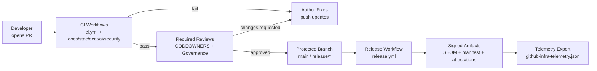
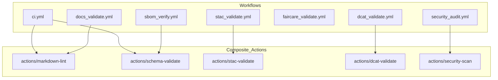

<div align="center">

# ⚙️ **Kansas Frontier Matrix — GitHub Infrastructure Architecture**  
`.github/ARCHITECTURE.md`

**Purpose**  
Define the **architectural role, structure, and control flows** of the `.github/` subsystem for KFM v11 — including CI/CD, security, FAIR+CARE enforcement, sovereignty checks, AI governance, and telemetry — in a way that is **reproducible, auditable, and machine-readable**.

[](README.md) ·
[](../docs/standards/kfm_markdown_protocol_v11.2.5.md) ·
[](../docs/standards/faircare/FAIRCARE-GUIDE.md) ·
[](#-version-history)

</div>

---

## 📘 Overview

The `.github/` directory is the **governance and automation fabric** for the Kansas Frontier Matrix (KFM) monorepo:

- Drives **CI/CD pipelines** for code, data, docs, and AI.  
- Enforces **KFM-MDP v11.2.5** Markdown rules and YAML front‑matter schemas.  
- Validates **STAC, DCAT, PROV-O, JSON-LD, and telemetry** artifacts.  
- Applies **FAIR+CARE and sovereignty constraints** before any public exposure.  
- Governs **AI behavior** (Story Nodes & Focus Mode v3) via test suites and policies.  
- Emits **OpenLineage + security + sustainability telemetry** used in audits and narratives.  

This document explains **how the pieces fit together** — workflows, composite actions, policies, and telemetry — and how they relate to the rest of the KFM architecture.

---

## 🗂️ Directory Layout

Canonical layout for `.github/`:

```text
.github/                                           # ⚙️ GitHub governance & automation subsystem
│
├── 📄 README.md                                   # High-level GitHub infrastructure overview
├── 🏗️ ARCHITECTURE.md                             # This architecture document
│
├── 🤖 workflows/                                  # GitHub Actions workflows (CI/CD + governance)
│   ├── 🧪 ci.yml                                  # Core CI: lint, tests, type-checks, schema checks
│   ├── 📚 docs_validate.yml                       # KFM-MDP v11.2.5 markdown + front-matter validation
│   ├── 🛰️ stac_validate.yml                       # STAC 1.x validation (collections/items)
│   ├── 🗂️ dcat_validate.yml                       # DCAT 3.0 validation (datasets/distributions)
│   ├── 🧬 jsonld_validate.yml                     # JSON-LD + ontology consistency (CIDOC/GeoSPARQL/OWL-Time/PROV-O)
│   ├── ⚖️ faircare_validate.yml                   # FAIR+CARE & sovereignty checks (sensitivity flags, masking)
│   ├── 🧊 h3_generalization.yml                   # H3 spatial generalization for sensitive sites
│   ├── 🔐 security_audit.yml                      # Dependency, CVE, secret, and supply-chain scans
│   ├── 📦 sbom_verify.yml                         # SBOM + manifest + SLSA attestations
│   ├── 🔁 data_pipeline.yml                       # Data/ETL contract & lineage enforcement
│   ├── 🌡️ climate_mlops.yml                       # Climate-related model governance
│   ├── 💧 hydrology_mlops.yml                     # Hydrology & water models governance
│   ├── 🌪️ hazards_mlops.yml                       # Severe weather / hazards models governance
│   ├── 🔡 embeddings_mlops.yml                    # Embedding model governance (semantic/spatial)
│   ├── 🎯 focusmode_mlops.yml                     # Focus Mode v3 narrative-safety checks
│   ├── 🤖 ai_behavior_check.yml                   # LLM behavior, drift, and forbidden-output checks
│   ├── 📊 telemetry_export.yml                    # Telemetry export → github-infra-telemetry.json
│   ├── 🚀 release.yml                             # Signed releases, tagging, packaging, publishing
│   ├── 🏷️ labeler.yml                             # Auto-labeling PRs based on path & semantics
│   └── 🌐 site.yml                                # Docs + web build/deploy pipelines
│
├── 🧱 actions/                                    # Reusable composite actions
│   ├── 📐 markdown-lint/                          # KFM-MDP v11.2.5 markdown & front-matter checks
│   ├── 🧾 schema-validate/                        # JSON, YAML, and JSON-LD schema validation
│   ├── 🛰️ stac-validate/                          # STAC validation wrapper
│   ├── 🗂️ dcat-validate/                          # DCAT validation wrapper
│   ├── 🧪 pytest-runner/                          # Python test runner harness
│   └── 🔍 security-scan/                          # Dependency + secret scanning wrapper
│
├── 📂 ISSUE_TEMPLATE/                             # Issue templates (governance-aware)
│   ├── 🐛 bug_report.md                           # Bug reports (pipelines, datasets, UI, AI)
│   ├── 💡 feature_request.md                      # Feature/enhancement requests
│   ├── 🗺️ data_issue.md                           # Data/STAC/DCAT/FAIR+CARE issues
│   └── ⚖️ governance_issue.md                     # Governance, ethics, sovereignty issues
│
├── ⚙️ ISSUE_TEMPLATE/config.yml                   # Template routing, required fields, auto-label configuration
├── 📜 PULL_REQUEST_TEMPLATE.md                    # PR metadata & governance checklist
├── 👥 CODEOWNERS                                  # Ownership boundaries & review requirements
├── 🧩 dependabot.yml                              # Automated dependency and security updates
├── 💸 FUNDING.yml                                 # Funding and sponsor links
├── 📏 CODE_OF_CONDUCT.md                          # Community norms and conduct guidelines
└── 🛡 SECURITY.md                                 # Security policy & vulnerability disclosure
```

Rules:

- Any new workflow or action MUST be reflected here and in `.github/README.md`.  
- Structural changes MUST be accompanied by updated schemas and CI configuration.  

---

## 🧭 Context

`.github/` is one of the **core subsystems** in the KFM v11 architecture:

> Deterministic ETL → STAC/DCAT/PROV catalogs → Neo4j knowledge graph → API layer → React/MapLibre/Cesium frontend → Story Nodes → Focus Mode.

At the **repository level**, it orchestrates:

- Tests and validation for `src/`, `web/`, `data/`, `docs/`, `mcp/`, and `tools/`.  
- Root contracts encoded in `.github/ARCHITECTURE.md` and `.github/README.md`.  

At the **governance level**, it encodes:

- Enforcement of **KFM-MDP v11.2.5** for all Markdown docs.  
- FAIR+CARE & sovereignty requirements for high-risk datasets and narratives.  
- Approval workflows (CODEOWNERS, required reviews, protected branches).  

At the **observability level**, it:

- Emits telemetry (energy, carbon, security, governance, lineage) conforming to telemetry schemas.  
- Integrates with OpenLineage and PROV-O to trace CI/CD, data pipelines, and AI flows.  

This architecture document should be read alongside:

- `.github/README.md` — conceptual overview & onboarding.  
- `ARCHITECTURE.md` — global system & repo architecture.  
- `docs/security/**` — detailed security, supply-chain, and incident response frameworks.  

---

## 🧱 Architecture

The `.github/` architecture is built around three main layers:

1. **Workflows (orchestration layer)**  
   - Declarative **GitHub Actions** YAML files in `.github/workflows/`.  
   - Triggered on PRs, pushes, scheduled runs, and releases.  
   - Path-aware filters ensure only relevant workflows run (e.g., STAC validation on `data/stac/**` changes).  

2. **Composite Actions (logic layer)**  
   - Reusable actions in `.github/actions/**` implementing linting, schema validation, STAC/DCAT checks, security scans, and test harnesses.  
   - Versioned and referenced by workflows to centralize complex behavior.  

3. **Policies & Templates (governance layer)**  
   - CODEOWNERS, branch protection rules, PR/issue templates, and conduct/security docs.  
   - Encode who can approve what, under which conditions, and with which metadata required.  

The architecture ensures:

- **Determinism** — Given a commit and configuration, workflows are reproducible and log their inputs/outputs.  
- **Traceability** — CI/CD runs emit telemetry that can be mapped into PROV-O/OpenLineage graphs.  
- **Separation of concerns** — Workflows orchestrate; composite actions encapsulate logic; policies set constraints.  

---

## 🗺️ Diagrams

### 1. Pull Request → Governance → Release Flow



Every change must pass **quality + governance** checks before it can land on a protected branch and produce signed release artifacts and telemetry.

### 2. Workflow & Composite Action Relationship



Workflows stay **thin and declarative**; composite actions centralize reusable logic.

---

## 🧪 Validation & CI/CD

### Workflow Classes

1. **Core Quality (`ci.yml`)**  
   - Linting, formatting, static analysis.  
   - Unit/integration tests for Python, Node, and other stacks.  
   - Core schema validation for configs and contracts.  

2. **Documentation & Metadata**  
   - `docs_validate.yml`: KFM-MDP v11.2.5 + YAML front-matter schema checks.  
   - `stac_validate.yml`: STAC item/collection validation.  
   - `dcat_validate.yml`: DCAT dataset/distribution checks.  

3. **Ontology & Graph Semantics**  
   - `jsonld_validate.yml`: validates JSON-LD contexts, graph exports, and ontology alignment (CIDOC, GeoSPARQL, OWL-Time, PROV-O).  

4. **FAIR+CARE & Sovereignty**  
   - `faircare_validate.yml`: ensures required FAIR+CARE metadata and sensitivity flags are present and correct.  
   - `h3_generalization.yml`: verifies H3 masking for sensitive archaeological, tribal, and high-risk sites.  

5. **Security & Supply Chain**  
   - `security_audit.yml`: dependency scanning, secret detection, policy enforcement.  
   - `sbom_verify.yml`: rebuilds/verifies SBOMs and manifests; checks signatures and attestations.  

6. **Data & AI Pipelines**  
   - `data_pipeline.yml`: ETL/data contract + lineage enforcement, including data quality gates.  
   - `*_mlops.yml`: domain-specific model governance for climate, hydrology, hazards, embeddings, and Focus Mode.  
   - `ai_behavior_check.yml`: LLM behavior, drift, bias, and forbidden-output tests.  
   - `focusmode_mlops.yml`: ensures Focus Mode uses only approved, grounded patterns and models.  

7. **Releases & Telemetry**  
   - `release.yml`: orchestrates version bumping, tagging, packaging, signing, and artifact upload.  
   - `telemetry_export.yml`: writes `github-infra-telemetry.json` with CI/CD + governance metrics and sustainability indicators.  

### Branch Protection & Required Checks

Protected branches (e.g., `main`, `release/*`) require:

- Success from a defined set of workflows (at minimum `ci.yml`, `docs_validate.yml`, security and metadata checks).  
- Minimum review counts and CODEOWNERS approval for sensitive paths.  
- No force-pushes or direct commits.  

Changing branch protection or required checks is an **architectural change** and MUST:

- Be reflected in this document and `.github/README.md`.  
- Be reviewed by the Architecture Board and FAIR+CARE Council where relevant.  

---

## 📦 Data & Metadata

The `.github/` architecture both **produces** and **consumes** metadata:

Produced:

- **SBOMs** (`sbom_ref`) and manifests (`manifest_ref`) per release.  
- **SLSA attestations** (`attestation_ref`) for builds and releases.  
- **Telemetry** (`telemetry_ref`) structured under `telemetry_schema`, `energy_schema`, and `carbon_schema`.  

Consumed:

- JSON/YAML/JSON-LD schemas referenced in `json_schema_ref` and `shape_schema_ref`.  
- Governance, FAIR+CARE, and sovereignty policies referenced in front-matter.  

All metadata is:

- Versioned per release and linked via provenance records in `docs/security/**` and `docs/data/**`.  
- Used to drive dashboards and Story Nodes about trust, security posture, and sustainability.  

---

## 🌐 STAC, DCAT & PROV Alignment

`.github/` does not hold STAC/DCAT data itself, but its workflows are the **gatekeepers** for:

- **STAC (SpatioTemporal Asset Catalog)**  
  - `stac_validate.yml` validates Items and Collections in `data/stac/**` against STAC 1.x schemas and KFM-STAC v11 profiles.  
  - Ensures `id`, `geometry`, `bbox`, `datetime`, and `assets` fields are present, consistent, and ready for graph ingestion.  

- **DCAT 3.0**  
  - `dcat_validate.yml` checks dataset/distribution metadata (including versioning, checksums, and licensing) for DCAT 3.0 and KFM-DCAT v11 compatibility.  
  - Ensures catalog metadata is federatable with external portals while preserving KFM-specific FAIR+CARE fields.  

- **PROV-O + OpenLineage**  
  - `jsonld_validate.yml` and telemetry checks ensure datasets, models, workflows, and releases can be expressed as PROV entities, activities, and agents.  
  - CI jobs themselves are modeled as Activities emitting lineage for ETL, AI training, and web/API builds.  

- **GeoSPARQL & Spatial Semantics**  
  - Geometry and spatial metadata (e.g., STAC footprints) are validated for compatibility with GeoSPARQL `geo:Feature` and `geo:Geometry` in the Neo4j-backed knowledge graph.  

---

## 🧠 Story Node & Focus Mode Integration

KFM’s narrative system builds **Story Nodes** over the graph and documents. `.github/` provides the **operational backstory**:

- Each successful CI run is a **PROV Activity** with associated Agents (humans, bots, services) and Entities (artifacts, docs, STAC/DCAT records).  
- Focus Mode can answer questions like:  
  - “How was this hazards model validated before deployment?”  
  - “Which release first introduced archaeology-sensitive masking?”  
- Telemetry and provenance events from `.github/` are ingested into Neo4j, allowing narratives to cross-link:  
  - Historical & ecological layers.  
  - New data domains (paleontology, climate futures, biodiversity, etc.).  
  - Open data sources and tools (e.g., KGS, DASC, BLM, county portals).  

Architectural constraint:

- Focus Mode MUST NOT rely on ungoverned content paths.  
- Only assets that have passed `.github/` workflows and governance checks are eligible for production narratives.  

---

## ⚖ FAIR+CARE & Governance

The design of `.github/` must always satisfy:

- **FAIR**  
  - **Findable** — workflows, actions, and policies clearly named and documented.  
  - **Accessible** — logs and telemetry accessible to maintainers and oversight councils.  
  - **Interoperable** — schemas and telemetry compatible with external tools.  
  - **Reusable** — patterns and composite actions can be reused in related projects.  

- **CARE**  
  - **Collective Benefit** — automation serves affected communities, data stewards, and maintainers.  
  - **Authority to Control** — sovereignty and ethics policies are enforced via CI checks and CODEOWNERS.  
  - **Responsibility** — security, privacy, and narrative safety are treated as first-class responsibilities.  
  - **Ethics** — high-risk flows (heritage, identity, environment) receive enhanced scrutiny and gating.  

Governance hooks:

- Changes to `.github/` that affect policy, security, FAIR+CARE, or sovereignty MUST be reviewed by relevant councils (Security, FAIR+CARE, Architecture Board) before merging.  
- This architecture document and `.github/README.md` MUST be updated when the governance scope or enforcement model changes.  

---

## 🕰️ Version History

| Version | Date       | Summary                                                                                                                |
|--------:|------------|------------------------------------------------------------------------------------------------------------------------|
| v11.2.3 | 2025-12-08 | Aligned with KFM-MDP v11.2.5; added Context, Diagrams, Story Node, and STAC/DCAT/PROV sections; synced with README.   |
| v11.2.2 | 2025-11-28 | Synced GitHub architecture with v11.2.2 CI/CD model; expanded workflow map; clarified FAIR+CARE and telemetry wiring. |
| v11.0.1 | 2025-11-23 | Linked CI workflows with PROV-O and OpenLineage; introduced AI behavior and Focus Mode governance flows.              |
| v11.0.0 | 2025-11-19 | First v11 GitHub architecture doc; defined workflow classes and composite-action patterns.                            |
| v10.0.0 | Legacy     | Pre-v11 baseline, prior to FAIR+CARE and sovereignty integration.                                                     |

---

<div align="center">

⚙️ **Kansas Frontier Matrix — GitHub Infrastructure Architecture (v11.2.3)**  
Automation-First · FAIR+CARE-Governed · Provenance-Aware  

[⬅️ Back to GitHub Infra Overview](README.md) · [🏗 Repository Architecture](../ARCHITECTURE.md) · [🛡 Security Policy](SECURITY.md)

</div>