```mermaid
flowchart TD
  A["Pull Request / Push"] --> B["Stage 1 · Lint & Style"]
  B --> C["Stage 2 · Schemas & Contracts"]
  C --> D["Stage 3 · Tests (Unit / Integration / E2E)"]
  D --> E["Stage 4 · FAIR+CARE & Governance"]
  E --> F["Stage 5 · Security & Supply Chain"]
  F --> G["Stage 6 · Build & Release Artifacts"]
  G --> H["Stage 7 · Deploy & Promote"]
```

# ⚙️ Kansas Frontier Matrix — GitHub Infrastructure & CI/CD Architecture

Purpose: define the autonomous GitHub infrastructure architecture for the Kansas Frontier Matrix (KFM) — including CI/CD pipelines, validation workflows, governance automation, telemetry export, SBOM/manifest integrity verification, documentation linting, and FAIR+CARE-compliant operational safeguards.

## 📘 1. Overview

The `.github/` directory hosts KFM’s automated governance and CI/CD engine.

This architecture document describes how `.github`:

- Validates code, data, docs, schemas, and governance metadata  
- Enforces FAIR+CARE, sovereignty, and security rules across all workflows  
- Builds and publishes releases, web/apps, and STAC/DCAT data catalogs  
- Produces SBOMs, manifests, attestations, and telemetry for governance and observability  
- Protects protected branches and production environments through strict checks  
- Integrates with OpenLineage v2.5, PROV-O, and the KFM governance ledger  

`.github/README.md` is the high-level overview; this file is the technical blueprint used by architects, reliability engineers, and governance maintainers.

## 🧱 2. Infrastructure Context in the KFM Stack

```mermaid
flowchart TD
    subgraph Dev ["Developer & Data Contributor Space"]
        A["Change Proposals (code · data · docs)"] --> B["Pull Request"]
    end

    subgraph Hub ["GitHub Infrastructure Plane (.github)"]
        B --> C["Workflows (.github/workflows/*)"]
        C --> D["Validation Stages (Lint · Tests · Schemas · FAIR+CARE · Security)"]
        D --> E["Artifacts & Telemetry (SBOM · Manifest · focus-telemetry.json)"]
    end

    E --> F["Protected Branches (main · release/*)"]
    F --> G["Deployments (Graph · Web · Docs · Data Releases)"]
```



All changes pass through this infrastructure plane before reaching any protected environment.

## 🗂️ 3. Directory Structure (Infrastructure Plane)

```text
.github/
│
├── ARCHITECTURE.md                    # CI/CD & governance architecture (this document)
├── README.md                          # High-level GitHub infrastructure overview
│
├── workflows/                         # GitHub Actions workflows
│   ├── ci.yml                         # Main CI: lint, tests, schemas, build
│   ├── docs_validate.yml              # KFM-MDP v11.2.2 markdown + front-matter validation
│   ├── stac_validate.yml              # STAC item/collection validation
│   ├── dcat_validate.yml              # DCAT dataset validation
│   ├── jsonld_validate.yml            # JSON-LD + ontology validation
│   ├── faircare_validate.yml          # FAIR+CARE & governance compliance checks
│   ├── h3_generalization.yml          # Dynamic H3 generalization for sensitive locations
│   ├── telemetry_export.yml           # Telemetry bundling for releases
│   ├── sbom_verify.yml                # SBOM integrity & checksum validation
│   ├── security_audit.yml             # Dependency & workflow security scanning
│   ├── data_pipeline.yml              # ETL/data pipeline tests & orchestration
│   └── site.yml                       # Web/docs deployment workflow
│
├── ISSUE_TEMPLATE/                    # Governance-aware issue templates
│   ├── bug_report.md                  # Bug reports (code, data, docs, AI behavior)
│   ├── feature_request.md             # Feature & enhancement proposals
│   └── data_issue.md                  # Dataset issues + CARE classification
│
├── PULL_REQUEST_TEMPLATE.md           # Governance checklist & metadata requirements
├── CODEOWNERS                        # Ownership map & review boundaries
├── dependabot.yml                    # Dependency update automation
└── SECURITY.md                       # Security & vulnerability disclosure policy
```

This structure aligns GitHub’s primitives with KFM’s governance and documentation protocols.

## 🔁 4. CI/CD Stage Architecture

### 4.1 Stage Flow



All stages are mandatory; any failure blocks merge and deployment.

### 4.2 Stage 1 — Lint & Style

**Workflows:** `ci.yml`, `docs_validate.yml`

Responsibilities:

- Frontend linting/formatting (ESLint, Prettier, TypeScript)  
- Stylelint for CSS and design tokens  
- Python linting/formatting (per repository configuration)  
- Markdown linting per **KFM-MDP v11.2.2**:

  - Valid YAML front-matter with required keys  
  - Single H1 rule  
  - Approved emoji-heading patterns  
  - Fence integrity and GitHub-safe code blocks  
  - No tabs and no trailing whitespace  

Failures stop the pipeline early and must be corrected before re-run.

### 4.3 Stage 2 — Schemas & Contracts

**Workflows:** `ci.yml`, `stac_validate.yml`, `dcat_validate.yml`, `jsonld_validate.yml`

Validates:

- STAC Items and Collections  
- DCAT Datasets  
- Telemetry payloads and schemas  
- Story Node v3 and Focus Mode v3 schemas  
- JSON-LD contexts for CIDOC-CRM, OWL-Time, GeoSPARQL, schema.org  
- Data contracts for ETL pipelines (KFM-PDC v11)  

No structured artifact is accepted without schema validation.

### 4.4 Stage 3 — Tests

**Workflows:** `ci.yml`, `data_pipeline.yml`

Covers:

- Unit tests for backend, ETL helpers, graph adapters, and frontend components  
- Integration tests (graph ↔ API ↔ pipelines)  
- End-to-end tests for key flows (Focus Mode narratives, Story Node rendering, data browsing)  
- Data validation tests for ETL outputs  
- Accessibility tests for critical UI paths (where configured)  

Testing ensures the platform remains reliable and stable as changes land.

### 4.5 Stage 4 — FAIR+CARE & Governance

**Workflow:** `faircare_validate.yml`

Applies:

- CARE classification for all data changes  
- Sovereignty and masking rules via dynamic H3 generalization  
- FAIR metadata presence and quality checks  
- Licensing verification and compatibility with KFM defaults  
- Provenance coverage with PROV-O alignment  
- AI governance rules for any narrative or model-related changes  

Violations require governance acknowledgment or remediation before continuation.

### 4.6 Stage 5 — Security & Supply Chain

**Workflows:** `security_audit.yml`, `sbom_verify.yml`, `dependabot.yml`

Includes:

- Dependency vulnerability scans  
- SBOM generation and verification against `sbom.spdx.json`  
- Signature and SLSA-style attestation checks for workflows and artifacts  
- Secret scanning for credentials and tokens  
- Workflow permission minimization and hardening  

This stage guards against external and internal security risks.

### 4.7 Stage 6 — Build & Release Artifacts

**Workflows:** `ci.yml`, `telemetry_export.yml`, `site.yml`

Builds:

- Web application bundles  
- Documentation site (if configured)  
- `manifest.zip` with checksums and file inventory  
- `sbom.spdx.json`  
- `focus-telemetry.json` (CI + governance + performance metrics)  

Artifacts are tied to provenance via OpenLineage and the KFM governance ledger.

### 4.8 Stage 7 — Deploy & Promote

**Workflows:** `site.yml` and any environment-specific deploy jobs

Implements:

- Environment-based promotion (dev → staging → production)  
- Manual approvals where required (e.g., releases, high-risk changes)  
- Post-deploy smoke tests and health checks  
- Rollback hooks coordinated with rollback runbooks and SLO/error-budget policy  

Only changes that pass prior stages are eligible for deployment.

## 🧩 5. Workflow Responsibility Matrix

| Workflow                | Role                                                       | Stages        |
|------------------------:|------------------------------------------------------------|---------------|
| `ci.yml`                | Core CI: lint, tests, schemas, build                       | 1, 2, 3, 6    |
| `docs_validate.yml`     | Markdown and front-matter validation                       | 1             |
| `stac_validate.yml`     | STAC Item/Collection validation                            | 2             |
| `dcat_validate.yml`     | DCAT Dataset validation                                    | 2             |
| `jsonld_validate.yml`   | JSON-LD and ontology validation                            | 2             |
| `faircare_validate.yml` | FAIR+CARE and governance checks                            | 4             |
| `security_audit.yml`    | Security scanning                                          | 5             |
| `sbom_verify.yml`       | SBOM creation and integrity checks                         | 5, 6          |
| `telemetry_export.yml`  | Telemetry bundling into `focus-telemetry.json`             | 6             |
| `site.yml`              | Web/docs build and deploy                                  | 6, 7          |
| `data_pipeline.yml`     | ETL orchestration and pipeline-level tests                 | 3             |

## 🧭 6. Issues, PRs, and Governance

The infrastructure relies on:

- Issue templates that guide reporters to specify governance, data sensitivity, and impact  
- Pull request templates that require CARE, provenance, a11y, and security metadata  
- CODEOWNERS mapping for core files and directories  
- Protected branches with required checks configured in GitHub  

This ensures all changes are transparent and reviewable along governance dimensions.

## 🔐 7. Security Architecture

Security is baked into:

- Protected branches and environments  
- Restricted workflow permissions and secrets  
- Automated vulnerability detection  
- Formal vulnerability disclosure and handling protocol in `SECURITY.md`  

The CI/CD pipeline is part of the security perimeter for the entire monorepo.

## 📊 8. Telemetry and Observability

CI/CD telemetry contributes to:

- Reliability statistics (pass/fail rates, flakiness)  
- Governance trend analysis (violation kinds, remediation time)  
- Sustainability metrics (energy/carbon approximations)  

Telemetry is persisted to:

```text
releases/<version>/focus-telemetry.json
```

and consumed by governance dashboards and Focus Mode where relevant.

## 🕰️ 9. Version History

| Version |       Date | Summary                                                                                                                       |
|--------:|-----------:|-------------------------------------------------------------------------------------------------------------------------------|
| v11.0.2 | 2025-11-27 | Updated to KFM-MDP v11.2.2 standard-document format; clarified stage flows, workflow responsibilities, and governance hooks. |
| v11.0.1 | 2025-11-23 | v11 CI/CD alignment with enriched stage descriptions, governance integration, and telemetry schemas.                          |
| v11.0.0 | 2025-11-19 | Initial v11 migration of GitHub architecture document.                                                                        |
| v10.4.1 | 2025-11-16 | Extended governance metadata and clarified workflow roles and security checks.                                               |
| v10.4.0 | 2025-11-15 | Major CI/CD architecture rewrite for KFM v10.4; introduced governance-first pipeline design.                                  |
| v10.3.2 | 2025-11-14 | Added telemetry bundling, STAC validation, and FAIR+CARE baseline checks.                                                    |
| v10.0.0 | 2025-11-10 | Initial GitHub CI/CD architecture baseline.                                                                                  |

---

[GitHub Infrastructure Overview](README.md) · [Repository Architecture](../ARCHITECTURE.md) · [Governance Charter](../docs/standards/governance/ROOT-GOVERNANCE.md)
