```mermaid
flowchart TD
  A["Pull Request / Push"] --> B["Stage 1 · Lint & Style"]
  B --> C["Stage 2 · Schemas & Contracts"]
  C --> D["Stage 3 · Tests (Unit / Integration / E2E)"]
  D --> E["Stage 4 · FAIR+CARE & Governance"]
  E --> F["Stage 5 · Security & Supply Chain"]
  F --> G["Stage 6 · Build & Release Artifacts"]
  G --> H["Stage 7 · Deploy & Promote"]
```

<div align="center">

# ⚙️ **Kansas Frontier Matrix — GitHub Infrastructure & CI/CD Architecture**  
`.github/ARCHITECTURE.md`

**Purpose**  
Define the **complete autonomous GitHub infrastructure architecture** for the Kansas Frontier Matrix (KFM) — including CI/CD pipelines, validation workflows, governance automation, telemetry export, SBOM/manifest integrity verification, documentation linting, and FAIR+CARE-compliant operational safeguards.

[](../docs/standards/kfm_markdown_protocol_superstandard.md)  
[](../docs/standards/faircare/FAIRCARE-GUIDE.md)  
[](../LICENSE)

</div>

---

## 📘 1. Overview

The `.github/` directory hosts KFM’s **automated governance and CI/CD engine**.

This architecture document describes how `.github`:

- Validates **code, data, docs, schemas, and governance metadata**  
- Enforces **FAIR+CARE, sovereignty, and security rules** across all workflows  
- Builds and publishes **releases, web/apps, and STAC/DCAT data catalogs**  
- Produces **SBOMs, manifests, attestations, and telemetry** for governance and observability  
- Protects **protected branches** and production environments through strict checks  
- Integrates with **OpenLineage v2.5**, PROV-O, and KFM’s governance ledger

Where `.github/README.md` is the **high-level overview**, this file is the **technical blueprint** that architects and reliability/governance engineers use to reason about the CI/CD and automation system.

---

## 🧱 2. Infrastructure Context in the KFM Stack

```mermaid
flowchart TD
    subgraph Dev ["Developer & Data Contributor Space"]
        A["Change Proposals<br/>(code · data · docs)"] --> B["Pull Request"]
    end

    subgraph Hub ["GitHub Infrastructure Plane (.github)"]
        B --> C["Workflows<br/>.github/workflows/*"]
        C --> D["Validation Stages<br/>Lint · Tests · Schemas · FAIR+CARE · Security"]
        D --> E["Artifacts & Telemetry<br/>SBOM · Manifest · focus-telemetry.json"]
    end

    E --> F["Protected Branches<br/>main · release/*"]
    F --> G["Deployments<br/>Graph · Web · Docs · Data Releases"]
````

The GitHub infrastructure plane is the **gatekeeper**:

- All changes must pass through **Hub** before landing in **protected branches**.  
- All deployments consume **artifacts and telemetry** produced by these workflows.  
- All governance-significant events are logged into the **governance ledger** and OpenLineage.

---

## 🗂️ 3. Directory Structure (Infrastructure View)

```text
.github/                               # GitHub infrastructure plane
│
├── ARCHITECTURE.md                    # This CI/CD & governance architecture blueprint
├── README.md                          # High-level GitHub infrastructure overview
│
├── workflows/                         # GitHub Actions workflows (CI/CD + governance)
│   ├── ci.yml                         # Main CI: lint, tests, schemas, build
│   ├── docs_validate.yml              # KFM-MDP v11 markdown + front-matter validation
│   ├── stac_validate.yml              # STAC item/collection validation
│   ├── dcat_validate.yml              # DCAT dataset validation
│   ├── jsonld_validate.yml            # JSON-LD + ontology validation
│   ├── faircare_validate.yml          # FAIR+CARE & governance compliance validator
│   ├── h3_generalization.yml          # Dynamic H3 generalization for sensitive locations
│   ├── telemetry_export.yml           # Telemetry bundling for releases
│   ├── sbom_verify.yml                # SBOM integrity & checksum validation
│   ├── security_audit.yml             # Dependency & workflow security scanning
│   ├── data_pipeline.yml              # ETL/data pipeline tests & triggers
│   └── site.yml                       # Web/docs deployment workflow
│
├── ISSUE_TEMPLATE/                    # Governance-aware issue templates
│   ├── bug_report.md                  # Bug reports (code, data, docs)
│   ├── feature_request.md             # Feature & enhancement proposals
│   └── data_issue.md                  # Dataset issues + CARE classification
│
├── PULL_REQUEST_TEMPLATE.md           # Governance checklist & metadata requirements
├── CODEOWNERS                        # Ownership map & review boundaries
├── dependabot.yml                    # Dependency update automation
└── SECURITY.md                       # Security & vulnerability disclosure policy
```

This structure is **monorepo-aware** and optimized for CI/CD observability and governance.

---

## 🔁 4. CI/CD Stage Architecture (v11)

### 4.1 Stage Diagram



All stages are enforced; any failing stage **blocks merging and deployment**.

---

### 4.2 Stage 1 — Lint & Style

**Workflows:** `ci.yml`, `docs_validate.yml`

Checks include:

- ESLint, Prettier, and TypeScript for frontend  
- Stylelint for CSS and design tokens  
- Python linting/formatting (e.g., `ruff`/`flake8`/`black`, as configured)  
- Markdown linting per **KFM-MDP v11**:

  - YAML front-matter structure and required keys  
  - Single H1 rule (inside the centered `<div>`)  
  - Emoji-prefixed H2s, proper heading hierarchy  
  - Fence integrity and GitHub-safe code blocks  
  - No tabs, no trailing whitespace

Lint failures → red checks → **no merge**.

---

### 4.3 Stage 2 — Schemas & Contracts

**Workflows:** `ci.yml`, `stac_validate.yml`, `dcat_validate.yml`, `jsonld_validate.yml`

Validates:

- STAC Items & Collections (`schemas/stac/*`)  
- DCAT Datasets (`schemas/dcat/*`)  
- Telemetry payloads (`schemas/telemetry/*`)  
- Story Node v3 and Focus Mode v3 schemas  
- JSON-LD contexts (CIDOC-CRM, OWL-Time, GeoSPARQL, schema.org)  
- Data contracts for ETL pipelines

This ensures every structured artifact is **machine-verified** before merge.

---

### 4.4 Stage 3 — Tests (Unit → Integration → E2E)

**Workflows:** `ci.yml`, `data_pipeline.yml`

Coverage:

- Unit tests: ETL helper code, graph adapters, React components  
- Integration tests: API ↔ graph ↔ data pipeline interactions  
- E2E tests: core user journeys (e.g., Focus Mode flows, Story Node rendering)  
- Data validation tests for ETL outputs (e.g., schema & contract tests)  
- a11y tests for core UIs (where configured)

Any test failure = **hard block**.

---

### 4.5 Stage 4 — FAIR+CARE & Governance

**Workflow:** `faircare_validate.yml` (+ indirectly via other workflows)

Enforces:

- CARE classification for data (including tribal/heritage datasets)  
- Sovereignty & masking rules — leveraging dynamic H3 generalization standard  
- FAIR metadata completeness and quality (F1–A1–I1–R1)  
- Licensing & usage rights checks  
- Provenance completeness (PROV-O alignment)  
- AI behavior rules (e.g., no disallowed transform types)

Governance failures require explicit FAIR+CARE Council or delegate sign-off before any override.

---

### 4.6 Stage 5 — Security & Supply Chain

**Workflows:** `security_audit.yml`, `sbom_verify.yml`, `dependabot.yml`

Covers:

- Dependency vulnerability scanning (e.g., GitHub Advanced Security, `npm audit`)  
- SBOM generation and verification against `sbom.spdx.json`  
- Signature/attestation checks (SLSA-style provenance)  
- Workflow hardening (permissions, tokens, secret usage)  
- Automated dependency PRs with required review

Security is integrated into the CI pipeline, not an afterthought.

---

### 4.7 Stage 6 — Build & Release Artifacts

**Workflows:** `ci.yml`, `telemetry_export.yml`, `site.yml`

Produces:

- Web bundles (React + MapLibre + Cesium)  
- Docs site (if separate)  
- `manifest.zip` (file inventory + checksums)  
- `sbom.spdx.json`  
- `focus-telemetry.json` (CI + governance + performance metrics)  
- Optionally environment-specific artifacts (e.g., container images) if configured

All artifacts are **provenance-linked** via OpenLineage and the governance ledger.

---

### 4.8 Stage 7 — Deploy & Promote

**Workflows:** `site.yml` + environment-specific release workflows

Implements:

- Controlled rollout (dev → staging → prod)  
- Environment protection (manual approvals, environment secrets)  
- Post-deploy smoke tests  
- Rollback hooks (tied to the rollback runbook and error-budget policy)  

Only commits and artifacts that successfully pass **all prior stages** are deployable.

---

## 🧩 5. Workflow Responsibility Matrix

| Workflow                | Primary Role                                           | Stages Covered |
|------------------------:|--------------------------------------------------------|----------------|
| `ci.yml`                | Core CI: lint, tests, schema checks, build             | 1, 2, 3, 6     |
| `docs_validate.yml`     | Markdown + front-matter + KFM-MDP v11 validation       | 1              |
| `stac_validate.yml`     | STAC Item/Collection validation                        | 2              |
| `dcat_validate.yml`     | DCAT dataset validation                                | 2              |
| `jsonld_validate.yml`   | JSON-LD / ontology validation                          | 2              |
| `faircare_validate.yml` | FAIR+CARE and governance validation                    | 4              |
| `security_audit.yml`    | Dependency and workflow security scanning              | 5              |
| `sbom_verify.yml`       | SBOM creation and integrity/attestation validation     | 5, 6           |
| `telemetry_export.yml`  | Telemetry bundling into `focus-telemetry.json`         | 6              |
| `site.yml`              | Web/docs build and deploy                              | 6, 7           |
| `data_pipeline.yml`     | ETL/data pipeline orchestration and integration tests  | 3              |

---

## 🧭 6. Governance Hooks: Issues & PRs

### 6.1 Issue Templates

`ISSUE_TEMPLATE/` enforces structured, governance-aware reporting:

- **`bug_report.md`**

  - Affected subsystem(s) (src, web, data, docs, pipelines)  
  - Repro steps, severity, environment details

- **`feature_request.md`**

  - User story & beneficiaries  
  - a11y / performance / governance considerations  
  - Potential FAIR+CARE implications

- **`data_issue.md`**

  - Dataset identifiers (STAC/DCAT IDs)  
  - CARE & sovereignty classification  
  - Desired change (masking, redaction, correction, removal)

### 6.2 Pull Request Template

`PULL_REQUEST_TEMPLATE.md` enforces:

- CARE/sensitivity classification for every change  
- Provenance and licensing description for any data/narrative changes  
- Schema & ontology impact assessment  
- a11y & UX impact notes for UI changes  
- Telemetry and observability updates (if any)  
- Identification of required reviewers (via CODEOWNERS + governance delegates)

PRs that skip these fields are **not governance-complete** and must be fixed.

---

## 🔐 7. Security Architecture & Branch Protection

The security model centers on:

- Protected branches (`main`, `release/*`) with mandatory checks  
- CODEOWNERS coverage for critical zones (`.github/**`, `schemas/**`, `docs/standards/**`, `src/pipelines/**`)  
- Environment-scoped secrets and minimal-permission workflow tokens  
- Automated security scanning + manual review on flagged issues  
- Formal vulnerability reporting and remediation documented in `.github/SECURITY.md`

This model limits blast radius and ensures that CI/CD infrastructure meets both **technical** and **ethical** security standards.

---

## 📊 8. Telemetry & Observability from CI

CI workflows are a primary observability source:

- Job duration and flakiness statistics  
- Validation and governance failure counts  
- Energy and carbon approximations (where configured)  
- a11y signal coverage  
- Test coverage trends  

All of this is consolidated into:

```text
releases/<version>/focus-telemetry.json
```

Telemetry is then used to:

- Drive governance dashboards  
- Inform reliability and sustainability reports  
- Populate system-level Story Nodes used by Focus Mode v3  

---

## 🛟 9. Failure Modes & Recovery Patterns

Common failure classes:

- **Style/Lint**: non-compliant code or docs  
- **Schema**: misaligned STAC/DCAT/Story Node/telemetry payloads  
- **Tests**: failing unit/integration/E2E checks  
- **FAIR+CARE**: missing metadata, unapproved sensitive content  
- **Security**: dependency vulnerabilities, misconfigured secrets, workflow risk  

Recovery patterns:

- Scoped follow-up commits / PRs for each failure type  
- Clear PR notes referencing the prior failure class  
- When necessary, governance ledger entries documenting policy exceptions or temporary workarounds

The architecture ensures failures are **actionable and auditable**.

---

## 🧾 10. Release & Artifact Lineage

For each release, `.github` orchestrates:

- SBOM (`sbom.spdx.json`)  
- Manifest (`manifest.zip`)  
- Telemetry bundle (`focus-telemetry.json`)  
- Attestation (`slsa-attestation.json`)  
- Signatures (`signature.sig`)

All of these are linked via:

- `event_source_id: "ledger:.github/ARCHITECTURE.md"`  
- OpenLineage events annotated with PROV-O-compatible metadata

This supports:

- Reproducible reconstruction of a release  
- Forensic analysis after incidents  
- Compliance reporting and audits

---

## 🕰️ 11. Version History

| Version |       Date | Summary                                                                                                               |
|--------:|-----------:|-----------------------------------------------------------------------------------------------------------------------|
| v11.0.1 | 2025-11-23 | Upgraded to full KFM-MDP v11 structure; enriched CI/CD stage details, workflow matrix, governance hooks, and lineage. |
| v11.0.0 | 2025-11-19 | v11 migration; baseline metadata, CI/CD alignment with governance and telemetry schemas.                              |
| v10.4.1 | 2025-11-16 | Extended governance/AI metadata, clarified workflow roles, improved security checks.                                  |
| v10.4.0 | 2025-11-15 | Major CI/CD architecture rewrite for KFM v10.4; governance-first pipeline introduced.                                 |
| v10.3.2 | 2025-11-14 | Added telemetry bundling, STAC validation, and FAIR+CARE baseline checks.                                             |
| v10.0.0 | 2025-11-10 | Initial GitHub CI/CD architecture baseline.                                                                           |

---

[GitHub Infrastructure Overview](README.md) · [Repository Architecture](../ARCHITECTURE.md) · [Governance Charter](../docs/standards/governance/ROOT-GOVERNANCE.md)
