<div align="center">

# ⚙️ **Kansas Frontier Matrix — GitHub Infrastructure & CI/CD Architecture**  
`.github/ARCHITECTURE.md`

**Purpose**  
Define the **complete autonomous GitHub infrastructure architecture** for the Kansas Frontier Matrix (KFM) — including CI/CD pipelines, validation workflows, governance automation, telemetry export, SBOM/manifest integrity verification, documentation linting, and FAIR+CARE-compliant operational safeguards.

[](../docs/standards/kfm_markdown_protocol_v11.md)  
[](../docs/standards/faircare.md)  
[](../LICENSE)

</div>

--- ✦ ---

## 📘 Overview

The `.github/` directory houses KFM’s **automated governance and CI/CD engine**, implementing:

- CI pipelines for **linting, testing, schema validation, and builds**  
- Automated **FAIR+CARE governance checks** (CARE labels, sovereignty, licensing)  
- **SBOM + manifest** verification and SLSA-style provenance  
- Documentation validation under **KFM-MDP v11.0.0**  
- Telemetry capture (performance, A11y, sustainability, drift)  
- Security checks, dependency audits, and workflow hardening  
- Release packaging and artifact publication  

GitHub infrastructure is treated as **critical system architecture**, not incidental automation.

--- ✦ ---

## 🧱 Directory Structure

```text
.github/                            # GitHub automation & CI/CD infrastructure
│
├── ARCHITECTURE.md                 # This CI/CD and governance architecture document
├── README.md                       # High-level GitHub infrastructure overview
│
├── workflows/                      # All GitHub Actions workflows
│   ├── ci.yml                      # Main CI: lint, test, typecheck, schema, build
│   ├── docs_validate.yml           # KFM-MDP v11 markdown + front-matter validation
│   ├── stac_validate.yml           # STAC Item/Collection validation
│   ├── dcat_validate.yml           # DCAT dataset validation
│   ├── faircare_validate.yml       # FAIR+CARE & governance compliance validator
│   ├── telemetry_export.yml        # Telemetry bundling for releases
│   ├── sbom_verify.yml             # SBOM integrity & checksum validation
│   ├── site.yml                    # Web/docs deployment workflow
│   ├── security_audit.yml          # Dependency & vulnerability scanning
│   └── data_pipeline.yml           # ETL/data workflow test triggers
│
├── ISSUE_TEMPLATE/                 # Issue templates (governance-aware)
│   ├── bug_report.md               # Bug reporting template
│   ├── feature_request.md          # Feature request template
│   └── data_issue.md               # Dataset issue + CARE classification
│
├── PULL_REQUEST_TEMPLATE.md        # Required metadata & governance checklist
├── CODEOWNERS                      # Modular ownership & review boundaries
├── dependabot.yml                  # Automated dependency updates
└── SECURITY.md                     # Security policy (vuln reporting & response)
```

--- ✦ ---

## 🧩 CI/CD Architecture (v11)

KFM CI/CD follows a **staged, governance-aware pipeline**.

```mermaid
flowchart TD
  A["Pull Request / Push"] --> B["Stage 1 · Lint & Style"]
  B --> C["Stage 2 · Schemas & Contracts"]
  C --> D["Stage 3 · Tests (Unit/Integration/E2E)"]
  D --> E["Stage 4 · FAIR+CARE & Governance"]
  E --> F["Stage 5 · Security & Supply Chain"]
  F --> G["Stage 6 · Build & Release Artifacts"]
  G --> H["Deployments<br/>Web · Docs · Data Releases"]
```



### 1️⃣ Lint & Style

- ESLint, Prettier (web and tools)  
- Stylelint for CSS/Tailwind  
- Markdown validation (KFM-MDP v11):  
  - YAML front-matter presence and shape  
  - No broken fences  
  - Required fields (status, intent, classification, etc.)  

### 2️⃣ Schema & Contract Validation

- Story Node v3 schemas  
- Focus Mode payload schemas  
- STAC 1.x Items and Collections  
- DCAT 3.0 datasets  
- Telemetry JSON schemas  
- Data contracts and configuration schemas  
- Governance & FAIR+CARE metadata schemas  

### 3️⃣ Tests

- Unit tests for libraries and components  
- Integration tests (API ↔ graph ↔ data)  
- E2E tests (web flows) where configured  
- A11y tests (e.g., axe/Lighthouse)  

Failures at this stage halt promotion and releases.

### 4️⃣ Governance Enforcement

- CARE label validation and sensitivity checks  
- Sovereignty constraints for geographic datasets  
- Provenance and licensing completeness  
- KFM governance rule checks for Story Nodes and narratives  

### 5️⃣ Security & Dependency Scanning

- Dependabot updates and policy enforcement  
- Vulnerability scanning (OSV/GitHub advisories)  
- SBOM verification against `sbom.spdx.json`  
- SLSA-inspired checks for workflow integrity and artifact provenance  

### 6️⃣ Build & Publish

- Web build (React + MapLibre + Cesium)  
- Docs build (if applicable)  
- Release artifact assembly:
  - `manifest.zip`
  - `sbom.spdx.json`
  - `focus-telemetry.json`  
- Tagging and publishing to releases  

--- ✦ ---

## 🔐 Governance Enforcement in CI

The GitHub CI layer is the **first enforcement point** for KFM governance:

- **CARE rules** are validated on every PR:
  - No unintended exposure of sensitive coordinates  
  - Proper masking/H3 generalization where needed  
- **Provenance chains** are required for all data/analysis PRs  
- **Licensing and rights** must be declared and valid  
- **Metadata completeness** for docs and datasets is enforced  

The PR template requires:

- CARE category & sensitivity context  
- Provenance declaration (sources, transformations)  
- A11y impact assessment  
- Telemetry impact assessment  
- Description of schema and ontology impact  

If governance checks fail → **PR is blocked** until resolved.

--- ✦ ---

## 🧪 Testing Integration & Telemetry

CI executes all configured test tiers:

- `tests/unit/**`  
- `tests/integration/**`  
- `tests/e2e/**`  
- `tests/schemas/**`  
- A11y and governance tests where defined  

Telemetry from CI is exported as:

```text
releases/<version>/focus-telemetry.json
```

This telemetry includes:

- Pass/fail counts per stage  
- Test coverage snapshots  
- A11y test statistics  
- Governance validation outcomes  
- Approximate CI resource and energy usage (where available)  

Testing failures block:

- PR merges into protected branches  
- Release creation  
- Governance certification steps  

--- ✦ ---

## 📈 Telemetry & Observability Architecture

GitHub workflows contribute to the **global observability layer**:

- CI duration and success rate  
- Per-workflow metrics (lint, test, validate, build, deploy)  
- Energy and carbon estimates per job (when instrumented)  
- A11y usage and coverage metrics  
- Governance validation metrics (FAIR+CARE outcomes)  

Representative flow:


Telemetry is:

- Packaged into release bundles  
- Used by Focus Mode for internal introspection  
- Surfaced in governance and observability dashboards  

--- ✦ ---

## ⚙️ Security Architecture

Security controls enforced by `.github` include:

- Protected branches (`main`, `release/*`)  
- Mandatory CODEOWNERS reviews for key paths (graph, data, security, `.github`)  
- Limited write permissions to workflows and release branches  
- Dependabot-controlled updates with required approvals  
- Secret scanning and policy enforcement  

Workflow constraints:

- No secrets logged or echoed  
- No unpinned or unverified remote code execution  
- No bypass of schema or FAIR+CARE validation steps  
- No direct modification of critical infrastructure without elevated review  

Modifications to `.github/workflows/**` require:

- At least one **infrastructure maintainer** review  
- Passing security and governance checks  

--- ✦ ---

## 🧾 Release & Artifact Architecture

A KFM **release** is defined by a structured set of artifacts:

- `sbom.spdx.json` — SBOM describing software dependencies  
- `manifest.zip` — listing of data assets and checksums  
- `focus-telemetry.json` — release-level telemetry and governance metrics  
- STAC/DCAT catalogs for data assets  
- Compiled web app bundle (if release includes frontend)  

Workflows involved:

- `ci.yml` — validates code, data, and docs  
- `telemetry_export.yml` — assembles telemetry bundle  
- `sbom_verify.yml` — ensures SBOM integrity and hash correctness  
- `faircare_validate.yml` — validates FAIR+CARE compliance of release contents  
- `site.yml` — builds and deploys frontend/docs  

All releases must be **reproducible** given tagged code, configs, and environment descriptions.

--- ✦ ---

## 🤖 Automation Hierarchy

GitHub automation is arranged into four conceptual layers:

1. **Static Validators**  
   - Linters, formatters, markdown rules  
   - JSON Schema and SHACL validators  
   - STAC/DCAT validators  

2. **Dynamic Validators**  
   - Unit, integration, E2E, schema, and A11y tests  
   - FAIR+CARE and governance checks  
   - Telemetry sanity checks  

3. **Automated Maintainers**  
   - Dependabot and (optionally) other update bots  
   - Docs synchronization, schema regeneration (where configured)  

4. **Immutable Builders**  
   - Release builders (manifest, SBOM, telemetry)  
   - Catalog emitters (STAC/DCAT snapshots)  
   - Story Node / Focus Mode asset packagers  

Automation must never violate:

- **MCP-DL v6.3**  
- **KFM-MDP v11.0.0**  
- **FAIR+CARE** and sovereignty rules  

--- ✦ ---

## 🛡 Privacy & Ethical Constraints in CI

The GitHub platform enforces privacy-conscious CI:

- No PII or sensitive-site identifiers in logs  
- No storage of raw coordinates for culturally sensitive or restricted sites in CI artifacts  
- Telemetry aggregated at job or workflow level — not at individual-contributor or user tracking level  
- Any dataset flagged as `sensitive` via CARE labels must pass redaction or generalization checks before publish workflows succeed  

Governance workflows ensure that:

- Sensitive datasets cannot be promoted by CI alone; they require human review  
- A record of decisions is written into governance logs and, where appropriate, the governance ledger  

--- ✦ ---

## 🕰️ Version History

| Version  | Date         | Summary                                                                                                      |
|---------:|-------------:|--------------------------------------------------------------------------------------------------------------|
| v11.0.0  | 2025-11-18   | Upgraded to KFM-MDP v11; added DCAT validation, expanded telemetry and governance integration, hardened CI. |
| v10.4.1  | 2025-11-16   | KFM-MDP v10.4.3; extended governance/AI metadata and refined directory layout.                              |
| v10.4.0  | 2025-11-15   | Complete CI/CD architecture rewrite for KFM v10.4; governance-first workflows.                              |
| v10.3.2  | 2025-11-14   | Integrated telemetry bundles and STAC validation into CI.                                                   |
| v10.3.1  | 2025-11-13   | Initial CI/CD architecture baseline for GitHub workflows.                                                   |

--- ✦ ---

<div align="center">

© 2025 Kansas Frontier Matrix — MIT License  
Validated under **MCP-DL v6.3** and **KFM-MDP v11.0.0**  
FAIR+CARE Certified · Public Document · GitHub Infrastructure & CI/CD Architecture v11

</div>