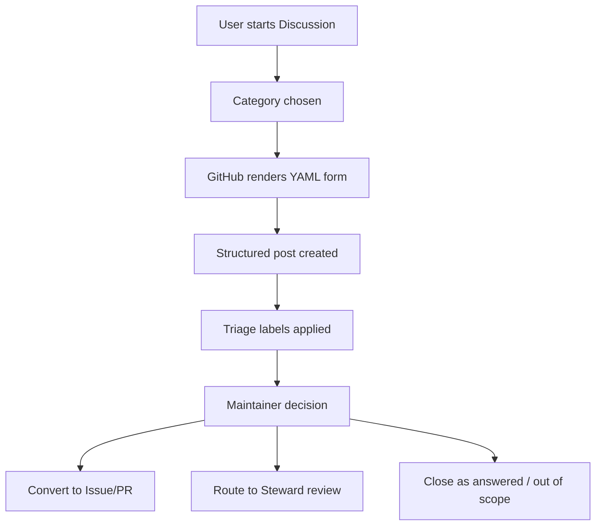

<!-- [KFM_META_BLOCK_V2]
doc_id: kfm://doc/9b8c7d3b-0f18-4e13-94f8-2d4c0c8c67c9
title: GitHub Discussions Category Forms
type: standard
version: v1
status: draft
owners: KFM Maintainers
created: 2026-02-28
updated: 2026-02-28
policy_label: public
related:
  - .github/DISCUSSION_TEMPLATE/
tags: [kfm, github, discussions, templates, governance]
notes:
  - This folder is read by GitHub to render category-specific discussion forms (YAML).
  - Keep forms policy-safe: do not request secrets, PII, or restricted location precision.
[/KFM_META_BLOCK_V2] -->

<a id="top"></a>

# 💬 GitHub Discussions Category Forms

**Purpose:** Standardize KFM GitHub Discussions intake with structured, policy-safe prompts that support *evidence-first* triage and reduce back-and-forth.


---

## Quick navigation

- [What belongs here](#what-belongs-here)
- [How GitHub uses this folder](#how-github-uses-this-folder)
- [Directory layout](#directory-layout)
- [Add or change a form](#add-or-change-a-form)
- [KFM form design rules](#kfm-form-design-rules)
- [YAML schema quick reference](#yaml-schema-quick-reference)
- [Recommended KFM forms](#recommended-kfm-forms)
- [Validation & troubleshooting](#validation--troubleshooting)

---

## What belongs here

✅ **Acceptable inputs**
- `*.yml` discussion category form definitions (one per category slug)
- This `README.md` documentation

🚫 **Exclusions**
- No dataset specs, run logs, screenshots, or policy docs
- No secrets (tokens/keys), credentials, or private URLs
- No “misc” docs that don’t affect GitHub Discussion forms

> NOTE: This directory is infrastructure-for-collaboration. Keep it boring, predictable, and reviewable.

[Back to top](#top)

---

## How GitHub uses this folder

GitHub reads YAML files in this folder to render a **category-specific discussion submission form**.
Each YAML file maps **1:1** to a Discussion **category slug**.

- Filename convention:  
  `.<repo>/.github/DISCUSSION_TEMPLATE/<category-slug>.yml`

- The `body:` key is required, and it must contain at least **one non-Markdown** input element.

> TIP: Keep titles/labels consistent so triage can filter and route quickly.

[Back to top](#top)

---

## Directory layout

```text
.github/
  DISCUSSION_TEMPLATE/
    README.md
    <category-slug>.yml
    <another-category-slug>.yml
```

[Back to top](#top)

---

## Add or change a form

1. **Confirm the category slug** (in repo Discussions settings).  
2. Create or edit: `.<repo>/.github/DISCUSSION_TEMPLATE/<slug>.yml`
3. Keep the form **minimal** and focused on:
   - problem statement
   - evidence and reproducibility
   - governance/sensitivity signals
4. Open a PR and request review from maintainers / governance stewards (per your CODEOWNERS policy).
5. After merge, **test in GitHub UI**:
   - Discussions → “New discussion” → pick the category → verify fields render & required prompts make sense.

[Back to top](#top)

---

## KFM form design rules

These are “trust membrane” rules applied to *discussion intake* (not runtime policy), to prevent harm and reduce governance debt.

### Safety & sensitivity
- **Never request**: credentials, API keys, private access links, personal phone/email, or precise coordinates for sensitive locations.
- If location is needed, ask for **coarse geography** (county / watershed / bounding box at coarse zoom) unless policy explicitly allows precision.
- If the topic could involve culturally restricted knowledge, endangered species, archaeology, or vulnerable sites:
  - ask for “**sensitivity level** (unknown / potentially sensitive / confirmed restricted)”
  - ask the author to *avoid* including restricted details and request steward review

### Evidence-first (practical)
For any claim that might become a work item, encourage:
- **What did you observe?** (not just conclusions)
- **What evidence exists?** (links, screenshots, dataset IDs, receipts, provenance)
- **How can someone reproduce/verify?** (steps, queries, bounding box/time window)

### Time-aware
If the topic is time-based (sensor feeds, imagery cadence, incident timelines):
- require a **time window** (“start/end” or a specific date range)
- ask for the **event time** vs **publication time** if relevant

[Back to top](#top)

---

## YAML schema quick reference

All discussion forms are YAML. Minimum viable file:

```yaml
title: "[<Category>] "
labels: ["<triage-label>"]   # optional
body:
  - type: markdown
    attributes:
      value: |
        Thanks for starting a discussion. Please include enough detail for others to verify and help.

  - type: textarea
    id: problem
    attributes:
      label: What are you trying to do?
      description: "Describe the goal and why it matters."
      placeholder: "I want to..."
    validations:
      required: true
```

Supported element types commonly used:
- `markdown` (context text, not submitted)
- `textarea` (multi-line input)
- `input` (single-line input)
- `dropdown` (choose one or many)
- `checkboxes` (acknowledgements / policy gates)

> WARNING: Treat field IDs (`id:`) as stable interface keys. Renaming IDs breaks continuity in how people reference “what we asked.”

[Back to top](#top)

---

## Recommended KFM forms

This repo’s actual category slugs may differ — align the filenames to the **existing** category slugs in GitHub.

| Category intent | Suggested slug filename | Goal | “Must ask” fields |
|---|---|---|---|
| Dataset onboarding request | `dataset-onboarding.yml` | Capture licensing, scope, and governance early | source/URL, license/rights, spatial extent, temporal extent, sensitivity flag |
| Policy / sensitivity question | `policy-review.yml` | Route to steward review fast | what is being shared, why, sensitivity level, proposed redaction/generalization |
| Bug / reliability report | `bug-report.yml` | Get reproducible steps and context | steps, expected vs actual, logs/screenshots, environment |
| Architecture / RFC discussion | `architecture-rfc.yml` | Compare options with explicit tradeoffs | decision needed, options, risks, rollbacks, invariants impacted |
| Story / narrative proposal | `story-proposal.yml` | Ensure “cite-or-abstain” readiness | thesis, datasets/evidence refs, map/time window, rights check |

### Canonical intake fields (recommended)
Use consistent field IDs across forms when possible:

- `problem` — what is being proposed / asked
- `evidence` — links, dataset IDs, receipts, screenshots (policy-safe)
- `repro` — steps to reproduce / verify
- `time_window` — start/end
- `geo_scope` — county/region/bbox (coarse)
- `sensitivity` — unknown / potentially sensitive / restricted
- `license_rights` — license + rights holder (if data/media involved)

[Back to top](#top)

---

## Validation & troubleshooting

### Checklist before merge
- [ ] Filename matches **category slug** exactly
- [ ] YAML parses (no tabs; consistent indentation)
- [ ] Has `body:` and at least one **non-Markdown** field
- [ ] No requests for secrets/PII/restricted coordinates
- [ ] Field IDs are stable and descriptive (`kebab-case` recommended)
- [ ] Labels referenced actually exist (if you use auto-labeling)

### Common “why isn’t it showing up?”
- File name doesn’t match the category slug
- YAML invalid (indentation / quoting)
- The category is a **Poll** (forms are not supported)
- You edited a non-default branch and didn’t merge to default

[Back to top](#top)

---

## Appendix: Form authoring pattern


