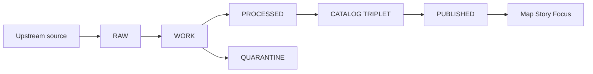
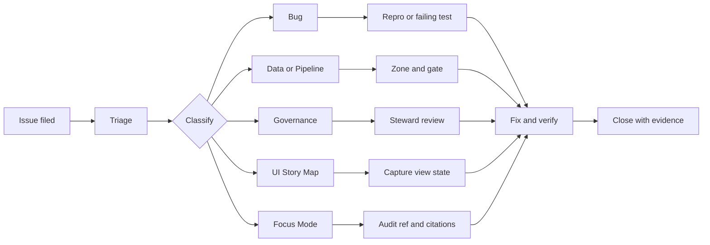

<!-- [KFM_META_BLOCK_V2]
doc_id: kfm://doc/b49f150f-953e-426a-bae7-2f507cff8f57
title: Issue templates README
type: standard
version: v1
status: draft
owners: KFM Maintainers
created: 2026-02-22
updated: 2026-02-22
policy_label: public
related: []
tags: [kfm, github, issues, templates, governance]
notes:
  - Keep this README aligned with the actual templates present in this directory.
  - This README is intended to be safe for public repos; do not add restricted details here.
[/KFM_META_BLOCK_V2] -->

# Issue templates
How to file **governed, evidence-first** issues for **Kansas Frontier Matrix (KFM)**.  
**Status:** draft • **Owners:** KFM Maintainers


## Navigation
- [Directory layout](#directory-layout)
- [KFM invariants that affect issues](#kfm-invariants-that-affect-issues)
- [Which template should I use](#which-template-should-i-use)
- [Before you file](#before-you-file)
- [Evidence pack checklist](#evidence-pack-checklist)
- [Issue types and required fields](#issue-types-and-required-fields)
- [Sensitive data and location safety](#sensitive-data-and-location-safety)
- [Maintainer triage notes](#maintainer-triage-notes)
- [Closing criteria](#closing-criteria)

---

## Directory layout

```text
.github/
└─ ISSUE_TEMPLATE/
   └─ README.md    # this file
   # other issue templates live beside this README
```

> TIP  
> If you add/remove templates, update the table in **[Which template should I use](#which-template-should-i-use)**.

[Back to top](#issue-templates)

---

## KFM invariants that affect issues

KFM is **map-first**, **time-aware**, **governed**, and **evidence-first**. In practice, that means:

- **Truth path lifecycle:** data moves from acquisition → processing → catalog/lineage → governed runtime surfaces.
- **Promotion is gated:** dataset versions are not “published” until minimum promotion gates pass.
- **Trust membrane:** clients don’t access storage/DB directly; policy enforcement happens at the governed API boundary.
- **Evidence-first UX:** map layers and story claims should open into evidence (version, license, policy label, provenance, digests).
- **Focus Mode is cite-or-abstain:** if citations can’t be verified/resolved, the system must abstain or reduce scope.

### Quick mental model



[Back to top](#issue-templates)

---

## Which template should I use

Pick the closest template from GitHub’s issue picker. If a matching template doesn’t exist yet, choose **Blank issue** and follow the **Evidence pack** checklist below.

| You want to… | Use a template like… | Typical labels |
|---|---|---|
| Report a regression, crash, incorrect output, failing test | **Bug report** | `type/bug`, `area/*` |
| Ask for new capability or improvement | **Feature request** | `type/feature`, `area/*` |
| Add a dataset, fix ingestion, improve QA, unblock promotion | **Data / pipeline** | `type/data`, `zone/*`, `gate/*` |
| Change policy labels, redaction rules, review workflow, stewardship | **Governance / policy** | `type/governance`, `policy/*` |
| Fix map rendering, story node UX, evidence drawer, timeline controls | **UI / story / map** | `type/ui`, `type/story` |
| Report Focus Mode citation failures, abstention UX, leakage risks | **Focus Mode** | `type/focus`, `risk/*` |
| Report a security vulnerability | **Do not open a public issue** | _(private disclosure)_ |

[Back to top](#issue-templates)

---

## Before you file

1) **Search first**  
Check existing issues (and closed issues) to avoid duplicates.

2) **Decide whether this is governed / sensitive**  
If your report includes anything that could be **restricted, private, culturally sensitive, or harm-amplifying**, **do not post it publicly**. See [Sensitive data and location safety](#sensitive-data-and-location-safety).

3) **Be time-aware**  
Use **explicit dates** (e.g., `2026-02-21`) rather than “yesterday” or “recently”. If the issue is about a time window, include:
- the **event time** you care about (what happened when), and
- the **transaction time** (when we ingested or updated it), if known.

4) **Identify the layer of the system**  
When possible, name the affected layer:
- **Pipelines / ingestion**
- **Catalog triplet (DCAT / STAC / PROV)**
- **Indexes (PostGIS / search / graph / tiles)**
- **Governed API**
- **UI (Map / Story / Focus)**

[Back to top](#issue-templates)

---

## Evidence pack checklist

KFM issues are most actionable when they include an **evidence pack** — enough information to reproduce, verify, and close the issue without guesswork.

### Required for most issues
- **What happened** (actual behavior)
- **What you expected**
- **Why it matters** (impact + who it affects)
- **How to reproduce**
  - minimal repro steps, or
  - a minimal failing test, or
  - a specific dataset slice (bbox/time/filter) that demonstrates the problem
- **Where you saw it**
  - UI route/screen, API endpoint, pipeline job name, etc.
- **When**
  - explicit date/time + timezone (or UTC)
- **Artifacts**
  - screenshots, logs, error codes, stack traces (redacted if needed)

### Required for data / pipeline / catalog issues
- **Dataset ID** (stable identity) and **DatasetVersion ID** (immutable version), if known
- **Truth-path zone** where the problem occurs: `RAW`, `WORK`, `QUARANTINE`, `PROCESSED`, `CATALOG`, `PUBLISHED`
- **Run receipt / run_id** and the **artifact digests** (checksums) involved, if available
- **Policy label** you believe applies (`public`, `restricted`, etc.) and any redaction/generalization expectations
- **Licensing status**
  - explicit license, or
  - “unclear” (defaults to quarantine / fail-closed)

### Optional but extremely helpful
- **Commit SHA** (or release tag) you tested
- **Environment details**
  - OS / browser, Node/Python versions, container image digest, cluster info
- **Proposed fix**
  - hypothesis + suggested approach
- **Acceptance criteria**
  - what “done” looks like

<details>
<summary>Example: minimal evidence pack (copy/paste)</summary>

```markdown
**What happened**
- …

**Expected**
- …

**Repro steps**
1. …
2. …
3. …

**When**
- Observed: 2026-02-21 14:32 America/Chicago

**Where**
- Component: governed API
- Endpoint: …

**Artifacts**
- Log excerpt (redacted):
  ```
  error_code: …
  message: …
  audit_ref: …
  ```

**Data context (if relevant)**
- dataset_id: …
- dataset_version_id: …
- zone: …
- run_id: …
- artifact_digest(s): sha256:…
- policy_label: …
- license: …
```

</details>

[Back to top](#issue-templates)

---

## Issue types and required fields

### Bug report

Include (in addition to the Evidence pack):
- **Scope**: API / UI / pipeline / catalog / index
- **Severity**: blocking / major / minor
- **Regression?** If yes, last known good version
- **Repro reliability**: always / intermittent
- **Minimal failing case** (prefer a test, then a repro script, then screenshots)

### Feature request

Include:
- **User story**: who + what + why
- **Non-goals**: what this request does *not* cover
- **Policy implications**: does this change what is visible to whom?
- **Acceptance criteria** and (if applicable) **a11y expectations**

### Data / pipeline

Include:
- **Intent**: new dataset, ingestion fix, QA improvement, redaction, re-index, etc.
- **Zone & gate**: where the issue is blocking (`RAW`/`WORK`/… and which promotion gate, if known)
- **Source of truth**: upstream citation / acquisition notes (no restricted content)
- **License and rights holder**
- **Schema + sample** (small, redacted)
- **Validation expectations**
  - schema checks
  - spatial checks
  - temporal checks
  - completeness checks
- **Output targets**
  - expected artifact formats (e.g., GeoParquet, PMTiles, COG, JSONL)

<details>
<summary>Promotion gates quick reference (A–G)</summary>

Use these labels when an issue is clearly tied to a promotion blocker.

- **Gate A:** Identity and versioning
- **Gate B:** Licensing and rights metadata
- **Gate C:** Sensitivity classification and redaction/generalization plan
- **Gate D:** Catalog triplet validation (DCAT/STAC/PROV + cross-links)
- **Gate E:** Run receipts and checksums
- **Gate F:** Policy tests and contract tests
- **Gate G:** Optional recommended gates (SBOM/build provenance, performance/a11y smoke checks, etc.)

</details>

> NOTE  
> If licensing is unclear or sensitivity is unresolved, the correct outcome is **QUARANTINE** until steward review.

### Governance / policy

Include:
- **What policy label / rule changes** are requested
- **Reason for change** (harm mitigation, compliance, community constraints, etc.)
- **Who needs to review** (roles, stewards, community stakeholders)
- **Migration / rollout plan** (how behavior changes safely, how we audit it)
- **Test updates**
  - policy fixtures and contract tests must be updated alongside policy changes

### UI / story / map

Include:
- **Map state** when the issue occurred
  - bbox, zoom, active layers, time window
- **Expected trust surfaces**
  - dataset version badge
  - license / rights info
  - policy label
  - evidence links
- **Screenshots / screen recordings** (redact sensitive data)
- **Browser + device** info

### Focus Mode

Include:
- **Prompt/query** (exact text)
- **View state** if used (bbox/time/layers)
- **Observed behavior**
  - missing citations, wrong citations, refusal/abstention, leakage concerns
- **Expected behavior**
  - cite-or-abstain, policy-safe refusal, clearer abstention UX, etc.
- **Audit reference** (if shown by the system)
- **Safety notes** (if you believe it is a security/privacy issue, treat it as such)

### Security

**Do not file a public issue** for:
- vulnerabilities (auth/policy bypass, injection, exfiltration),
- sensitive data leaks,
- anything that could enable abuse.

Use the private disclosure channel described in `SECURITY.md` (if present) or contact the maintainers directly.

[Back to top](#issue-templates)

---

## Sensitive data and location safety

> WARNING  
> KFM handles historical, environmental, and archaeological information. Some locations or attributes may be **vulnerable**.  
> **Do not post precise coordinates, access instructions, or identifying details** for sensitive sites in public issues.

Rules of thumb:
- If you’re unsure whether something is sensitive: **assume restricted** and **generalize**.
- Prefer bounding boxes at **county/region** scale over point coordinates.
- Remove personal data, private addresses, phone numbers, emails, and unique IDs.
- When sharing logs, redact tokens, API keys, cookies, and any restricted dataset identifiers.

If the issue requires sensitive details to diagnose:
- file a **minimal public issue** with general context, then
- coordinate with stewards/maintainers for a restricted evidence handoff.

[Back to top](#issue-templates)

---

## Maintainer triage notes

These notes are here to keep triage consistent and fast.

### Recommended label scheme
- `type/bug` `type/feature` `type/data` `type/governance` `type/ui` `type/story` `type/focus`
- `area/ingest` `area/catalog` `area/policy` `area/api` `area/ui` `area/index`
- `zone/raw` `zone/work` `zone/quarantine` `zone/processed` `zone/catalog` `zone/published`
- `gate/A` … `gate/G` (promotion gates)
- `severity/blocker` `severity/major` `severity/minor`
- `risk/*` (hallucination, leakage, licensing, policy bypass, etc.)

### Triage flow



[Back to top](#issue-templates)

---

## Closing criteria

An issue is ready to close when:
- the fix is merged (or explicitly declined) **and**
- the outcome is **verified** with reproducible evidence.

Examples:
- **Bug**: regression test added, bug fixed, test passes.
- **Data**: dataset version is in the correct zone; validation passes; catalogs and checksums are consistent.
- **Policy**: policy change is reviewed, fixtures/tests updated, and the governed API behavior matches policy.
- **UI/Story**: evidence drawer and trust surfaces show the right version/license/policy info; repro no longer occurs.
- **Focus Mode**: citations resolve, abstention/refusal behavior is correct, and audit receipt exists.

[Back to top](#issue-templates)
