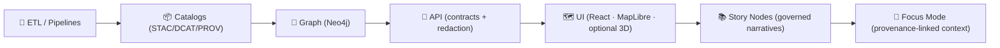

# 🧩 Issue Templates


Welcome! This folder holds the **GitHub Issue Forms / templates** that keep the Kansas-Matrix-System (KFM) workflow clear, reproducible, and governance-aligned. 🧭

> [!NOTE]
> **Why we’re strict:** this project is built around *contract-first* + *evidence-first* boundaries. Issues should point to **artifacts** (schemas, datasets, provenance, endpoints) instead of “vibes” so we can fix things fast ✅

## 🔗 Quick links

- 📌 Repo onboarding: `../../README.md`
- 🤝 Contribution rules: `../../CONTRIBUTING.md`
- 🧠 System source of truth: `../../docs/MASTER_GUIDE_v13.md`
- 🧾 Standards & profiles: `../../docs/standards/`
- 🛡️ Security policy: `../SECURITY.md` (or `../../SECURITY.md` if yours lives at repo root)

---

## 🚦 Before you open an issue

- 🔎 **Search** existing issues (and Discussions, if enabled) for duplicates.
- 🧭 **Pick the subsystem** (helps triage + labeling):
  - 🧪 ETL / Pipelines → 📦 Catalogs (STAC/DCAT/PROV) → 🧠 Graph → 🔌 API → 🗺️ UI → 📚 Story Nodes → 🎯 Focus Mode
- 🧾 **Gather evidence** (IDs, file paths, screenshots, logs, and/or provenance references).
- 🔐 **Sanity check**: do **not** post secrets, PII, or sensitive locations (see Security section below).

---

## 🧭 Which template should I use?

| Template | Use it when… | You should include… |
|---|---|---|
| 🐛 **Bug Report** | Something is broken or behaving unexpectedly | repro steps, expected vs actual, logs/screens, version/commit |
| ✨ **Feature Request** | You want new functionality | goal, user story, constraints, acceptance criteria |
| ➕ **Dataset Addition Request** | Suggesting a new dataset/domain | source + license, spatial/temporal coverage, why it matters |
| 🧼 **Data Quality / Metadata / Provenance** | Wrong values, missing/invalid STAC/DCAT/PROV, lineage mismatch | dataset identifiers, file paths, what’s wrong, proposed fix |
| 🧭 **Map / Projection / Visualization** | CRS/projection, symbology, time slider, layer rendering | bbox, CRS/EPSG, screenshots, steps, browser/device |
| 📚 **Story Node / Narrative** | Citation gaps, factual corrections, wording/structure problems | story id/path, section anchor, sources, suggested edits |
| 🧠 **Focus Mode / AI** | Unsourced claim, redaction leak, evidence mismatch, UX issues | what you saw, evidence refs, steps, minimal context needed |
| 📖 **Docs / Governance** | Docs wrong/outdated OR policy needs change | exact doc path + section, proposed change + rationale |

> [!TIP]
> If you’re unsure, pick **🐛 Bug Report** and clearly state what subsystem you *think* it is — maintainers will retag it.

---

## 🧾 Baseline checklist for every issue

- [ ] I searched existing issues (and Discussions if available)
- [ ] I selected the closest template (or explained why none fit)
- [ ] I identified the subsystem (ETL / Catalogs / Graph / API / UI / Story / Focus)
- [ ] I provided **evidence** (logs/screens/IDs) — not just description
- [ ] I did **not** include secrets, PII, or sensitive coordinates/locations

---

## 🗂️ Where things live

Use these paths to “point at the thing” in your issue 👇

```text
📁 .github/
   └── 📁 ISSUE_TEMPLATE/
       ├── 📄 README.md                 👈 you are here
       ├── 📄 config.yml                (template chooser + contact links)
       ├── 📄 bug_report.yml            (issue form)
       ├── 📄 feature_request.yml
       └── 📄 ...
📁 data/
   ├── 📁 raw/                          (inputs; do not mutate)
   ├── 📁 work/                         (intermediate)
   ├── 📁 processed/                    (publishable outputs)
   ├── 📁 stac/                         (STAC collections/items)
   ├── 📁 catalog/dcat/                 (DCAT JSON-LD)
   └── 📁 prov/                         (PROV lineage bundles)
📁 schemas/                              (JSON Schemas: STAC/DCAT/PROV/story/ui/telemetry)
📁 src/
   ├── 📁 pipelines/                    (ETL & generators)
   ├── 📁 graph/                        (ontology + migrations + graph sync)
   └── 📁 server/                       (API implementation + contracts)
📁 web/                                  (UI: React/MapLibre/etc.)
📁 docs/
   ├── 📁 architecture/                 (design + ADRs)
   ├── 📁 governance/                   (ethics/sovereignty/policy)
   └── 📁 reports/story_nodes/          (governed narratives: draft/ + published/)
📁 tests/                                (unit/integration)
📁 tools/                                (validators + utilities)
```

---

## 🧩 Subsystem map

<details>
<summary>Click to expand the pipeline/architecture flow 🗺️</summary>



</details>

---

## 📎 What “great issues” look like

### 🐛 Bug reports

Include:
- ✅ **Repro steps** (commands, URL, query, clicks)
- ✅ **Expected vs actual**
- ✅ **Artifacts**:
  - logs (redacted) + stack trace
  - screenshots/video if UI
  - API request/response (redacted)
- ✅ **Version context**:
  - commit SHA / tag
  - OS + browser/device
  - Docker/Compose version (if relevant)

Nice-to-have:
- 🔬 minimal reproduction repo or fixture dataset
- 📌 suspected subsystem + file(s)

---

### ➕ Dataset addition requests

Include:
- 🌐 Source link(s) (official preferred) + citation info
- ⚖️ License terms (and any restrictions)
- 🗺️ Spatial coverage (region/bbox) + resolution
- 🕰️ Temporal coverage (start/end; update cadence)
- 🎯 Why it matters (what questions it enables in KFM)
- 🧾 Any known metadata format (STAC-ready? CSV? GeoTIFF? WMS?)

> [!TIP]
> If you can, propose a *pipeline plan*:
> `raw input → processing steps → processed outputs → STAC/DCAT/PROV artifacts → API exposure → UI layer`.

---

### 🧼 Data quality / metadata / provenance issues

Include:
- 🆔 Dataset identifiers (STAC Item/Collection id, DCAT dataset name, PROV bundle filename)
- 📄 File paths involved (raw/work/processed + catalog + prov)
- ❌ What’s wrong (schema invalid, missing fields, wrong bbox/time, license mismatch, etc.)
- ✅ What “correct” should be (with source references)

---

### 🧭 Map / projection / visualization issues

Include:
- 🗺️ BBox/extent (rough is fine)
- 🧭 CRS/EPSG (what you expected vs what’s displayed)
- 🕰️ Time range / timestamp (if it’s time-aware)
- 🖥️ Browser + device/GPU info (render bugs are often platform-specific)
- 📸 Screenshot(s) with annotation

---

### 📚 Story Nodes & narrative issues

Include:
- 🧾 Story Node path/id (and whether it’s `draft/` or `published/`)
- 🔗 Section heading/anchor (what line/section is wrong)
- 📚 Sources that support the correction (links, citations)
- ✍️ Suggested replacement text (optional but helpful)

> [!NOTE]
> Narrative changes must stay **provenance-linked** — no new claims without sources.

---

### 🧠 Focus Mode & AI issues

Include:
- 🧠 What feature you used (summary, “possible connection”, explanation, etc.)
- 🧾 Which Story Node / evidence artifact(s) were in context
- ❌ The issue category:
  - unsourced claim
  - wrong linkage to evidence
  - redaction/sensitivity leak
  - misleading confidence/uncertainty display
- ✅ What should have happened (including what sources should have been used)

> [!TIP]
> If it looks like a **leak** (sensitive locations / restricted info), jump straight to the security path below 🔐

---

## 🔐 Security & sensitive reports

🚫 **Do not** open a public issue for:
- secrets / tokens / credentials
- PII (names, addresses, personal identifiers)
- culturally sensitive or protected locations (precise coordinates)
- anything that could bypass redaction/governance

✅ Instead:
- Follow `../SECURITY.md` (or `../../SECURITY.md`) for responsible disclosure  
- Use GitHub Security Advisories if enabled

---

## 🛠️ Maintaining templates

Templates should:
- ✅ ask for **contract artifacts** (schemas/specs/IDs) and **evidence**
- ✅ keep the user’s burden low (only what we truly need)
- ✅ include governance nudges (license, provenance, sensitivity)

Template file types:
- `*.yml` → **Issue Forms** (recommended)
- `*.md` → legacy templates (ok if you must)
- `config.yml` → disables blank issues + adds “contact links” + orders templates

Suggested label prefixes (if your repo uses them):
- `type:` bug / feature / docs / data / story / governance
- `area:` pipelines / catalogs / graph / api / ui / focus
- `priority:` p0 / p1 / p2
- `status:` triage / blocked / ready

---

## ✅ Want to add a new issue template?

1. Create a new Issue Form: `./<template_name>.yml`
2. Keep fields aligned to KFM’s contracts (evidence + provenance + governance)
3. Update `./config.yml` so it appears in the chooser
4. Open a PR with a short screenshot or copy/paste of the rendered form ✨
