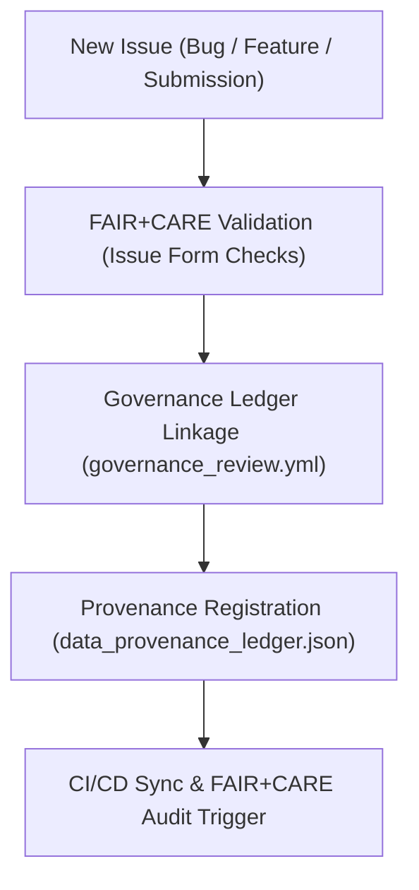

<div align="center">

# 🧾 Kansas Frontier Matrix — **GitHub Issue Templates**
`.github/ISSUE_TEMPLATE/README.md`

**Purpose:**  
Provides FAIR+CARE-aligned issue templates for transparent reporting, reproducibility documentation, and ethical governance tracking across the Kansas Frontier Matrix (KFM).  
All issue templates enforce **MCP-DL v6.3 documentation standards** and link directly to governance, FAIR+CARE, and validation workflows.

[](../../../docs/standards/faircare-validation.md)
[](../../../LICENSE)
[](../../../docs/architecture/repo-focus.md)

</div>

---

## 📚 Overview

The `.github/ISSUE_TEMPLATE/` directory defines standardized templates for bug reports, feature requests, data submissions, and governance reviews.  
Each template enforces FAIR+CARE, provenance, and ethical governance principles — ensuring every issue created in this repository contributes to transparency and reproducibility.

### Core Responsibilities
- Provide reproducible and auditable templates for all KFM issue types.  
- Align issue fields with FAIR+CARE ethics and provenance metadata.  
- Enable community participation in open, ethical data governance.  
- Integrate issue events into CI/CD governance workflows.  

---

## 🗂️ Directory Layout

```plaintext
.github/ISSUE_TEMPLATE/
├── README.md                              # This file — FAIR+CARE-aligned documentation for issue templates
│
├── bug_report.yml                         # Template for reporting pipeline or data-related bugs
├── feature_request.yml                    # Template for proposing new features or pipelines
├── data_submission.yml                    # Template for submitting new FAIR+CARE datasets
└── governance_review.yml                  # Template for governance and ethics council reviews
```

---

## ⚙️ FAIR+CARE Issue Lifecycle



### Workflow Description
1. **Issue Creation:** Contributor opens an issue using a FAIR+CARE-aligned template.  
2. **Validation:** Automated workflows confirm schema and field integrity.  
3. **Governance Linkage:** Issue metadata appended to the FAIR+CARE provenance ledger.  
4. **Audit Trigger:** CI/CD validation and FAIR+CARE checks automatically run.  
5. **Closure:** Issue completion updates lineage and governance metrics.  

---

## 🧩 Example Issue Metadata Record

```json
{
  "id": "issue_2025_11_03_1234",
  "issue_type": "bug_report",
  "reporter": "@kfm-data",
  "severity": "high",
  "status": "open",
  "linked_workflows": [
    "ci.yml",
    "faircare-validate.yml",
    "governance-ledger.yml"
  ],
  "governance_ref": "reports/audit/data_provenance_ledger.json",
  "fairstatus": "under_review",
  "created": "2025-11-03T13:00:00Z"
}
```

---

## 🧠 FAIR+CARE Governance Matrix

| Principle | Implementation |
|------------|----------------|
| **Findable** | All issues automatically indexed and traceable via ledger references. |
| **Accessible** | Open issue templates available to all contributors under MIT license. |
| **Interoperable** | Template metadata aligns with FAIR+CARE, ISO 19115, and DCAT 3.0. |
| **Reusable** | Templates reusable across governance and validation workflows. |
| **Collective Benefit** | Fosters open, ethical collaboration and transparency. |
| **Authority to Control** | FAIR+CARE Council oversees governance issue handling. |
| **Responsibility** | Contributors maintain integrity and documentation compliance. |
| **Ethics** | Issues reviewed for inclusion, respect, and ethical alignment. |

All issue events logged in:  
`reports/audit/system_ledger.json` • `reports/fair/system_summary.json`

---

## ⚙️ Template Summary

| Template | Purpose | FAIR+CARE Function |
|-----------|----------|--------------------|
| `bug_report.yml` | Capture reproducible pipeline or data issues. | FAIR integrity and traceability. |
| `feature_request.yml` | Propose enhancements for AI, ETL, or governance. | FAIR+CARE collective benefit alignment. |
| `data_submission.yml` | Submit datasets for FAIR+CARE validation. | Ethical governance certification. |
| `governance_review.yml` | Facilitate FAIR+CARE Council governance evaluations. | Immutable provenance and ethics audit. |

All templates automatically validated by `github_issue_template_sync.yml`.

---

## ⚖️ Governance & Provenance Linkages

| Record | Description |
|---------|-------------|
| `reports/audit/data_provenance_ledger.json` | Logs issue creation, updates, and governance linkage. |
| `reports/fair/data_care_assessment.json` | Tracks ethics and accessibility assessments linked to issues. |
| `releases/v9.6.0/manifest.zip` | Records issue-linked file references and metadata hashes. |

Governance automation triggered through `governance-ledger.yml` CI workflow.

---

## 🧾 Retention Policy

| Record Type | Retention Duration | Policy |
|--------------|--------------------|--------|
| Closed Issues | Permanent | Maintained for provenance and reproducibility. |
| Open Issues | Until Resolution | Automatically revalidated every 90 days. |
| Governance Reviews | Permanent | Stored as FAIR+CARE Council records. |
| Data Submissions | 365 days | Archived under FAIR+CARE data registry. |

Cleanup automated by `issue_template_cleanup.yml`.

---

## 🧾 Internal Use Citation

```text
Kansas Frontier Matrix (2025). GitHub Issue Templates (v9.6.0).
FAIR+CARE-certified documentation framework ensuring ethical reporting, transparent governance, and reproducibility across repository issues.
Maintained under MCP-DL v6.3 and ISO data governance compliance.
```

---

## 🧾 Version Notes

| Version | Date | Notes |
|----------|------|--------|
| v9.6.0 | 2025-11-03 | Added governance review template and FAIR+CARE Council integration. |
| v9.5.0 | 2025-11-02 | Integrated ethics audit automation for data submissions. |
| v9.3.2 | 2025-10-28 | Established standardized issue templates for FAIR+CARE compliance. |

---

<div align="center">

**Kansas Frontier Matrix** · *Transparency × FAIR+CARE Ethics × Provenance Accountability*  
[🔗 Repository](https://github.com/bartytime4life/Kansas-Frontier-Matrix) • [🧭 Docs Portal](../../../docs/) • [⚖️ Governance Ledger](../../../docs/standards/governance/)

</div>
