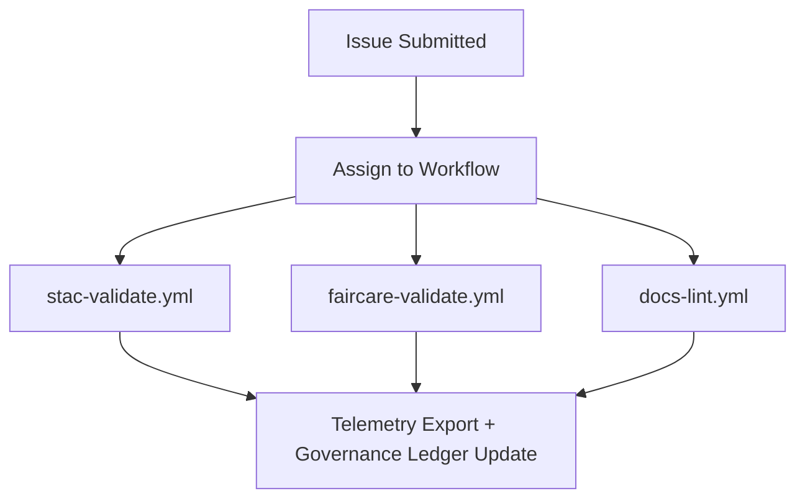

<div align="center">

# 🧾 **Kansas Frontier Matrix — Issue Templates & Governance Forms Overview**
`.github/ISSUE_TEMPLATE/README.md`

**Purpose:** Provide an index and description of all GitHub issue templates used within Kansas Frontier Matrix (KFM).  
These forms standardize **community collaboration**, **data governance**, and **ethical review** under the **Master Coder Protocol (MCP v6.3)** and **FAIR+CARE** certification standards.

[](../../docs/README.md)
[](../../LICENSE)
[](../../docs/standards/faircare.md)
[]()

</div>

---

## 📘 Overview

All issue templates in `.github/ISSUE_TEMPLATE/` are **YAML-based structured forms** that guide users through providing complete, validated, and reproducible information.  
Templates ensure submissions include metadata such as:
- Provenance, license, checksum  
- FAIR+CARE governance attestations  
- Links to datasets, workflows, or manifests  
- Required fields for validation automation  

---

## 🗂️ Directory Layout

```
.github/ISSUE_TEMPLATE/
├── README.md                # This file
├── data_submission.yml      # For new datasets or STAC items
├── feature_request.yml      # For proposing new enhancements
├── bug_report.yml           # For software or data defects
└── governance_form.yml      # For ethical / FAIR+CARE governance reviews
```

Each form feeds CI/CD validation workflows automatically (`stac-validate.yml`, `faircare-validate.yml`, `docs-lint.yml`).

---

## 🧩 Template Summary

| Template | Use Case | Key Fields | Workflow Triggered |
|-----------|-----------|-------------|--------------------|
| `data_submission.yml` | New dataset or STAC Item submission | `id`, `title`, `license`, `spatial`, `temporal`, `checksum` | `stac-validate.yml`, `faircare-validate.yml` |
| `feature_request.yml` | New feature or enhancement proposal | `title`, `rationale`, `dependencies` | `docs-lint.yml` |
| `bug_report.yml` | Reproducible software/data issue | `steps_to_reproduce`, `expected_behavior`, `logs` | `codeql.yml`, `test.yml` |
| `governance_form.yml` | FAIR+CARE ethics review submission | `dataset`, `reviewer`, `CARE_evaluation`, `decision` | `faircare-validate.yml` |

---

## 🧾 Data Submission Template (`data_submission.yml`)

Used for **dataset additions** to `data/sources/`.  
Ensures each submission includes FAIR+CARE-compliant metadata.

**Required Fields**
```yaml
id: "noaa_storms_1950_2025"
title: "NOAA Storm Events (1950–2025)"
license: "Public Domain"
spatial: [-102.05, 37.0, -94.6, 40.0]
temporal: { start: "1950-01-01", end: "2025-05-01" }
provenance: "NOAA NCEI"
checksum: "sha256-123abc..."
```

All submissions undergo schema validation and checksum verification before merge.

---

## ✨ Feature Request Template (`feature_request.yml`)

Encourages innovation while maintaining governance alignment.

**Includes:**
- Purpose and scope  
- Motivation and problem statement  
- Dependencies or blockers  
- FAIR+CARE implications (if affecting data layers)

Reviewed quarterly by the **Architecture Committee** and logged in the governance ledger.

---

## 🐞 Bug Report Template (`bug_report.yml`)

Collects details needed to reproduce issues deterministically.

**Sections:**
- Environment (OS, browser, Python/Node versions)
- Reproduction steps
- Expected vs. actual results
- Logs or screenshots

Upon submission, workflows run `make test` and append debug reports to:
```
reports/debug/<issue_id>/
```

---

## ⚖️ Governance Review Template (`governance_form.yml`)

Ensures **ethical and cultural review** for datasets or workflows with community relevance.

**Sections:**
- Reviewer name and role  
- Dataset IDs and source references  
- CARE evaluation: **Collective Benefit**, **Authority to Control**, **Responsibility**, **Ethics**  
- Summary notes and approval/rejection

**Log Output:**  
`reports/audit/governance-ledger.json`

All reviews become part of the **FAIR+CARE Council Ledger** and feed telemetry metrics.

---

## 🧮 Automation Flow



Each template directly connects issue submissions to CI/CD pipelines, creating end-to-end traceability.

---

## 🧠 Governance & Compliance Checklist

Each issue form includes mandatory consent and metadata requirements:

- [x] Acknowledgement of Master Coder Protocol v6.3  
- [x] Confirmed open license and provenance source  
- [x] Cultural sensitivity review for Indigenous data  
- [x] Provided SHA-256 checksum for datasets  
- [x] Verified compliance with FAIR+CARE standards  

---

## ⚙️ FAIR+CARE Integration

| Principle | Implementation |
|------------|----------------|
| **Findable** | Metadata searchable via GitHub and governance dashboards |
| **Accessible** | Public issue forms; transparent review history |
| **Interoperable** | JSON/YAML syntax compatible with governance parsers |
| **Reusable** | Versioned templates revalidated quarterly |
| **CARE** | Governance form ensures ethical review chain |

---

## 🧩 Workflow → Template Mapping

| Template | Workflow | Output Artifact |
|-----------|-----------|----------------|
| `data_submission.yml` | `stac-validate.yml` / `faircare-validate.yml` | `reports/self-validation/stac/_summary.json` |
| `feature_request.yml` | `docs-lint.yml` | `reports/self-validation/docs/lint_summary.json` |
| `bug_report.yml` | `test.yml` / `codeql.yml` | `reports/debug/*.json` |
| `governance_form.yml` | `faircare-validate.yml` | `reports/audit/governance-ledger.json` |

---

## 🕰️ Version History

| Version | Date | Author | Summary |
|----------|------|---------|----------|
| v9.7.0 | 2025-11-05 | A. Barta | Consolidated and aligned all issue templates with governance telemetry integration. |
| v9.5.0 | 2025-10-20 | A. Barta | FAIR+CARE governance form expansion and Council ledger linkage. |
| v9.3.1 | 2025-09-01 | KFM Core Team | Added SPDX license and provenance verification fields. |
| v9.0.0 | 2025-06-01 | KFM Core Team | Initial structured YAML issue templates. |

---

<div align="center">

**© 2025 Kansas Frontier Matrix — MIT / CC-BY 4.0**  
Governed under **Master Coder Protocol v6.3** · FAIR+CARE Certified · Diamond⁹ Ω / Crown∞Ω Ultimate Certified  
[Back to GitHub Overview](../README.md) · [Governance Charter](../../docs/standards/governance/ROOT-GOVERNANCE.md)

</div>
