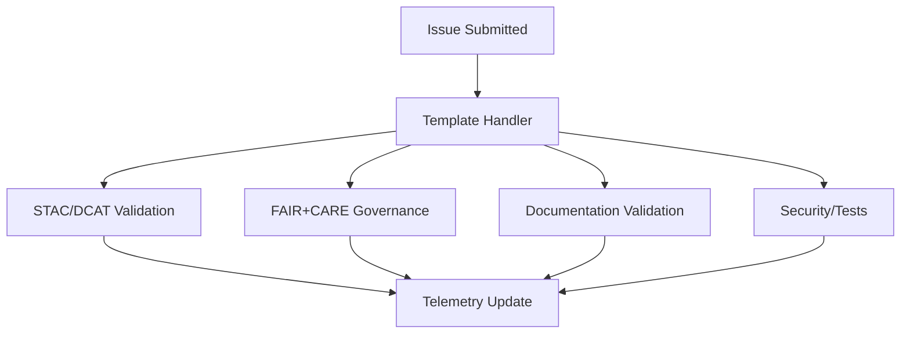

<div align="center">

# 🧾 **Kansas Frontier Matrix — Issue Templates & Governance Forms Overview**  
`.github/ISSUE_TEMPLATE/README.md`

This file describes all **GitHub Issue Templates & Governance Forms** used across the KFM monorepo.  
Templates enforce **documentation-first**, **governance-first**, **ethics-first**, and **sovereignty-aware** workflows consistent with:

- **MCP-DL v6.3**  
- **KFM-MDP v11**  
- **FAIR+CARE**  
- **Diamond⁹ Ω / Crown∞Ω** governance  

[](#)  
[](#)  
[](#)

</div>

## 📘 Overview

The `.github/ISSUE_TEMPLATE/` directory contains **YAML Issue Forms** used to capture:

- Dataset provenance, licensing, and FAIR+CARE metadata  
- STAC/DCAT identifiers and schema references  
- Governance and sovereignty considerations  
- Clear bug reproduction steps  
- Feature proposal reasoning and design requirements  
- Consent, masking, sensitivity classification for cultural data  

Each issue form **feeds automation**:

- CI/CD validators (`docs_validate`, `stac_validate`, `dcat_validate`)  
- Governance & sovereignty checks (`faircare_validate`)  
- Security scans (`security_audit`)  
- Telemetry logs (`telemetry_export`)  

## 🗂️ Directory Layout

```
.github/ISSUE_TEMPLATE/
│
├── README.md                # This file
├── bug_report.yml           # Deterministic bug reporting
├── feature_request.yml      # Feature requests with governance prompts
├── data_submission.yml      # Dataset + STAC/DCAT submission
└── governance_form.yml      # Indigenous/CARE governance review
```

## 🧩 Template Summary

| Template              | Purpose                               | Key Fields                                           | Workflows Triggered                          |
|-----------------------|-----------------------------------------|-------------------------------------------------------|-----------------------------------------------|
| `data_submission.yml` | Register/update dataset or STAC Item    | provenance, license, spatial/temporal, checksum       | stac-validate · dcat-validate · faircare      |
| `feature_request.yml` | Request new features or enhancements     | rationale, scope, dependencies, FAIR+CARE implications | docs-validate                                 |
| `bug_report.yml`      | Provide reproducible defect reports      | environment, logs, expected/actual behavior           | ci · security_audit                           |
| `governance_form.yml` | Cultural/Indigenous CARE evaluation      | CARE criteria, reviewer, decision, rationale          | faircare-validate · governance-ledger         |

Templates must adhere to:

- KFM-MDP v11 Markdown & YAML rules  
- No bare `null` / `None` values (use `"N/A"`)  
- STAC/DCAT field conventions for dataset-related templates  

## 🧾 Data Submission Template (Example)

```
id: "noaa_storms_1950_2025"
title: "NOAA Storm Events, 1950–2025"
license: "Public Domain"
spatial: [-102.05, 37.0, -94.6, 40.0]
temporal: { start: "1950-01-01", end: "2025-04-30" }
provenance: "NOAA NCEI"
checksum: "sha256-<64hex>"
```

This template activates:

- `stac_validate.yml`  
- `faircare_validate.yml`  
- `dcat_validate.yml` (if dataset includes DCAT metadata)  

Outputs written to:

```
reports/self-validation/stac/
reports/fair/
```

## ✨ Feature Request Template

Captures:

- Feature rationale & intended outcomes  
- FAIR+CARE implications  
- Deprecation & rollout plan  
- Cross-domain dependencies (web/API/graph/data)  
- Accessibility and sustainability considerations  

Architecture reviewers use this template to ensure multi-domain alignment.

## 🐞 Bug Report Template

Ensures reproducible debugging:

- Full environment  
- Step-by-step reproduction  
- Screenshots/logs  
- Dataset IDs involved  
- Impact severity  

Artifacts stored in:

```
reports/debug/<issue-id>/
```

## ⚖️ Governance Review Template (`governance_form.yml`)

Enforces Indigenous rights & cultural stewardship:

- Dataset IDs and provenance  
- Reviewer  
- Full CARE framework evaluation  
- Required masking or restrictions  
- Conditions and rationale for decisions  

Produces:

```
docs/reports/audit/governance-ledger.json
```

This ledger is **append-only** and linked to release metadata.

## 🧮 Workflow Routing



## ⚙️ FAIR+CARE Integration

| Principle | Implementation |
|----------|----------------|
| **F1**   | Metadata fields required in issue forms |
| **A1**   | Templates expose license & access constraints |
| **I1**   | Aligns with STAC/DCAT schemas |
| **R1**   | Provenance + checksum fields required |
| **CARE** | Governance forms enforce sovereignty, consent, masking |

Governance automation uses issue form fields to differentiate **normal updates** from **sensitive or culturally governed updates**.

## 🕰️ Version History

| Version | Date       | Summary |
|--------:|------------|---------|
| v11.0.1 | 2025-11-19 | Updated metadata for v11; added new telemetry schema; corrected directory layout block; unified v11 footer. |
| v11.0.0 | 2025-11-18 | First full v11 version; upgraded schemas, workflows, and governance mappings. |
| v10.4.1 | 2025-11-16 | Added expanded CARE metadata; aligned with v10.4.0. |
| v10.3.1 | 2025-11-13 | Updated router + telemetry mapping. |
| v10.0.0 | 2025-11-09 | Initial v10 governance-first issue template overview. |
| v9.0.0  | 2025-06-01 | Initial version of formal issue templates. |

<div align="center">

**© 2025 Kansas Frontier Matrix — MIT / CC-BY 4.0**  
Issue Templates & Governance Forms Overview  
FAIR+CARE Certified · MCP-DL v6.3 · KFM-MDP v11.0 · KFM-OP v11.0  
Diamond⁹ Ω / Crown∞Ω Ultimate Certified  

[Back to .github Overview](../README.md)  
[Governance Charter](../../docs/standards/governance/ROOT-GOVERNANCE.md)

</div>
