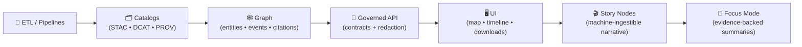

# 🧩 `.github/ISSUE_TEMPLATE/` — Issue Forms for Kansas Frontier Matrix (KFM)


> **Purpose:** This directory is the **governed front door** 🚪🧭 for opening issues in **Kansas Frontier Matrix (KFM)**.  
> Every issue should capture enough **pipeline stage**, **evidence**, **provenance/licensing**, and **sensitivity** context so maintainers can triage without breaking KFM contracts.

> [!IMPORTANT]
> 🔐 **Do not post secrets, credentials, private keys, PII, or restricted/sensitive coordinates in public issues.**  
> Use the repository’s security reporting path (see **Security Policy**) for anything sensitive.

---

## 📌 Quick links

| Action | Where |
|---|---|
| 🐛 Bug report | Use `bug_report.yml` (Issue chooser) |
| ✨ Feature request | Use `feature_request.yml` (Issue chooser) |
| 🗺️ Request a data layer/source | Use `data_layer_request.yml` (Issue chooser) |
| ❓ Ask a question | Use `question.yml` (Issue chooser) |
| 🔐 Security policy | `../SECURITY.md` *(or `../../SECURITY.md` if policy lives at repo root)* |
| 🤝 Collaboration rules + labels | `../README.md` *(the `.github/README.md` hub)* |
| 🧠 Master work protocol (v13) | `../../docs/specs/MARKDOWN_GUIDE_v13.md` *(or equivalent canonical path)* |
| 📘 System design | `../../docs/specs/Kansas Frontier Matrix (KFM) – Comprehensive Technical Documentation.docx` |
| 🧾 Templates (Story Nodes, dataset metadata, etc.) | `../../docs/templates/` |
| 📖 Glossary | `../../docs/glossary.md` |

> [!TIP]
> If a template link 404s, use the chooser: `https://github.com/<owner>/<repo>/issues/new/choose`

---

<details>
<summary><strong>🧭 Table of contents</strong></summary>

- [🧾 What this folder controls](#-what-this-folder-controls)
- [🧠 KFM intake philosophy](#-kfm-intake-philosophy)
- [🗂️ Directory layout](#️-directory-layout)
- [🧰 Template inventory](#-template-inventory)
- [✅ Minimum required fields for every issue](#-minimum-required-fields-for-every-issue)
- [🧭 Stage picker](#-stage-picker)
- [🧾 Provenance, licensing, and data hygiene](#-provenance-licensing-and-data-hygiene)
- [🔒 Sensitivity, sovereignty, and governance](#-sensitivity-sovereignty-and-governance)
- [🏷️ Labels & triage conventions](#️-labels--triage-conventions)
- [🧪 CI / contract failures](#-ci--contract-failures)
- [🛠️ Maintainers: evolving issue forms safely](#️-maintainers-evolving-issue-forms-safely)
- [📚 Reference library](#-reference-library)
- [🕰️ Version history](#️-version-history)

</details>

---

## 🧾 What this folder controls

This folder contains GitHub **Issue Forms** (`*.yml`) and optional configuration (`config.yml`) that:

- ✅ **shape** what reporters are asked
- ✅ **enforce** minimum intake fields (stage, evidence, provenance, sensitivity)
- ✅ **route** issues into the correct subsystem *without* guessing or “vibes”

Think of these templates as **operational scaffolding** 🧱 — not policy.  
Policy lives in governance/security docs; issue forms only **reference** those.

---

## 🧠 KFM intake philosophy

KFM is intentionally staged so changes stay **auditable** and **safe**:



**So issue intake must:**
- 🧭 capture a **pipeline stage guess** (don’t worry if you’re unsure)
- 🧾 require **evidence** (repro steps, IDs, logs, screenshots, or sample data)
- 🧱 require **provenance/licensing** when data is involved
- 🔒 flag **sensitivity** early (so we don’t accidentally publish restricted info)
- 🔌 preserve the **API boundary rule** (UI does not talk to graph DB directly)

---

## 🗂️ Directory layout

```text
📁 .github/
└─ 📁 ISSUE_TEMPLATE/
   ├─ 📘 README.md                 # you are here 👋
   ├─ ⚙️ config.yml                # optional: issue chooser links, disable blank issues
   ├─ 🐛 bug_report.yml            # bugs across stack
   ├─ ✨ feature_request.yml       # new features / enhancements
   ├─ 🗺️ data_layer_request.yml    # new dataset/layer/source request
   ├─ ❓ question.yml              # general questions / clarification
   ├─ 🧪 ci_failure.yml            # (recommended) CI failures / pipeline breakage
   ├─ 🔌 api_contract_change.yml   # (recommended) OpenAPI/GraphQL contract changes
   ├─ 🕸️ graph_model_change.yml    # (recommended) ontology/entity/relation changes
   ├─ 🎬 story_node_request.yml    # (recommended) Story Node additions/edits
   └─ ⚖️ governance_question.yml   # (recommended) ethics/sovereignty/sensitivity topics
```

> [!NOTE]
> Your repo may not have every file above yet.  
> This README documents the **target, governed inventory**—keep it synchronized with what exists.

---

## 🧰 Template inventory

> **Rule:** If you don’t know which form to use, pick **Bug Report** or **Question** and include the minimum fields below. Maintainers will retag it.

| Template | Use it for | Must capture (minimum) |
|---|---|---|
| 🐛 `bug_report.yml` | something is broken | stage guess · expected vs actual · repro · evidence/logs · affected paths/IDs |
| ✨ `feature_request.yml` | new capability | stage(s) · user story · acceptance criteria · contracts affected · risks |
| 🗺️ `data_layer_request.yml` | add a dataset/layer/source | source + license + retrieval date · coverage (space/time) · sensitivity · intended domain |
| ❓ `question.yml` | “how do I…?” / clarification | goal · context · stage guess · links/paths/IDs · what you tried |
| 🧪 `ci_failure.yml` *(recommended)* | CI broke / gates failing | workflow + job + step · error output (redacted) · changed paths · local repro (if known) |
| 🔌 `api_contract_change.yml` *(recommended)* | API schema/route changes | contract diff · sample req/res · breaking change assessment · tests |
| 🕸️ `graph_model_change.yml` *(recommended)* | ontology/entity/relation changes | node/edge definitions · migration plan · impacts to API/UI/story |
| 🎬 `story_node_request.yml` *(recommended)* | Story Node edits/additions | story ID/path · claim → evidence map · dataset/doc IDs · sensitivity |
| ⚖️ `governance_question.yml` *(recommended)* | ethics/sovereignty/sensitivity | concern summary · data classification · who is affected · references |

---

## ✅ Minimum required fields for every issue

Regardless of template, every issue should include:

- **What happened** (actual behavior)
- **What you expected**
- **Evidence** (at least one):
  - repro steps
  - logs (redacted)
  - screenshot/screen recording (safe)
  - a minimal sample file (non-sensitive) or a pointer + checksum
  - IDs/paths (dataset ID, STAC item, Story Node slug, API route)
- **Pipeline stage guess** (pick one — see Stage Picker below)
- **Affected paths** (best guess)
- **Sensitivity note**:
  - ✅ “Public OK”
  - ⚠️ “Internal only”
  - 🔐 “Confidential/Restricted — do not publish details here”

> [!TIP]
> If your issue involves **data**, add:
> **source** · **license/terms** · **retrieval date** · **space/time coverage** · **processing context**.

---

## 🧭 Stage picker

Use this to pick a pipeline stage (or pick “unknown” and we’ll triage).

| Stage | What it covers | Typical “evidence anchors” 🔎 |
|---|---|---|
| 🧰 **ETL / Pipelines** | ingest, transforms, tiling, normalization | run config · input sample · expected output · logs · `src/pipelines/**` |
| 🗂️ **Catalogs** (STAC/DCAT/PROV) | discoverability + metadata correctness | collection/item IDs · validator output · `schemas/{stac,dcat,prov}` |
| 🕸️ **Graph** | entities, relations, citations, timelines | node labels/IDs · relation expectations · import fixtures · `src/graph/**` |
| 🔌 **API boundary** | contracts, authZ, redaction, query behavior | endpoint + contract ref · req/res sample · auth context · `src/server/**` |
| 🖥️ **UI / Map viewer** | layers, time slider, rendering, UX | steps + screenshots · browser/device · network trace · `web/**` |
| 🎬 **Story Nodes** | narrative orchestration + citations | story slug/path · claim → evidence · layer/time steps · `docs/reports/story_nodes/**` |
| 🧠 **Focus Mode** | evidence-backed summaries | context bundle IDs · missing citations · “fact vs interpretation” errors |
| 🧪 **CI / DevEx** | tests, builds, validations, gates | workflow name · failing step · logs · changed paths |

---

## 🧾 Provenance, licensing, and data hygiene

KFM is **provenance-first**. If your issue touches datasets, documents, scans, model outputs, or derived layers:

### ✅ Required provenance fields (data-related issues)
- **Source authority** (who produced it?)
- **License/terms** (or “unknown” with explanation)
- **Retrieval/access date**
- **Spatial coverage** (bbox/region/county; avoid restricted coordinates)
- **Temporal coverage** (year/range/event window)
- **Processing context**
  - toolchain (GDAL/QGIS/GEE/Python/R/etc.)
  - CRS/EPSG
  - major transforms (georef, resample, simplify, reproject, mask)

### 🧼 Data sharing hygiene
- Prefer **tiny fixtures** or **redacted subsets** for reproduction
- If the dataset is too large:
  - provide a stable URL (if public)
  - provide checksums (sha256 recommended)
  - provide the exact ID(s) used in catalogs
- Avoid uploading:
  - sensitive coordinates
  - private infrastructure details
  - personally identifying info (PII)

### 🗂️ “Where would this live?” (helpful for routing)
Typical (v13 target) locations:

```text
📁 data/
├─ 📁 sources/        # manifests: URLs, licenses, access notes
├─ 📁 raw/            # immutable raw inputs
├─ 📁 processed/      # derived outputs (versioned)
├─ 📁 catalog/        # DCAT rollups
└─ 📁 provenance/     # PROV bundles per run / per asset
```

> [!IMPORTANT]
> Any **derived** (including AI-assisted) layer is a first-class dataset: it needs catalogs + provenance, not “just a file.”

---

## 🔒 Sensitivity, sovereignty, and governance

KFM is “mostly open” 🌾, but not everything should be published at full fidelity.

### 🧭 Recommended classification (for issue intake)
| Class | Public issue? | Examples |
|---|---:|---|
| 🌍 Public | ✅ yes | published layers with clear licensing |
| 🏢 Internal | ⚠️ limited details | staging catalogs, draft pipelines, internal runbooks |
| 🔐 Confidential | ❌ no | sensitive layers requiring controlled sharing |
| 🧨 Restricted | ❌ no | credentials, private endpoints, protected locations |

### 🪶 CARE / sovereignty notes
If an issue involves Indigenous knowledge, culturally sensitive sites, or restricted locations:
- flag it in the issue **without** posting precise coordinates
- prefer county-level or generalized geometry
- reference governance docs (expected):  
  `docs/governance/ROOT_GOVERNANCE.md` · `ETHICS.md` · `SOVEREIGNTY.md` · `REVIEW_GATES.md`

> [!CAUTION]
> Issue templates must not invent new policy.  
> They should **route** questions to governance docs + human review.

---

## 🏷️ Labels & triage conventions

KFM uses labels to route work cleanly (maintainers apply them if you don’t). 🏷️

### Suggested label taxonomy (recommended)
- `type: bug | feature | data | question | governance | ci`
- `stage: etl | catalogs | graph | api | ui | story | focus | ci`
- `component: pipeline | postgis | neo4j | webgl | map | timeline | auth | docs`
- `priority: p0 | p1 | p2 | p3`
- `governance: sensitive | sovereignty | licensing | privacy`
- `good first issue` (mentored / self-contained)

> [!TIP]
> If you know the likely label, mention it in the issue—maintainers will confirm.

---

## 🧪 CI / contract failures

If CI fails, include:

- workflow name + job name + failing step
- full error output (**redact secrets**)
- changed paths in the PR/branch
- “repro locally?” (commands if known)

Common failure buckets in KFM:
- 📄 markdown protocol/lint
- 🗂️ schema validation (STAC/DCAT/PROV)
- 🔗 link integrity (catalog `links[].href`)
- 🧾 provenance required-but-missing
- 🕸️ graph integrity checks
- 🔌 API contract tests
- 🖥️ UI build/a11y checks
- 🔐 security scans (deps, SAST, secrets)

---

## 🛠️ Maintainers: evolving issue forms safely

Issue forms are **interfaces**. Treat changes like contract changes.

### ✅ DoD for modifying templates
- [ ] Template changes map to a pipeline stage or governance requirement (no “random questions”)
- [ ] Required fields cover: stage · evidence · expected vs actual · sensitivity
- [ ] Data-related templates require: source · license · retrieval date · coverage (space/time)
- [ ] Links in `config.yml` point to real files/paths
- [ ] Labels remain consistent with `.github/README.md` + project board routing
- [ ] Version history below updated

### Optional (high leverage)
- Add dropdowns for `stage:` and `classification:`
- Add a checkbox gate: “I did not include secrets/PII/restricted coordinates”
- Add links to “how to redact” guidance (docs/security or docs/governance)

---

## 📚 Reference library

KFM’s intake questions are shaped by a multidisciplinary reference library 📚🎒 (modeling rigor, reproducibility, GIS workflows, web security, governance).  
These materials may carry licenses **separate** from this repo’s code.

<details>
<summary><strong>🧠 Why we ask for evidence + reproducibility</strong></summary>

- 📈 Stats & experimental design → avoid false certainty, demand clear assumptions + diagnostics  
- 🧪 Scientific modeling discipline → verification/validation, sensitivity, uncertainty quantification  
- 🗂️ Data governance → provenance, access constraints, purpose limitations  
- 🔐 Security posture → prevent sensitive disclosure and supply-chain footguns

</details>

<details>
<summary><strong>📦 Reference list (project library)</strong></summary>

### 🧭 Canonical KFM design docs
- `docs/specs/Kansas Frontier Matrix (KFM) – Comprehensive Technical Documentation.docx`
- `docs/specs/MARKDOWN_GUIDE_v13.md` *(or source `.gdoc`)*

### 🗺️ GIS, geoprocessing, cartography
- `docs/library/python-geospatial-analysis-cookbook.pdf`
- `docs/library/PostgreSQL Notes for Professionals - PostgreSQLNotesForProfessionals.pdf`
- `docs/library/making-maps-a-visual-guide-to-map-design-for-gis.pdf`
- `docs/library/Mobile Mapping_ Space, Cartography and the Digital - 9789048535217.pdf`
- `docs/library/compressed-image-file-formats-jpeg-png-gif-xbm-bmp.pdf`

### 🛰️ Remote sensing & Earth Engine
- `docs/library/Cloud-Based Remote Sensing with Google Earth Engine-Fundamentals and Applications.pdf`

### 🌐 Web & graphics
- `docs/library/responsive-web-design-with-html5-and-css3.pdf`
- `docs/library/webgl-programming-guide-interactive-3d-graphics-programming-with-webgl.pdf`

### 📈 Stats, experiments, Bayesian
- `docs/library/Understanding Statistics & Experimental Design.pdf`
- `docs/library/regression-analysis-with-python.pdf`
- `docs/library/Regression analysis using Python - slides-linear-regression.pdf`
- `docs/library/graphical-data-analysis-with-r.pdf`
- `docs/library/think-bayes-bayesian-statistics-in-python.pdf`

### 🧪 Simulation & scientific computing
- `docs/library/Scientific Modeling and Simulation_ A Comprehensive NASA-Grade Guide.pdf`

### 🧠 ML / Deep learning
- `docs/library/Deep Learning for Coders with fastai and PyTorch - Deep.Learning.for.Coders.with.fastai.and.PyTorchpdf`

### ⚙️ Systems, scaling, interoperability
- `docs/library/Scalable Data Management for Future Hardware.pdf`
- `docs/library/concurrent-real-time-and-distributed-programming-in-java-threads-rtsj-and-rmi.pdf`
- `docs/library/Data Spaces.pdf`

### ❤️ Ethics, autonomy, governance foundations
- `docs/library/Introduction to Digital Humanism.pdf`
- `docs/library/Principles of Biological Autonomy - book_9780262381833.pdf`
- `docs/library/On the path to AI Law’s prophecies and the conceptual foundations of the machine learning age.pdf`

### 🧮 Advanced math & optimization
- `docs/library/Spectral Geometry of Graphs.pdf`
- `docs/library/Generalized Topology Optimization for Structural Design.pdf`

### 🛡️ Security (defensive reference)
- `docs/library/ethical-hacking-and-countermeasures-secure-network-infrastructures.pdf`
- `docs/library/Gray Hat Python - Python Programming for Hackers and Reverse Engineers (2009).pdf`

### 🧰 General programming shelf (bundles)
- `docs/library/A programming Books.pdf`
- `docs/library/B-C programming Books.pdf`
- `docs/library/D-E programming Books.pdf`
- `docs/library/F-H programming Books.pdf`
- `docs/library/I-L programming Books.pdf`
- `docs/library/M-N programming Books.pdf`
- `docs/library/O-R programming Books.pdf`
- `docs/library/S-T programming Books.pdf`
- `docs/library/U-X programming Books.pdf`

</details>

---

## 🕰️ Version history

| Version | Date | Summary |
|---|---|---|
| v1.1.0 | 2026-01-08 | Align intake to v13 repo map + stage order; normalize template names (`data_layer_request.yml`); add governance/sensitivity + label taxonomy; add maintainer DoD + reference library |
| v1.0.x | 2025-12 | Initial scaffold (pre-v13 alignment) |

---

<p align="right"><a href="#-githubissue_template--issue-forms-for-kansas-frontier-matrix-kfm">⬆️ Back to top</a></p>