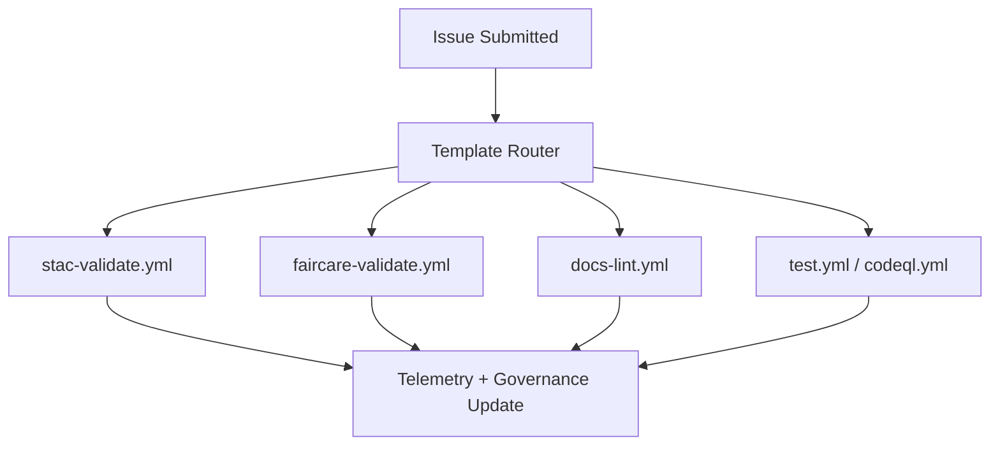

<div align="center">

# 🧾 **Kansas Frontier Matrix — Issue Templates & Governance Forms Overview**  
`.github/ISSUE_TEMPLATE/README.md`

**Purpose:**  
Provide an authoritative index of all **GitHub Issue Templates** used in the Kansas Frontier Matrix (KFM).  
These templates formalize **community collaboration**, **dataset governance**, **ethical review**, and **provenance capture** under **MCP-DL v6.3** and **FAIR+CARE** governance.

[](../../docs/README.md)  
[](../../LICENSE)  
[](../../docs/standards/faircare.md)  
[]()

</div>

---

## 📘 Overview

All issue templates under `.github/ISSUE_TEMPLATE/` are **YAML Issue Forms** designed to gather:

- Complete context (data, code, provenance)  
- FAIR+CARE attestations and consent flags  
- STAC/DCAT dataset references  
- Required SHA-256 checksums  
- Governance metadata for append-only ledgers  

Each issue template triggers automated **CI/CD validation workflows**, updating telemetry and governance audit logs.

---

## 🗂️ File Context & Directory Layout

```text
.github/ISSUE_TEMPLATE/
│
├── README.md                # This index (issue templates & governance forms overview)
├── data_submission.yml      # Dataset & STAC/DCAT submission form
├── feature_request.yml      # Feature proposals & enhancements
├── bug_report.yml           # Reproducible defect reports
└── governance_form.yml      # Ethical/cultural CARE review form
````

Each form can activate workflows such as:
`stac-validate.yml`, `faircare-validate.yml`, `docs-lint.yml`, `codeql.yml`, and telemetry exports.

---

## 🧩 Template Summary

| Template              | Purpose                           | Required Fields (excerpt)                                                 | CI/CD Triggered                              |
| --------------------- | --------------------------------- | ------------------------------------------------------------------------- | -------------------------------------------- |
| `data_submission.yml` | Register new dataset or STAC Item | `id`, `title`, `license`, `spatial`, `temporal`, `provenance`, `checksum` | `stac-validate.yml`, `faircare-validate.yml` |
| `feature_request.yml` | Request a feature or enhancement  | `title`, `rationale`, `scope`, `risks`, `dependencies`                    | `docs-lint.yml`                              |
| `bug_report.yml`      | Report deterministic defect       | `environment`, `steps`, `expected`, `actual`, `logs`                      | `test.yml`, `codeql.yml`                     |
| `governance_form.yml` | FAIR+CARE ethical/cultural review | `dataset_ids`, `reviewer`, `CARE_evaluation`, `decision`                  | `faircare-validate.yml`                      |

> **Important:** YAML Issue Forms must avoid reserved values such as bare `None` — use `"N/A"` instead.

---

## 🧾 Data Submission Template (`data_submission.yml`)

**Example (Minimal Valid):**

```yaml
id: "noaa_storms_1950_2025"
title: "NOAA Storm Events (1950–2025)"
license: "Public Domain"
spatial: [-102.05, 37.0, -94.6, 40.0]
temporal: { start: "1950-01-01", end: "2025-05-01" }
provenance: "NOAA NCEI"
checksum: "sha256-<64-hex>"
```

**Validation Pipeline:**

1. `stac-validate.yml` — JSON Schema, bbox, licensing
2. `faircare-validate.yml` — CARE classification + provenance

Artifacts produced:

* `reports/self-validation/stac/summary.json`
* `reports/fair/faircare_summary.json`

---

## ✨ Feature Request Template (`feature_request.yml`)

Captures:

* Purpose and rationale
* Feature scope + dependencies
* FAIR+CARE implications
* Acceptance criteria
* Rollout plan

Reviewed by the **Architecture Committee**, with decisions appended to the governance ledger.

---

## 🐞 Bug Report Template (`bug_report.yml`)

Collects deterministic reproduction information:

* Full environment (OS, browser, versions)
* Reproduction steps
* Expected vs. actual behavior
* Logs, screenshots, relevant datasets

Debug artifacts are saved under:

```text
reports/debug/<issue_id>/
```

---

## ⚖️ Governance Review Template (`governance_form.yml`)

Enforces **CARE** cultural and ethical review for datasets, media, or workflows with community impact.

Contains:

* Dataset IDs + provenance sources
* Reviewer metadata
* CARE criteria evaluation
* Decision + conditions
* Required consent / sensitivity flags

**Output:**

```text
docs/reports/audit/governance-ledger.json
```

---

## 🧮 Workflow Routing



---

## 🧠 Governance & Compliance Checklist

Each template includes mandatory confirmations, for example:

* [x] Reviewed **MCP-DL v6.3**
* [x] Included license + provenance + checksum (where applicable)
* [x] CARE evaluation required for cultural/heritage data
* [x] Governance Charter acknowledged

---

## ⚙️ FAIR+CARE Integration

| Principle     | Implementation                                         |
| ------------- | ------------------------------------------------------ |
| Findable      | All issue metadata indexed & cross-linked to telemetry |
| Accessible    | Public templates with CI-enforced completeness         |
| Interoperable | JSON/YAML schemas, STAC/DCAT alignment                 |
| Reusable      | Versioned templates validated quarterly                |
| CARE          | Governance forms enforce cultural/ethical review       |

---

## 🧩 Workflow → Template Mapping

| Template              | Workflow                                      | Artifact                                         |
| --------------------- | --------------------------------------------- | ------------------------------------------------ |
| `data_submission.yml` | `stac-validate.yml` / `faircare-validate.yml` | `reports/self-validation/stac/summary.json`      |
| `feature_request.yml` | `docs-lint.yml`                               | `reports/self-validation/docs/lint_summary.json` |
| `bug_report.yml`      | `test.yml` / `codeql.yml`                     | `reports/debug/<issue_id>/*.json`                |
| `governance_form.yml` | `faircare-validate.yml`                       | `reports/audit/governance-ledger.json`           |

---

## 🕰️ Version History

| Version | Date       | Author            | Summary                                                                                                            |
| ------: | ---------- | ----------------- | ------------------------------------------------------------------------------------------------------------------ |
| v10.4.1 | 2025-11-16 | FAIR+CARE Council | Upgraded to KFM-MDP v10.4.3; added extended YAML metadata, KFM-lined directory layout, and v10.4.0 telemetry refs. |
| v10.3.1 | 2025-11-13 | FAIR+CARE Council | Updated flowchart; aligned metadata to v10.3; added router fixes & compliance links.                               |
| v10.0.0 | 2025-11-09 | FAIR+CARE Council | Upgraded to v10; required fields clarified; metadata validation ensured.                                           |
|  v9.7.0 | 2025-11-05 | A. Barta          | Added telemetry integration + governance mapping.                                                                  |
|  v9.5.0 | 2025-10-20 | Core Team         | Expanded FAIR+CARE enforcement.                                                                                    |
|  v9.0.0 | 2025-06-01 | KFM Core Team     | Initial templated issues.                                                                                          |

---

<div align="center">

**© 2025 Kansas Frontier Matrix — MIT / CC-BY 4.0**
Governed under **Master Coder Protocol v6.3** · FAIR+CARE Certified · Diamond⁹ Ω / Crown∞Ω Ultimate Certified
[Back to GitHub Overview](../README.md) · [Governance Charter](../../docs/standards/governance/ROOT-GOVERNANCE.md)

</div>
