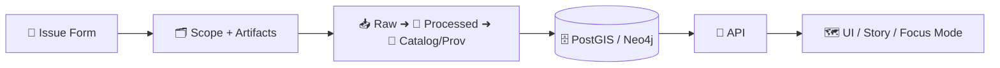

<div align="center">

# 🧭 Kansas Frontier Matrix (KFM) · GitHub Ops Hub

**Community health + governance + automation for a provenance-first geospatial monorepo** 🧬🗺️

<p>
  <a href="https://github.com/bartytime4life/Kansas-Frontier-Matrix"></a>
  
  
  
  
</p>

**Quick links:**  
[🏠 Project README](../README.md) · [🧩 Issue templates](#-issue-templates-issue_template) · [🤝 PR flow](#-pull-requests--review-flow) · [🛡️ Security](#️-security--responsible-disclosure) · [⚙️ Workflows](#️-workflows-workflows) · [🧭 Governance](../policy/)

</div>

---

## 🎯 What is `.github/`?

This folder is **the repo’s operating system** 🧠: issue intake, PR standards, security posture, owners, automation, and release tooling.

> [!IMPORTANT]
> KFM follows a **provenance-first + fail-closed** approach: if permissions, licensing, or governance is unclear, we stop and ask for clarity instead of “shipping vibes.”  
> That philosophy applies to issues, PRs, and automation too. 🔒

---

## 🗂️ Recommended `.github/` layout

This is the baseline structure that “just works” for KFM:

```text
.github/
├─ 📁 ISSUE_TEMPLATE/          # GitHub Issue Forms (YAML) + config.yml
│  ├─ 📄 config.yml
│  ├─ 📄 README.md             # Optional: explains how to pick templates
│  ├─ 📄 bug_report.yml
│  ├─ 📄 ci_failure.yml
│  ├─ 📄 feature_request.yml
│  ├─ 📄 question.yml
│  ├─ 📄 data_addition_request.yml
│  ├─ 📄 data_layer_request.yml
│  ├─ 📄 story_node_request.yml
│  ├─ 📄 ui_layer_issue.yml
│  ├─ 📄 api_contract_change.yml
│  ├─ 📄 graph_model_change.yml
│  ├─ 📄 governance_form.yml
│  ├─ 📄 governance_question.yml
│  └─ 📄 agent_ops_issue.yml   # Optional: AI / agent-run ops tasks
│
├─ 📁 actions/                 # Composite actions (reusable CI building blocks)
├─ 📁 workflows/               # GitHub Actions workflows (*.yml)
│
├─ 📄 CODEOWNERS               # Ownership & review routing
├─ 📄 PULL_REQUEST_TEMPLATE.md # PR checklist (DoD, provenance, tests, docs)
├─ 📄 SECURITY.md              # Responsible disclosure + contact
├─ 📄 dependabot.yml           # Dependency updates
└─ 📄 release-drafter.yml      # Auto-drafted release notes
```

### ✅ Nice-to-have (optional but common)

If you want full “community health” coverage:

- 📄 `CODE_OF_CONDUCT.md` (often best at repo root, but can live here)
- 📄 `SUPPORT.md` (where to ask questions)
- 📄 `FUNDING.yml` (sponsors)

---

## 🧩 Issue Templates (`ISSUE_TEMPLATE/`)

Your screenshots are already extremely close to an ideal KFM set.

### ✅ What should exist in `.github/ISSUE_TEMPLATE/`

**Minimum required**
- `config.yml` ✅ *(controls contact links + “blank issues” behavior)*
- At least these issue forms:
  - `bug_report.yml`
  - `feature_request.yml`
  - `question.yml`
  - `ci_failure.yml`

**KFM-recommended (because we have governed data + pipelines + stories)**
- `data_addition_request.yml` (new dataset ingestion request)
- `data_layer_request.yml` (new map layer spec, style + metadata expectations)
- `story_node_request.yml` (story map additions / narrative requests)
- `ui_layer_issue.yml` (frontend layer rendering, style, map interactions)

**Architecture/governance-specific**
- `api_contract_change.yml` (request changes to API models/endpoints)
- `graph_model_change.yml` (Neo4j/domain relationship changes)
- `governance_question.yml` (policy interpretation / “is this allowed?”)
- `governance_form.yml` (sensitivity labels, CARE/FAIR concerns, access requests)

**Ops / AI**
- `agent_ops_issue.yml` (model/tooling changes, prompt/policy alignment, evals)

**Optional (add if you feel the pain)**
- `performance_regression.yml` (slow query, tile latency, heavy endpoints)
- `docs_request.yml` (documentation gaps)
- `data_quality_issue.yml` (bad geometry, missing attributes, schema drift)

> [!TIP]
> Keep filenames **stable** and **human-readable**. Templates become habit; habit reduces friction. ⚡

---

## 🧷 Template-by-template intent map

Use this as the “routing table” for contributors:

| Template 📄 | Use it when… | Typical outputs expected |
|---|---|---|
| `bug_report.yml` 🐛 | Something is broken in API/UI/pipelines | Repro steps, expected vs actual, logs, screenshots |
| `ci_failure.yml` 🧯 | CI failed or a workflow is flaky | Workflow link, failing job, minimal reproduction |
| `feature_request.yml` ✨ | You want a new capability | Problem statement, proposal, acceptance criteria |
| `question.yml` ❓ | You’re unsure how something should work | Context + desired outcome + links to docs |
| `data_addition_request.yml` 📥 | You want to add a dataset to `data/raw/` | Source link, license, provenance, pipeline plan |
| `data_layer_request.yml` 🗺️ | You want a new layer in MapLibre/Cesium | Layer spec, symbology, CRS/projection, metadata plan |
| `story_node_request.yml` 📚 | New story content or narrative map steps | Narrative outline, citations plan, choreography needs |
| `ui_layer_issue.yml` 🖥️ | Layer styling, UI controls, or interaction issues | Screenshots, style rules, expected behavior |
| `api_contract_change.yml` 🔌 | API schema / endpoint contract change | Proposed request/response, versioning notes |
| `graph_model_change.yml` 🕸️ | Graph entity/relationship updates | Node/edge changes, migration plan |
| `governance_question.yml` 🛡️ | “Is this allowed?” / policy ambiguity | Sensitivity context, proposed safe handling |
| `governance_form.yml` 🧾 | Formal governance request (restricted data, care labels) | Intended use, access controls, redaction plan |
| `agent_ops_issue.yml` 🤖 | Focus Mode / local model ops / evals | Model version, prompts/tools, test queries |

---

## ✅ KFM Issue Form “Definition of Done” checks

Issue templates should push contributors toward KFM’s canonical “truth path”:



### 🔒 Governance & provenance fields that matter (strongly recommended)

For **data-related** templates, include fields like:

- 📜 **Source URL / archive / citation**
- ⚖️ **License and usage rights**
- 🧾 **Provenance plan** (what created this artifact? how reproduced?)
- 🧠 **Sensitivity / CARE labels** (if applicable)
- 🌐 **CRS / projection** (EPSG code if known)
- ✅ **Acceptance criteria** (what proves it’s done?)

> [!CAUTION]
> If license is unknown or sensitivity is unclear, the correct default is **stop**. That’s “fail closed.” 🔐

---

## 🏷️ Labels (recommended conventions)

Not required, but you’ll thank yourself later:

- `type:bug`, `type:feature`, `type:question`, `type:governance`
- `area:api`, `area:web`, `area:pipelines`, `area:data`, `area:docs`, `area:ai`
- `risk:sensitive`, `risk:breaking-change`
- `status:needs-triage`, `status:blocked`

---

## 🤝 Pull Requests & review flow

### 📌 Where enforcement should live

- ✅ Templates gather the right info up front
- ✅ PR template enforces: tests, docs, provenance, metadata
- ✅ CI validates: formatting, schemas, pipeline outputs, docs links
- ✅ CODEOWNERS routes review to the right people

> [!NOTE]
> KFM’s architecture expects contributions to keep **code + data + docs** in lockstep (monorepo advantage).  
> If you update one, update the others. 🧩

---

## 🛡️ Security & responsible disclosure

Use `SECURITY.md` for reporting vulnerabilities.

**Do not** open public issues for security-sensitive reports. 🚫

---

## ⚙️ Workflows (`workflows/`)

What belongs here (typical KFM set):

- ✅ `ci.yml` — lint/test/build
- ✅ `docs.yml` — docs link checker, markdown lint, spell checks (optional)
- ✅ `data-validate.yml` — schema checks, metadata checks, pipeline smoke tests
- ✅ `security.yml` — dependency review, secret scanning (if enabled)
- ✅ `release.yml` — release tagging + release-drafter integration

> [!TIP]
> Keep workflows small and composable. Put reusable logic in `.github/actions/`.

---

## 📚 Reference library (recommended links)

Place project PDFs under `docs/library/` and link them from dataset cards, stories, and templates:

- `docs/library/Kansas Frontier Matrix (KFM) – Comprehensive Technical Blueprint.pdf`
- `docs/library/making-maps-a-visual-guide-to-map-design-for-gis.pdf`
- `docs/library/Map Reading & Land Navigation.pdf`

This keeps KFM’s governance + cartography rules discoverable and citeable. 📎

---

## 🧠 Maintainers checklist

- [ ] Issue templates updated when workflow changes
- [ ] `config.yml` contact links point to the correct docs
- [ ] CODEOWNERS matches repo reality
- [ ] PR template matches Definition-of-Done
- [ ] Dependabot + release drafter kept in sync with release strategy

---

## 🔗 Related docs

- 🧱 System overview: `../docs/architecture/system_overview.md`
- 🧾 Governance policies: `../policy/`
- 🤝 Contributing: `../CONTRIBUTING.md`
- 🛡️ Security: `./SECURITY.md`