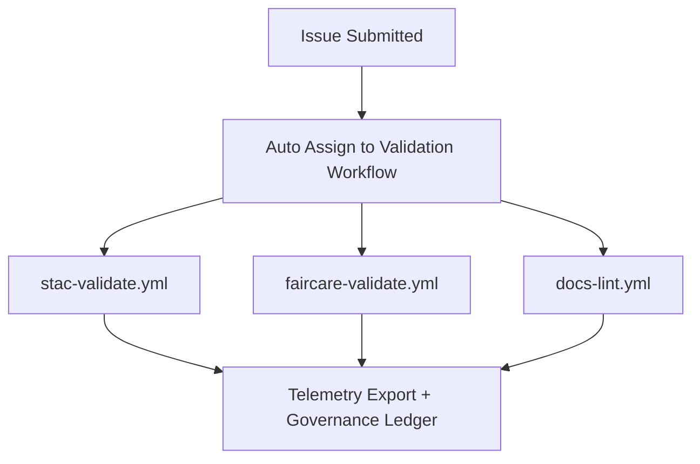

<div align="center">

# 🧾 **Kansas Frontier Matrix — Issue Templates & Governance Forms Overview**
`.github/ISSUE_TEMPLATE/README.md`

**Purpose:** Document and describe all GitHub issue templates used by the Kansas Frontier Matrix (KFM) project.  
These forms standardize community feedback, dataset submissions, and ethical governance reviews following the **Master Coder Protocol (MCP v6.3)** and **FAIR+CARE** standards.

[](../../docs/README.md)
[](../../LICENSE)
[](../../docs/standards/faircare.md)
[]()

</div>

---

## 📚 Overview

All KFM issue templates are located in `.github/ISSUE_TEMPLATE/` and provide YAML-based, structured issue forms for contributors.  
These templates ensure that all new contributions — datasets, features, bug reports, and governance reviews — include the **required metadata, provenance, and ethical compliance** information.

Each submission type corresponds to one of KFM’s governance workflows:
- **Data Governance** → FAIR+CARE / provenance compliance
- **Development Governance** → MCP documentation-first adherence
- **Ethical Governance** → Indigenous data sovereignty & transparency

---

## 🧱 Directory Layout

```
.github/ISSUE_TEMPLATE/
├── README.md                # This file (overview of all issue templates)
├── data_submission.yml      # Template for adding new datasets or STAC Items
├── feature_request.yml      # Template for proposing new features or enhancements
├── bug_report.yml           # Template for reporting issues, bugs, or regressions
└── governance_form.yml      # Template for ethical or FAIR+CARE review submissions
```

---

## 🗺️ Template Summary

| Template | Purpose | Key Metadata Required | Validation Workflow |
|-----------|----------|------------------------|----------------------|
| **`data_submission.yml`** | Submit new dataset for inclusion | `id`, `title`, `license`, `spatial`, `temporal`, `checksum` | `stac-validate.yml` + `faircare-validate.yml` |
| **`feature_request.yml`** | Propose a new functionality or improvement | `title`, `description`, `rationale`, `dependencies` | `docs-lint.yml` |
| **`bug_report.yml`** | Report a reproducible issue or defect | `steps_to_reproduce`, `expected_behavior`, `logs` | `codeql.yml` / `test.yml` |
| **`governance_form.yml`** | Submit governance/ethics or FAIR+CARE review | `affected_data`, `reviewers`, `CARE_implications` | `faircare-validate.yml` |

---

## 🧩 Data Submission Template (`data_submission.yml`)

This form is required for **any dataset addition** to `data/sources/`.

**Mandatory Fields:**
- Dataset ID (unique and descriptive)
- Title & Description  
- License (SPDX or CC format)  
- Provenance / Source URL  
- Spatial & Temporal coverage  
- SHA-256 checksum  
- FAIR+CARE compliance checkbox

Example JSON schema reference:
```yaml
id: "noaa_storms_1950_2025"
title: "NOAA Storm Events (1950–2025)"
license: "Public Domain"
spatial: [-102.05, 37.0, -94.6, 40.0]
temporal: { start: "1950-01-01", end: "2025-05-01" }
checksum: "sha256-123abc..."
```

---

## ✨ Feature Request Template (`feature_request.yml`)

For proposing enhancements to the system, API, data ingestion, or visualization.  
Each submission must describe **rationale**, **impact**, and **MCP documentation requirements**.

**Fields:**
- Summary & Description  
- Motivation / Problem statement  
- Dependencies or linked issues  
- Expected benefits  

All feature requests are reviewed quarterly during **Architecture Review Cycles** and linked to milestones via `ROADMAP.md`.

---

## 🐞 Bug Report Template (`bug_report.yml`)

Used for identifying reproducible software or data pipeline issues.

**Required Fields:**
- Steps to reproduce  
- Expected vs. actual results  
- Logs or screenshots  
- Environment (OS, Python version, Browser if frontend)  

Reports trigger automated reproduction via CI (`make test`) and attach to the issue’s `reports/debug/` directory during validation.

---

## ⚖️ Governance Review Template (`governance_form.yml`)

This form supports **FAIR+CARE and ethical review** of datasets that reference Indigenous lands, cultural data, or community-contributed materials.

**Sections Include:**
- Reviewer name(s) and affiliation  
- Dataset(s) or layer(s) reviewed  
- CARE evaluation (Collective Benefit, Authority, Responsibility, Ethics)  
- Notes and decisions  
- Recommended remediation or follow-up  

Governance reviews are logged in:
```
reports/audit/governance-ledger.json
```

---

## 🧮 Workflow Integration

Each issue template triggers the appropriate **validation workflows** on submission or PR creation.



All issues and PRs include structured metadata to maintain provenance across the project’s **Knowledge Graph** and **Governance Dashboard**.

---

## 🧠 Governance Compliance Checklist

Every issue form includes MCP and FAIR+CARE consent checkboxes:

- [x] Contributor acknowledges Master Coder Protocol v6.3  
- [x] Contributor ensures data license allows open redistribution  
- [x] Contributor confirms cultural sensitivity review for Indigenous or tribal content  
- [x] Contributor provides provenance and checksum validation  

These ensure every submission remains legally and ethically compliant.

---

## 🕰️ Version History

| Version | Date | Author | Summary |
|----------|------|---------|----------|
| v9.7.0 | 2025-11-05 | A. Barta | Added unified README for all issue templates; FAIR+CARE integration. |
| v9.5.0 | 2025-10-20 | A. Barta | Updated governance and CARE template alignment. |
| v9.3.1 | 2025-09-01 | KFM Core Team | Standardized data submission fields and SPDX license validation. |
| v9.0.0 | 2025-06-01 | KFM Core Team | Initial implementation of structured YAML templates. |

---

<div align="center">

**© 2025 Kansas Frontier Matrix — MIT / CC-BY 4.0**  
Managed under **Master Coder Protocol v6.3** · FAIR+CARE Certified · Diamond⁹ Ω / Crown∞Ω Ultimate Certified  
[Back to .github README](../README.md)

</div>
