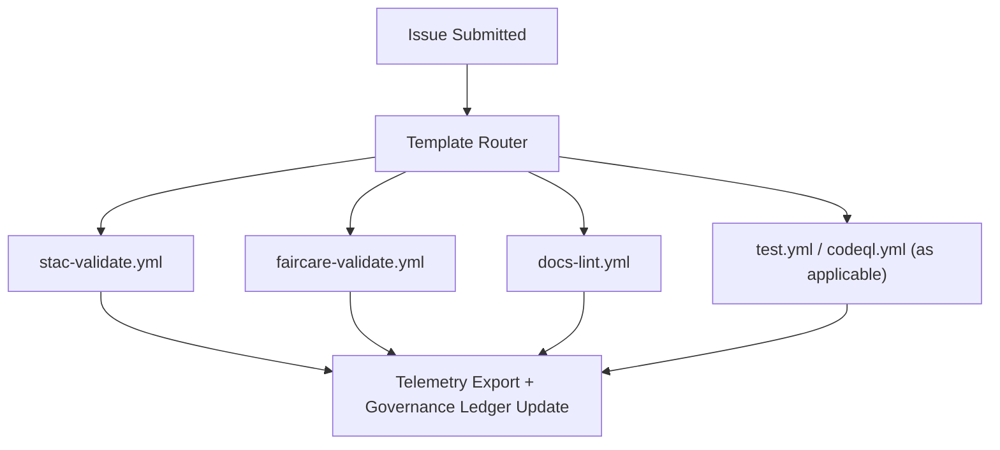

<div align="center">

# 🧾 **Kansas Frontier Matrix — Issue Templates & Governance Forms Overview**
`.github/ISSUE_TEMPLATE/README.md`

**Purpose:**  
Index and describe all **GitHub Issue Templates** used across the Kansas Frontier Matrix (KFM) project.  
These forms standardize **community collaboration**, **dataset governance**, and **ethical review** under **Master Coder Protocol (MCP-DL v6.3)** and **FAIR+CARE** certification.

[](../../docs/README.md)
[](../../LICENSE)
[](../../docs/standards/faircare.md)
[]()

</div>

---

## 📘 Overview
All issue templates in `.github/ISSUE_TEMPLATE/` are **YAML Issue Forms** that prompt for complete, reproducible information and trigger automation.  
Each template is validated in CI and feeds the **governance ledger** and **telemetry** for full traceability.

**Common metadata collected:**
- Source **provenance**, **license**, and **checksum** (SHA-256)  
- FAIR+CARE attestations and consent flags  
- Links to datasets, STAC/DCAT items, or release manifests  
- Required fields for schema-driven validation

---

## 🗂️ Directory Layout
```
.github/ISSUE_TEMPLATE/
├── README.md                # This index
├── data_submission.yml      # New datasets / STAC items
├── feature_request.yml      # Enhancements & proposals
├── bug_report.yml           # Reproducible software/data defects
└── governance_form.yml      # FAIR+CARE ethical/governance review
```

Each form triggers the relevant **GitHub Actions** (e.g., `stac-validate.yml`, `faircare-validate.yml`, `docs-lint.yml`) and contributes to `releases/v10.0.0/focus-telemetry.json`.

---

## 🧩 Template Summary
| Template | Primary Use | Required Fields (excerpt) | Workflows Triggered |
|---|---|---|---|
| `data_submission.yml` | Submit a **new dataset** or **STAC Item** | `id`, `title`, `license`, `spatial`, `temporal`, `provenance`, `checksum` | `stac-validate.yml`, `faircare-validate.yml` |
| `feature_request.yml` | Propose a **feature or enhancement** | `title`, `rationale`, `scope`, `dependencies` | `docs-lint.yml` |
| `bug_report.yml` | Report a **reproducible defect** | `environment`, `steps_to_reproduce`, `expected`, `actual`, `logs` | `test.yml`, `codeql.yml` |
| `governance_form.yml` | Request **FAIR+CARE review** | `dataset_ids`, `reviewer`, `CARE_evaluation`, `decision` | `faircare-validate.yml` |

> **Note:** All templates avoid reserved keywords (e.g., do **not** use `"None"` in dropdowns); use `"N/A"` to ensure YAML Issue Forms validate correctly.

---

## 🧾 Data Submission Template (`data_submission.yml`)
The canonical path to register **new datasets** into `data/sources/` and corresponding **STAC/DCAT** entries.

**Minimum example**
```yaml
id: "noaa_storms_1950_2025"
title: "NOAA Storm Events (1950–2025)"
license: "Public Domain"
spatial: [-102.05, 37.0, -94.6, 40.0]
temporal: { start: "1950-01-01", end: "2025-05-01" }
provenance: "NOAA NCEI"
checksum: "sha256-<64-hex-digest>"
```

**Validation path**
1. `stac-validate.yml` checks JSON schema & link integrity.  
2. `faircare-validate.yml` verifies license, provenance, CARE flags.  
3. Results appended to `reports/self-validation/stac/_summary.json` and `reports/fair/faircare_summary.json`.

---

## ✨ Feature Request Template (`feature_request.yml`)
Standardizes proposals and their governance context.

**Includes:**
- Purpose, scope, and motivation  
- Dependencies/blockers and risk notes  
- FAIR+CARE implications for data/UI  
- Acceptance criteria and rollout plan

Reviewed by the **Architecture Committee**; decisions recorded in the governance ledger.

---

## 🐞 Bug Report Template (`bug_report.yml`)
Collects all information needed for deterministic reproduction.

**Sections:**
- Environment (OS, Browser, Python/Node versions)  
- Steps to reproduce, expected vs. actual results  
- Logs/screenshots and dataset references (if applicable)

Automation runs targeted tests and exports debug artifacts to:
```
reports/debug/<issue_id>/
```

---

## ⚖️ Governance Review Template (`governance_form.yml`)
Ensures **ethical & cultural** review for datasets and workflows with community impact.

**Sections:**
- Reviewer name & role, dataset IDs, source references  
- CARE evaluation (**Collective Benefit, Authority, Responsibility, Ethics**)  
- Summary, decision (approved/rejected/deferred), and conditions  

**Ledger Output:**  
`docs/reports/audit/governance-ledger.json`

---

## 🧮 Automation Flow


Every issue template directly connects user submissions to CI/CD pipelines and ledger updates to provide **end-to-end traceability**.

---

## 🧠 Governance & Compliance Checklist
Each issue form includes the following mandatory confirmations:

- [x] I acknowledge the **Master Coder Protocol v6.3**.  
- [x] I confirm **open license** & **provenance** are provided and accurate.  
- [x] I confirm a **SHA-256 checksum** is included for data files.  
- [x] I confirm **CARE** review is required for culturally sensitive content.  
- [x] I agree to abide by the **KFM Governance Charter**.

---

## ⚙️ FAIR+CARE Integration
| Principle | Implementation |
|---|---|
| **Findable** | Issue metadata is indexed and cross-linked to dashboards and ledgers. |
| **Accessible** | Public forms with transparent review history and outcomes. |
| **Interoperable** | JSON/YAML compatible with governance parsers & CI. |
| **Reusable** | Versioned templates; revalidated quarterly by CI. |
| **CARE** | Governance form enforces cultural/ethical review and consent flows. |

---

## 🧩 Workflow → Template Mapping
| Template | Workflow | Output Artifact |
|---|---|---|
| `data_submission.yml` | `stac-validate.yml` / `faircare-validate.yml` | `reports/self-validation/stac/_summary.json` |
| `feature_request.yml` | `docs-lint.yml` | `reports/self-validation/docs/lint_summary.json` |
| `bug_report.yml` | `test.yml` / `codeql.yml` | `reports/debug/<issue_id>/*.json` |
| `governance_form.yml` | `faircare-validate.yml` | `reports/audit/governance-ledger.json` |

---

## 🕰️ Version History
| Version | Date | Author | Summary |
|---|---|---|---|
| v10.0.0 | 2025-11-09 | FAIR+CARE Council | Upgraded to v10: clarified required fields, added router flow, ensured YAML Issue Forms compliance, and tightened governance ledger linkage. |
| v9.7.0 | 2025-11-05 | A. Barta | Consolidated templates with telemetry integration and governance mapping. |
| v9.5.0 | 2025-10-20 | A. Barta | Expanded FAIR+CARE review and Council ledger linkage. |
| v9.0.0 | 2025-06-01 | KFM Core Team | Initial structured YAML issue templates. |

---

<div align="center">

**© 2025 Kansas Frontier Matrix — MIT / CC-BY 4.0**  
Governed under **Master Coder Protocol v6.3** · FAIR+CARE Certified · Diamond⁹ Ω / Crown∞Ω Ultimate Certified  
[Back to GitHub Overview](../README.md) · [Governance Charter](../../docs/standards/governance/ROOT-GOVERNANCE.md)

</div>