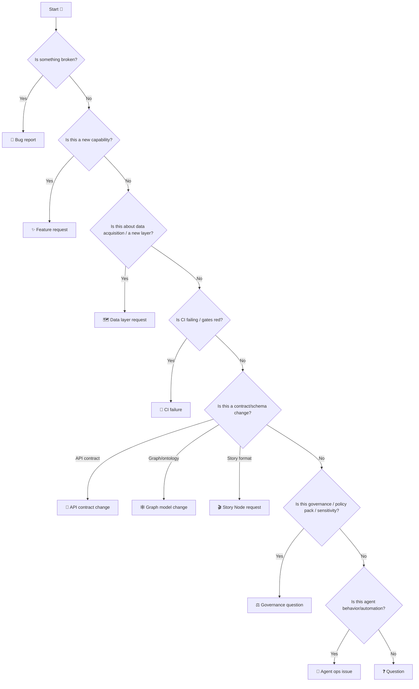
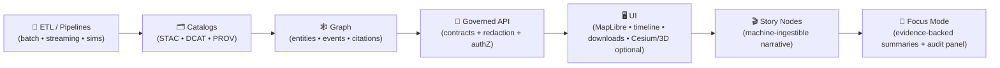

<!-- According to a document from 2026-01-19 -->

# 🧩 `.github/ISSUE_TEMPLATE/` — Issue Forms for Kansas Frontier Matrix (KFM)


> **Purpose:** This directory is the **governed front door** 🚪🧭 for opening issues in **Kansas Frontier Matrix (KFM)**.  
> Every issue should carry enough **pipeline stage**, **contracts**, **evidence**, **provenance/licensing**, **policy gates**, and **sensitivity** context so maintainers can triage *without guessing* and without breaking KFM invariants.

> [!IMPORTANT]
> 🔐 **Do not post secrets, credentials, private keys, PII, or restricted/sensitive coordinates in public issues.**  
> Use the repository’s security reporting path (see **Security Policy**) for anything sensitive.

> [!NOTE]
> 🧭 **Version map (why you may see “v13” + “v11” together):**  
> - **Master Guide v13** documents the *repo structure + pipeline invariants* (contract-first, evidence-first, provenance-first).  
> - **Standards / profiles** (STAC/DCAT/PROV) currently track **v11** in many places.  
> - **Policy Pack (OPA/Conftest)** is versioned separately via stable policy IDs (ex: `KFM-PROV-001`) and **CI gates**.  
> - **Agent W·P·E architecture** is versioned separately and enforced via PR governance.

---

## 📌 Quick links

| Action | Where |
|---|---|
| 🐛 Bug report | Use `bug_report.yml` (Issue chooser) |
| ✨ Feature request | Use `feature_request.yml` (Issue chooser) |
| 🗺️ Request a data layer/source (datasets *or* document corpora) | Use `data_layer_request.yml` (Issue chooser) |
| ❓ Ask a question | Use `question.yml` (Issue chooser) |
| 🧪 CI failure / gates failing *(incl. Policy Pack IDs like `KFM-PROV-001`)* | Use `ci_failure.yml` *(recommended)* |
| 🔌 API contract change | Use `api_contract_change.yml` *(recommended)* |
| 🕸️ Graph model / ontology change | Use `graph_model_change.yml` *(recommended)* |
| 🎬 Story Node request | Use `story_node_request.yml` *(recommended)* |
| ⚡ Performance regression | Use `bug_report.yml` *(label `type: perf`)* |
| 📜 Policy Pack / waiver request | Use `governance_question.yml` *(recommended)* |
| ⚖️ Governance / sensitivity question | Use `governance_question.yml` *(recommended)* |
| 🤖 Agent / automation behavior | Use `agent_ops_issue.yml` *(recommended if you run W·P·E)* |
| 🔐 Security policy | `../../SECURITY.md` *(or `.github/SECURITY.md` if you keep it there)* |
| 🤝 Collaboration rules + labels | `../README.md` *(the `.github/README.md` hub)* |
| 🧠 Master Guide (structure + invariants) | `../../docs/MASTER_GUIDE_v13.md` *(or `../../docs/specs/MARKDOWN_GUIDE_v13.md.gdoc`)* |
| 📐 Architecture blueprints | `../../docs/architecture/` *(ex: `KFM_REDESIGN_BLUEPRINT_v13.md`)* |
| 📥 Data intake runbook | `../../docs/guides/pipelines/ingestion-guide.md` |
| 🤖 AI pipeline cookiecutter | `../../docs/guides/pipelines/kfm-ai-pipeline-cookiecutter.md` |
| 📜 Policy Pack (rules + waivers) | `../../api/scripts/policy/README.md` · `../../tools/validation/policy/` |
| 🧾 Raw-data trust boundary | `../../data/raw/README.md` |
| 🧪 Simulation sandbox | `../../data/work/sims/README.md` |
| 🕸️ Graph CSV import contract | `../../data/graph/csv/README.md` |
| 🗃️ PostGIS adapter notes | `../../api/src/adapters/outbound/postgis/README.md` |
| 📄 Data contract examples | `../../docs/data/contracts/examples/README.md` |
| 📦 Standards (profiles) | `../../docs/standards/` *(KFM_STAC/DCAT/PROV profiles + Markdown work protocol)* |
| 🤖 Agent architecture (W·P·E) | `../../docs/specs/agents/README.md` |
| 🎛️ Feature flags / kill-switches | `../../ops/feature_flags/` *(ex: `agents.yml`)* |
| 🧾 Templates (Story Nodes, API, docs) | `../../docs/templates/` *(ex: `TEMPLATE__STORY_NODE_V3.md`)* |
| 📖 Glossary | `../../docs/glossary.md` |
| ⚖️ Governance hub | `../../docs/governance/ROOT_GOVERNANCE.md` *(or `ROOT_GOVERNANCE_CHARTER.md`)* |

> [!TIP]
> If a template link 404s, use the chooser: `https://github.com/<owner>/<repo>/issues/new/choose`

---

## 🧭 Choosing the right issue form

If you’re unsure, pick **🐛 Bug Report** or **❓ Question** — maintainers will route it. ✅



---

<details>
<summary><strong>🧭 Table of contents</strong></summary>

- [🧾 What this folder controls](#-what-this-folder-controls)
- [🧠 KFM intake philosophy](#-kfm-intake-philosophy)
- [🧱 Non-negotiable invariants](#-non-negotiable-invariants)
- [🗂️ Directory layout](#️-directory-layout)
- [🧰 Template inventory](#-template-inventory)
- [✅ Minimum required fields for every issue](#-minimum-required-fields-for-every-issue)
- [🧭 Stage picker](#-stage-picker)
- [📜 Policy Pack and waivers](#-policy-pack-and-waivers)
- [🧾 Provenance, licensing, and data hygiene](#-provenance-licensing-and-data-hygiene)
- [⏱ Real-time and streaming layers](#-real-time-and-streaming-layers)
- [🧪 Simulations and scenario outputs](#-simulations-and-scenario-outputs)
- [⚡ Performance & scalability issues](#-performance--scalability-issues)
- [🤖 Agent & automation issues](#-agent--automation-issues)
- [📡 Governance ledger & telemetry](#-governance-ledger--telemetry)
- [🔒 Sensitivity, sovereignty, and governance](#-sensitivity-sovereignty-and-governance)
- [🏷️ Labels & triage conventions](#️-labels--triage-conventions)
- [🧪 CI / contract failures](#-ci--contract-failures)
- [🛠️ Maintainers: evolving issue forms safely](#️-maintainers-evolving-issue-forms-safely)
- [📚 Reference library](#-reference-library)
- [🕰️ Version history](#️-version-history)

</details>

---

## 🧾 What this folder controls

This folder contains GitHub **Issue Forms** (`*.yml`) and optional configuration (`config.yml`) that:

- ✅ **shape** what reporters are asked
- ✅ **enforce** minimum intake fields (stage, evidence, provenance, sensitivity, contract anchors, policy IDs)
- ✅ **route** issues into the correct subsystem *without* guessing or “vibes”

Think of these templates as **operational scaffolding** 🧱 — not policy.  
Policy lives in governance/security docs; issue forms only **reference** those and **capture the right breadcrumbs** 🔎.

---

## 🧠 KFM intake philosophy

KFM is intentionally staged so changes stay **auditable** and **safe**:



**So issue intake must:**
- 🧭 capture a **pipeline stage guess** (don’t worry if you’re unsure)
- 🧾 require **evidence** (repro steps, IDs, logs, screenshots, sample data, or failing checks)
- 🧱 require **provenance/licensing** when data is involved (datasets *and* document corpora)
- 🔒 flag **sensitivity** early (so we don’t accidentally publish restricted info)
- 📜 include **Policy Pack breadcrumbs** when relevant (policy IDs + gate output)
- 🔌 preserve the **API boundary rule** (UI does not talk to graph DB directly)
- 📜 anchor to **contracts** (schemas/specs) when behavior depends on them

> [!NOTE]
> 🧱 **Architectural intent:** KFM is built with **layer isolation** in mind.  
> Layers exist to keep changes contained and enforce governance boundaries — “bypassing a layer” is an exception path, not the default. 🛡️

---

## 🧱 Non-negotiable invariants

These are the “guardrails” 🛡️ that issue forms should **help us enforce**, not bypass:

- **Pipeline ordering is absolute:** `ETL → Catalogs (STAC/DCAT/PROV) → Graph → API → UI → Story Nodes → Focus Mode`
- **Closed layers (default):** requests should not “skip” layers without an explicit, documented exception path
- **API boundary rule:** UI must **never** query the graph DB directly; all access flows through the governed API
- **One fact, one place:** each subsystem has a **canonical home** (avoid duplicate folders + shadow implementations)
- **Provenance-first:** data (including derived/AI outputs) is not “real” in KFM until it has **STAC/DCAT + PROV**
- **Deterministic, idempotent ETL:** reruns should be safe; outputs stable for same inputs/config
- **Evidence-first narrative:** Story Nodes / Focus Mode allow **no unsourced claims**; AI output must be labeled + constrained
- **Stable identifiers:** prefer IDs that don’t encode meaning (so names/labels can evolve without breaking references)
- **Classification propagation:** no output can be less restricted than its inputs (unless reviewed + redacted)
- **Policy Pack gates (fail closed):** automated policies enforce baseline governance (catalog/prov/license/sovereignty/etc.)
- **Validation gates:** CI enforces these invariants (schema checks, link checks, provenance completeness, policy pack, security scans)

> [!CAUTION]
> If your issue requests something that violates the invariants above, please file it as a **Governance Question** ⚖️.  
> We’ll either propose a compliant design or explicitly document an exception path (rare).

---

## 🗂️ Directory layout

```text
📁 .github/
└─ 📁 ISSUE_TEMPLATE/
   ├─ 📘 README.md                 # you are here 👋
   ├─ ⚙️ config.yml                # optional: issue chooser links, disable blank issues
   ├─ 🐛 bug_report.yml            # bugs across stack (incl. perf regressions)
   ├─ ✨ feature_request.yml       # new features / enhancements
   ├─ 🗺️ data_layer_request.yml    # new dataset/layer/source request (incl. doc corpora)
   ├─ ❓ question.yml              # general questions / clarification
   ├─ 🧪 ci_failure.yml            # (recommended) CI failures / policy gates / pipeline breakage
   ├─ 🔌 api_contract_change.yml   # (recommended) OpenAPI/GraphQL contract changes
   ├─ 🕸️ graph_model_change.yml    # (recommended) ontology/entity/relation changes
   ├─ 🎬 story_node_request.yml    # (recommended) Story Node additions/edits
   ├─ ⚖️ governance_question.yml   # (recommended) ethics/sovereignty/sensitivity/policy waivers
   └─ 🤖 agent_ops_issue.yml       # (recommended) W·P·E / automation behavior + ops controls
```

> [!NOTE]
> Your repo may not have every file above yet.  
> This README documents the **target, governed inventory**—keep it synchronized with what exists.

---

## 🧰 Template inventory

> **Rule:** If you don’t know which form to use, pick **Bug Report** or **Question** and include the minimum fields below. Maintainers will retag it. ✅

| Template | Use it for | Must capture (minimum) |
|---|---|---|
| 🐛 `bug_report.yml` | something is broken *(incl. perf)* | stage guess · expected vs actual · repro · evidence/logs · affected paths/IDs |
| ✨ `feature_request.yml` | new capability | stage(s) · user story · acceptance criteria · contracts affected · risks |
| 🗺️ `data_layer_request.yml` | add a dataset/layer/source *(or document corpus)* | source + license + retrieval date · coverage (space/time) · sensitivity · intended domain |
| ❓ `question.yml` | “how do I…?” / clarification | goal · context · stage guess · links/paths/IDs · what you tried |
| 🧪 `ci_failure.yml` *(recommended)* | CI broke / gates failing *(incl. Policy Pack)* | workflow + job + step · error output (redacted) · policy ID(s) if shown · changed paths · local repro (if known) |
| 🔌 `api_contract_change.yml` *(recommended)* | API schema/route changes | contract diff · sample req/res · breaking change assessment · tests |
| 🕸️ `graph_model_change.yml` *(recommended)* | ontology/entity/relation changes | node/edge definitions · migration plan · impacts to API/UI/story |
| 🎬 `story_node_request.yml` *(recommended)* | Story Node edits/additions | story ID/path · claim → evidence map · dataset/doc IDs · sensitivity |
| ⚖️ `governance_question.yml` *(recommended)* | ethics/sovereignty/sensitivity/policy waivers | concern summary · data classification · who is affected · references |
| 🤖 `agent_ops_issue.yml` *(recommended)* | W·P·E agents / automation | component (W/P/E) · idempotency key · commit seed · plan/diff paths · telemetry IDs · kill-switch state |

> [!TIP]
> 🚧 **Roadmap ideas (AR, bulk document ingestion, streaming watchers, “digital twin” simulations)**:  
> Use **Feature Request** (capability) and/or **Data Layer Request** (new inputs), and tag with `priority:` + `stage:` + `component:`.  
> If anything touches sensitive knowledge, route through **Governance Question** first. ⚖️

---

## ✅ Minimum required fields for every issue

Regardless of template, every issue should include:

- **What happened** (actual behavior)
- **What you expected**
- **Evidence** (at least one):
  - repro steps
  - logs (redacted)
  - screenshot/screen recording (safe)
  - a minimal sample file (non-sensitive) or a pointer + checksum
  - IDs/paths (dataset ID, STAC item, Story Node slug, API route)
- **Pipeline stage guess** (pick one — see Stage Picker below)
- **Affected paths** (best guess)
- **Contract anchors (if applicable)**:
  - schema/spec name + path (ex: `schemas/stac/**`, `schemas/telemetry/**`, `openapi.yaml`)
  - expected validation behavior (what should pass/fail)
- **Policy Pack breadcrumbs (if applicable)**:
  - policy ID(s) shown by CI *(ex: `KFM-PROV-001`)*
  - the failing artifact path(s) (collection/item/prov bundle/openapi/etc.)
- **Sensitivity note**:
  - ✅ “Public OK”
  - ⚠️ “Internal only”
  - 🔐 “Confidential/Restricted — do not publish details here”

### 🧪 Reproducibility pack (highly recommended)
If your issue involves **analysis, models, ETL, streaming, or anything scientific**, include as many of these as you can:

- **Environment**: OS + versions (Python/Node), container image tag/digest (if used), GPU/browser for UI/WebGL
- **Inputs**: IDs + checksums or stable URLs
- **Parameters**: config file path(s) + key parameters
- **Seeds**: random seed(s) + deterministic flags (if applicable)
- **Expected outputs**: expected file counts, key metrics, and where outputs should land (paths/IDs)
- **Citations/credit** (if relevant): DOI/snapshot ID, `CITATION.cff`, release tag

> [!TIP]
> If your issue involves **data**, add:
> **source** · **license/terms** · **retrieval date** · **space/time coverage** · **processing context**.

---

## 🧭 Stage picker

Use this to pick a pipeline stage (or pick “unknown” and we’ll triage).  
🧠 *Cross-cutting* items (telemetry/ops/policy/governance/streaming/sims) are allowed—just label them.

| Stage | What it covers | Typical “evidence anchors” 🔎 |
|---|---|---|
| 🧰 **ETL / Pipelines** | ingest, transforms, tiling, normalization *(batch or streaming)* | run config · input sample · expected output · logs · `src/pipelines/**` · `data/raw/**` → `data/work/**` → `data/processed/**` |
| 🗂️ **Catalogs** (STAC/DCAT/PROV) | discoverability + metadata correctness | collection/item IDs · validator output · `docs/standards/**` · `schemas/**` · `data/stac/**` · `data/catalog/dcat/**` · `data/prov/**` |
| 🕸️ **Graph** | entities, relations, citations, timelines *(often Neo4j)* | node labels/IDs · relation expectations · import fixtures · `src/graph/**` |
| 🔌 **API boundary** | contracts, authZ, redaction, query behavior *(FastAPI + GraphQL in many designs)* | endpoint + contract ref · req/res sample · auth context · `src/server/**` |
| 🖥️ **UI / Map viewer** | layers, time slider, rendering, UX *(MapLibre + optional Cesium)* | steps + screenshots · browser/device/GPU · WebGL errors · layer ID(s) · map state JSON · `web/**` |
| 🎬 **Story Nodes** | narrative orchestration + citations | story slug/path · step index · claim → evidence map · dataset/doc IDs · `docs/reports/story_nodes/**` |
| 🧠 **Focus Mode** | evidence-backed summaries + audit panel | query + context bundle (bbox/time/layers) · missing citations · “fact vs interpretation” errors · governance flags |
| 📜 **Policy Pack / Governance gates** *(cross-cutting)* | CI policy failures, waiver requests, review triggers | policy ID(s) · conftest/OPA output · artifact paths · `tools/validation/policy/**` |
| ⏱ **Streaming / Real-time** *(cross-cutting)* | live feeds & watchers (sensor streams, GTFS-RT, etc.) | feed URL (if public) · poll interval · last good timestamp · station/vehicle IDs · rate limits |
| 🧪 **Simulations / Models** *(cross-cutting)* | scenario runs + derived layers | model version · container digest/lockfile · params + seeds · outputs path · baseline vs current |
| 🧪 **CI / DevEx** | tests, builds, validations, gates | workflow name · failing step · logs · changed paths |
| 📡 **Telemetry / Ops** *(cross-cutting)* | observability, agent events, kill-switches | `telemetry/**` · `schemas/telemetry/**` · `ops/feature_flags/**` |

---

## 📜 Policy Pack and waivers

KFM uses a **Policy Pack** (OPA/Conftest) to enforce governance rules as code. ✅🧩  
These checks are designed to **fail closed**: if required provenance/licensing/sensitivity metadata is missing, CI should block promotion.

### ✅ What to include when a policy gate fails
If CI shows a policy name/ID like:

- `KFM-CAT-001` *(catalog requirements)*
- `KFM-PROV-001` *(provenance/lineage requirements)*
- `KFM-LIC-001` *(license/terms requirements)*
- `KFM-SOV-001` *(sovereignty/sensitivity rules)*

…copy the **policy ID** + the **exact failing artifact path(s)** into the issue.

### 🧯 Waivers (rare)
If you think the rule should not apply in a specific case:

- file a **⚖️ Governance Question**
- include: policy ID · reason · scope (which artifact) · mitigation plan
- maintainers can record an explicit waiver entry in:  
  `tools/validation/policy/waivers.yml`

> [!CAUTION]
> Waivers should be **exception paths**, not a way to weaken baseline governance.

---

## 🧾 Provenance, licensing, and data hygiene

KFM is **provenance-first** 🧾. If your issue touches datasets, documents, scans, model outputs, derived layers, or AI outputs:

### ✅ Required provenance fields (data-related issues)
- **Source authority** (who produced it?)
- **License/terms** (or “unknown” with explanation)
- **Retrieval/access date**
- **Spatial coverage** (bbox/region/county; avoid restricted coordinates)
- **Temporal coverage** (year/range/event window)
- **Processing context**
  - toolchain (GDAL/QGIS/GEE/Python/R/etc.)
  - CRS/EPSG (web display typically **EPSG:4326**)
  - major transforms (georef, resample, simplify, reproject, mask)

### 🧾 Trust boundary artifacts (required before “published”)
For anything that becomes user-facing (API/UI/Story/Focus), KFM expects these boundary artifacts:

```text
📁 data/
├─ 📁 raw/<domain>/                  # immutable inputs + source manifests
│  ├─ source.json                    # source metadata (authority/license/retrieval/sensitivity)
│  └─ checksums.sha256               # checksums for raw bytes
├─ 📁 work/<domain>/                 # intermediate artifacts (rebuildable)
├─ 📁 work/sims/                     # simulation workbench (experimental)
├─ 📁 processed/<domain>/            # published outputs (versioned)
├─ 📁 stac/
│  ├─ 📁 collections/                # STAC Collections
│  └─ 📁 items/                      # STAC Items
├─ 📁 catalog/
│  └─ 📁 dcat/                       # DCAT dataset views (JSON-LD)
└─ 📁 prov/                          # PROV lineage bundles (JSON-LD)
```

> [!IMPORTANT]
> Any **derived** (including AI-assisted) layer is a first-class dataset: it needs catalogs + provenance, not “just a file.” ✅

### 🧼 Data sharing hygiene
- Prefer **tiny fixtures** or **redacted subsets** for reproduction
- If the dataset is too large:
  - provide a stable URL (if public)
  - provide checksums (sha256 recommended)
  - provide the exact ID(s) used in catalogs
- Avoid uploading:
  - sensitive coordinates
  - private infrastructure details
  - personally identifying info (PII)

---

## ⏱ Real-time and streaming layers

Real-time layers (sensor feeds, transit feeds, alert streams) are supported as **first-class ingestion**, not “special UI hacks.” ⏱🧰

### ✅ Include these fields (streaming issues)
- **Feed identity**: name + provider + link (if public)
- **Protocol**: REST polling / websocket / GTFS-RT / etc.
- **Cadence**: poll interval, expected latency, clock source
- **Record identity**: station/vehicle/device IDs
- **Time semantics**: timezone, event time vs ingest time, watermark behavior
- **Backfill rules**: how gaps are handled (drop / backfill / interpolate)
- **Safety**: whether this feed could reveal sensitive locations or personal movement

> [!NOTE]
> Streaming outputs still follow the same promotion rule: catalogs + provenance + sensitivity metadata.

---

## 🧪 Simulations and scenario outputs

Simulations are powerful—but KFM treats them as **experimental until promoted**. 🧪🧾

### ✅ If your issue touches simulations, include
- **Sandbox path**: where the run happened (typically `data/work/sims/**`)
- **Promotion intent**: should this become `data/processed/**`?
- **Repro anchors**:
  - input dataset IDs + hashes
  - model code version/commit
  - container digest / lockfiles
  - parameters + seeds
- **Verification/validation**: expected behavior and what constitutes “correct”
- **Sensitivity + governance**: do outputs reveal restricted knowledge?

> [!CAUTION]
> UI/Story/Focus should not “depend on” simulation outputs directly while still in `data/work/sims/`.  
> Promote via PR with STAC/DCAT/PROV and review.

---

## ⚡ Performance & scalability issues

Performance regressions are real bugs 🐛⚡ — but they require different evidence.

### ✅ Include these (whenever possible)
- **Baseline vs current** (before/after) with timestamps and versions
- **Workload context**:
  - read/write mix, batch vs real-time, dataset size, item size
- **Metrics**:
  - p50/p95/p99 latency, throughput, memory, CPU, GPU, query time
- **Scope**:
  - which endpoint/layer/dataset/graph query regressed
- **Artifacts**:
  - DB: `EXPLAIN (ANALYZE, BUFFERS)` *(redacted)* + index details
  - API: sample request + response size + auth context
  - UI: browser + GPU + WebGL errors + network waterfall

### 🧩 UI-performance specifics (helpful evidence)
- layer type: raster tiles / vector tiles / GeoJSON / 3D tiles
- tile strategy: cache headers, CDN behavior, tile size
- time slider: time-step count + request pattern
- Cesium: tileset ID + screen-space error settings (if known)

### 🌱 When perf intersects governance
Sometimes slowness is actually a *gate doing its job* (validation, redaction, sovereignty controls).  
Call this out explicitly so triage doesn’t “optimize away” safety.

### 🌍 Energy / carbon accounting (if relevant)
If your issue is about large compute (simulations, bulk OCR, ML training), include:
- estimated runtime + hardware
- why the computation is necessary
- any cost/energy constraints you know about

---

## 🤖 Agent & automation issues

KFM supports (or plans to support) a safe agent architecture that separates:

- 👀 **Watcher (W):** observes + emits facts/alerts (no mutations)
- 🧠 **Planner (P):** deterministic plan + diff (PR-ready artifacts only)
- 🛠️ **Executor (E):** opens/updates PRs + attaches attestations/telemetry (**never auto-merges**)

### ✅ If your issue involves agents, include:
- **Component:** `Watcher | Planner | Executor`
- **Subject:** what the agent acted on (file/path/module)
- **Idempotency key:** `{component}.{subject}.{window}.{commit_seed}`
- **Commit seed:** (determinism anchor)
- **Artifacts:** plan path, diff/patch path, evidence folder path
- **Telemetry IDs:** relevant event IDs / timestamps (redacted if needed)
- **Kill-switch state:** whether agents are enabled (`ops/feature_flags/agents.yml`)
- **Schedule/trigger:** cron/event trigger if this was scheduled ingestion

> [!CAUTION]
> 🧯 If you suspect unsafe behavior (policy bypass, secrets exposure, unintended data release), **do not** post details publicly. Use Security reporting.

---

## 📡 Governance ledger & telemetry

KFM’s governance is reinforced by **telemetry and auditability** 📡🧾:

- pipeline runs should leave reproducible breadcrumbs
- policy gates should emit actionable IDs/messages
- Focus Mode should record “answer → citations → context” for review (when enabled)

### ✅ Useful telemetry fields to paste into issues
- event timestamp(s)
- pipeline/run ID(s)
- dataset/story IDs involved
- policy ID(s) involved
- redaction mode/classification used
- links to relevant logs (redacted)

> [!NOTE]
> If you don’t know where telemetry lives yet, just paste what CI or logs printed—maintainers can trace it.

---

## 🔒 Sensitivity, sovereignty, and governance

KFM is “mostly open” 🌾, but not everything should be published at full fidelity.

### 🧭 Recommended classification (for issue intake)
| Class | Public issue? | Examples |
|---|---:|---|
| 🌍 Public | ✅ yes | published layers with clear licensing |
| 🏢 Internal | ⚠️ limited details | staging catalogs, draft pipelines, internal runbooks |
| 🔐 Confidential | ❌ no | sensitive layers requiring controlled sharing |
| 🧨 Restricted | ❌ no | credentials, private endpoints, protected locations |

### 🪶 CARE / sovereignty notes
If an issue involves Indigenous knowledge, culturally sensitive sites, or restricted locations:
- flag it in the issue **without** posting precise coordinates
- prefer county-level or generalized geometry
- reference governance docs (expected):  
  `docs/governance/ROOT_GOVERNANCE*.md` · `ETHICS.md` · `SOVEREIGNTY.md` · `REVIEW_GATES.md`

### 🧩 Sensitivity-aware UX (why issue forms ask early)
If a layer is sensitive, KFM may:
- obfuscate coordinates (rounding/generalization/hex bins)
- restrict attributes or zoom levels
- enforce role-based access
- require human review before promotion

> [!CAUTION]
> Issue templates must not invent new policy.  
> They should **route** questions to governance docs + human review.

---

## 🏷️ Labels & triage conventions

KFM uses labels to route work cleanly (maintainers apply them if you don’t). 🏷️

### Suggested label taxonomy (recommended)
- `type: bug | feature | data | question | governance | ci | ops | perf`
- `stage: etl | catalogs | graph | api | ui | story | focus | policy | streaming | sims | ci | ops`
- `component: pipeline | postgis | neo4j | api | webgl | map | timeline | cesium | auth | docs | telemetry | agents | policy`
- `agent: watcher | planner | executor`
- `priority: p0 | p1 | p2 | p3`
- `governance: sensitive | sovereignty | licensing | privacy | policy-pack`
- `good first issue` (mentored / self-contained)

> [!TIP]
> If you know the likely labels, mention them in the issue—maintainers will confirm.

---

## 🧪 CI / contract failures

If CI fails, include:

- workflow name + job name + failing step
- full error output (**redact secrets**)
- **policy ID(s)** if shown (`KFM-…-###`)
- changed paths in the PR/branch
- “repro locally?” (commands if known)

Common failure buckets in KFM:
- 📄 markdown protocol/lint
- 🗂️ schema validation (**STAC/DCAT/PROV**, plus any **telemetry** schemas)
- 🔗 link integrity (catalog `links[].href`)
- 🧾 provenance required-but-missing
- 🕸️ graph integrity checks / ontology rules
- 🔌 API contract tests (OpenAPI/GraphQL)
- 🖥️ UI build/a11y checks
- 📜 Policy Pack failures (OPA/Conftest)
- 🔐 security scans (deps, SAST, secrets)
- 🧯 policy gates (governance review triggers)

---

## 🛠️ Maintainers: evolving issue forms safely

Issue forms are **interfaces**. Treat changes like contract changes. 🔌📜

### ✅ DoD for modifying templates
- [ ] Template changes map to a pipeline stage or governance requirement (no “random questions”)
- [ ] Required fields cover: stage · evidence · expected vs actual · sensitivity · contract anchors · policy ID(s) when relevant
- [ ] Data-related templates require: source · license · retrieval date · coverage (space/time) · sensitivity
- [ ] Agent-related templates require: component · idempotency key · plan/diff artifacts · telemetry IDs · kill-switch state
- [ ] Links in `config.yml` point to real files/paths
- [ ] Labels remain consistent with `.github/README.md` + project board routing
- [ ] Version history below updated

### Optional (high leverage) 🚀
- Add dropdowns for `stage:` and `classification:`
- Add a checkbox gate: “I did not include secrets/PII/restricted coordinates”
- Add links to “how to redact” guidance (docs/security or docs/governance)
- Add a “contract anchor” picker for schema/standard paths
- Add a “policy ID” input field to `ci_failure.yml`
- Add a “streaming feed” mini-block to `data_layer_request.yml`
- Add a “simulation reproducibility” mini-block to `bug_report.yml` / `feature_request.yml`

---

## 📚 Reference library

KFM’s intake questions are shaped by a multidisciplinary reference library 📚🎒 (modeling rigor, reproducibility, GIS workflows, web security, governance).  
These materials may carry licenses **separate** from this repo’s code.

<details>
<summary><strong>🧠 Why we ask for evidence + reproducibility</strong></summary>

- 📈 Stats & experimental design → avoid false certainty; demand assumptions + diagnostics  
- 🧪 Scientific modeling discipline → verification/validation, sensitivity, uncertainty quantification  
- 🗂️ Data governance → provenance, access constraints, purpose limitations  
- 🔐 Security posture → prevent sensitive disclosure and supply-chain footguns  
- 🤖 Agent governance → deterministic plans, PR-only execution, telemetry + attestations  
- ⚡ Performance engineering → workload context, baseline comparisons, explain plans  

</details>

<details>
<summary><strong>📦 Reference list (project library)</strong></summary>

### 🧭 Core KFM design, intake, UI, and AI (project docs)
- `docs/specs/Kansas Frontier Matrix (KFM) – Comprehensive Technical Documentation.pdf`
- `docs/specs/Kansas Frontier Matrix (KFM) – Comprehensive Architecture, Features, and Design.pdf`
- `docs/specs/Kansas Frontier Matrix (KFM) – AI System Overview 🧭🤖.pdf`
- `docs/specs/Kansas Frontier Matrix – Comprehensive UI System Overview.pdf`
- `docs/specs/📚 Kansas Frontier Matrix (KFM) Data Intake – Technical & Design Guide.pdf`
- `docs/specs/Innovative Concepts to Evolve the Kansas Frontier Matrix (KFM).pdf`
- `docs/specs/🌟 Kansas Frontier Matrix – Latest Ideas & Future Proposals.docx.pdf`

### 🧭 Canonical KFM design & governance (repo-native)
- `docs/MASTER_GUIDE_v13.md` *(or `docs/specs/MARKDOWN_GUIDE_v13.md.gdoc`)*
- `docs/architecture/` *(blueprints, ADRs, long-term vision)*
- `docs/templates/` *(universal doc, story node, API contract extension)*
- `docs/governance/ROOT_GOVERNANCE*.md` · `docs/governance/ETHICS.md` · `docs/governance/SOVEREIGNTY.md` · `docs/governance/REVIEW_GATES.md`

### 🧾 Data governance & catalog standards
- `docs/standards/` *(KFM STAC/DCAT/PROV profiles)*
- `tools/validation/policy/` *(OPA/Conftest Policy Pack + waivers)*

### 🗺️ GIS, geoprocessing, cartography & 3D
- `docs/library/python-geospatial-analysis-cookbook.pdf`
- `docs/library/PostgreSQL Notes for Professionals - PostgreSQLNotesForProfessionals.pdf`
- `docs/library/making-maps-a-visual-guide-to-map-design-for-gis.pdf`
- `docs/library/webgl-programming-guide-interactive-3d-graphics-programming-with-webgl.pdf`

### 📦 Bundles / portfolios (Acrobat recommended) 🧳
> Some of these are **PDF portfolios** (multiple embedded books/files).

- `docs/library/AI Concepts & more.pdf`
- `docs/library/Maps-GoogleMaps-VirtualWorlds-Archaeological-Computer Graphics-Geospatial-webgl.pdf`
- `docs/library/Various programming langurages & resources 1.pdf`
- `docs/library/Data Managment-Theories-Architures-Data Science-Baysian Methods-Some Programming Ideas.pdf`

### 🧪 Simulation, stats, Bayesian, and scientific computing
- `docs/library/Scientific Modeling and Simulation_ A Comprehensive NASA-Grade Guide.pdf`
- `docs/library/think-bayes-bayesian-statistics-in-python.pdf`
- `docs/library/Understanding Statistics & Experimental Design.pdf`

### 🛡️ Security (defensive reference)
- `docs/library/ethical-hacking-and-countermeasures-secure-network-infrastructures.pdf`
- `docs/library/Gray Hat Python - Python Programming for Hackers and Reverse Engineers (2009).pdf`

</details>

---

## 🕰️ Version history

| Version | Date | Summary |
|---|---|---|
| v1.4.0 | 2026-01-19 | Add **Policy Pack** section (OPA/Conftest IDs + waiver path); expand **Stage Picker** with policy/streaming/sims; strengthen **CI failure** fields (policy ID breadcrumbs); add quick links to **ingestion guide**, **AI pipeline cookiecutter**, **policy pack**, **raw trust boundary**, **sim sandbox**; enrich UI evidence anchors (MapLibre/Cesium/AR/story builder); refresh reference library with core project PDFs + portfolio bundles |
| v1.3.0 | 2026-01-13 | Align README language to Master Guide v13 invariants (canonical homes, closed layers default, FAIR+CARE); add “Choosing the right form” decision tree; add dedicated perf/scalability guidance; expand reproducibility pack; refresh quick links to standards/templates/architecture; add missing library items (Database Performance at Scale, Archaeological 3D GIS) |
| v1.2.0 | 2026-01-09 | Align quick links + repo paths to Master Guide v13; add “non‑negotiable invariants”; add W·P·E agent/ops intake fields; expand stage picker with Telemetry/Ops; harden contract anchors + boundary artifact paths; refresh library list |
| v1.1.0 | 2026-01-08 | Align intake to v13 repo map + stage order; normalize template names (`data_layer_request.yml`); add governance/sensitivity + label taxonomy; add maintainer DoD + reference library |
| v1.0.x | 2025-12 | Initial scaffold (pre-v13 alignment) |

---

<p align="right"><a href="#-githubissue_template--issue-forms-for-kansas-frontier-matrix-kfm">⬆️ Back to top</a></p>