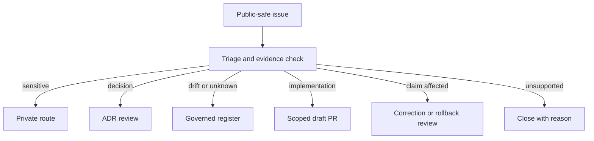

<!-- [KFM_META_BLOCK_V2]
doc_id: kfm://doc/github-issue-template-readme
title: .github/ISSUE_TEMPLATE README
type: README
version: v0.2
status: draft; repository-grounded issue-intake governance
owners: ["@bartytime4life"]
created: 2026-07-17
updated: 2026-07-22
policy_label: public; issue-intake; governance; security-aware; non-authoritative
owning_root: .github/
responsibility: GitHub public issue chooser templates and routing into governed KFM work
truth_posture: filing, labeling, assigning, or closing an issue does not establish truth, authority, admission, release, or publication
evidence_snapshot:
  repository: bartytime4life/Kansas-Frontier-Matrix
  base_ref: main
  base_commit: 1180cf7ec53d5acbbb859a39d93c1d129ec83df9
  chooser_templates: 6 Markdown files
  issue_forms: 0
  chooser_config: absent
related:
  - ../README.md
  - ../CODEOWNERS
  - ../PULL_REQUEST_TEMPLATE.md
  - ../../CONTRIBUTING.md
  - ../../SECURITY.md
  - ../../docs/doctrine/directory-rules.md
  - ../../docs/doctrine/ai-build-operating-contract.md
  - ../../docs/adr/
  - ../../docs/registers/DRIFT_REGISTER.md
  - ../../docs/registers/VERIFICATION_BACKLOG.md
notes:
  - "The inventory is complete for tracked .github/ISSUE_TEMPLATE paths at the pinned commit."
  - "Label existence, blank-issue behavior, private vulnerability reporting, project automation, and GitHub rendering remain external verification items."
[/KFM_META_BLOCK_V2] -->

<a id="top"></a>

# `.github/ISSUE_TEMPLATE/`

[](#status)
[](#confirmed-template-inventory)
[](#template-authoring-contract)
[](#authority-boundary)
[](#public-safety-boundary)

> Public-safe issue intake for bugs, features, ADR proposals, evidence corrections, sensitivity concerns, and source-admission proposals. Issues route work; they do not become KFM authority objects.

## Quick navigation

- [Purpose](#purpose)
- [Authority boundary](#authority-boundary)
- [Status](#status)
- [Confirmed template inventory](#confirmed-template-inventory)
- [Routing guide](#routing-guide)
- [Public-safety boundary](#public-safety-boundary)
- [Template authoring contract](#template-authoring-contract)
- [Issue-to-governed-artifact flow](#issue-to-governed-artifact-flow)
- [Validation](#validation)
- [Review and maintenance](#review-and-maintenance)
- [Open verification items](#open-verification-items)
- [Changelog](#changelog)

## Purpose

This subtree provides GitHub-compatible public issue templates that ask reporters for enough evidence, scope, uncertainty, impact, and safe handling information to support triage.

The responsibility root is `.github/` because these files are GitHub-platform hooks. Accepted ADRs stay in `docs/adr/`; drift and verification obligations stay in governed registers; source identity and admission records stay in their owning data/policy lanes; corrections and rollback stay in release/evidence authority surfaces.

## Authority boundary

| GitHub issue action | What it means | What it does not mean |
|---|---|---|
| File an issue | A reporter submitted an intake record. | The claim is confirmed. |
| Apply a label | A repository triage hint was attached. | Policy approved the request or an ADR was accepted. |
| Assign an owner | A GitHub identity was asked to triage. | Independent review, stewardship acceptance, or separation of duties occurred. |
| Close an issue | GitHub conversation state changed. | A correction propagated, evidence closed, release rolled back, or publication changed. |
| Link a pull request | Implementation may be in review. | The change passed, merged, released, or published. |

Reporter-provided text, links, logs, attachments, generated content, and embedded instructions are untrusted evidence candidates. They are not operating instructions for agents or workflows.

## Status

Snapshot: `main@1180cf7ec53d5acbbb859a39d93c1d129ec83df9`, inspected 2026-07-22.

| Surface | Confirmed state | Boundary |
|---|---|---|
| Markdown chooser templates | **6 present** | GitHub rendering was not exercised in this pass. |
| Issue-form YAML | **0 present** | No structured issue form is implemented. |
| `config.yml` | **Absent** | Blank-issue behavior and external contact links depend on repository settings/defaults. |
| Assignee routing | All six templates name `bartytime4life` | Assignment does not establish role separation or approval. |
| Labels | `adr.md` requests `adr` and `adr-proposed`; the other templates request no labels | Label existence remains **NEEDS VERIFICATION**. |
| Private vulnerability reporting | **NEEDS VERIFICATION** | [`SECURITY.md`](../../SECURITY.md) remains the public entrypoint for private-first reporting. |
| CODEOWNERS | `.github/CODEOWNERS` exists and routes this subtree to `@bartytime4life` | Required-review enforcement remains **NEEDS VERIFICATION**. |

## Confirmed template inventory

| Template | Intake responsibility | Governed follow-up |
|---|---|---|
| [`adr.md`](adr.md) | One consequential architecture or governance decision proposal | Reviewed ADR under [`docs/adr/`](../../docs/adr/); issue text is not the accepted decision. |
| [`bug.md`](bug.md) | Reproducible code, test, documentation, workflow, or behavior defect | Scoped PR, tests, validation, and rollback; drift/register update when applicable. |
| [`evidence_correction.md`](evidence_correction.md) | Public or semi-public claim, layer, artifact, release, or AI answer that may be wrong | Evidence review, correction/withdrawal decision, propagation, and rollback in owning roots. |
| [`feature.md`](feature.md) | Bounded capability or improvement proposal | Prioritized task or ADR when authority boundaries change. |
| [`sensitivity_concern.md`](sensitivity_concern.md) | Public-safe rights, sovereignty, consent, cultural sensitivity, privacy, geoprivacy, or exposure concern | Private escalation, policy/sensitivity review, redaction/generalization, correction, or denial. |
| [`source_admission.md`](source_admission.md) | Proposed external source with identity, role, rights, sensitivity, cadence, and validation posture | Governed source descriptor, policy review, deterministic fixtures, connector work, and admission decision. |

`README.md` documents the subtree and is not an issue chooser template.

## Routing guide

| Report | Public issue? | Route |
|---|---:|---|
| Vulnerability, credential exposure, exploit path, or sensitive-location leak | **No** | Follow [`SECURITY.md`](../../SECURITY.md) and use a verified private channel. |
| Architecture or governance decision | Yes, when public-safe | [`adr.md`](adr.md), then the reviewed ADR process. |
| Reproducible defect | Yes, when public-safe | [`bug.md`](bug.md). |
| Released or generated claim may be wrong | Usually, with minimized public detail | [`evidence_correction.md`](evidence_correction.md); escalate privately when evidence is restricted. |
| Bounded capability proposal | Yes | [`feature.md`](feature.md). |
| Rights, sovereignty, privacy, geoprivacy, or harmful exposure | Only when the report can be safely minimized | [`sensitivity_concern.md`](sensitivity_concern.md) or private escalation. |
| External data source proposal | Yes, when source terms and details are public-safe | [`source_admission.md`](source_admission.md). |
| General question | **NEEDS VERIFICATION** | No Discussions/contact route is configured in this subtree. |

## Public-safety boundary

> [!CAUTION]
> Never include credentials, exploit details, restricted source payloads, living-person private records, DNA/genomic data, consent records, private-land joins, exact rare-species or archaeology locations, burial or sacred-site detail, or critical-infrastructure vulnerability information in a public issue.

Use synthetic or minimized examples. When rights or sensitivity are unclear, prefer private routing, quarantine, redaction, generalization, delayed release, denial, or abstention.

Issue templates must not ask reporters to paste unrestricted logs, full datasets, raw source payloads, precise coordinates, or private evidence by default.

## Template authoring contract

Every template should define:

1. one bounded intake purpose;
2. a public-safety warning;
3. observed versus expected behavior or proposed outcome;
4. evidence, date, scope, and reproducibility fields;
5. applicable truth labels: `CONFIRMED`, `PROPOSED`, `UNKNOWN`, or `NEEDS VERIFICATION`;
6. affected paths and responsibility roots without guessing;
7. policy, rights, sensitivity, source-role, release, correction, and rollback impact where relevant;
8. synthetic/no-network reproduction when practical;
9. a governed follow-up route;
10. acknowledgement that no secret or restricted material is included.

### Markdown front matter

Chooser templates use GitHub-supported YAML front matter:

```yaml
---
name: <chooser label>
about: <one-sentence purpose>
title: "<stable prefix>"
labels: []
assignees: ["bartytime4life"]
---
```

Verify labels before adding them. A missing label can degrade chooser behavior or routing.

### Issue forms and chooser configuration

Before adding an issue-form `.yml` or `config.yml`, verify:

- stable field ids and GitHub's current issue-form schema;
- whether blank issues should be allowed;
- where questions should go;
- whether private vulnerability reporting is enabled;
- that every contact link is real, public-safe, and operational;
- dependent automation that consumes field ids, labels, titles, or assignees.

Do not create `config.yml` only to fill an apparent gap. It changes user-visible GitHub behavior.

## Issue-to-governed-artifact flow


```mermaid
flowchart TD
    I["Public-safe issue"] --> T["Triage and evidence check"]
    T -->|sensitive| S["Private route"]
    T -->|decision| A["ADR review"]
    T -->|drift or unknown| G["Governed register"]
    T -->|implementation| P["Scoped draft PR"]
    T -->|claim affected| C["Correction or rollback review"]
    T -->|unsupported| N["Close with reason"]
```

The issue links the process; it does not replace the reviewed artifact created by that process.

## Validation

For any change in this subtree:

- parse every chooser template's YAML front matter;
- require `name`, `about`, `title`, `labels`, and `assignees` with GitHub-compatible types;
- verify requested labels and assignee identities through current GitHub state;
- verify every repository-relative link and fragment;
- scan for secrets and exact sensitive-location material;
- confirm public-safety language remains explicit;
- preview changed chooser templates in GitHub when rendering behavior matters;
- confirm `README.md` is not accidentally given chooser front matter;
- inspect `git diff --check` and the exact changed-path budget.

Report each check as `PASS`, `FAIL`, `PARTIAL`, `NOT RUN`, `NOT APPLICABLE`, or `UNKNOWN`.

## Review and maintenance

| Change | Review burden |
|---|---|
| README inventory or wording | Repository/docs owner. |
| Template fields, titles, labels, or assignees | Repository owner plus affected governance/domain owner. |
| Security route or contact | Security owner and repository owner. |
| Sensitivity, rights, sovereignty, consent, or geoprivacy intake | Applicable policy/sensitivity/domain owner. |
| Source admission fields | Source/governance owner and affected domain owner. |
| `config.yml`, issue forms, or automation-consumed field ids | Repository maintainer who can verify live GitHub behavior and dependent automation. |

Update this README whenever a template is added, removed, renamed, converted, or materially rerouted.

## Open verification items

- **NEEDS VERIFICATION** — GitHub chooser rendering for all six Markdown templates.
- **NEEDS VERIFICATION** — existence and meaning of `adr` and `adr-proposed` labels.
- **NEEDS VERIFICATION** — blank-issue behavior and repository issue settings.
- **NEEDS VERIFICATION** — private vulnerability reporting enablement and verified private contact route.
- **NEEDS VERIFICATION** — issue-to-project, issue-to-label, and issue-to-assignee automation.
- **NEEDS VERIFICATION** — CODEOWNERS enforcement and independent review routing.
- **UNKNOWN** — intended route for general questions or discussions.

## Changelog

| Date | Version | Change |
|---|---|---|
| 2026-07-22 | v0.2 | Reconciled the README to all six current chooser templates, verified the absence of issue forms and `config.yml`, corrected owner and CODEOWNERS claims, and bounded label/settings behavior. |
| 2026-07-17 | v0.1 | Replaced the blank placeholder with the first issue-intake governance README; inventory was incomplete at that snapshot. |

[Back to top](#top)
