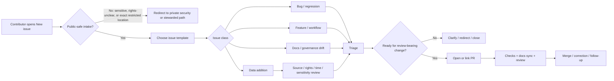

<!-- [KFM_META_BLOCK_V2]
doc_id: kfm://doc/<uuid-NEEDS_VERIFICATION>
title: KFM Issue Template Directory
type: standard
version: v1
status: draft
owners: <owners-NEEDS_VERIFICATION>
created: <YYYY-MM-DD-NEEDS_VERIFICATION>
updated: <YYYY-MM-DD-NEEDS_VERIFICATION>
policy_label: <policy_label-NEEDS_VERIFICATION>
related: [.github/ISSUE_TEMPLATE/, ../PULL_REQUEST_TEMPLATE.md (NEEDS VERIFICATION), ../../docs/ (NEEDS VERIFICATION)]
tags: [kfm, github, contributor-intake, governance]
notes: [Evidence-bounded draft; current-session workspace inspection surfaced the attached KFM PDF corpus under /mnt/data but did not surface a mounted repo checkout, so sibling template filenames, chooser config, owners, labels, and adjacent repo paths remain NEEDS VERIFICATION.]
[/KFM_META_BLOCK_V2] -->

# KFM Issue Template Directory

Contributor intake guidance for GitHub issues that should enter Kansas Frontier Matrix through an evidence-first, review-bearing, PR-first workflow.

> **Status:** experimental  
> **Owners:** `<owners-NEEDS_VERIFICATION>`  
>       
> **Repo fit:** `.github/ISSUE_TEMPLATE/README.md`  
> **Upstream:** GitHub new-issue chooser → `./config.yml` (**NEEDS VERIFICATION**)  
> **Downstream:** triage → `../PULL_REQUEST_TEMPLATE.md` (**NEEDS VERIFICATION**) → review/docs sync → `../../docs/` (**NEEDS VERIFICATION**)  
> **Quick jump:** [Scope](#scope) · [Repo fit](#repo-fit) · [Inputs](#inputs) · [Exclusions](#exclusions) · [Directory tree](#directory-tree) · [Quickstart](#quickstart) · [Usage](#usage) · [Diagram](#diagram) · [Template matrix](#template-matrix) · [Task list](#task-list--definition-of-done) · [FAQ](#faq)

> [!IMPORTANT]
> This README is intentionally evidence-bounded. Current-session review confirmed the attached KFM PDF corpus and did **not** confirm a mounted repository tree, so sibling filenames, chooser wiring, owners, labels, and adjacent repo paths stay visible as **NEEDS VERIFICATION** instead of being presented as settled repo fact.

---

## Scope

This directory exists to make issue intake structured, reviewable, and aligned with KFM’s governed documentation and delivery posture.

In practice, templates here should help contributors submit enough context to:

- describe a problem, proposal, or drift clearly
- preserve source, time, rights, and sensitivity context when those matter
- route meaningful work into review-bearing pull requests instead of comment-thread improvisation
- keep documentation, policy, and implementation changes visibly connected

> [!NOTE]
> Template fields in this directory should preserve four KFM signals: intake is a contract rather than a casual upload, trust-affecting changes move through PR review, documentation is part of the working system, and public intake fails safe around rights, sensitivity, and exact-location exposure.

### Working status labels used in this README

| Label | Meaning here |
|---|---|
| **CONFIRMED** | Supported by attached project sources or direct current-session workspace inspection |
| **INFERRED** | Strongly suggested by project materials, but not directly re-verified in a mounted repo tree |
| **PROPOSED** | Recommended directory behavior or template pattern aligned to current KFM doctrine |
| **UNKNOWN** | Not verified strongly enough in the current session to present as current repo reality |
| **NEEDS VERIFICATION** | Repo-specific path, file, owner, label, chooser, or workflow detail not directly inspected |

## Repo fit

| Item | Value | Status |
|---|---|---|
| Target path | `.github/ISSUE_TEMPLATE/README.md` | **CONFIRMED** task target |
| Directory role | Contributor-facing GitHub issue intake surface for KFM | **INFERRED** |
| Upstream trigger | GitHub “New issue” chooser, likely via `./config.yml` | **NEEDS VERIFICATION** |
| Primary downstream path | issue → triage → scoped PR → checks / review / docs sync | **PROPOSED** |
| Likely PR handoff file | `../PULL_REQUEST_TEMPLATE.md` | **INFERRED / NEEDS VERIFICATION** |
| Longer-form governed docs | `../../docs/` | **INFERRED / NEEDS VERIFICATION** |
| Governance-adjacent paths | `../../policy/`, `../../contracts/`, `../../schemas/`, `../../runbooks/` | **INFERRED / NEEDS VERIFICATION** |
| Sensitive-report redirect | private disclosure or stewarded path | **INFERRED / NEEDS VERIFICATION** |

## Inputs

The following content belongs here:

| Accepted input | What it should capture | Status |
|---|---|---|
| Bug / regression reports | expected vs actual behavior, affected surface, reproduction clues, evidence links, screenshots or logs where safe | **PROPOSED** |
| Feature or workflow proposals | goal, user lane, affected subsystem, acceptance criteria, risks, docs impact | **PROPOSED** |
| Data addition requests | source identity, license/rights posture, temporal coverage, spatial scope, intended use, sensitivity notes | **INFERRED** |
| Documentation / governance drift reports | affected path or surface, observed mismatch, supporting evidence, review urgency | **PROPOSED** |

### Why these inputs matter

KFM treats intake quality as an early governance concern. A vague issue becomes review drift; a structured issue becomes a usable entry point into policy, documentation, validation, and implementation work.

## Exclusions

The following content does **not** belong in this directory:

| Exclusion | Why it does not belong here | Put it here instead |
|---|---|---|
| Pull request review checklists | PR review happens after issue intake | `../PULL_REQUEST_TEMPLATE.md` (**NEEDS VERIFICATION**) |
| Private security disclosures | Public issue threads are the wrong place for sensitive reporting | `../SECURITY.md` or project disclosure channel (**NEEDS VERIFICATION**) |
| Credentials, tokens, or private access details | Public issue intake must not become a leakage path | private disclosure path (**NEEDS VERIFICATION**) |
| Exact restricted locations or rights-unclear raw materials | Public issue intake should route stewardship safely, not bypass it | stewarded review path (**NEEDS VERIFICATION**) |
| Canonical policy / schema definitions | Templates should reference rules, not replace them | `../../policy/`, `../../contracts/`, `../../schemas/` (**NEEDS VERIFICATION**) |
| Long-form runbooks, ADRs, or architecture manuals | Those are governed documents, not intake forms | `../../docs/` or adjacent governance docs (**NEEDS VERIFICATION**) |

> [!CAUTION]
> Do not use public issue templates to submit exact restricted coordinates, unpublished raw files, confidential review material, or secrets. Public intake should capture enough detail to route work safely, not enough detail to bypass policy, stewardship, or quarantine behavior.

## Directory tree

Expected reviewable shape for this directory:

```text
.github/
└── ISSUE_TEMPLATE/
    ├── README.md                           # this file
    ├── bug_report.(md|yml)                 # NEEDS VERIFICATION
    ├── feature_request.(md|yml)            # NEEDS VERIFICATION
    ├── data_addition_request.(md|yml)      # INFERRED / NEEDS VERIFICATION
    ├── docs_governance_drift.(md|yml)      # PROPOSED
    └── config.yml                          # NEEDS VERIFICATION
```

The tree above is a **directory contract draft**, not a claim that every file already exists.

## Quickstart

### Reporter path

1. Choose the smallest issue type that matches your intent.
2. Fill only the fields needed for triage, not the entire implementation design.
3. Attach evidence links, screenshots, logs, or source references when safe.
4. For source- or data-related requests, include identity, rights/license posture, and time basis early.
5. Move substantial implementation work into a pull request rather than resolving it in issue comments.

### Maintainer path

1. Keep each template focused on intake rather than release approval.
2. Require fields that preserve KFM context when it matters: source, time basis, rights, sensitivity, and acceptance criteria.
3. Redirect sensitive or non-public material away from public issue threads.
4. Update this README when template classes, chooser behavior, or contributor gates change.
5. Keep template, PR, and docs behavior synchronized in the same review stream.

### Illustrative issue-form fragment

```yaml
# Illustrative only — exact filenames, labels, and field set NEEDS VERIFICATION
name: Data Addition Request
description: Propose a new source or dataset for governed onboarding
title: "[data-addition] "
labels:
  - data
  - intake

body:
  - type: input
    id: source_name
    attributes:
      label: Source name
      placeholder: Kansas Historical Society / USGS / county GIS / archive collection
    validations:
      required: true

  - type: input
    id: source_url
    attributes:
      label: Source URL or catalog reference
    validations:
      required: true

  - type: textarea
    id: temporal_coverage
    attributes:
      label: Temporal coverage
      description: What dates or time span does this source cover?
    validations:
      required: true

  - type: input
    id: rights_license
    attributes:
      label: Rights / license / agreement posture
      placeholder: public domain, CC-BY, restricted, unknown
    validations:
      required: true

  - type: textarea
    id: sensitivity_notes
    attributes:
      label: Sensitivity or stewardship notes
      description: Include location sensitivity, privacy, archival restrictions, or uncertainty.
```

> [!NOTE]
> A Markdown template (`.md`) and an issue-form template (`.yml`) can both serve this directory’s job. The repo’s actual choice is **NEEDS VERIFICATION**.

## Usage

### Intake flow

1. A contributor opens a new issue and selects the closest template.
2. The template gathers just enough structure to keep the request reviewable.
3. Triage decides whether the issue is:
   - ready for implementation work
   - missing required evidence or scope
   - out of scope for public issue intake
   - better handled as policy, security, or stewardship review
4. Substantial change moves into a pull request with checks, review, and docs updates in the same governed stream.

### Proposed template design rules

The following rules are **PROPOSED** directory behavior aligned to current KFM doctrine:

| Rule | Why it exists | Typical fields |
|---|---|---|
| Ask only for triage-critical information | Intake should structure work, not replace design or review docs | summary, affected surface, evidence links, urgency |
| Require source identity, rights, and time basis when onboarding data | KFM treats source admission as a contract, not a casual upload | source name, source URL, license/rights, temporal coverage |
| Avoid public solicitation of sensitive detail | Public issue threads must not become a leak path | generalized location, steward note, redirect guidance |
| Route meaningful change into PR review | Trust-affecting changes should be review-bearing and reversible | acceptance criteria, downstream PR link, rollback notes where relevant |
| Keep docs in the same change stream as workflow changes | Contributor guidance is part of the working system | docs impact, related README/runbook/ADR updates |

### Reporter guidance

Use this directory when you need to:

- report a defect in a KFM-facing surface or workflow
- propose a new capability or refinement
- request governed onboarding of a dataset or source family
- flag drift between documented behavior and observed behavior

Do **not** use this directory as a substitute for:

- formal release approval
- schema or policy definition
- restricted-source submission
- ad hoc chat-based triage without a review trail

## Diagram


```mermaid
flowchart LR
    A[Contributor opens New issue] --> B{Public-safe intake?}

    B -- No: sensitive, rights-unclear, or exact restricted location --> C[Redirect to private security or stewarded path]
    B -- Yes --> D[Choose issue template]

    D --> E{Issue class}
    E --> F[Bug / regression]
    E --> G[Feature / workflow]
    E --> H[Data addition]
    E --> I[Docs / governance drift]

    H --> J[Source / rights / time / sensitivity review]
    F --> K[Triage]
    G --> K
    I --> K
    J --> K

    K --> L{Ready for review-bearing change?}
    L -- No --> M[Clarify / redirect / close]
    L -- Yes --> N[Open or link PR]

    N --> O[Checks + docs sync + review]
    O --> P[Merge / correction / follow-up]
```

## Template matrix

| Template lane | Use when | Minimum fields | Why it matters | Status |
|---|---|---|---|---|
| Bug / regression | Something no longer behaves as expected | summary, expected vs actual, affected surface, reproduction clues, evidence or log links | Keeps defects concrete and reviewable | **PROPOSED** |
| Feature / workflow proposal | A contributor wants a new capability, refinement, or delivery improvement | goal, audience lane, constraints, acceptance criteria, docs impact | Prevents feature requests from staying vague | **PROPOSED** |
| Data addition request | A source or dataset should enter governed onboarding | source info, rights/license, temporal coverage, spatial scope, intended use, sensitivity notes | Aligns intake with evidence-first source onboarding | **INFERRED** |
| Docs / governance drift | Documented behavior and observed behavior no longer match | affected path, mismatch summary, evidence, severity, review need | Treats docs as part of the working system | **PROPOSED** |

## Task list & Definition of Done

A healthy issue-template directory should meet all of the following:

- [ ] Each public issue type captures enough information to route work without guesswork.
- [ ] Data-oriented intake asks for source identity, rights/license posture, and temporal coverage.
- [ ] Public templates avoid prompting contributors to paste credentials, restricted coordinates, or sensitive raw material.
- [ ] Meaningful contributor workflow changes point toward pull-request review instead of replacing it.
- [ ] Security-sensitive reports are redirected away from public issue threads.
- [ ] Template, chooser, and PR-handoff changes are reflected in docs in the same governed change stream.
- [ ] This README matches the actual files present in `.github/ISSUE_TEMPLATE/`.
- [ ] Any chooser config, labels, owners, and handoff links referenced here are verified against the mounted repo.
- [ ] Review gates and downstream docs references are current, not historical leftovers.

## FAQ

### Why ask for source, license, and temporal coverage so early?

Because KFM treats intake as a governed step, not a casual upload. If a proposed source cannot be described in terms of identity, rights, and time basis, it is not ready for clean onboarding.

### Why is so much marked **NEEDS VERIFICATION**?

Because the current session exposed the attached KFM source corpus but not a mounted repository tree. This README is meant to be commit-friendly and honest, not persuasive by omission.

### Should security issues go here?

No. Public issue intake is the wrong place for sensitive disclosures. Route them through the project’s verified security or private disclosure path once that path is confirmed.

### Does this directory replace pull request templates?

No. It should feed into them. Issue templates structure intake; pull request templates structure implementation review and merge readiness.

### Why mention docs so explicitly in an issue-template README?

Because in KFM, contributor workflow guidance is part of the working system. If intake behavior changes, the documentation that explains intake should change with it.

## Appendix

<details>
<summary>Appendix — evidence-bounded drafting notes</summary>

### Confirmed doctrine signals carried into this README

- KFM documentation is treated as part of the governed system, not decoration.
- KFM’s contributor and automation posture strongly favors review-bearing pull requests over silent background mutation for trust-affecting change.
- Source onboarding is treated as a contract process that preserves source identity, rights, sensitivity, and temporal meaning.
- Public-facing behavior should fail safe when rights, evidence, or sensitivity are incomplete.

### Historically explicit collaboration-template precedent

- Earlier KFM design material explicitly described issue and pull-request templates in `.github/ISSUE_TEMPLATE` and `PULL_REQUEST_TEMPLATE`.
- That same material explicitly named a **Data Addition Request** issue type that asks for source info, license, and temporal coverage.
- Those older references are treated here as useful continuity, **not** as proof that the mounted repo currently has the same files or wording.

### Explicit unknowns left visible on purpose

- exact issue-template filenames
- whether the repo currently uses Markdown templates, issue forms, or both
- current labels, owners, assignees, and chooser configuration
- existence and wording of `SECURITY.md`
- exact adjacency to the mounted pull request template and contributor docs

</details>

[Back to top](#kfm-issue-template-directory)
