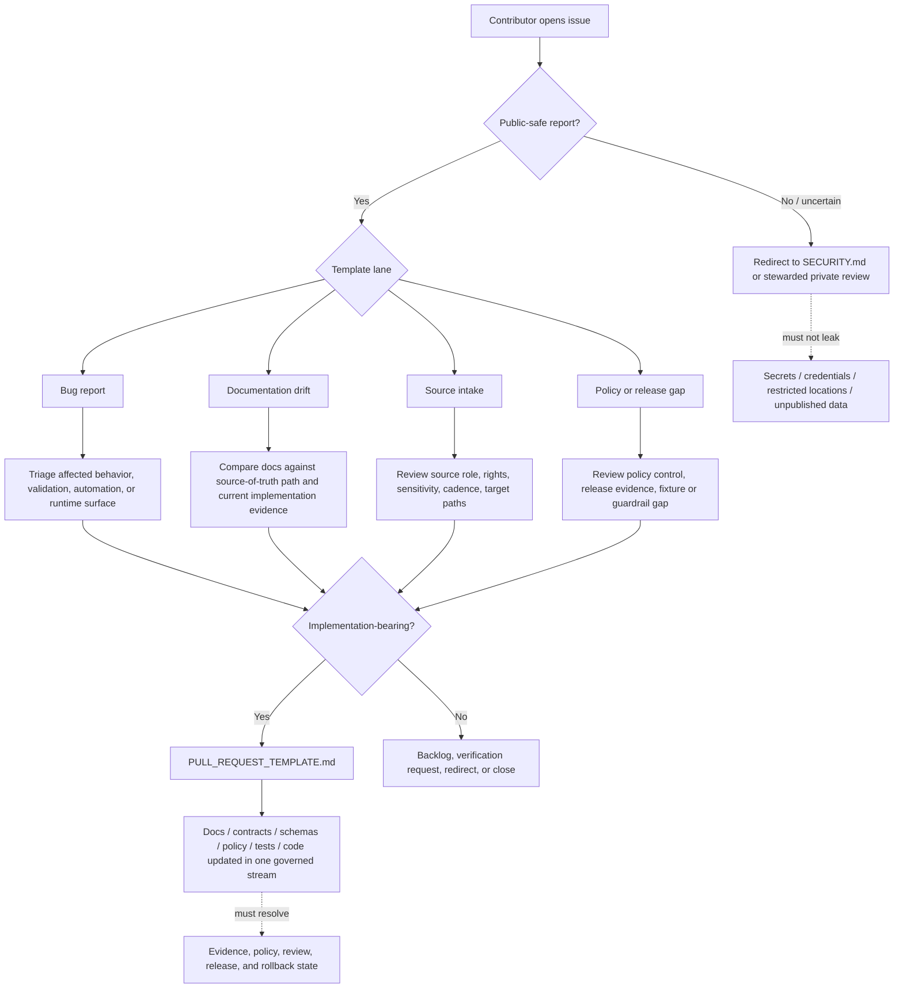

<!-- [KFM_META_BLOCK_V2]
doc_id: kfm://doc/TODO-ISSUE-TEMPLATE-README-UUID
title: KFM Issue Template Directory
type: standard
version: v1
status: draft
owners: @bartytime4life
created: TODO-NEEDS-VERIFICATION
updated: 2026-04-27
policy_label: public
related: [../README.md, ../CODEOWNERS, ../PULL_REQUEST_TEMPLATE.md, ../SECURITY.md, ../../SECURITY.md, ../../CONTRIBUTING.md, ./config.yml, ./bug_report.md, ./documentation_drift.md, ./policy_or_release_gap.md, ./source_intake.md, ../../docs/, ../../policy/, ../../contracts/, ../../schemas/, ../../tests/]
tags: [kfm, github, issue-template, intake, governance, documentation, source-intake, policy, release]
notes: [doc_id and created date need repository document-record verification; owner is grounded in current CODEOWNERS fallback coverage for `/.github/`; updated date reflects this drafted README revision; policy_label is public because the file is in the public repository, but formal policy labeling should still be checked at merge time.]
[/KFM_META_BLOCK_V2] -->

<a id="top"></a>

# KFM Issue Template Directory

Contributor issue-intake guidance for routing bugs, documentation drift, source intake, and policy/release gaps without leaking sensitive material or replacing PR review.


> [!IMPORTANT]
> **Status:** experimental  
> **Owners:** `@bartytime4life`  
> **Path:** `.github/ISSUE_TEMPLATE/README.md`  
> **Repo fit:** child README under the `.github` gatehouse; upstream from [`../README.md`](../README.md), [`../CODEOWNERS`](../CODEOWNERS), [`../PULL_REQUEST_TEMPLATE.md`](../PULL_REQUEST_TEMPLATE.md), [`../SECURITY.md`](../SECURITY.md), and [`../../CONTRIBUTING.md`](../../CONTRIBUTING.md); downstream into public GitHub issue intake, triage, PR handoff, documentation correction, source onboarding, and policy/release review.  
> **Quick jumps:** [Scope](#scope) · [Repo fit](#repo-fit) · [Inputs](#inputs) · [Exclusions](#exclusions) · [Directory tree](#directory-tree) · [Quickstart](#quickstart) · [Usage](#usage) · [Diagram](#diagram) · [Current inventory & routing tables](#current-inventory--routing-tables) · [Task list & Definition of Done](#task-list--definition-of-done) · [FAQ](#faq) · [Appendix](#appendix)

> [!NOTE]
> This README describes the checked-in issue-intake lane. It does **not** prove live GitHub chooser behavior, label existence, default assignees, platform-side issue settings, required checks, or branch/ruleset enforcement.

---

## Scope

`.github/ISSUE_TEMPLATE/` is KFM’s public issue-intake lane.

It exists to make contributor reports structured enough for safe triage before they become PRs, policy work, source onboarding, documentation correction, or release/review follow-up. In KFM terms, issue intake is part of the trust membrane: it should gather safe evidence and route work without becoming the source of truth.

### This directory helps answer

- What kind of issue is being opened?
- Which repo surface is affected?
- What evidence is safe to share publicly?
- Does the report implicate documentation, contracts, schemas, policy, release evidence, security, rights, or sensitivity?
- Should the work stay in public issue triage, move to private security handling, or become an implementation-bearing PR?

### Truth posture used in this README

| Label | Use in this README |
|---|---|
| **CONFIRMED** | Directly supported by current public repository contents or current KFM doctrine. |
| **INFERRED** | Conservative reading of confirmed repository or doctrine evidence. |
| **PROPOSED** | Recommended improvement or future issue-template behavior not yet proven as active enforcement. |
| **UNKNOWN** | Not established strongly enough to present as current repository or GitHub-platform fact. |
| **NEEDS VERIFICATION** | Merge-time or platform-side check required before stronger claims are made. |

[Back to top](#top)

---

## Repo fit

`.github/ISSUE_TEMPLATE/` is a GitHub-facing routing surface. It is not the canonical home for policy, schema, contract, evidence, runtime, or publication truth.

| Relationship | Path | Status | Role |
|---|---|---:|---|
| Parent gatehouse | [`../README.md`](../README.md) | CONFIRMED | Explains `.github/` as contribution, review, and CI orchestration support. |
| Ownership routing | [`../CODEOWNERS`](../CODEOWNERS) | CONFIRMED | Broad fallback owner coverage and future split guidance. |
| PR handoff | [`../PULL_REQUEST_TEMPLATE.md`](../PULL_REQUEST_TEMPLATE.md) | CONFIRMED | Implementation-bearing changes move from issue intake into PR review. |
| Security routing | [`../SECURITY.md`](../SECURITY.md) and [`../../SECURITY.md`](../../SECURITY.md) | CONFIRMED path targets / NEEDS VERIFICATION for alignment | Public issue intake should redirect sensitive reports. |
| Contribution guidance | [`../../CONTRIBUTING.md`](../../CONTRIBUTING.md) | CONFIRMED path target | Broader contributor expectations. |
| Documentation authority | [`../../docs/`](../../docs/) | CONFIRMED path target | Doctrine, architecture, standards, runbooks, and verification backlog. |
| Policy authority | [`../../policy/`](../../policy/) | CONFIRMED path target | Policy semantics and release/sensitivity rules. |
| Contract/schema authority | [`../../contracts/`](../../contracts/) and [`../../schemas/`](../../schemas/) | CONFIRMED path targets | Meaning and machine-checkable shapes. |
| Verification authority | [`../../tests/`](../../tests/) | CONFIRMED path target | Fixtures, regression checks, and validation evidence. |

### Boundary contract

| Issue intake may coordinate | Authority remains outside this directory |
|---|---|
| Ask for a safe summary, affected surface, evidence, and repro steps. | Runtime truth, canonical data state, source authority, policy meaning, release state. |
| Route docs drift to documentation review. | The corrected doctrine, standards, or implementation evidence. |
| Route source proposals to source-intake review. | SourceDescriptor contracts, source registries, rights decisions, and steward review. |
| Route policy/release gaps to policy and release reviewers. | DecisionEnvelope semantics, PromotionDecision state, proof packs, release manifests, and correction lineage. |
| Redirect security-sensitive or restricted details. | Private vulnerability handling and stewarded restricted-access review. |

[Back to top](#top)

---

## Inputs

Accepted inputs for this directory are public-safe GitHub issue-intake files and the README that explains how to use them.

| Input class | Belongs here when… | Current status |
|---|---|---:|
| Directory README | It explains issue-template purpose, routing, boundaries, and verification gaps. | CONFIRMED |
| `config.yml` | It controls blank-issue behavior and contact links for the GitHub issue chooser. | CONFIRMED |
| Markdown issue templates | They provide lightweight public issue bodies for bug, docs drift, source intake, and policy/release gaps. | CONFIRMED |
| YAML issue forms | They define structured GitHub issue forms. | PROPOSED / none currently visible beyond `config.yml` |
| Public-safe template guidance | It asks for triage-critical evidence without soliciting secrets, restricted coordinates, unpublished data, or private source material. | INFERRED / PROPOSED |

### Current template lanes

| Template | Intake purpose | Current signal |
|---|---|---|
| [`bug_report.md`](./bug_report.md) | Defects in behavior, validation, or automation. | CONFIRMED |
| [`documentation_drift.md`](./documentation_drift.md) | Docs that no longer match implementation or source-of-truth surfaces. | CONFIRMED |
| [`source_intake.md`](./source_intake.md) | New source onboarding or source-term updates. | CONFIRMED |
| [`policy_or_release_gap.md`](./policy_or_release_gap.md) | Missing policy controls or release-evidence gates. | CONFIRMED |
| [`config.yml`](./config.yml) | Blank issue and security contact behavior. | CONFIRMED |

### Good public issue reports include

- a concise summary;
- affected paths, workflows, docs, policies, schemas, contracts, data lanes, or runtime surfaces;
- safe evidence links, logs, screenshots, or reproduction steps;
- expected vs actual behavior where applicable;
- rights, sensitivity, release, or documentation implications where relevant;
- open unknowns that should remain **NEEDS VERIFICATION**.

[Back to top](#top)

---

## Exclusions

`.github/ISSUE_TEMPLATE/` must not become a dumping ground for KFM truth, secrets, source data, policy law, or release evidence.

| Do not put here | Use instead | Why |
|---|---|---|
| Pull-request review checklist or merge-readiness contract | [`../PULL_REQUEST_TEMPLATE.md`](../PULL_REQUEST_TEMPLATE.md) | Issues shape intake; PRs prove implementation readiness. |
| Private vulnerability details or coordinated disclosure | [`../SECURITY.md`](../SECURITY.md) and verified private reporting path | Public issues can expose risk. |
| Secrets, tokens, private service URLs, credentials, or model endpoints | Repository/environment secrets and deployment/security procedures | Prevents exposure and credential leakage. |
| Exact restricted coordinates, sensitive cultural/site/species details, or unpublished review material | Stewarded restricted-access review paths | Preserves sensitivity, rights, and safety posture. |
| RAW, WORK, QUARANTINE, processed datasets, or published artifacts | `../../data/` lifecycle surfaces | Keeps KFM lifecycle boundaries intact. |
| Canonical policy semantics or rights/sensitivity rules | [`../../policy/`](../../policy/) | Templates may route policy work; they do not define policy truth. |
| Contract definitions, schemas, vocabularies, or proof-object meaning | [`../../contracts/`](../../contracts/) and [`../../schemas/`](../../schemas/) | Prevents machine-authority drift. |
| Validators, scripts, or complex automation logic | `../../tools/`, `../../tests/`, or repo-native runtime/tooling surfaces | Keeps templates thin and reviewable. |
| Runtime API, UI, MapLibre, data loader, graph, AI adapter, or resolver code | App/package/script surfaces | Issue intake is not implementation. |
| Publication approval, release manifest truth, or proof-pack state | Release, proof, catalog, and review-record homes as repo convention confirms | Promotion is a governed state transition, not an issue-template side effect. |

> [!CAUTION]
> Public issues should capture enough context to route work safely, not enough detail to leak secrets, restricted locations, rights-unclear data, or unpublished evidence.

[Back to top](#top)

---

## Directory tree

Current public `main` inventory:

```text
.github/
└── ISSUE_TEMPLATE/
    ├── README.md
    ├── bug_report.md
    ├── config.yml
    ├── documentation_drift.md
    ├── policy_or_release_gap.md
    └── source_intake.md
```

No YAML issue forms are currently visible in this directory other than the chooser/config file.

> [!TIP]
> Re-check the inventory from a mounted checkout before merge:
>
> ```bash
> find .github/ISSUE_TEMPLATE -maxdepth 2 -type f | sort
> ```

[Back to top](#top)

---

## Quickstart

### Contributor path

1. Pick the closest issue lane:
   - bug or regression;
   - documentation drift;
   - source intake;
   - policy or release gap.
2. Keep the report public-safe.
3. Include affected paths and safe evidence.
4. Use `NEEDS VERIFICATION` when a claim depends on runtime behavior, platform settings, source rights, release state, or branch rules you have not inspected.
5. Stop and use [`../SECURITY.md`](../SECURITY.md) for vulnerabilities, credentials, sensitive locations, or private disclosure material.
6. When the issue becomes implementation-bearing, carry the work into [`../PULL_REQUEST_TEMPLATE.md`](../PULL_REQUEST_TEMPLATE.md).

### Maintainer path

1. Verify the issue template actually routed the report to the right review lane.
2. Check whether the issue belongs in public triage, private security handling, source/steward review, or PR implementation.
3. Add labels only after verifying label existence on the live GitHub side.
4. Preserve truth labels in comments where evidence remains incomplete.
5. Close, redirect, or convert to a PR only when the next state is clear and reversible.

[Back to top](#top)

---

## Usage

### Current behavior

The current checked-in lane provides a lightweight Markdown template set plus a GitHub chooser/config file. That means intake is structured, but not yet strongly typed in the way YAML issue forms would be.

| Current element | What it does | What it does not prove |
|---|---|---|
| Markdown templates | Provide repeatable issue bodies and default labels/titles. | That labels exist, assignees are active, or fields are enforced. |
| `config.yml` | Disables blank issues and points security reports to `../SECURITY.md`. | That live chooser behavior has been verified after merge. |
| README | Documents the lane and its governance boundaries. | That branch protection, required checks, or platform settings enforce those boundaries. |

### Design rules for future template additions

| Rule | Why it matters |
|---|---|
| Keep templates triage-focused. | Issues should start safe review, not replace design docs or PR proof. |
| Ask for safe evidence only. | Public issue text must not solicit restricted data. |
| Preserve KFM truth labels. | Contributors should not be pressured into overclaiming. |
| Route sensitive reports away from public issues. | Security, sovereignty, cultural sensitivity, exact-location exposure, and rights uncertainty may need restricted handling. |
| Connect issues to PR review. | Behavior-significant changes still need contracts, schemas, policy, tests, docs, and rollback notes. |
| Update adjacent docs together. | Template behavior affects `.github/README.md`, security guidance, contribution flow, PR review, and sometimes policy/docs standards. |

[Back to top](#top)

---

## Diagram


```mermaid
flowchart TD
    A[Contributor opens issue] --> B{Public-safe report?}

    B -- No / uncertain --> C[Redirect to SECURITY.md or stewarded private review]
    B -- Yes --> D{Template lane}

    D --> E[Bug report]
    D --> F[Documentation drift]
    D --> G[Source intake]
    D --> H[Policy or release gap]

    E --> I[Triage affected behavior, validation, automation, or runtime surface]
    F --> J[Compare docs against source-of-truth path and current implementation evidence]
    G --> K[Review source role, rights, sensitivity, cadence, target paths]
    H --> L[Review policy control, release evidence, fixture or guardrail gap]

    I --> M{Implementation-bearing?}
    J --> M
    K --> M
    L --> M

    M -- Yes --> N[PULL_REQUEST_TEMPLATE.md]
    M -- No --> O[Backlog, verification request, redirect, or close]

    N --> P[Docs / contracts / schemas / policy / tests / code updated in one governed stream]

    C -. must not leak .-> Q[Secrets / credentials / restricted locations / unpublished data]
    P -. must resolve .-> R[Evidence, policy, review, release, and rollback state]
```

[Back to top](#top)

---

## Current inventory & routing tables

### Template registry

| File | Current title/about signal | Current fields to watch | Status |
|---|---|---|---:|
| [`bug_report.md`](./bug_report.md) | Bug report; defect in behavior, validation, or automation. | Summary, expected/actual behavior, reproduction steps, affected paths, evidence, environment. | CONFIRMED |
| [`documentation_drift.md`](./documentation_drift.md) | Documentation drift; docs no longer match implementation. | Drift summary, source-of-truth paths, drifted doc paths, proposed correction, verification commands. | CONFIRMED |
| [`source_intake.md`](./source_intake.md) | Source intake; new source or source-term update. | Source summary, source role, rights/usage terms, sensitivity, cadence, proposed target paths. | CONFIRMED |
| [`policy_or_release_gap.md`](./policy_or_release_gap.md) | Policy or release gap; missing controls or evidence gates. | Gap summary, affected workflow/policy paths, risk, guardrail, validation or fixture updates. | CONFIRMED |
| [`config.yml`](./config.yml) | GitHub issue chooser/config seam. | Blank issues disabled; security contact link. | CONFIRMED |

### Routing matrix

| Intake signal | First review question | Likely next surface |
|---|---|---|
| Defect, failing validation, broken automation | Can the reporter provide safe reproduction evidence? | Bug triage, tests, tools, workflow docs, PR fix. |
| Documentation drift | Which source-of-truth path wins? | Docs update, architecture/register update, contradiction/backlog entry. |
| New source or changed source terms | Is source role, rights posture, sensitivity, and cadence reviewable? | SourceDescriptor work, registry update, policy/source review. |
| Missing policy or release evidence | Does risk require ABSTAIN, DENY, fixture coverage, or gate repair? | Policy update, release gate, validator fixture, review record. |
| Security, credential, restricted-location, or private disclosure | Should this leave public issue intake immediately? | `../SECURITY.md` or stewarded private path. |

### Maturity snapshot

| Surface | Current posture | Merge-time check |
|---|---|---|
| Directory inventory | README + four Markdown templates + config. | Re-run local checkout inventory. |
| Blank issue posture | `blank_issues_enabled: false` in `config.yml`. | Verify live GitHub issue chooser behavior. |
| Security contact link | `../SECURITY.md` in `config.yml`. | Confirm link resolves correctly in GitHub issue UI. |
| Labels | Template front matter names labels. | Verify labels exist in the repository. |
| Assignees | Current templates use empty assignees. | Decide whether default assignees are intentional. |
| YAML issue forms | Not currently visible except `config.yml`. | Decide whether to keep Markdown templates or migrate to issue forms. |

[Back to top](#top)

---

## Task list & Definition of Done

A healthy KFM issue-template directory should satisfy the following before stronger claims are made:

- [x] Directory README exists.
- [x] `config.yml` exists.
- [x] Bug, documentation drift, source intake, and policy/release-gap Markdown templates exist.
- [ ] README inventory matches the current checked-in directory.
- [ ] `config.yml` behavior is verified in the live GitHub issue chooser.
- [ ] Security contact link is tested from the rendered chooser.
- [ ] Labels referenced by templates are verified or created.
- [ ] Assignee behavior is intentionally empty or explicitly assigned.
- [ ] Root [`../../SECURITY.md`](../../SECURITY.md) and gatehouse [`../SECURITY.md`](../SECURITY.md) are aligned enough that sensitive reports cannot drift into public issue text.
- [ ] Future YAML issue-form migration is either accepted, rejected, or recorded as **PROPOSED**.
- [ ] Any future public template pack continues to redirect secrets, credentials, restricted locations, unpublished evidence, and rights-unclear source material away from public issues.
- [ ] Owners, doc UUID, created date, and formal policy label are finalized at merge time.

[Back to top](#top)

---

## FAQ

### Does this directory prove GitHub issue routing is fully enforced?

No. Checked-in templates prove repository content, not platform-side behavior. Labels, assignees, chooser rendering, blank-issue behavior, and private reporting behavior still need live GitHub verification.

### Do issues replace the PR template?

No. Issues are intake and triage. Implementation-bearing work moves through [`../PULL_REQUEST_TEMPLATE.md`](../PULL_REQUEST_TEMPLATE.md), with affected surfaces, evidence, tests, documentation, rollback, and open verification items carried forward.

### Where should sensitive reports go?

Use [`../SECURITY.md`](../SECURITY.md) or the verified private reporting process. Do not put credentials, restricted locations, unpublished review evidence, exact sensitive cultural/archaeological/species locations, or private source material into public issue text.

### Why keep Markdown templates instead of YAML issue forms?

Markdown templates are lightweight and already checked in. YAML issue forms may be a future improvement if the project wants more structured public intake. That change should be deliberate, tested in the chooser UI, and updated alongside this README.

### What should a source-intake issue never do?

It should not admit the source, approve rights, publish data, or declare source authority. It should start a reviewable conversation about source role, rights, sensitivity, cadence, and target paths.

[Back to top](#top)

---

## Appendix

<details>
<summary>Appendix A — Evidence boundary and revision rationale</summary>

This revision corrects the issue-template README toward the current visible directory inventory and the KFM README-like documentation contract.

Key changes:

1. Added `KFM_META_BLOCK_V2` with placeholders only where stable document-record values still need verification.
2. Updated the inventory from a minimal README/config-only posture to the current README + four Markdown templates + config posture.
3. Kept platform behavior bounded as **NEEDS VERIFICATION**.
4. Preserved KFM’s trust boundary: issue intake routes work; it does not define policy, contracts, schemas, evidence bundles, source authority, release state, or publication approval.
5. Added a Mermaid intake flow so reviewers can see when public issue intake should redirect to security/private handling or PR review.
6. Added a definition-of-done checklist focused on merge-time verification and safe growth.

</details>

<details>
<summary>Appendix B — Merge-time verification checklist</summary>

Before merging this README revision, verify:

- current file inventory from a mounted checkout;
- rendered GitHub issue chooser behavior;
- `blank_issues_enabled: false` behavior;
- security contact link target from issue chooser;
- labels referenced by templates;
- whether empty assignees are intentional;
- whether `.github/SECURITY.md` or root `SECURITY.md` is the canonical user-facing security entry;
- whether this directory should remain Markdown-template based or migrate to YAML issue forms;
- `doc_id`, created date, and formal `policy_label` in the meta block.

</details>

[Back to top](#top)
