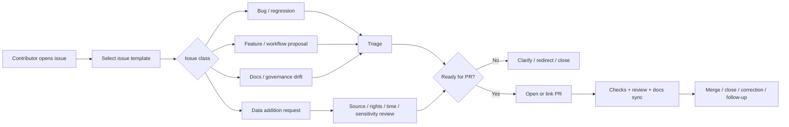

<!-- [KFM_META_BLOCK_V2]
doc_id: kfm://doc/<uuid-NEEDS_VERIFICATION>
title: KFM Issue Template Directory
type: standard
version: v1
status: draft
owners: <owners-NEEDS_VERIFICATION>
created: <YYYY-MM-DD-NEEDS_VERIFICATION>
updated: <YYYY-MM-DD-NEEDS_VERIFICATION>
policy_label: <policy_label-NEEDS_VERIFICATION>
related: [.github/ISSUE_TEMPLATE/, ../PULL_REQUEST_TEMPLATE.md (NEEDS VERIFICATION), ../../docs/ (NEEDS VERIFICATION)]
tags: [kfm]
notes: [Evidence-bounded draft; current-session source review exposed the attached KFM PDF corpus but not a mounted repository tree, so sibling filenames, chooser config, owners, labels, and adjacent paths remain NEEDS VERIFICATION.]
[/KFM_META_BLOCK_V2] -->

# KFM Issue Template Directory

Contributor intake guidance for GitHub issues that should enter Kansas Frontier Matrix through an evidence-first, PR-first workflow.

> [!IMPORTANT]
> This README is intentionally evidence-bounded. The target directory is known, but the current session exposed the attached KFM PDF corpus rather than a mounted repository tree. Exact sibling filenames, chooser configuration, owners, labels, and adjacent repo paths are therefore kept as **NEEDS VERIFICATION** instead of being presented as settled repo fact.

> **Status:** experimental  
> **Owners:** `<owners-NEEDS_VERIFICATION>`  
>       
> **Quick jump:** [Scope](#scope) · [Repo fit](#repo-fit) · [Inputs](#inputs) · [Exclusions](#exclusions) · [Directory tree](#directory-tree) · [Quickstart](#quickstart) · [Usage](#usage) · [Diagram](#diagram) · [Template matrix](#template-matrix) · [Task list](#task-list--definition-of-done) · [FAQ](#faq)

---

## Scope

This directory exists to make issue intake structured, reviewable, and aligned with KFM’s governed documentation and delivery posture.

In practice, that means issue templates here should help contributors submit enough context to:

- describe a problem, proposal, or drift clearly
- preserve source, time, rights, and sensitivity context when those matter
- route substantial work into reviewable pull requests instead of comment-thread improvisation
- keep documentation, policy, and implementation changes visibly connected

### Working status labels used in this README

| Label | Meaning here |
|---|---|
| **CONFIRMED** | Supported by the current attached KFM source corpus used for this draft |
| **INFERRED** | Strongly suggested by current KFM materials, but not directly verified in a mounted repo tree |
| **PROPOSED** | Recommended directory behavior or template pattern aligned to KFM doctrine |
| **UNKNOWN** | Not verified strongly enough in the current session to present as current repo reality |
| **NEEDS VERIFICATION** | Repo-specific path, file, owner, label, or config detail not directly inspected |

## Repo fit

| Item | Value | Status |
|---|---|---|
| Target path | `[.github/ISSUE_TEMPLATE/README.md](./README.md)` | **CONFIRMED** task target |
| Directory role | Contributor-facing GitHub issue intake for KFM | **INFERRED** |
| Upstream flow | GitHub “New issue” chooser → issue template selection → triage | **PROPOSED** |
| Downstream flow | issue → scoped review → pull request → checks / review / docs sync | **PROPOSED** |
| Likely chooser control | `./config.yml` | **NEEDS VERIFICATION** |
| Likely sibling templates | `./*.md` and/or `./*.yml` | **NEEDS VERIFICATION** |
| Likely PR handoff file | [`../PULL_REQUEST_TEMPLATE.md`](../PULL_REQUEST_TEMPLATE.md) | **INFERRED / NEEDS VERIFICATION** |
| Longer-form governed docs | [`../../docs/`](../../docs/) | **INFERRED / NEEDS VERIFICATION** |
| Policy / contract / schema neighbors | `../../policy/`, `../../contracts/`, `../../schemas/` | **INFERRED / NEEDS VERIFICATION** |

## Inputs

The following content belongs here:

| Accepted input | What it should capture | Status |
|---|---|---|
| Bug / regression reports | expected vs actual behavior, affected surface, reproduction clues, evidence links, screenshots or logs where safe | **PROPOSED** |
| Feature or workflow proposals | goal, user lane, affected subsystem, acceptance criteria, risks, documentation impact | **PROPOSED** |
| Data addition requests | source identity, license/rights posture, temporal coverage, spatial scope, intended use, sensitivity notes | **INFERRED** |
| Documentation / governance drift reports | affected path or surface, observed mismatch, supporting evidence, review urgency | **PROPOSED** |

### Why these inputs matter

KFM treats documentation as a production surface and review as part of governed delivery. Intake quality therefore matters early. A vague issue becomes review drift; a structured issue becomes a usable entry point into policy, documentation, testing, and implementation work.

## Exclusions

The following content does **not** belong in this directory:

| Exclusion | Why it does not belong here | Put it here instead |
|---|---|---|
| Pull request review checklists | PR review happens after issue intake | `../PULL_REQUEST_TEMPLATE.md` (**NEEDS VERIFICATION**) |
| Private security disclosures | Public issue threads are the wrong place for sensitive reporting | `../SECURITY.md` or project disclosure channel (**NEEDS VERIFICATION**) |
| Canonical policy / schema definitions | Templates should reference rules, not replace them | `../../policy/`, `../../contracts/`, `../../schemas/` (**NEEDS VERIFICATION**) |
| Long-form runbooks, ADRs, and architecture docs | Those are governed documents, not intake forms | `../../docs/` (**NEEDS VERIFICATION**) |
| Sensitive coordinates, restricted locations, or rights-unclear raw material | Public issue intake must not become a leak path | stewarded review path (**NEEDS VERIFICATION**) |

> [!CAUTION]
> Do not use public issue templates to submit exact restricted locations, rights-unclear source files, credentials, or confidential review material. Public issue intake should capture enough detail to route work safely, not bypass stewardship, policy, or quarantine behavior.

## Directory tree

Expected reviewable shape for this directory:

```text
.github/
└── ISSUE_TEMPLATE/
    ├── README.md                           # this file
    ├── bug_report.(md|yml)                 # NEEDS VERIFICATION
    ├── feature_request.(md|yml)            # NEEDS VERIFICATION
    ├── data_addition_request.(md|yml)      # INFERRED / NEEDS VERIFICATION
    ├── docs_governance_drift.(md|yml)      # PROPOSED
    └── config.yml                          # NEEDS VERIFICATION
```

The tree above is a **directory contract draft**, not a claim that every file already exists.

## Quickstart

1. Start with the smallest issue type that matches the contributor’s intent.
2. Keep the template focused on intake, not full implementation design.
3. Require fields that preserve KFM context when it matters: source, time basis, rights, sensitivity, and acceptance criteria.
4. Route substantial work from issue discussion into a reviewable pull request rather than solving it inside comments.
5. Update this README whenever template classes, chooser behavior, or contributor gates change.

### Illustrative issue-form fragment

```yaml
# Illustrative only — exact filenames, labels, and field set NEEDS VERIFICATION
name: Data Addition Request
description: Propose a new source or dataset for governed onboarding
title: "[data-addition] "
labels:
  - data
  - intake

body:
  - type: input
    id: source_name
    attributes:
      label: Source name
      placeholder: Kansas Historical Society / USGS / county GIS / archive collection
    validations:
      required: true

  - type: input
    id: source_url
    attributes:
      label: Source URL or catalog reference
    validations:
      required: true

  - type: textarea
    id: temporal_coverage
    attributes:
      label: Temporal coverage
      description: What dates or time span does this source cover?
    validations:
      required: true

  - type: input
    id: rights_license
    attributes:
      label: Rights / license / agreement posture
      placeholder: public domain, CC-BY, restricted, unknown
    validations:
      required: true

  - type: textarea
    id: sensitivity_notes
    attributes:
      label: Sensitivity or stewardship notes
      description: Include location sensitivity, privacy, archival restrictions, or uncertainty.
```

> [!NOTE]
> A Markdown template (`.md`) and an issue-form template (`.yml`) can both serve this directory’s job. The repo’s actual choice is **NEEDS VERIFICATION**.

## Usage

### Intake flow

1. A contributor opens a new issue and selects the closest template.
2. The template gathers just enough structure to keep the request reviewable.
3. Triage decides whether the issue is:
   - ready for implementation work
   - missing required evidence or scope
   - out of scope for public issue intake
   - better handled as policy, security, or stewardship review
4. Substantial changes move into a pull request with checks, review, and documentation updates in the same governed stream.

### Reporter guidance

Use this directory when you need to:

- report a defect in a KFM-facing surface or workflow
- propose a new capability or refinement
- request governed onboarding of a dataset or source family
- flag drift between documented behavior and observed behavior

Do **not** use this directory as a substitute for:

- formal release approval
- schema or policy definition
- restricted-source submission
- ad hoc chat-based triage without a review trail

## Diagram


```mermaid
flowchart LR
    A[Contributor opens issue] --> B[Select issue template]
    B --> C{Issue class}

    C --> D[Bug / regression]
    C --> E[Feature / workflow proposal]
    C --> F[Data addition request]
    C --> G[Docs / governance drift]

    D --> H[Triage]
    E --> H
    G --> H
    F --> I[Source / rights / time / sensitivity review]

    H --> J{Ready for PR?}
    I --> J

    J -- No --> K[Clarify / redirect / close]
    J -- Yes --> L[Open or link PR]

    L --> M[Checks + review + docs sync]
    M --> N[Merge / close / correction / follow-up]
```

## Template matrix

| Template lane | Use when | Minimum fields | Why it matters | Status |
|---|---|---|---|---|
| Bug / regression | Something no longer behaves as expected | summary, expected vs actual, affected surface, reproduction clues, evidence or log links | Keeps defects concrete and reviewable | **PROPOSED** |
| Feature / workflow proposal | A contributor wants a new capability, refinement, or delivery improvement | goal, audience lane, constraints, acceptance criteria, documentation impact | Prevents feature requests from staying vague | **PROPOSED** |
| Data addition request | A source or dataset should enter governed onboarding | source info, rights/license, temporal coverage, spatial scope, intended use, sensitivity notes | Aligns intake with evidence-first source onboarding | **INFERRED** |
| Docs / governance drift | Documented behavior and observed behavior no longer match | affected path, mismatch summary, evidence, severity, review need | Treats docs as part of the working system | **PROPOSED** |

## Task list & Definition of Done

A healthy issue-template directory should meet all of the following:

- [ ] Each public issue type captures enough information to route work without guessing.
- [ ] Data-oriented intake asks for source identity, rights/license posture, and temporal coverage.
- [ ] Public templates avoid prompting contributors to paste restricted locations or sensitive raw material.
- [ ] Issue intake points toward pull-request review instead of replacing it.
- [ ] Security-sensitive reports are redirected away from public issue threads.
- [ ] Documentation updates are expected when contributor workflow changes.
- [ ] This README matches the actual files present in `.github/ISSUE_TEMPLATE/`.
- [ ] Any chooser config, labels, owners, and handoff links referenced here are verified against the mounted repo.
- [ ] Behavior-significant contributor-workflow changes are updated in the same governed stream as docs, templates, and review expectations.

## FAQ

### Why call out source, license, and temporal coverage so early?

Because KFM treats intake as a governed step, not a casual upload. If a proposed source cannot be described in terms of identity, rights, and time basis, it is not ready for clean onboarding.

### Why is this README so explicit about **NEEDS VERIFICATION**?

Because the current session did not expose a mounted repository tree. This file is meant to be honest and commit-friendly, not persuasive by omission.

### Should security issues go here?

No. Public issue intake is the wrong place for sensitive disclosures. Route them through the project’s security policy or private disclosure path once verified.

### Does this directory replace pull request templates?

No. It should feed into them. Issue templates structure intake; pull request templates structure implementation review and merge readiness.

## Appendix

<details>
<summary>Appendix — evidence-bounded drafting notes</summary>

### Confirmed drafting principles carried into this README

- KFM documentation is treated as part of the governed system, not as decoration.
- KFM’s collaboration posture is PR-first, with merge-blocking checks rather than advisory review.
- Product surfaces and contributor-facing touchpoints are part of the trust model.
- Public-facing behavior should fail closed when evidence, rights, review, or release state are incomplete.

### Inferred or historical contributor-workflow patterns reflected here

- `.github/ISSUE_TEMPLATE/` and `PULL_REQUEST_TEMPLATE.md` are part of the project’s collaboration model.
- A **Data Addition Request** issue type is project-aligned and historically described as useful for collecting source identity, license posture, and temporal coverage.
- Repo inventories in supporting documentation suggest `.github/`, `docs/`, `contracts/`, `policy/`, and related governed paths, but those were not directly re-verified in the current session.

### Explicit unknowns left visible on purpose

- exact issue-template filenames
- whether the repo currently uses Markdown templates, issue forms, or both
- current labels, assignees, owners, and chooser configuration
- existence and wording of `SECURITY.md`
- exact adjacency to the mounted pull request template and contributor docs

</details>

[Back to top](#kfm-issue-template-directory)