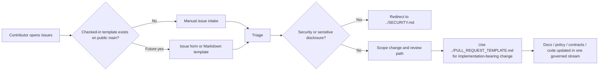

<!-- [KFM_META_BLOCK_V2]
doc_id: kfm://doc/<uuid-NEEDS_VERIFICATION>
title: KFM Issue Template Directory
type: standard
version: v1
status: draft
owners: @bartytime4life
created: <YYYY-MM-DD-NEEDS_VERIFICATION>
updated: <YYYY-MM-DD-NEEDS_VERIFICATION>
policy_label: <policy_label-NEEDS_VERIFICATION>
related: [./config.yml, ../README.md, ../PULL_REQUEST_TEMPLATE.md, ../SECURITY.md, ../../SECURITY.md, ../../CONTRIBUTING.md, ../../docs/, ../../policy/, ../../contracts/, ../../schemas/]
tags: [kfm, github, contributor-intake, governance]
notes: [Public-main-grounded revision; current public tree confirms README.md plus zero-byte config.yml only inside .github/ISSUE_TEMPLATE; root SECURITY.md still needs explicit delegation or text alignment with .github/SECURITY.md; doc UUID, created/updated dates, and policy label still need merge-time verification.]
[/KFM_META_BLOCK_V2] -->

# KFM Issue Template Directory

Current public guidance for contributor issue intake inside KFM’s `.github` gatehouse.

> **Status:** experimental directory · draft README revision  
> **Owners:** `@bartytime4life` *(current public `CODEOWNERS` coverage for `/.github/`)*  
>        
> **Repo fit:** `.github/ISSUE_TEMPLATE/README.md`  
> **Upstream:** [`../README.md`](../README.md) · [`../../CONTRIBUTING.md`](../../CONTRIBUTING.md) · [`../SECURITY.md`](../SECURITY.md)  
> **Downstream:** GitHub issue creation UI via [`./config.yml`](./config.yml) · issue triage · [`../PULL_REQUEST_TEMPLATE.md`](../PULL_REQUEST_TEMPLATE.md) · [`../../docs/`](../../docs/) · [`../../policy/`](../../policy/) · [`../../contracts/`](../../contracts/) · [`../../schemas/`](../../schemas/)  
> **Quick jump:** [Scope](#scope) · [Repo fit](#repo-fit) · [Inputs](#inputs) · [Exclusions](#exclusions) · [Directory tree](#directory-tree) · [Quickstart](#quickstart) · [Usage](#usage) · [Diagram](#diagram) · [Tables](#current-public-inventory--proposed-template-pack) · [Task list](#task-list--definition-of-done) · [FAQ](#faq) · [Appendix](#appendix)

> [!IMPORTANT]
> Current public `main` shows `.github/ISSUE_TEMPLATE/` containing **only** `README.md` and `config.yml`. No checked-in Markdown issue templates or YAML issue forms are visible in this directory on public `main`, and `config.yml` is currently a zero-byte placeholder.

> [!NOTE]
> This README is public-tree-grounded. It documents the checked-in directory honestly, but it does not claim GitHub platform settings, labels, assignees, required checks, private issue-management features, or chooser behavior that cannot be proven from public repo contents alone.

## Scope

`.github/ISSUE_TEMPLATE/` is KFM’s repo-local issue-intake lane.

Right now, that lane is intentionally thin: documentation plus a chooser/config seam, not a populated library of checked-in issue forms. Its job is still important. This is where contributor intake should become structured enough to protect review quality, evidence handling, and security routing before work widens into policy, contracts, runtime changes, or public-facing consequence.

### Truth posture used in this README

| Label | Use in this README |
|---|---|
| **CONFIRMED** | Directly supported by the current public repo tree, current public repo Markdown, or attached KFM doctrine |
| **INFERRED** | Conservative interpretation that follows from confirmed repo/doctrine evidence |
| **PROPOSED** | Recommended future template or chooser behavior not yet proven as checked-in on public `main` |
| **UNKNOWN** | Not established strongly enough to present as current repo or GitHub-platform fact |
| **NEEDS VERIFICATION** | Merge-time placeholder for IDs, dates, labels, owners beyond current public evidence, or platform settings |

[Back to top](#kfm-issue-template-directory)

## Repo fit

| Item | Current reading | Status |
|---|---|---|
| Path | `.github/ISSUE_TEMPLATE/README.md` | **CONFIRMED** |
| Current directory inventory | `README.md`, `config.yml` | **CONFIRMED** |
| Chooser/config surface | `./config.yml` exists, but is empty on public `main` | **CONFIRMED** |
| Checked-in issue forms (`*.yml`) | none visible in this directory on public `main` | **CONFIRMED** |
| Checked-in Markdown issue templates (`*.md`) | none visible besides this README | **CONFIRMED** |
| Adjacent PR handoff | [`../PULL_REQUEST_TEMPLATE.md`](../PULL_REQUEST_TEMPLATE.md) | **CONFIRMED** |
| Canonical public security redirect | route sensitive disclosure to [`../SECURITY.md`](../SECURITY.md) | **CONFIRMED** |
| Root security doc | [`../../SECURITY.md`](../../SECURITY.md) also exists, but the two current public security-policy files are not yet fully aligned; keep issue-intake routing anchored to [`../SECURITY.md`](../SECURITY.md) until delegation is explicit | **CONFIRMED** |
| Broader contribution rulebook | [`../../CONTRIBUTING.md`](../../CONTRIBUTING.md) | **CONFIRMED** |
| Broader doctrine / doc surfaces | [`../../docs/`](../../docs/), [`../../contracts/`](../../contracts/), [`../../policy/`](../../policy/), [`../../schemas/`](../../schemas/) | **CONFIRMED** path presence |
| GitHub issue labels, assignees, blank-issue behavior, platform-side chooser settings | not provable from public checked-in files alone | **UNKNOWN / NEEDS VERIFICATION** |

### Why this directory exists even in a minimal state

A minimal issue-template directory still matters because it names the seam where KFM expects contributor intake to become review-bearing rather than improvised. In KFM terms, intake is not separate from governance. It is part of the same trust membrane that later shows up in PR review, policy gates, docs sync, disclosure flow, and correction readiness.

[Back to top](#kfm-issue-template-directory)

## Inputs

Accepted inputs for this directory:

| Input class | What belongs here | Status |
|---|---|---|
| Directory README | contributor-intake guidance, routing rules, evidence posture, security redirect, future template conventions | **CONFIRMED** |
| Chooser/config file | `config.yml` controlling or documenting GitHub issue-creation behavior | **CONFIRMED** file presence |
| Future issue templates | checked-in YAML issue forms or Markdown issue templates when the repo is ready to expose them | **PROPOSED** |
| Public-safe intake rules | required fields or prompts that gather enough context for triage without soliciting secrets or restricted detail | **INFERRED / PROPOSED** |

### What future templates should ask for

When this directory grows beyond its current minimal state, template fields should stay small and triage-critical:

- what changed or went wrong
- what repo surface or behavior is affected
- what evidence, logs, links, or screenshots are safe to share
- whether docs, policy, contracts, or security routing are implicated
- what should be redirected to private handling instead of public issue text

[Back to top](#kfm-issue-template-directory)

## Exclusions

What does **not** belong here as canonical truth:

| Exclusion | Keep it here instead |
|---|---|
| Pull-request review checklist or merge-readiness contract | [`../PULL_REQUEST_TEMPLATE.md`](../PULL_REQUEST_TEMPLATE.md) |
| Private vulnerability reporting, disclosure workflow, coordinated security guidance | [`../SECURITY.md`](../SECURITY.md) |
| Canonical policy bodies, reason codes, obligation registries, policy tests | [`../../policy/`](../../policy/) |
| Canonical schemas, envelopes, machine-readable contracts, vocabularies | [`../../contracts/`](../../contracts/) and [`../../schemas/`](../../schemas/) |
| Runtime code, UI code, evidence resolvers, data loaders, automation logic | repo app/package/script surfaces, not `.github/ISSUE_TEMPLATE/` |
| Secrets, tokens, unpublished review material, exact restricted coordinates, rights-unclear raw files | never in public issue intake; route through stewarded or private paths |

> [!CAUTION]
> Public issue intake should capture enough detail to route work safely, not enough detail to leak secrets, disclose unpublished material, or bypass KFM’s review and stewardship controls.

[Back to top](#kfm-issue-template-directory)

## Directory tree

Current public `main`:

```text
.github/
└── ISSUE_TEMPLATE/
    ├── README.md
    └── config.yml   # present, zero-byte placeholder on current public main
```

There are **no** additional checked-in issue templates or issue forms visible in this directory on current public `main`.

[Back to top](#kfm-issue-template-directory)

## Quickstart

### Contributor path — current public state

1. Open the repo’s issue flow from GitHub.
2. Do not assume a checked-in issue form exists in this directory just because `ISSUE_TEMPLATE/` exists.
3. Include the essentials manually: summary, affected repo surface, safe evidence links, expected vs actual behavior, and whether docs, policy, or security are involved.
4. If the report is security-sensitive or disclosure-sensitive, stop and use [`../SECURITY.md`](../SECURITY.md) instead of a public issue.
5. When the work becomes implementation-bearing, carry it into [`../PULL_REQUEST_TEMPLATE.md`](../PULL_REQUEST_TEMPLATE.md).

### Maintainer path — when adding the first real templates

1. Decide whether the repo should use YAML issue forms, Markdown templates, or both.
2. Replace the empty [`./config.yml`](./config.yml) with explicit chooser behavior.
3. Keep public templates triage-focused and public-safe.
4. Update this README, the PR template, and security/disclosure guidance in the same change set when intake behavior changes.
5. Verify the actual GitHub issue-creation UX after merge; checked-in files do not prove platform behavior by themselves.

### Illustrative manual issue skeleton

```md
## Summary
What is the problem, proposal, or drift?

## Affected surface
Which path, package, workflow, doc, policy, or UI surface is involved?

## Evidence
Safe links, logs, screenshots, repro steps, or related docs.

## Expected vs actual
What should happen? What is happening instead?

## Governance notes
Docs impact, policy impact, contract impact, or security redirect needed?
```

[Back to top](#kfm-issue-template-directory)

## Usage

### Current public behavior

The current checked-in directory does **not** yet define specific issue classes in code. That means this README should describe the lane honestly:

- there is a directory
- there is a config seam
- there are no visible checked-in issue forms/templates beyond this README
- structured intake is still more of a documented contract than a fully materialized chooser/template pack on public `main`

### Design rules for future template additions

When templates are added here, keep them aligned with KFM’s repo-wide contribution and review posture:

| Rule | Why it matters |
|---|---|
| Ask only for triage-critical information | issue intake should structure work, not replace design docs or PR review |
| Keep security-sensitive paths out of public issues | sensitive routing already has a dedicated surface |
| Link changes forward into PR review | KFM is PR-first for behavior-significant change |
| Treat docs as part of the working system | intake changes should update adjacent guidance in the same stream |
| Preserve KFM truth labels where uncertainty matters | contributor guidance should not pretend unknown platform state is confirmed |

### Suggested first template lanes

These are **PROPOSED**, not current checked-in files:

- bug / regression
- docs / governance drift
- feature / workflow proposal
- data or source-onboarding request, only if public-safe and stewarded enough for issue intake

[Back to top](#kfm-issue-template-directory)

## Diagram


```mermaid
flowchart LR
    A[Contributor opens Issues] --> B{Checked-in template exists on public main?}

    B -- No --> C[Manual issue intake]
    B -- Future yes --> D[Issue form or Markdown template]

    C --> E[Triage]
    D --> E

    E --> F{Security or sensitive disclosure?}
    F -- Yes --> G[Redirect to ../SECURITY.md]
    F -- No --> H[Scope change and review path]

    H --> I[Use ../PULL_REQUEST_TEMPLATE.md for implementation-bearing change]
    I --> J[Docs / policy / contracts / code updated in one governed stream]
```

[Back to top](#kfm-issue-template-directory)

## Current public inventory & proposed template pack

### Current public inventory

| Item | What it tells us | Status |
|---|---|---|
| `README.md` | this directory is documented, not absent | **CONFIRMED** |
| `config.yml` | GitHub chooser/config seam exists as a checked-in file | **CONFIRMED** |
| empty `config.yml` | chooser behavior is not materially defined by checked-in content yet | **CONFIRMED** |
| no `*.yml` issue forms visible | public template library is not yet checked in here | **CONFIRMED** |
| no extra `*.md` templates visible | README is currently the only Markdown file in this directory | **CONFIRMED** |

### Proposed first template pack

| Proposed lane | Suggested file | Why it is a reasonable first addition | Status |
|---|---|---|---|
| Bug / regression | `bug_report.yml` | gives defects a repeatable intake shape | **PROPOSED** |
| Docs / governance drift | `docs_governance_drift.yml` | lets contributors flag mismatch between checked-in guidance and observed repo behavior | **PROPOSED** |
| Feature / workflow proposal | `feature_request.yml` | keeps proposals tied to affected surfaces and downstream docs/PR review | **PROPOSED** |
| Public-safe data/source intake | `data_addition_request.yml` | matches KFM’s source-onboarding-as-contract doctrine, but only if the lane is safe for public issue intake | **PROPOSED / lane-sensitive** |

[Back to top](#kfm-issue-template-directory)

## Task list & Definition of Done

A healthy issue-template directory for this repo should meet all of the following:

- [x] The directory README exists.
- [x] The chooser/config file exists.
- [x] This README reflects the current public `main` inventory instead of a hypothetical template pack.
- [ ] `config.yml` is made explicit rather than empty.
- [ ] The repo decides whether it wants YAML issue forms, Markdown issue templates, or a deliberately minimal manual issue flow.
- [ ] Any future public template pack is wired to redirect sensitive/security reports to [`../SECURITY.md`](../SECURITY.md).
- [ ] Any future public template pack points implementation-bearing changes toward [`../PULL_REQUEST_TEMPLATE.md`](../PULL_REQUEST_TEMPLATE.md).
- [ ] Root [`../../SECURITY.md`](../../SECURITY.md) explicitly delegates to [`../SECURITY.md`](../SECURITY.md), or the two public security-policy files are otherwise text-aligned enough that issue-intake routing cannot drift.
- [ ] Labels, assignees, blank-issue posture, and chooser behavior are verified on the live GitHub side before this README is treated as fully settled.
- [ ] Owners, dates, and policy label in the meta block are finalized at merge time.

[Back to top](#kfm-issue-template-directory)

## FAQ

### Why does this directory exist if it only has two files?

Because the issue-intake seam is real even before the full template library exists. In KFM, documentation, routing, and review boundaries are part of the system, not decoration.

### Does `config.yml` prove the GitHub issue chooser is fully configured?

No. It proves the checked-in config file exists. It does **not** prove the chooser is materially configured when the file is empty, or that any platform-side behavior matches future expectations.

### Where should sensitive reports go?

Use [`../SECURITY.md`](../SECURITY.md), not a public issue.

### Does this directory replace the PR template?

No. Issues shape intake. [`../PULL_REQUEST_TEMPLATE.md`](../PULL_REQUEST_TEMPLATE.md) shapes implementation review and merge-readiness.

### Why are the future template filenames marked as proposed?

Because no such files are currently visible in this directory on public `main`. This README should not turn a reasonable design direction into false checked-in fact.

[Back to top](#kfm-issue-template-directory)

## Appendix

<details>
<summary>Appendix A — evidence boundary and revision rationale</summary>

This revision intentionally keeps the directory tree anchored to the **actual current public-main tree**.

That produces four concrete improvements:

1. owner coverage is no longer blank at the README surface
2. adjacent PR and security paths are no longer treated as hypothetical
3. template filenames that are not checked in stay out of the directory tree and remain a clearly marked proposed pack
4. root-versus-`.github` security-policy drift is named as an open coordination item instead of being treated as already resolved

</details>

<details>
<summary>Appendix B — merge-time verification checklist</summary>

Before merge, verify the following repo/platform details that public file inspection alone cannot settle:

- issue chooser behavior in the live GitHub UI
- blank-issue posture
- labels and default assignees
- whether zero-byte `config.yml` is intentional or accidental
- whether `.github/SECURITY.md` remains canonical and root `SECURITY.md` delegates explicitly
- doc UUID, created date, updated date, and policy label for the meta block

</details>

[Back to top](#kfm-issue-template-directory)
