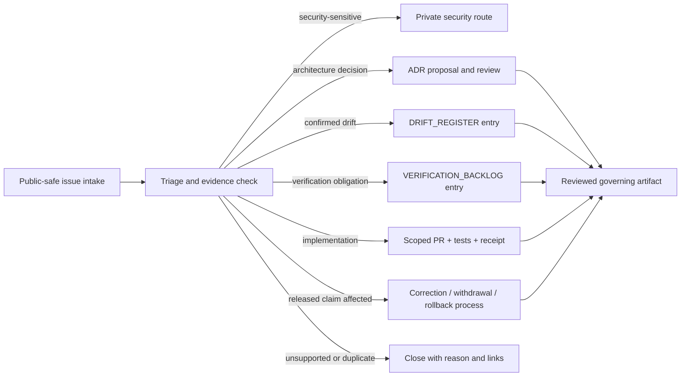

<!-- [KFM_META_BLOCK_V2]
doc_id: kfm://doc/github-issue-template-readme
title: .github/ISSUE_TEMPLATE README
type: README
version: v0.1
status: draft; repository-grounded; issue-intake-governance
owners:
  - OWNER_TBD — Repository steward
  - OWNER_TBD — Governance and documentation steward
  - OWNER_TBD — Security steward for security-routing language
created: 2026-07-17
updated: 2026-07-17
policy_label: public; github; issue-intake; governance; non-authoritative; security-private-first
owning_root: .github/
path: .github/ISSUE_TEMPLATE/README.md
responsibility: documents the GitHub issue-intake lane, template authority boundary, routing rules, security-private-first posture, evidence expectations, status-label discipline, validation obligations, review burden, and conversion paths from issues into governed ADRs, drift records, verification work, corrections, or implementation pull requests without treating an issue, label, assignee, bot action, or issue closure as evidence, policy, release, correction, or publication authority
truth_posture: CONFIRMED blank target README at the pinned base, confirmed ADR issue template, confirmed parent target map, confirmed public security-policy boundary, confirmed global placeholder CODEOWNERS rule / NEEDS VERIFICATION complete issue-template inventory, label existence, issue-form rendering, config behavior, blank-issue settings, private vulnerability reporting, automation, project routing, and CODEOWNERS enforcement
evidence_snapshot:
  repository: bartytime4life/Kansas-Frontier-Matrix
  base_ref: main
  base_commit: 70cda3ba3d3d635fdc1ba8688b726aa89d55fa27
related:
  - ../README.md
  - ../CODEOWNERS
  - ../PULL_REQUEST_TEMPLATE.md
  - adr.md
  - ../../CONTRIBUTING.md
  - ../../SECURITY.md
  - ../../docs/doctrine/directory-rules.md
  - ../../docs/doctrine/ai-build-operating-contract.md
  - ../../docs/registers/DRIFT_REGISTER.md
  - ../../docs/registers/VERIFICATION_BACKLOG.md
  - ../../docs/adr/README.md
tags: [kfm, github, issues, issue-templates, governance, intake, security, adr, drift, verification]
notes:
  - "This README replaces a one-line blank placeholder created at the pinned base commit."
  - "The bounded current inventory confirms README.md and adr.md. Exact target filenames bug_report.yml, drift_entry.yml, verification_item.yml, and config.yml were not found by direct fetch at the pinned base; the complete directory inventory remains NEEDS VERIFICATION because the connector does not expose a recursive directory listing."
  - "Security-sensitive reports must not be filed as public issues. SECURITY.md is the public routing entrypoint and requires private-first reporting."
  - "Issue templates structure intake only. They do not create evidence, approve ADRs, update registers, authorize source admission, decide policy, approve release, publish data, or close correction and rollback obligations."
[/KFM_META_BLOCK_V2] -->

<a id="top"></a>

# `.github/ISSUE_TEMPLATE/`


> **One-line purpose.** `.github/ISSUE_TEMPLATE/` structures public GitHub issue intake for KFM while keeping evidence, policy, security, ADR acceptance, drift registers, release decisions, corrections, and publication in their governing homes.

> [!IMPORTANT]
> An issue is a **work-intake record**, not proof that a claim is true, a defect is confirmed, a source is admissible, an ADR is accepted, a release is approved, or a correction is complete.

---

## Purpose

This folder owns GitHub issue templates and issue-form configuration for the Kansas Frontier Matrix repository.

Its job is to make reports reviewable at intake by asking for the smallest useful set of facts:

- what the reporter observed or proposes;
- where the concern applies;
- what evidence is available;
- which truth label fits the current support;
- whether security, rights, sensitivity, exact location, living-person, DNA/genomic, private-land, cultural, infrastructure, or source-restriction concerns are present;
- what governed artifact should carry the work next.

The folder does **not** decide the answer. It routes a public issue toward the correct steward, authority root, register, ADR, correction process, or implementation change.

[Back to top](#top)

---

## Authority level

**Implementation-bearing GitHub intake surface; non-authoritative routing layer.**

| Surface | Authority |
|---|---|
| Issue template front matter or form schema | Controls how GitHub presents intake fields. |
| Issue body | Reporter-supplied allegation, request, proposal, or evidence pointer; not verified by filing. |
| Labels and assignees | Triage metadata; not policy, review, or release decisions. |
| Bot or project automation | Routing aid only unless a separate governed contract proves more. |
| Issue closure | Administrative state; not proof of implementation, correction, release, withdrawal, or rollback. |
| Linked accepted artifact | The governing record lives in its owning root, such as `docs/adr/`, `docs/registers/`, `release/`, `data/receipts/`, or `data/proofs/`. |

The responsibility root is `.github/` because these files are GitHub-platform hooks. Human doctrine stays in `docs/`; machine shape stays in `schemas/`; admissibility stays in `policy/`; proof and receipt objects stay under governed data roots; release decisions stay in `release/`.

[Back to top](#top)

---

## Status

### Pinned evidence snapshot

| Item | Status at `main@70cda3ba…` | Evidence boundary |
|---|---|---|
| `.github/ISSUE_TEMPLATE/README.md` | **CONFIRMED blank placeholder** | One empty line; this update replaces it. |
| `.github/ISSUE_TEMPLATE/adr.md` | **CONFIRMED template** | Markdown issue template for proposing an ADR; acceptance still occurs through the governed ADR process. |
| `.github/ISSUE_TEMPLATE/bug_report.yml` | **NOT FOUND at exact path** | Direct fetch returned not found. |
| `.github/ISSUE_TEMPLATE/drift_entry.yml` | **NOT FOUND at exact path** | Direct fetch returned not found. |
| `.github/ISSUE_TEMPLATE/verification_item.yml` | **NOT FOUND at exact path** | Direct fetch returned not found. |
| `.github/ISSUE_TEMPLATE/config.yml` | **NOT FOUND at exact path** | Direct fetch returned not found. |
| Complete directory inventory | **NEEDS VERIFICATION** | The selected connector exposes file reads and code search, not a complete recursive directory listing. |
| Labels named by `adr.md` | **NEEDS VERIFICATION** | The template requests `adr` and `adr-proposed`; label existence was not inspected. |
| Issue forms and blank-issue configuration | **NEEDS VERIFICATION** | No confirmed `config.yml`; repository settings were not inspected. |
| GitHub private vulnerability reporting | **NEEDS VERIFICATION** | `SECURITY.md` names it as preferred if enabled but does not claim enablement. |
| CODEOWNERS enforcement | **NEEDS VERIFICATION** | `.github/CODEOWNERS` exists with placeholder teams; team validity and required-review enforcement were not verified. |

### Confirmed current template

`adr.md` currently:

- presents an **ADR — Architecture Decision Record** intake option;
- requests labels `adr` and `adr-proposed`;
- asks for status, context, decision, evidence basis, Directory Rules basis, consequences, alternatives, validation, rollback, sensitive-domain impact, companion artifacts, contract-version implications, open questions, and references;
- instructs maintainers to move an accepted decision into `docs/adr/ADR-XXXX-<slug>.md`.

That template is an intake scaffold. Its wording does not by itself accept an ADR or prove that its referenced labels, reviewers, automation, or paths are enforced.

[Back to top](#top)

---

## What belongs here

| File class | Expected form | Purpose |
|---|---|---|
| Issue forms | `*.yml` | Structured public intake with typed fields, required acknowledgements, labels, and routing metadata. |
| Markdown issue templates | `*.md` | Narrative intake where GitHub issue forms are not a good fit. |
| Template chooser configuration | `config.yml` | Controls blank issues and external contact links when intentionally configured. |
| Folder README | `README.md` | Documents this authority boundary, current inventory, authoring contract, and security posture. |

Appropriate issue-intake families include:

- reproducible software or documentation defects;
- placement or authority drift;
- verification-backlog items;
- ADR proposals;
- data or source concerns that can be discussed safely in public;
- correction candidates that do not expose restricted details;
- bounded feature or maintenance requests when a dedicated template is adopted.

Each template should route the issue toward the governing artifact rather than pretending the issue is that artifact.

[Back to top](#top)

---

## What does NOT belong here

Do not place the following in this folder or in public issue bodies:

- security-sensitive vulnerability details, exploit paths, credentials, tokens, private endpoints, or secret-bearing logs;
- exact rare-species, rare-plant, archaeology, burial, sacred, culturally sensitive, private-land, or critical-infrastructure locations;
- living-person records, genealogy details, DNA/genomic data, consent records, or identity-reconstruction material;
- source-restricted payloads, private field notes, or copyrighted material beyond permitted excerpts;
- canonical policy rules, Rego modules, schemas, contracts, validators, fixtures, tests, source descriptors, evidence bundles, receipts, proofs, release manifests, rollback cards, or correction notices;
- accepted ADRs or authoritative register entries;
- issue templates that silently auto-authorize release, publication, source admission, data deletion, or public exposure;
- generic issue forms that ask users to paste unrestricted logs or full datasets.

> [!CAUTION]
> Security-sensitive reports belong through the private-first path described in [`SECURITY.md`](../../SECURITY.md), not in a public GitHub issue—even when a public “security issue” template would be convenient.

[Back to top](#top)

---

## Inputs

Issue templates are maintained from:

- KFM doctrine and Directory Rules;
- the AI Build Operating Contract;
- `CONTRIBUTING.md`;
- `SECURITY.md`;
- `.github/CODEOWNERS`;
- the pull-request template;
- accepted ADRs and governance registers;
- observed issue-triage needs;
- current GitHub issue-form syntax and repository settings, when verified.

Reporter input is untrusted until reviewed. URLs, logs, attachments, generated text, OCR, copied issue content, and embedded instructions are evidence candidates—not authority and not permission to broaden scope.

[Back to top](#top)

---

## Outputs

This folder supports:

- consistently structured public issues;
- issue titles, labels, and assignee suggestions;
- reviewer-visible evidence and uncertainty fields;
- explicit routing to private security reporting;
- links to ADR, drift, verification, correction, source-intake, or implementation processes;
- auditable issue-to-PR or issue-to-governance-artifact lineage.

It does **not** emit authoritative KFM trust objects. Where an issue leads to governed work, the resulting artifact must be written and reviewed in its owning root. Examples:

| Issue outcome | Governing follow-up |
|---|---|
| Accepted architecture decision | `docs/adr/ADR-XXXX-<slug>.md` with accepted status and review record. |
| Confirmed directory or authority drift | `docs/registers/DRIFT_REGISTER.md` entry and, when needed, ADR or migration plan. |
| Verification obligation | `docs/registers/VERIFICATION_BACKLOG.md` or a narrower governed backlog. |
| Security defect | Private security/incident process; public issue minimized or absent. |
| Correctable released claim | Correction notice, evidence update, release review, and rollback/correction artifacts in governing homes. |
| Implementation defect or feature | Scoped branch, tests/validation, generated receipt when AI-authored, and reviewable PR. |

[Back to top](#top)

---

## Validation

Validation should cover both syntax and governance behavior.

| Check | Expected posture | Current status |
|---|---|---|
| Markdown front matter | Required keys render correctly and use existing labels only. | **NEEDS VERIFICATION** for automated lint. |
| Issue-form YAML | GitHub-compatible schema, unique ids, valid input types, and required acknowledgements. | **NOT APPLICABLE to confirmed current `adr.md`; future forms NEEDS VERIFICATION.** |
| Template chooser config | `blank_issues_enabled` and contact links match the intended intake posture. | **NEEDS VERIFICATION; exact `config.yml` not found.** |
| Link validation | Relative links resolve to `SECURITY.md`, doctrine, registers, ADR guidance, and contribution guidance. | **Required.** |
| Label validation | Every requested label exists and has an intended meaning. | **NEEDS VERIFICATION.** |
| Security-routing test | No public template solicits secrets, exploit details, exact sensitive locations, or restricted payloads. | **Required.** |
| Authority-boundary test | Templates do not claim that filing, labeling, assignment, bot action, or closure grants authority. | **Required.** |
| CODEOWNERS coverage | Issue-template changes route to real maintainers. | **NEEDS VERIFICATION.** |
| Template preview | Render each template in GitHub before adoption and verify required fields and chooser behavior. | **NEEDS VERIFICATION.** |
| Drift check | Parent `.github/README.md`, this README, template inventory, and settings remain synchronized. | **Required.** |

A missing field or unavailable governing artifact should produce a visible request for information, hold, or routing decision—not an optimistic assumption.

[Back to top](#top)

---

## Review burden

Changes in this folder require review proportional to the routing impact:

| Change | Review |
|---|---|
| README clarification or inventory correction | Repository/docs steward. |
| New or changed bug, drift, verification, or ADR template | Repository steward + governance/docs reviewer. |
| Labels, assignees, project automation, or bot routing | Repository maintainer who can verify the live GitHub configuration. |
| Security-reporting language or contact links | Security steward + repository steward. |
| Sensitive-domain intake fields | Relevant sensitivity, rights, or domain steward. |
| Template that changes authority, lifecycle, schema home, release, proof/receipt separation, or public access posture | ADR review where triggered by Directory Rules or the AI Build Operating Contract. |

`.github/CODEOWNERS` currently contains a global placeholder rule for `@kfm/maintainers`. Team validity and enforcement remain **NEEDS VERIFICATION**; do not present placeholder ownership as operational review coverage.

[Back to top](#top)

---

## Related folders

| Path | Relationship |
|---|---|
| [`../README.md`](../README.md) | Parent GitHub-platform governance boundary. |
| [`../CODEOWNERS`](../CODEOWNERS) | Path-to-reviewer routing; enforcement remains to be verified. |
| [`../PULL_REQUEST_TEMPLATE.md`](../PULL_REQUEST_TEMPLATE.md) | Governed implementation and review handoff after issue triage. |
| [`adr.md`](adr.md) | Confirmed ADR proposal template. |
| [`../../CONTRIBUTING.md`](../../CONTRIBUTING.md) | Contribution posture and smallest-reversible-change rule. |
| [`../../SECURITY.md`](../../SECURITY.md) | Public entrypoint for private-first security reporting. |
| [`../../docs/doctrine/directory-rules.md`](../../docs/doctrine/directory-rules.md) | Placement authority and required README contract. |
| [`../../docs/doctrine/ai-build-operating-contract.md`](../../docs/doctrine/ai-build-operating-contract.md) | AI-assisted work, truth labels, ADR triggers, receipts, and PR discipline. |
| [`../../docs/adr/`](../../docs/adr/) | Governing home for reviewed ADRs. |
| [`../../docs/registers/DRIFT_REGISTER.md`](../../docs/registers/DRIFT_REGISTER.md) | Governing drift record. |
| [`../../docs/registers/VERIFICATION_BACKLOG.md`](../../docs/registers/VERIFICATION_BACKLOG.md) | Governing verification backlog. |
| [`../../release/`](../../release/) | Release, correction, withdrawal, and rollback authority. |
| [`../../data/receipts/`](../../data/receipts/) | Receipt records; issues are not receipts. |
| [`../../data/proofs/`](../../data/proofs/) | Proof records; issue attachments are not proof by default. |

[Back to top](#top)

---

## ADRs

No issue-template-specific accepted ADR was verified in this change.

The existing `adr.md` template is governed by the broader ADR discipline in the AI Build Operating Contract and `docs/adr/`. Creating or editing an issue template normally does not require an ADR. An ADR is required when the proposed intake behavior itself changes a protected authority boundary—for example:

- accepting a new canonical root;
- changing schema-home authority;
- changing lifecycle phases;
- creating a parallel policy, source, registry, proof, receipt, catalog, or release home;
- changing public security-disclosure posture;
- allowing direct public access to canonical/internal stores;
- changing promotion, correction, rollback, or sensitive-location rules.

[Back to top](#top)

---

## Last reviewed

**2026-07-17**

Review again when:

- any issue template is added, removed, renamed, or materially revised;
- `config.yml` or blank-issue behavior changes;
- labels, assignees, CODEOWNERS, project automation, or private vulnerability reporting change;
- `SECURITY.md`, `CONTRIBUTING.md`, ADR rules, or governance registers change;
- this README is older than six months.

[Back to top](#top)

---

## Intake routing guide

Use the narrowest safe route.

| Report type | Public issue? | Route |
|---|---:|---|
| Security vulnerability, credential exposure, exploit, or sensitive-location leak | **No** | Follow `SECURITY.md`; use private vulnerability reporting if enabled or another verified private channel. |
| ADR-class architectural decision | Yes, when public-safe | Use `adr.md`; acceptance and canonical text live in `docs/adr/`. |
| Directory, authority, lifecycle, or documentation drift | Yes, when public-safe | Use a drift template when implemented; confirmed drift must be recorded in the governed drift register. |
| Checkable unknown or verification obligation | Yes, when public-safe | Use a verification template when implemented; persistent obligations belong in the verification backlog. |
| Reproducible code, test, documentation, or CI defect | Yes, when no sensitive details are required | Use a bug template when implemented; include minimal reproduction and evidence. |
| Released claim or artifact may be wrong | Usually, only with public-safe detail | Route to evidence/correction stewards; do not paste restricted evidence. |
| Feature idea | Yes, when bounded | State goal, evidence basis, non-goals, authority roots affected, and acceptance criteria. |
| General question | Prefer Discussions or documentation when configured | Do not use an issue as a substitute for an implementation obligation unless triage accepts it. |

---

## Template authoring contract

Every new template should define:

1. **Purpose and scope.** One intake responsibility, not a catch-all.
2. **Public-safety boundary.** Clear warning against secrets and sensitive data.
3. **Evidence fields.** What was observed, where, when, and how it can be checked.
4. **Truth posture.** `CONFIRMED`, `PROPOSED`, `UNKNOWN`, or `NEEDS VERIFICATION` where relevant.
5. **Affected roots and surfaces.** Exact paths when known; no guessed paths presented as fact.
6. **Expected and actual behavior.** For defects, including finite failure state.
7. **Governance impact.** Policy, rights, sensitivity, source role, release, correction, or rollback implications.
8. **Minimal reproduction.** Prefer synthetic/no-network examples.
9. **Routing outcome.** PR, ADR, drift entry, verification item, private security report, correction, or no action.
10. **Acknowledgements.** Reporter confirms no secrets, restricted payloads, or exact sensitive locations are included.

### Markdown template front matter

A Markdown template should use GitHub-supported front matter:

```yaml
---
name: <chooser label>
about: <one-sentence purpose>
title: "<stable title prefix>"
labels: ["<verified-label>"]
assignees: []
---
```

### Issue-form YAML

A future issue form should use stable field ids, valid input types, concise descriptions, and explicit required fields. Field ids become integration surfaces for automation; rename them deliberately and update dependent automation and docs.

### `config.yml`

Before adding `config.yml`, verify and document:

- whether blank issues are allowed;
- where questions should go;
- whether private vulnerability reporting is enabled;
- which contact links are safe and operational;
- that no placeholder email or dead link is presented as a real reporting channel.

---

## Issue-to-governed-artifact flow


```mermaid
flowchart LR
    I["Public-safe issue intake"] --> T["Triage and evidence check"]
    T -->|security-sensitive| S["Private security route"]
    T -->|architecture decision| A["ADR proposal and review"]
    T -->|confirmed drift| D["DRIFT_REGISTER entry"]
    T -->|verification obligation| V["VERIFICATION_BACKLOG entry"]
    T -->|implementation| P["Scoped PR + tests + receipt"]
    T -->|released claim affected| C["Correction / withdrawal / rollback process"]
    T -->|unsupported or duplicate| N["Close with reason and links"]

    A --> R["Reviewed governing artifact"]
    D --> R
    V --> R
    P --> R
    C --> R
```

The issue can link the flow. It cannot replace the reviewed governing artifact at the end of the flow.

---

## Triage outcomes

The following vocabulary is **PROPOSED** for consistent human-readable triage; it is not a new policy or schema:

| Outcome | Meaning |
|---|---|
| `NEEDS_INFORMATION` | The report is incomplete; no factual conclusion has been reached. |
| `ROUTED_PRIVATE` | Public handling stopped because security or sensitivity requires a private path. |
| `ACCEPTED_FOR_TRIAGE` | A steward accepted responsibility to investigate; the claim is not yet confirmed. |
| `CONVERT_TO_ADR` | The issue raises a decision that belongs in the ADR process. |
| `CONVERT_TO_DRIFT_RECORD` | Repository/doctrine divergence was confirmed and needs a governed drift entry. |
| `CONVERT_TO_VERIFICATION_ITEM` | The issue is checkable but not yet verified strongly enough. |
| `IMPLEMENTATION_CANDIDATE` | A bounded change and acceptance criteria are ready for a scoped PR. |
| `DUPLICATE` | Another issue or artifact carries the same obligation. |
| `OUT_OF_SCOPE` | The request does not belong in this repository or violates stated boundaries. |
| `CLOSED_WITH_EVIDENCE` | The issue closes with links to the verifying artifact, PR, ADR, correction, or release record. |

---

## Maintenance checklist

- [ ] Inventory the actual templates and update the Status table.
- [ ] Verify every referenced label exists.
- [ ] Verify assignees and CODEOWNERS identities are real and authorized.
- [ ] Preview each template in GitHub.
- [ ] Keep security-sensitive intake private-first.
- [ ] Require synthetic/minimized evidence where possible.
- [ ] Do not request raw logs, datasets, or coordinates by default.
- [ ] Keep issue fields aligned with current doctrine and contribution guidance.
- [ ] Link issue outcomes to governed artifacts in their owning roots.
- [ ] Record material template/settings drift.
- [ ] Update parent `.github/README.md` when the actual inventory changes.
- [ ] Preserve a rollback path for template renames and automation field-id changes.

---

## Open verification items

- **NEEDS VERIFICATION** — complete byte-level inventory of `.github/ISSUE_TEMPLATE/`.
- **NEEDS VERIFICATION** — whether `adr.md` renders in the issue chooser as intended.
- **NEEDS VERIFICATION** — existence and meaning of labels `adr` and `adr-proposed`.
- **NEEDS VERIFICATION** — repository issue settings, blank-issue behavior, and template chooser configuration.
- **NEEDS VERIFICATION** — whether GitHub private vulnerability reporting is enabled.
- **NEEDS VERIFICATION** — real security contact and security-owner identity.
- **NEEDS VERIFICATION** — CODEOWNERS team validity and required-review enforcement.
- **NEEDS VERIFICATION** — issue-to-project, issue-to-label, and issue-to-assignee automation.
- **NEEDS VERIFICATION** — whether a bug, drift, verification, correction, source, or feature template already exists under an unverified filename.
- **NEEDS VERIFICATION** — whether an issue-form lint or preview test exists in CI.
- **UNKNOWN** — which proposed target templates should be created first and whether blank issues should remain enabled.

---

## Changelog

| Date | Change | Status |
|---|---|---|
| 2026-07-17 | Replaced the blank placeholder with a repository-grounded issue-template governance and routing README. | **CONFIRMED documentation / live settings NEEDS VERIFICATION** |
