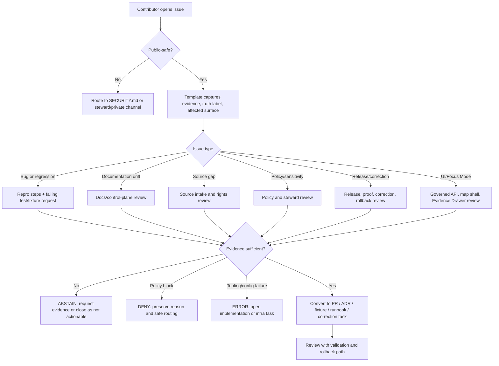

<!-- [KFM_META_BLOCK_V2]
doc_id: kfm://doc/TODO-NEEDS-UUID
title: .github/ISSUE_TEMPLATE
type: standard
version: v1
status: draft
owners: TODO: owner not verified
created: TODO: YYYY-MM-DD
updated: TODO: YYYY-MM-DD
policy_label: TODO: public|restricted|internal
related: [README.md, .github/README.md, .github/CODEOWNERS, .github/PULL_REQUEST_TEMPLATE.md, .github/workflows/README.md, SECURITY.md, CONTRIBUTING.md, docs/adr/ADR-0001-schema-home.md]
tags: [kfm, github, issue-template, intake, governance, evidence, review]
notes: [Target README path was confirmed in the accessible GitHub repository, but complete issue-template inventory, owners, dates, policy label, labels, branch settings, and template chooser configuration still need active-checkout verification.]
[/KFM_META_BLOCK_V2] -->

<a id="top"></a>

# `.github/ISSUE_TEMPLATE`

Public issue intake templates for evidence-bearing, policy-aware, correction-ready Kansas Frontier Matrix work.

> [!IMPORTANT]
> **Status:** `experimental`  
> **Owners:** `TODO: owner not verified`  
> **Path:** `.github/ISSUE_TEMPLATE/README.md`  
> **Authority:** `CONFIRMED path / PROPOSED intake contract / NEEDS VERIFICATION template inventory`  
> **Review burden:** Issue templates shape how contributors report bugs, corrections, source gaps, documentation drift, policy concerns, and release-impacting defects. Treat changes here as contributor-facing governance changes, not cosmetic text edits.


**Quick jumps:** [Scope](#scope) · [Repo fit](#repo-fit) · [Evidence boundary](#evidence-boundary) · [Accepted inputs](#accepted-inputs) · [Exclusions](#exclusions) · [Directory tree](#directory-tree) · [Quickstart](#quickstart) · [Usage](#usage) · [Intake flow](#intake-flow) · [Template families](#template-families) · [Review gates](#review-gates) · [Definition of done](#definition-of-done) · [FAQ](#faq) · [Appendix](#appendix)

---

## Scope

`.github/ISSUE_TEMPLATE/` is the GitHub-native intake surface for public, contributor-facing issue reports.

Its job is to help maintainers receive issues that are:

- evidence-aware;
- safe to discuss in public;
- routed to the correct KFM responsibility root;
- explicit about truth posture;
- clear about expected review, correction, rollback, or publication impact.

It does **not** own KFM doctrine, policy, source authority, schemas, contracts, release decisions, proof objects, or runtime behavior.

> [!NOTE]
> An issue can request review, correction, triage, or investigation. It is not an EvidenceBundle, PromotionDecision, ReleaseManifest, CorrectionNotice, or proof pack.

[Back to top](#top)

---

## Repo fit

| Relationship | Path | Status | Use |
| --- | --- | ---: | --- |
| This document | `.github/ISSUE_TEMPLATE/README.md` | `CONFIRMED path` / `draft content` | Directory orientation and issue-intake rules |
| Parent gatehouse | [`../README.md`](../README.md) | `CONFIRMED` | `.github/` boundary, governance, automation posture |
| Root landing page | [`../../README.md`](../../README.md) | `CONFIRMED` | KFM identity, trust law, lifecycle, and root routing |
| Contributor rules | [`../../CONTRIBUTING.md`](../../CONTRIBUTING.md) | `CONFIRMED` | Truth labels and cite-or-abstain contribution posture |
| Security reporting | [`../../SECURITY.md`](../../SECURITY.md) | `CONFIRMED` | Sensitive-data, model-access, and public-interface guardrails |
| Ownership routing | [`../CODEOWNERS`](../CODEOWNERS) | `CONFIRMED path / NEEDS VERIFICATION content` | Reviewer routing; do not assume coverage until populated |
| PR intake | [`../PULL_REQUEST_TEMPLATE.md`](../PULL_REQUEST_TEMPLATE.md) | `CONFIRMED path / NEEDS VERIFICATION content` | Pull request review prompts; separate from issue intake |
| Workflow orchestration | [`../workflows/README.md`](../workflows/README.md) | `CONFIRMED` | CI and validation lane; issues do not prove workflow success |
| Schema-home decision | [`../../docs/adr/ADR-0001-schema-home.md`](../../docs/adr/ADR-0001-schema-home.md) | `CONFIRMED` | Contract/schema/policy split and drift-control posture |

### Responsibility boundary

Issue templates may ask for information about `docs/`, `contracts/`, `schemas/`, `policy/`, `tests/`, `fixtures/`, `tools/`, `data/`, `release/`, `apps/`, and domain lanes. They must not redefine those roots.

| If the issue is about... | Route review toward... | Do not place in issue body |
| --- | --- | --- |
| Documentation drift | `docs/`, `control_plane/`, adjacent README | Unverified claims dressed as canon |
| Contract meaning | `contracts/` and relevant ADRs | Duplicate machine schema text |
| Schema shape | `schemas/` and fixture validators | Private examples or unreviewed generated schemas |
| Policy or sensitivity | `policy/`, security docs, steward review | Restricted data, secrets, or exact sensitive locations |
| Source intake | `docs/sources/`, `data/registry/`, source descriptors | Credentials, raw dumps, or unclear-rights data |
| Release/correction | `release/`, `data/proofs/`, `data/receipts/`, correction runbooks | Claims that publication has already occurred |
| UI / map / Focus Mode | `apps/`, `packages/`, MapLibre shell docs | Direct model output treated as truth |

[Back to top](#top)

---

## Evidence boundary

This README is deliberately conservative.

| Claim | Status | Reason |
| --- | ---: | --- |
| `.github/ISSUE_TEMPLATE/README.md` exists on `main` | `CONFIRMED` | The target path was fetched from the accessible GitHub repository. |
| The prior file content was blank | `CONFIRMED at authoring time` | The fetched file contained only a newline. |
| Complete issue-template inventory | `NEEDS VERIFICATION` | A mounted checkout was not available in this session; run the quickstart inventory before claiming files. |
| `config.yml` template chooser status | `NEEDS VERIFICATION` | Do not claim blank-issue behavior or contact links until checked. |
| Active label names, issue types, projects, and assignees | `UNKNOWN` | GitHub platform settings and repo label inventory were not inspected here. |
| Owners and CODEOWNERS coverage | `NEEDS VERIFICATION` | Path presence is not reviewer coverage. |
| Workflow enforcement from issue events | `UNKNOWN` | Issue templates do not prove Actions triggers, branch protections, or required checks. |

> [!WARNING]
> Public issues are public by default in a public repository. Do not ask contributors to paste secrets, tokens, private reports, precise protected locations, restricted cultural information, living-person data, DNA/genomic data, or raw unpublished material into an issue.

[Back to top](#top)

---

## Accepted inputs

Use this directory for GitHub issue intake files only.

| Input | Belongs here when | Minimum expectation |
| --- | --- | --- |
| `README.md` | It orients maintainers and contributors to issue intake | Scope, repo fit, accepted inputs, exclusions, safety, review gates |
| Issue forms, `*.yml` | Structured issue intake is useful | `name`, `description`, `body`, required fields, public-safety prompts |
| Markdown templates, `*.md` | Lightweight issue intake is enough | YAML front matter, clear prompts, evidence and safety reminders |
| `config.yml` | Maintainers need template chooser behavior | Explicit blank-issue posture and contact links, if used |
| Template-specific guidance | It keeps public reports actionable | Truth labels, affected surfaces, evidence links, reproduction steps, expected outcome |
| Public-safe examples | They help contributors understand good reports | No secrets, restricted coordinates, private data, or unpublished raw material |

### Required prompts for most KFM issue templates

Most templates should ask for:

- affected path or surface;
- truth label: `CONFIRMED`, `PROPOSED`, `UNKNOWN`, or `NEEDS VERIFICATION`;
- evidence basis, citation, log excerpt, screenshot, fixture, or command output;
- expected behavior;
- observed behavior;
- policy, sensitivity, rights, release, correction, or rollback impact;
- whether the issue is safe for public discussion.

[Back to top](#top)

---

## Exclusions

| Material | Do not put it here | Correct home or path |
| --- | --- | --- |
| Pull request template content | PR prompts are not issue prompts | [`../PULL_REQUEST_TEMPLATE.md`](../PULL_REQUEST_TEMPLATE.md) |
| Ownership rules | Issue templates are not owner routing | [`../CODEOWNERS`](../CODEOWNERS) or governance register |
| Workflow YAML | Issues do not own automation | [`../workflows/`](../workflows/) |
| Reusable GitHub actions | Not issue intake | `../actions/` when verified |
| Security vulnerabilities | Do not route sensitive disclosures through public issues | [`../../SECURITY.md`](../../SECURITY.md) and private disclosure path |
| KFM doctrine | Templates may reference doctrine, not redefine it | `../../docs/` |
| Semantic contracts | Templates may ask about contract impact, not define meaning | `../../contracts/` |
| Machine schemas | Templates may request schema review, not house schemas | `../../schemas/` |
| Policy-as-code | Templates may request policy review, not define admissibility | `../../policy/` |
| Tests and fixtures | Templates may request failing fixtures, not store them | `../../tests/`, `../../fixtures/` |
| Source data | Do not paste raw or unclear-rights data into public issues | `../../data/` lifecycle roots after source intake |
| Receipts, proofs, release records | Issues can link review targets, not replace them | `../../data/receipts/`, `../../data/proofs/`, `../../release/` |
| Secrets or restricted information | Never commit or paste | GitHub secrets, protected environments, private steward channel |

[Back to top](#top)

---

## Directory tree

This is a **starter map**, not a confirmed current inventory. Re-run the quickstart commands before changing path claims.

```text
.github/ISSUE_TEMPLATE/
├── README.md                         # CONFIRMED path
├── config.yml                        # NEEDS VERIFICATION
├── 01-bug-report.yml                 # PROPOSED
├── 02-documentation-correction.yml    # PROPOSED
├── 03-source-intake.yml               # PROPOSED
├── 04-policy-sensitivity-review.yml   # PROPOSED
├── 05-map-ui-focus-mode.yml           # PROPOSED
├── 06-release-correction-rollback.yml # PROPOSED
└── 07-domain-lane-proposal.yml        # PROPOSED
```

> [!TIP]
> Keep the directory shallow. If a template requires a long runbook, link to a governed doc rather than embedding the runbook into the template.

[Back to top](#top)

---

## Quickstart

Run these from the repository root before changing this directory.

```bash
git status --short
git branch --show-current || true
git rev-parse --show-toplevel || true

find .github/ISSUE_TEMPLATE -maxdepth 2 -type f | sort

sed -n '1,240p' .github/ISSUE_TEMPLATE/README.md
sed -n '1,260p' .github/README.md
sed -n '1,220p' CONTRIBUTING.md
sed -n '1,220p' SECURITY.md
sed -n '1,220p' .github/CODEOWNERS
sed -n '1,260p' .github/PULL_REQUEST_TEMPLATE.md
sed -n '1,220p' .github/workflows/README.md
```

When template files exist, validate their shape with repo-native checks. Do not report validation or platform behavior as passing unless the check actually ran.

```bash
# Examples only; replace with repo-native commands when confirmed.
git diff --check
find .github/ISSUE_TEMPLATE -maxdepth 1 -type f -name '*.yml' -print | sort
find .github/ISSUE_TEMPLATE -maxdepth 1 -type f -name '*.md' -print | sort
```

[Back to top](#top)

---

## Usage

### For contributors opening issues

1. Choose the narrowest public-safe template.
2. State what is `CONFIRMED` and what is `UNKNOWN`.
3. Link to evidence when public and permitted.
4. Describe reproduction steps or review steps.
5. Name affected files, domains, contracts, schemas, policies, tests, workflows, or release artifacts.
6. Mark any rights, sensitivity, location, living-person, cultural, security, or publication concerns.
7. Do not paste restricted data. Use the security or steward path when the report is not public-safe.

### For maintainers triaging issues

1. Confirm whether the issue is public-safe.
2. Add or correct labels only after label inventory is verified.
3. Route to the owning responsibility root.
4. Ask for evidence, not speculation.
5. Convert issue outcomes into the correct artifact: PR, ADR, source descriptor, validation fixture, correction notice, rollback card, or documentation update.
6. Close or restrict issues that require private handling.

[Back to top](#top)

---

## Intake flow


```mermaid
flowchart TD
    A[Contributor opens issue] --> B{Public-safe?}
    B -->|No| C[Route to SECURITY.md or steward/private channel]
    B -->|Yes| D[Template captures evidence, truth label, affected surface]

    D --> E{Issue type}
    E -->|Bug or regression| F[Repro steps + failing test/fixture request]
    E -->|Documentation drift| G[Docs/control-plane review]
    E -->|Source gap| H[Source intake and rights review]
    E -->|Policy/sensitivity| I[Policy and steward review]
    E -->|Release/correction| J[Release, proof, correction, rollback review]
    E -->|UI/Focus Mode| K[Governed API, map shell, Evidence Drawer review]

    F --> L{Evidence sufficient?}
    G --> L
    H --> L
    I --> L
    J --> L
    K --> L

    L -->|No| M[ABSTAIN: request evidence or close as not actionable]
    L -->|Policy block| N[DENY: preserve reason and safe routing]
    L -->|Tooling/config failure| O[ERROR: open implementation or infra task]
    L -->|Yes| P[Convert to PR / ADR / fixture / runbook / correction task]

    P --> Q[Review with validation and rollback path]
```

[Back to top](#top)

---

## Template families

These are proposed template families to add or verify. They are not current-file claims.

| Family | Proposed filename | Use for | Required public-safety reminder |
| --- | --- | --- | --- |
| Bug / regression | `01-bug-report.yml` | Broken behavior, failed checks, bad rendering, incorrect output | Include minimal repro; omit secrets and restricted data |
| Documentation correction | `02-documentation-correction.yml` | Unsupported claim, stale path, broken link, term drift | Identify source evidence and proposed correction |
| Source intake | `03-source-intake.yml` | Candidate source, missing source, changed source terms | Do not paste raw data; provide public source reference and rights posture |
| Policy / sensitivity review | `04-policy-sensitivity-review.yml` | Rights, cultural sensitivity, living-person, rare species, archaeology, infrastructure, restricted geometry | Do not disclose sensitive exact locations or private data |
| Map / UI / Focus Mode | `05-map-ui-focus-mode.yml` | Map shell, layer, Evidence Drawer, Focus Mode, trust-state display | Include screenshot only when it contains no restricted material |
| Release / correction / rollback | `06-release-correction-rollback.yml` | Published artifact concern, release manifest gap, rollback request | Link public artifact and explain correction risk |
| Domain-lane proposal | `07-domain-lane-proposal.yml` | New lane work or substantial domain expansion | Name owning responsibility roots; do not create domain root folders |

### Suggested issue outcomes

| Outcome | Use when | Maintainer action |
| --- | --- | --- |
| `CONFIRMED` | Evidence is sufficient and public-safe | Convert to PR, fixture, ADR, correction, or implementation task |
| `NEEDS VERIFICATION` | Checkable facts are missing | Ask for exact evidence or assign verification |
| `ABSTAIN` | Evidence is insufficient for action | Close with reason or keep pending evidence |
| `DENY` | Public handling is unsafe or policy-blocked | Route to security/steward/private process |
| `ERROR` | Tooling or configuration failed | Open implementation or platform task |

[Back to top](#top)

---

## Review gates

A change to this directory is ready for review only when these gates are addressed.

| Gate | Check | Fail-closed result |
| --- | --- | --- |
| Directory fit | Does this belong in `.github/ISSUE_TEMPLATE/`? | Move it to the correct responsibility root |
| Public safety | Could the template solicit secrets, restricted data, or exact sensitive locations? | `DENY` until rewritten |
| Evidence discipline | Does the template ask for evidence and truth labels? | `ABSTAIN` until added |
| Issue routing | Does it name affected surfaces and review lanes? | `ABSTAIN` |
| Template schema | For issue forms, are required top-level fields present? | `ERROR` until fixed |
| Label assumptions | Are labels, projects, assignees, and issue types verified? | Mark as `NEEDS VERIFICATION` or remove |
| Security routing | Does it redirect sensitive disclosures away from public issues? | `DENY` |
| Publication impact | Could the issue imply release/correction/rollback work? | Require release/correction review prompts |
| Documentation sync | Are parent `.github` and contributor docs still accurate? | `ABSTAIN` |
| Rollback | Can the template change be reverted without losing audit context? | `ERROR` until defined |

[Back to top](#top)

---

## Definition of done

- [ ] `README.md` includes KFM Meta Block V2 with verified or clearly marked placeholder fields.
- [ ] The full issue-template inventory has been checked on the active branch.
- [ ] `config.yml` status is known and documented.
- [ ] Every issue form has `name`, `description`, and `body`.
- [ ] Every Markdown template has valid front matter if it should appear in the chooser.
- [ ] Every template includes public-safety guidance.
- [ ] Every template asks for affected surface and evidence basis.
- [ ] Sensitive reports are routed to `SECURITY.md` or a steward/private channel.
- [ ] Labels, projects, issue types, and assignees are verified before use.
- [ ] Parent `.github/README.md`, `CONTRIBUTING.md`, and `SECURITY.md` remain synchronized.
- [ ] Reviewers can distinguish bug intake, correction intake, source intake, policy review, release review, and domain-lane proposals.
- [ ] Rollback is simply revertible and does not erase public issue audit context.

[Back to top](#top)

---

## FAQ

### Why does this README avoid claiming the current template list?

Because a complete active-checkout directory listing was not available during this revision. The target README path was confirmed, but complete template inventory and GitHub platform behavior still need verification.

### Should security reports be issue templates?

No. Security vulnerabilities, sensitive data exposure, secrets, private reports, exact protected locations, and restricted steward material should not be routed through public issues.

### Can an issue template require labels or assignees?

Yes, but only after label names, issue types, projects, and owner routing are verified. A template that references nonexistent labels or unverified maintainers creates false routing confidence.

### Can a public issue request correction of a published artifact?

Yes, when the report is public-safe. The issue should link the public artifact, describe the suspected problem, and route maintainers toward correction and rollback review. The issue itself is not the correction notice.

### Can AI summarize issue reports?

Only as interpretive support. AI output must not become source authority, policy decision, release approval, or proof. Evidence, policy, review, and release state outrank generated language.

[Back to top](#top)

---

## Appendix

<details>
<summary><strong>Illustrative issue-form skeleton</strong></summary>

This example is **illustrative**. Do not add it as-is without verifying labels, owner routing, issue types, and repo-native validation.

```yaml
name: Documentation correction
description: Report an unsupported claim, stale path, broken link, or terminology drift.
title: "[docs-correction]: "
labels:
  - docs
  - needs-verification
body:
  - type: markdown
    attributes:
      value: |
        Thanks for helping keep KFM evidence-first and correction-ready.
        Do not paste secrets, restricted data, exact sensitive locations, private records,
        or unpublished source material into a public issue.

  - type: input
    id: affected_path
    attributes:
      label: Affected path or anchor
      description: Use a repo-relative path and heading anchor when possible.
      placeholder: docs/architecture/governed-api.md#evidence-boundary
    validations:
      required: true

  - type: dropdown
    id: truth_label
    attributes:
      label: Truth label
      options:
        - CONFIRMED
        - PROPOSED
        - UNKNOWN
        - NEEDS VERIFICATION
    validations:
      required: true

  - type: textarea
    id: evidence
    attributes:
      label: Evidence basis
      description: Link public evidence or describe the exact command/output that supports the report.
      placeholder: "Observed in README.md; expected link target is missing."
    validations:
      required: true

  - type: textarea
    id: requested_change
    attributes:
      label: Requested correction
      description: Describe the smallest safe correction.
    validations:
      required: true

  - type: checkboxes
    id: safety
    attributes:
      label: Public-safety check
      options:
        - label: This issue does not include secrets, restricted data, precise protected locations, private records, or unpublished raw material.
          required: true
```

</details>

<details>
<summary><strong>Maintainer triage checklist</strong></summary>

- [ ] Is the report public-safe?
- [ ] Is the affected surface named?
- [ ] Is the evidence basis sufficient?
- [ ] Does the report require source-rights review?
- [ ] Does the report require policy or sensitivity review?
- [ ] Does the report affect a release, proof, receipt, catalog, or published artifact?
- [ ] Does the report need a correction notice or rollback card?
- [ ] Does the report require a PR, ADR, fixture, validator, or documentation patch?
- [ ] Is the outcome `CONFIRMED`, `NEEDS VERIFICATION`, `ABSTAIN`, `DENY`, or `ERROR`?

</details>

[Back to top](#top)
