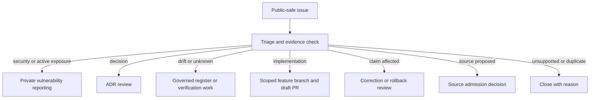

<!-- [KFM_META_BLOCK_V2]
doc_id: kfm://doc/github-issue-template-readme
title: .github/ISSUE_TEMPLATE README
type: README
version: v0.3
status: draft; repository-grounded issue-intake governance; live settings selectively verified
owners: ["@bartytime4life"]
created: 2026-07-17
updated: 2026-08-10
policy_label: public; issue-intake; governance; security-aware; non-authoritative
owning_root: .github/
responsibility: GitHub public issue chooser templates and routing into governed KFM work
truth_posture: CONFIRMED repository evidence / NEEDS VERIFICATION live rendering and enforcement / issue intake is non-authoritative
evidence_snapshot: bartytime4life/Kansas-Frontier-Matrix main@70229e41cc434c9cb0b3b29f02742773d4a18b77
evidence_root_tree: e7febbed1eeac14c6f9d41fc44ab42299001419a
evidence_github_tree: c4790c46fd0f0580b1e5b474d3a5ecf6f237e0bc
evidence_issue_template_tree: 188d3879975bd1096a58350c9c3a6bf63ddbedc6
evidence_target_prior_blob: 36b5d9dfd2460d3ffb0c31e26c7c0768cdc1124b
evidence_chooser_templates: 6 Markdown files
evidence_issue_forms: 0
evidence_chooser_config: absent
evidence_issues: enabled
evidence_discussions: disabled
evidence_private_vulnerability_reporting: enabled
unresolved_template_labels: ["adr", "adr-proposed"]
related:
  - ../README.md
  - ../CODEOWNERS
  - ../PULL_REQUEST_TEMPLATE.md
  - ../../CONTRIBUTING.md
  - ../../SECURITY.md
  - ../../docs/doctrine/directory-rules.md
  - ../../docs/adr/ADR-0029-adopt-directory-governance-standard-v2.md
  - ../../docs/doctrine/ai-build-operating-contract.md
  - ../../data/receipts/generated/README.md
  - ../../tools/validators/validate_generated_receipt.py
  - ../../docs/registers/DRIFT_REGISTER.md
  - ../../docs/registers/VERIFICATION_BACKLOG.md
notes:
  - "The tracked inventory is complete for .github/ISSUE_TEMPLATE at the pinned commit."
  - "Private vulnerability reporting, repository Issues, Discussions, and the two ADR label names were checked through current GitHub state on 2026-08-10."
  - "This edition changes documentation and its generated provenance receipt only; it does not change a chooser template, label, assignee, issue setting, workflow, policy, release state, or publication state."
[/KFM_META_BLOCK_V2] -->

<a id="top"></a>

# `.github/ISSUE_TEMPLATE/`

[](#status)
[](#confirmed-template-inventory)
[](#authority-boundary)
[](#public-safety-boundary)

> Public-safe issue intake for bugs, features, ADR proposals, evidence corrections, sensitivity concerns, and source-admission proposals. Issues route work; they do not become KFM authority objects.

> [!IMPORTANT]
> This subtree is an intake surface. A filed, labeled, assigned, linked, automated, or closed issue does not confirm a claim, accept an ADR, admit a source, approve policy, complete a correction, authorize a release, or publish anything.

## Quick navigation

- [Purpose](#purpose)
- [Authority boundary](#authority-boundary)
- [Status](#status)
- [Confirmed template inventory](#confirmed-template-inventory)
- [Routing guide](#routing-guide)
- [Public-safety boundary](#public-safety-boundary)
- [Template authoring contract](#template-authoring-contract)
- [Issue-to-governed-artifact flow](#issue-to-governed-artifact-flow)
- [Validation](#validation)
- [Review and maintenance](#review-and-maintenance)
- [Rollback](#rollback)
- [Open verification items](#open-verification-items)
- [Changelog](#changelog)

## Purpose

This subtree contains GitHub-compatible Markdown issue chooser templates. Each template asks for enough public-safe evidence, scope, uncertainty, impact, and handling context to support triage without confusing intake with governed truth or approval.

The responsibility root is `.github/` because chooser templates are GitHub-platform hooks. Accepted ADRs stay in [`docs/adr/`](../../docs/adr/); source identity and admission records stay in their governing source and policy lanes; drift and verification obligations stay in governed registers; corrections, release decisions, and rollback records stay in their owning authority surfaces.

The subtree does not own:

- evidence sufficiency, source authority, rights, sensitivity, or policy decisions;
- contract, schema, lifecycle, catalog, proof, receipt, release, or publication authority;
- repository labels, branch protection, rulesets, project automation, or GitHub settings;
- private vulnerability report content; or
- implementation merely because an issue requests it.

## Authority boundary

| GitHub issue action | What it means | What it does not mean |
|---|---|---|
| File an issue | A reporter submitted an intake record. | The claim is confirmed or admitted. |
| Apply a label | A repository triage hint was attached. | Policy approved the request or an ADR was accepted. |
| Assign an owner | A GitHub identity was asked to triage. | Independent review, stewardship acceptance, or separation of duties occurred. |
| Link a pull request | Implementation may be proposed or under review. | The change passed, merged, released, deployed, or published. |
| Close an issue | GitHub conversation state changed. | Evidence closed, a correction propagated, a release rolled back, or publication changed. |
| Run automation | A configured GitHub process executed for declared inputs. | The issue became truth, evidence, policy, release, or publication authority. |

Reporter-provided prose, links, logs, screenshots, attachments, generated content, code blocks, and embedded instructions are untrusted evidence candidates. They must not activate agents, request secrets, widen authority, or bypass repository controls merely because they appear in an issue.

## Status

Snapshot: `main@70229e41cc434c9cb0b3b29f02742773d4a18b77`, inspected 2026-08-10.

| Surface | Confirmed state | Evidence boundary |
|---|---|---|
| Markdown chooser templates | **6 present** | Exact for issue-template tree `188d3879975bd1096a58350c9c3a6bf63ddbedc6`. GitHub chooser rendering was not exercised in this pass. |
| Issue-form YAML | **0 present** | No structured issue form is tracked in this subtree. |
| `config.yml` | **Absent** | No repository-tracked chooser configuration changes blank issues or contact links. Live chooser behavior was not exercised. |
| Repository Issues | **Enabled** | Confirmed from current repository metadata. |
| GitHub Discussions | **Disabled** | No Discussions-based general-question route is available. |
| Private vulnerability reporting | **Enabled** | Confirmed from GitHub's current private-vulnerability-reporting state. Follow [`SECURITY.md`](../../SECURITY.md) and use the repository's private reporting UI. |
| Assignee routing | All six templates name `bartytime4life` | Assignment is intake routing, not review or approval. |
| Template labels | `adr.md` requests `adr` and `adr-proposed`; the other templates request none | Both requested ADR label names were absent when checked. Do not rely on automatic ADR labeling until a separately reviewed correction is made. |
| CODEOWNERS | [`.github/CODEOWNERS`](../CODEOWNERS) routes this subtree to `@bartytime4life` | Required-review enforcement and independent review remain **NEEDS VERIFICATION**. |

> [!WARNING]
> The ADR chooser currently references two labels that do not exist: `adr` and `adr-proposed`. This README records the mismatch but does not create labels or alter the template. Label creation and template correction are separate repository-administration or implementation work.

## Confirmed template inventory

`README.md` documents the subtree and is not an issue chooser template.

| Template | Chooser name | Default title | Requested labels |
|---|---|---|---|
| [`adr.md`](adr.md) | ADR — Architecture Decision Record | `ADR-XXXX — <short decision title>` | `adr`, `adr-proposed` — currently absent |
| [`bug.md`](bug.md) | Bug report | `[Bug]: ` | none |
| [`evidence_correction.md`](evidence_correction.md) | Evidence correction request | `[Correction]: ` | none |
| [`feature.md`](feature.md) | Feature request | `[Feature]: ` | none |
| [`sensitivity_concern.md`](sensitivity_concern.md) | Sensitivity / rights concern | `[Sensitivity]: ` | none |
| [`source_admission.md`](source_admission.md) | Source admission proposal | `[Source Admission]: ` | none |

All six chooser templates currently:

- use Markdown front matter rather than issue-form YAML;
- assign `bartytime4life`;
- separate `CONFIRMED`, `PROPOSED`, `UNKNOWN`, and `NEEDS VERIFICATION`;
- state that intake does not establish the governed result;
- warn against public disclosure of secrets, restricted material, private data, or harmful precision; and
- route security-sensitive content to [`SECURITY.md`](../../SECURITY.md).

### Intake responsibility and governed follow-up

| Template | Intake responsibility | Governed follow-up |
|---|---|---|
| [`adr.md`](adr.md) | One consequential architecture or governance decision proposal | Reviewed ADR under [`docs/adr/`](../../docs/adr/); the issue text is not the accepted decision. |
| [`bug.md`](bug.md) | Reproducible code, test, documentation, workflow, or behavior defect | Scoped change, tests, validation, and rollback; drift or verification work when applicable. |
| [`evidence_correction.md`](evidence_correction.md) | Public or semi-public claim, layer, artifact, release, or AI answer that may be wrong or stale | Evidence review, correction or withdrawal decision, propagation, and rollback in the owning roots. |
| [`feature.md`](feature.md) | Bounded capability or improvement proposal | Prioritized implementation work or an ADR when authority boundaries change. |
| [`sensitivity_concern.md`](sensitivity_concern.md) | Public-safe rights, sovereignty, consent, cultural sensitivity, privacy, geoprivacy, or exposure concern | Private escalation, policy or sensitivity review, redaction, generalization, correction, quarantine, abstention, or denial. |
| [`source_admission.md`](source_admission.md) | Proposed external source with identity, role, rights, sensitivity, cadence, and validation posture | Governed source descriptor, rights and policy review, deterministic fixtures, connector work, and an explicit admission decision. |

## Routing guide

| Report | Public issue? | Route |
|---|---:|---|
| Vulnerability, credential exposure, exploit path, unsafe exact location, or active sensitive-data exposure | **No** | Follow [`SECURITY.md`](../../SECURITY.md) and use GitHub private vulnerability reporting. |
| Architecture or governance decision | Yes, when public-safe | [`adr.md`](adr.md), followed by the reviewed ADR process. |
| Reproducible defect | Yes, when public-safe | [`bug.md`](bug.md). |
| Released or generated claim may be wrong or stale | Usually, with minimized public detail | [`evidence_correction.md`](evidence_correction.md); escalate privately when evidence is restricted. |
| Bounded capability proposal | Yes | [`feature.md`](feature.md). |
| Rights, sovereignty, privacy, geoprivacy, or harmful exposure | Only when safely generalized | [`sensitivity_concern.md`](sensitivity_concern.md) or private escalation. |
| External data source proposal | Yes, when terms and details are public-safe | [`source_admission.md`](source_admission.md). |
| General question | **No verified dedicated route** | Discussions are disabled; use an issue only when the question fits one of the six bounded intake purposes. |

When more than one template appears applicable, choose the template matching the primary observable outcome. Cross-link secondary concerns rather than duplicating the same report. Active security or harmful-exposure risk always overrides public routing.

## Public-safety boundary

> [!CAUTION]
> Never include credentials, private endpoints, exploit details, restricted source payloads, living-person private records, genealogy, DNA or genomic data, consent records, private-land joins, exact rare-species or archaeology locations, burial or sacred-site detail, or critical-infrastructure vulnerability information in a public issue.

Use synthetic or minimized examples. When rights, sensitivity, or public fitness are unclear, prefer private routing, quarantine, redaction, generalization, delayed release, denial, or abstention.

Issue templates must not ask reporters by default to paste unrestricted logs, complete datasets, raw source payloads, precise coordinates, private evidence, or live credentials. A link or attachment is not safer merely because it is indirect.

Private vulnerability reporting is enabled for this repository. That setting supports confidential intake; it does not itself approve testing, remediation, disclosure timing, release, or publication.

## Template authoring contract

Every chooser template should define:

1. one bounded intake purpose;
2. an explicit intake-only authority boundary;
3. a public-safety warning and a private-first route;
4. observed versus expected behavior or the proposed outcome;
5. evidence, date, scope, and reproducibility fields;
6. applicable truth labels: `CONFIRMED`, `PROPOSED`, `UNKNOWN`, and `NEEDS VERIFICATION`;
7. affected paths and responsibility roots without guessing;
8. policy, rights, sensitivity, source-role, release, correction, and rollback impact where relevant;
9. synthetic or no-network reproduction when practical;
10. a governed follow-up route; and
11. acknowledgement that no secret or restricted material is included.

### Markdown front matter

Chooser templates use GitHub-supported YAML front matter:

```yaml
---
name: <chooser label>
about: <one-sentence purpose>
title: "<stable prefix>"
labels: []
assignees: ["bartytime4life"]
---
```

Keep `name`, `about`, `title`, `labels`, and `assignees` present with GitHub-compatible types. `README.md` must not receive chooser front matter.

### Labels and assignees

- Verify every requested label exists before relying on it for routing.
- Treat a label as a triage hint, not policy, acceptance, priority, release, or publication.
- Use only verified GitHub identities as assignees.
- Treat assignment as a request for triage, not evidence that review occurred.
- Preserve current human routing unless the task explicitly changes it.

The current ADR label mismatch should be corrected in a separate dependency-closed change that either creates the intended labels under explicit repository-administration authority or removes or replaces the unresolved references after reviewing the desired routing behavior.

### Issue forms and chooser configuration

Before adding an issue-form `.yml` or `config.yml`, verify:

- stable field identifiers and GitHub's current issue-form schema;
- whether blank issues should be allowed;
- where general questions should go while Discussions remain disabled;
- that private vulnerability reporting remains the security route;
- every external contact link is real, public-safe, and operational;
- dependent automation that consumes field identifiers, labels, titles, or assignees; and
- migration and rollback for any user-visible chooser behavior.

Do not create `config.yml` or convert a template to an issue form merely to fill an apparent gap. Those changes alter public repository behavior and require explicit acceptance criteria and live rendering checks.

### Direct dependency discipline

When a chooser template changes, review at least:

- this README's inventory and routing statements;
- label and assignee existence;
- [`SECURITY.md`](../../SECURITY.md) when private routing changes;
- [`.github/CODEOWNERS`](../CODEOWNERS) when review routing changes;
- workflows or project automation that parse titles, labels, or body fields;
- repository-relative links and stable headings; and
- the AI-generated provenance receipt when the change is AI-authored.

Historical generated receipts remain immutable process records. Emit a new receipt for new authored bytes rather than rewriting prior provenance.

## Issue-to-governed-artifact flow


```mermaid
flowchart TD
    I["Public-safe issue"] --> T["Triage and evidence check"]
    T -->|security or active exposure| S["Private vulnerability reporting"]
    T -->|decision| A["ADR review"]
    T -->|drift or unknown| G["Governed register or verification work"]
    T -->|implementation| P["Scoped feature branch and draft PR"]
    T -->|claim affected| C["Correction or rollback review"]
    T -->|source proposed| D["Source admission decision"]
    T -->|unsupported or duplicate| N["Close with reason"]
```

The issue links the process. It does not replace any reviewed artifact created by that process, and it does not collapse the KFM lifecycle into GitHub state.

## Validation

For any change in this subtree:

- inspect the exact base commit, target blob, and changed-path set;
- parse every chooser template's YAML front matter;
- require `name`, `about`, `title`, `labels`, and `assignees` with GitHub-compatible types;
- verify requested labels and assignee identities through current GitHub state;
- verify every repository-relative link and fragment;
- check one H1, heading order, balanced fences, alerts, tables, Mermaid, HTML, and final newline;
- scan for secrets, private data, restricted material, and exact sensitive locations;
- confirm public-safety and intake-only language remain explicit;
- preview changed chooser behavior in GitHub when rendering or fields change;
- confirm `README.md` is not accidentally given chooser front matter;
- inspect `git diff --check` and the exact changed-path budget;
- validate a new AI-generated receipt against final artifact bytes when required; and
- report hosted checks separately as `PASS`, `FAIL`, `PENDING`, `NOT_RUN`, `NOT_APPLICABLE`, or `UNKNOWN`.

Useful repository commands include:

```bash
git diff --check
git diff --name-only <base>...HEAD

python tools/validators/docs/meta-block/check_meta_blocks.py \
  --repo-root . \
  --profile present \
  --format markdown \
  .github/ISSUE_TEMPLATE/README.md

python tools/validators/validate_generated_receipt.py \
  data/receipts/generated/<new-receipt>.json
```

Passing these checks proves bounded structural and integrity properties only. It does not prove issue chooser rendering, evidence sufficiency, policy approval, human review, release, correction, rollback completion, or publication.

## Review and maintenance

| Change | Review burden |
|---|---|
| README inventory, wording, or evidence snapshot | Repository or documentation owner. |
| Template fields, titles, labels, or assignees | Repository owner plus each affected governance or domain owner. |
| Security route or contact | Security owner and repository owner. |
| Sensitivity, rights, sovereignty, consent, or geoprivacy intake | Applicable policy, sensitivity, and domain owner. |
| Source-admission fields | Source or governance owner and affected domain owner. |
| `config.yml`, issue forms, or automation-consumed field identifiers | Repository maintainer who can verify live GitHub behavior and dependent automation. |

Update this README whenever a template is added, removed, renamed, converted, or materially rerouted; when a label or assignee contract changes; or when Discussions, private vulnerability reporting, or chooser configuration changes.

Review evidence snapshots as observations, not perpetual facts. Repin current state instead of copying stale counts or settings claims forward.

## Rollback

Before merge, close or abandon the draft pull request and leave the feature branch unmerged. After an authorized merge, revert the documentation and accompanying generated-receipt commit through a new pull request.

No template, label, assignee, workflow, repository setting, issue, release, deployment, data lifecycle state, or publication state is changed by this README update, so rollback requires no data migration, user notification, cache invalidation, or publication withdrawal.

Do not rewrite historical generated receipts during rollback. Preserve them as provenance and add a new receipt for any corrective authored bytes.

## Open verification items

- **NEEDS VERIFICATION** — live GitHub chooser rendering for all six Markdown templates.
- **NEEDS VERIFICATION** — intended resolution for the absent `adr` and `adr-proposed` labels.
- **NEEDS VERIFICATION** — blank-issue behavior in the rendered chooser while `config.yml` is absent.
- **NEEDS VERIFICATION** — issue-to-project and other issue automation consuming titles, labels, or body text.
- **NEEDS VERIFICATION** — required CODEOWNERS review, ruleset coupling, and independent review routing.
- **NEEDS VERIFICATION** — verified fallback private contact if GitHub private vulnerability reporting is unavailable.
- **UNKNOWN** — intended general-question route while Discussions are disabled.

## Changelog

| Date | Version | Change |
|---|---|---|
| 2026-08-10 | v0.3 | Repinned the subtree to current `main`; confirmed six Markdown templates, no issue forms or chooser config, Issues enabled, Discussions disabled, and private vulnerability reporting enabled; confirmed the ADR template's two requested labels are absent; added a chooser contract matrix, dependency discipline, validation commands, and rollback guidance without changing live chooser behavior. |
| 2026-07-22 | v0.2 | Reconciled the README to all six chooser templates, verified the absence of issue forms and `config.yml`, corrected owner and CODEOWNERS claims, and bounded label and settings behavior. |
| 2026-07-17 | v0.1 | Replaced the blank placeholder with the first issue-intake governance README; inventory was incomplete at that snapshot. |

[Back to top](#top)
