# 🧾 **Kansas Frontier Matrix — Issue Templates & Governance Forms Overview**  
`.github/ISSUE_TEMPLATE/README.md`

**Purpose**  
Define the **governance-aware issue template system** for KFM v11, aligning contributor-facing workflows with **FAIR+CARE**, **sovereignty**, **MCP-DL v6.3**, and **KFM-MDP v11.2.2** standards.

 ·  · 

---

## 📘 1. Overview

Issue templates in KFM are **part of the governance and reproducibility architecture**, not just GitHub conveniences.

Each template:

- Embeds **FAIR+CARE** metadata  
- Enforces **documentation-first** principles  
- Captures provenance & licensing details  
- Identifies sovereignty and cultural protections  
- Activates automated CI/CD validation workflows  
- Routes governance and ethics evaluations  
- Ensures deterministic, reproducible, and auditable reporting  

Issue templates are the **first governance checkpoint** in the contributor workflow.

---

## 🗂 2. Directory Layout (v11 · Emoji Style A)

~~~text
.github/ISSUE_TEMPLATE/                 # Governance-aware issue templates
│
├── 📄 README.md                        # This overview document
├── 🐛 bug_report.yml                   # Deterministic bug reporting with repro metadata
├── 💡 feature_request.yml              # Feature proposals with governance/a11y prompts
├── 🗺️ data_submission.yml              # Dataset/STAC/DCAT ingestion + provenance declaration
└── 🛡️ governance_form.yml              # CARE, sovereignty, and cultural-rights review
~~~

Each template is validated by workflows such as:

- `docs_validate.yml` (KFM-MDP v11.2.2 document compliance)  
- `stac_validate.yml` (for data-related issues)  
- `dcat_validate.yml`  
- `faircare_validate.yml` (CARE/sovereignty)  
- `security_audit.yml` (for bug reports involving vulnerabilities)  

---

## 🧩 3. Template Roles & Responsibilities

| Template                | Purpose                          | Required Fields                                      | Triggers                                           |
|-------------------------|----------------------------------|------------------------------------------------------|----------------------------------------------------|
| **bug_report.yml**      | Capture reproducible defects     | environment, repro steps, expected/actual, logs      | `ci.yml` · `security_audit.yml`                    |
| **feature_request.yml** | Request features w/ governance   | rationale, FAIR+CARE, a11y, deployment/rollout       | `docs_validate.yml`                                |
| **data_submission.yml** | Add/update datasets              | license, provenance, STAC/DCAT, bbox, temporal range | `stac_validate.yml` · `dcat_validate.yml` · `faircare_validate.yml` |
| **governance_form.yml** | Cultural/Indigenous review       | CARE, sovereignty, consent, reviewer, decision       | `faircare_validate.yml` · governance ledger update |

Governance actions are recorded in:

~~~text
docs/reports/audit/governance-ledger.json
~~~

which is included in **release manifests**.

---

## 🗃 4. Template Architecture (Deep-Dive)

### 4.1 🐛 `bug_report.yml`

Captures:

- Runtime environment and version  
- System area (web, ETL, graph, data, CI/CD)  
- Deterministic reproduction steps  
- Logs & screenshots  
- Dataset IDs or STAC Items involved  
- Security classification (if relevant)  

Routing:

- General issues → `ci.yml`  
- Security-related issues → `security_audit.yml` with additional governance attention  

---

### 4.2 💡 `feature_request.yml`

Captures:

- Feature rationale and expected user impact  
- Affected components (APIs, ETL, graph, web)  
- Governance implications including:  
  - FAIR  
  - CARE & sovereignty  
  - A11y  
  - Sustainability & energy impact  

Architecture/Governance councils review:

- Features involving predictive models  
- Cultural/heritage data  
- Sensitive-site exposure  
- New dataset categories  

---

### 4.3 🗺️ `data_submission.yml`

Used for new/updated datasets. Requires:

- Dataset identifier and scope  
- STAC/DCAT metadata  
- Provenance chain (source, author, consent)  
- Spatial & temporal extents  
- License validation  
- CARE & sovereignty declarations  
- Checksums (integrity)  

Triggers:

- `stac_validate.yml`  
- `dcat_validate.yml`  
- `faircare_validate.yml`  

No dataset enters `data/` or `data/stac/` without passing these gates.

---

### 4.4 🛡️ `governance_form.yml`

Used for:

- Indigenous / CARE review of datasets  
- Cultural or sacred-site data  
- Sensitive historical documents  
- Non-public or governed content  

Captures:

- CARE evaluation (Collective Benefit, Authority, Responsibility, Ethics)  
- Sovereignty constraints and data handling rules  
- Masking/generalization requirements  
- Reviewer identity, date, and decision  
- Access and retention rules  

Outputs are aggregated into:

~~~text
docs/reports/audit/governance-ledger.json
~~~

for long-term governance traceability.

---

## 🔁 5. CI/CD Workflow Routing

```mermaid
flowchart TD
  A["✍️ Issue Submitted"] --> B["📋 Template Parser"]
  B --> C["📚 Docs Validation (KFM-MDP v11.2.2)"]
  B --> D["🛰 STAC/DCAT Validation (Data Submissions)"]
  B --> E["⚖ FAIR+CARE Governance Checks"]
  B --> F["🔐 Security Audit (if Bug/Security)"]
  C --> G["📊 Telemetry Export"]
  D --> G
  E --> G
  F --> G
```

All forms feed telemetry into:

~~~text
releases/<version>/focus-telemetry.json
~~~

used for governance dashboards and Focus Mode context.

---

## ⚖ 6. FAIR+CARE Integration (v11)

| Principle              | Template Enforcement                               |
|------------------------|----------------------------------------------------|
| **F1 — Findable**      | IDs, provenance, schema references                 |
| **A1 — Accessible**    | Licenses, access conditions                        |
| **I1 — Interoperable** | STAC/DCAT, JSON-LD crosswalks                      |
| **R1 — Reusable**      | Lineage, rights, documentation                     |
| **CARE Framework**     | Sovereignty, consent, masking, and cultural safety |

Issue templates **encode** KFM’s ethical + governance obligations at the entrypoint.

---

## 📊 7. Telemetry Outputs

Telemetry dimensions:

- Metadata completeness  
- Governance errors / warnings  
- CARE/sovereignty flags  
- Provenance coverage  
- License correctness  
- A11y metadata success rate  
- Documentation compliance  
- STAC/DCAT compliance  

All aggregated into:

~~~text
releases/<version>/focus-telemetry.json
~~~

and consumed by governance panels and Focus Mode.

---

## 🕰 8. Version History

| Version | Date       | Notes                                                                                      |
|--------:|-----------:|--------------------------------------------------------------------------------------------|
| v11.2.2 | 2025-11-27 | Upgraded to KFM-MDP v11.2.2, applied emoji directory styling, refined wording and routing. |
| v11.0.2 | 2025-11-19 | Full v11 architecture upgrade; expanded sovereignty processing; telemetry hooks added.     |
| v11.0.1 | 2025-11-19 | Metadata enrichment, directory layout fix, stable MDP-v11 formatting.                      |
| v11.0.0 | 2025-11-18 | First full v11 version with FAIR+CARE alignment.                                           |
| v10.4.1 | 2025-11-16 | Added CARE and a11y fields.                                                                |
| v10.3.1 | 2025-11-13 | Introduced telemetry routing.                                                              |
| v10.0.0 | 2025-11-09 | Initial Issue Template docs.                                                               |

---

© 2025 Kansas Frontier Matrix  
[⬅️ Back](../README.md) · [🧾 Pull Request Template](../PULL_REQUEST_TEMPLATE.md) · [🛡️ Governance Charter](../../docs/standards/governance/ROOT-GOVERNANCE.md)

