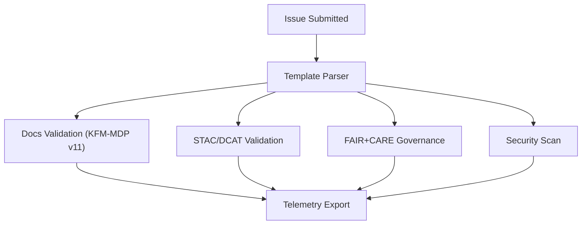

<div align="center">

# 🧾 **Kansas Frontier Matrix — Issue Templates & Governance Forms Overview**  
`.github/ISSUE_TEMPLATE/README.md`

**Purpose**  
Define the **full governance-aware issue template system** for KFM v11, aligning contributor-facing workflows with **FAIR+CARE**, **sovereignty**, **MCP-DL v6.3**, and **KFM-MDP v11** documentation standards.

[](#)  
[](#)  
[](#)

</div>

---

# 📘 1. Overview

Issue templates in KFM are **not simple GitHub conveniences** — they are part of the **governance and reproducibility architecture**.

Each template:

- Embeds **FAIR+CARE** metadata  
- Enforces **documentation-first** principles  
- Captures provenance & licensing  
- Identifies sovereignty and cultural protections  
- Activates automated CI/CD validation workflows  
- Routes governance and ethics evaluations  
- Ensures deterministic, reproducible reporting  

Issue templates act as **the first governance checkpoint** in the contributor workflow.

---

# 🗂 2. Directory Layout (v11 Option-B Standard)

```text
.github/ISSUE_TEMPLATE/                 # Governance-aware issue templates
│
├── README.md                           # This overview document
├── bug_report.yml                      # Deterministic bug reporting with repro metadata
├── feature_request.yml                 # Feature proposals with governance/a11y prompts
├── data_submission.yml                 # Dataset/STAC/DCAT ingestion + provenance declaration
└── governance_form.yml                 # CARE, sovereignty, and cultural-rights review
````

Each template is validated by:

* **docs_validate.yml** (KFM-MDP v11 docs compliance)
* **stac_validate.yml** (data_submission)
* **dcat_validate.yml**
* **faircare_validate.yml** (governance, CARE/Sovereignty)
* **security_audit.yml** (bug reports involving vulnerabilities)

---

# 🧩 3. Template Roles & Responsibilities

| Template                | Purpose                        | Required Fields                                      | Triggers                                          |
| ----------------------- | ------------------------------ | ---------------------------------------------------- | ------------------------------------------------- |
| **bug_report.yml**      | Capture reproducible defects   | environment, repro steps, expected/actual, logs      | ci.yml · security_audit                           |
| **feature_request.yml** | Request features w/ governance | rationale, FAIR+CARE, a11y, rollout                  | docs_validate                                     |
| **data_submission.yml** | Add/update datasets            | license, provenance, STAC/DCAT, bbox, temporal range | stac_validate · dcat_validate · faircare_validate |
| **governance_form.yml** | Cultural/Indigenous review     | CARE, sovereignty, consent, reviewer                 | faircare_validate · governance-ledger             |

Governance forms tie into the **KFM Governance Ledger**:

```
docs/reports/audit/governance-ledger.json
```

This ledger is append-only and is included in **release manifests**.

---

# 🗃 4. Template Architecture (Deep-Dive)

## 4.1 `bug_report.yml`

Captures:

* Runtime environment
* System area (web, ETL, graph, data, CI)
* Deterministic reproduction steps
* Logs & screenshots
* Dataset IDs or STAC Items involved
* Security classification

Failures here route to:

* `ci.yml`
* `security_audit.yml`

---

## 4.2 `feature_request.yml`

Captures:

* Feature rationale and expected user impact
* Dependencies (API, ETL, graph, web)
* Governance implications:

  * FAIR
  * CARE
  * Sovereignty
  * A11y
  * Sustainability

Architecture Council reviews features involving:

* Predictive models
* Cultural/heritage data
* Sensitive-site exposure
* New dataset categories

---

## 4.3 `data_submission.yml`

This is the **complex template** requiring:

* Dataset identifier
* STAC/DCAT metadata
* Provenance chain
* Spatial & temporal extents
* License validation
* CARE & sovereignty declarations
* Checksum

Activates:

* `stac_validate.yml`
* `dcat_validate.yml`
* `faircare_validate.yml`

Ensures **no dataset enters the monorepo** without governance alignment.

---

## 4.4 `governance_form.yml`

Used for:

* Indigenous / CARE review
* Cultural or sacred-site datasets
* Sensitive historical documents
* Non-public or governed content

Captures:

* CARE evaluation
* Sovereignty constraints
* Masking requirements
* Reviewer & decision metadata
* Access/retention rules

Outputs:

```
docs/reports/audit/governance-ledger.json
```

---

# 🔁 5. CI/CD Workflow Routing



Every Issue Form sends metadata to the **CI telemetry layer**, improving governance dashboards and FAIR+CARE analytics.

---

# ⚖️ 6. FAIR+CARE Integration (v11)

| Principle              | Template Enforcement                           |
| ---------------------- | ---------------------------------------------- |
| **F1 — Findable**      | provenance, IDs, schema links                  |
| **A1 — Accessible**    | license, access conditions                     |
| **I1 — Interoperable** | STAC/DCAT crosswalks                           |
| **R1 — Reusable**      | lineage, rights, documentation                 |
| **CARE Framework**     | sovereignty, consent, masking, cultural safety |

Issue Forms **encode** KFM’s ethical and governance obligations at the very start of the workflow.

---

# 📊 7. Telemetry Outputs

All templates feed telemetry categories:

* metadata completeness
* governance errors
* sovereignty / CARE flags
* provenance coverage
* license correctness
* a11y metadata success rate
* documentation compliance
* STAC/DCAT compliance

Telemetry written to:

```
releases/<version>/focus-telemetry.json
```

And summarized in governance dashboards.

---

# 🕰 8. Version History

| Version | Date       | Notes                                                                                  |
| ------: | ---------- | -------------------------------------------------------------------------------------- |
| v11.0.2 | 2025-11-19 | Full v11 architecture upgrade; expanded sovereignty processing; telemetry hooks added. |
| v11.0.1 | 2025-11-19 | Metadata enrichment, directory layout fix, stable MDP-v11 formatting.                  |
| v11.0.0 | 2025-11-18 | First full v11 version with FAIR+CARE alignment.                                       |
| v10.4.1 | 2025-11-16 | Added CARE and a11y fields.                                                            |
| v10.3.1 | 2025-11-13 | Introduced telemetry routing.                                                          |
| v10.0.0 | 2025-11-09 | Initial Issue Template docs.                                                           |

---

<div align="center">

**© 2025 Kansas Frontier Matrix — MIT / CC-BY 4.0**
Issue Templates & Governance Forms Overview
FAIR+CARE Compliant · MCP-DL v6.3 · KFM-MDP v11 · KFM-OP v11
Diamond⁹ Ω / Crown∞Ω Ultimate Certified

[Back to .github Overview](../README.md) ·
[GitHub Workflows Architecture](../workflows/README.md) ·
[Governance Charter](../../docs/standards/governance/ROOT-GOVERNANCE.md)

</div>
