<div align="center">

# 🧾 Kansas Frontier Matrix — **GitHub Issue Templates**  
`.github/ISSUE_TEMPLATE/README.md`

**Purpose:** Standardized issue creation & governance workflows for the Kansas Frontier Matrix (KFM).  
Templates enforce **Master Coder Protocol (MCP-DL v6.4.3 Diamond⁹ Ω)** and **FAIR+CARE** requirements for provenance, ethics, and reproducibility.

[](../../../docs/architecture/repo-focus.md)
[](../../../docs/standards/faircare-validation.md)
[](../../../docs/standards/governance/)
[](../../workflows/README.md)

</div>

---

## 📚 Overview

This directory defines all GitHub **Issue Templates** used for structured collaboration, reproducible bug tracking, data submissions, governance audits, and ethical reviews.  
Each template captures **FAIR+CARE-aligned metadata**, ensuring issues include sources, licenses, consent/ethics notes, and links to STAC/DCAT records for traceability.

**Templates**
- 🐛 **Bug Report** — Technical, validation, or pipeline defects.  
- 💡 **Feature Request** — Enhancements & new integrations.  
- ⚖️ **Governance Review** — Ethical/FAIR+CARE/doc reviews.  
- 🧭 **Data Request** — Request integration of external datasets/APIs.  
- 📦 **Data Submission** — Submit datasets/ETL sources/schema changes.  
- 🛡️ **Security Vulnerability** *(optional)* — Coordinated disclosure per `SECURITY.md`.

All issues automatically tie into **GitHub Actions** (`.github/workflows/`) for validation, tagging, and ledger/provenance updates.

---

## 🗂️ Directory Layout

```plaintext
.github/ISSUE_TEMPLATE/
├── README.md                    # This file — overview of issue template system
│
├── bug_report.yml               # Report technical issues or broken workflows
├── feature_request.yml          # Suggest new capabilities or data layers
├── governance_review.yml        # FAIR+CARE compliance & ethics reviews
├── data_request.yaml            # Request new data sources or external APIs
├── data_submission.yml          # New dataset ingestion or metadata registration
└── security_vulnerability.yml   # (Optional) Security report form, if enabled
```

> **Why templates?** They standardize metadata capture and **auto-trigger** CI validations for docs, STAC/DCAT, FAIR+CARE, and governance.

---

## ⚙️ Issue Workflow Integration

```mermaid
flowchart TD
  A[Contributor Opens Issue] --> B[Select Template]
  B --> C[Auto-Populate Governance Fields]
  C --> D[Run CI: docs-validate · stac-validate · dcat-export]
  D --> E[FAIR+CARE Checks & Ethics Review]
  E --> F[Governance Ledger Update + Checksums]
  F --> G[STAC/DCAT Sync & Labels]
  G --> H[Close · Merge · Archive]
```



Each issue type **initiates CI** to guarantee metadata completeness, ethical review, and catalog synchronization.

---

## 🧩 Issue Templates Summary

| Template | Purpose | Required Fields | Primary Workflow |
|---|---|---|---|
| `bug_report.yml` | Reproducible defects (ETL/AI/UI) | Steps, env, logs, impacted paths | `codeql.yml`, `docs-validate.yml` |
| `feature_request.yml` | Propose features/data layers | Rationale, design, deps, risks | `site.yml` |
| `governance_review.yml` | Ethics/FAIR+CARE review | FAIR+CARE fields, risk, reviewer | `faircare-validate.yml` |
| `data_request.yaml` | Request new external data | Source, license, STAC/DCAT plan, purpose | `stac-validate.yml`, `dcat-export.yml` |
| `data_submission.yml` | Submit datasets/schema | Source, license, spatial/temporal coverage, STAC item link | `stac-validate.yml`, `dcat-export.yml` |
| `security_vulnerability.yml` | Responsible disclosure | Impact, versions, PoC (optional), contact | `trivy.yml`, `SECURITY.md` flow |

---

## 🧠 FAIR+CARE Governance Fields

All templates include **required fields** to enforce governance-by-design:

| Field | Description |
|---|---|
| **Dataset Source** | Canonical origin or API endpoint. |
| **License / Access Rights** | Legal terms; note any restrictions. |
| **Ethical Review Status** | “Pending”, “Approved”, or “N/A”. |
| **Metadata File(s)** | Link to STAC Item / Collection and/or DCAT JSON-LD. |
| **Spatial / Temporal Coverage** | BBOX/geometry and date/period info. |
| **Reviewer** | FAIR+CARE reviewer or board assignee. |
| **CARE Flags** | Any sensitivity/consent/authority-to-control notes. |

> Collected fields feed the provenance ledger (`reports/audit/ai_hazards_ledger.json`) and FAIR reports (`reports/fair/**`).

---

## 🧾 Governance & Provenance Integration

Issue submission triggers:
1. **Metadata lint** and **docs validation** (`docs-validate.yml`).  
2. **STAC 1.0** checks and **DCAT 3.0** export sync (`stac-validate.yml`, `dcat-export.yml`).  
3. **FAIR+CARE** validation and ethics routing (`faircare-validate.yml`).  
4. **Ledger & hash updates** + telemetry publication.  

Artifacts and references:
- `docs/standards/governance/ROOT-GOVERNANCE.md`  
- `data/stac/**` (STAC Items/Collections)  
- `data/meta/**` (DCAT JSON-LD)  
- `reports/audit/**` (governance logs)  
- `../../../releases/v9.5.0/focus-telemetry.json` (Focus Mode signals)

---

## 🧩 FAIR+CARE Compliance

**FAIR**  
- *Findable:* Issues labeled & indexed; STAC/DCAT links included.  
- *Accessible:* Open YAML/GitHub forms; public docs links.  
- *Interoperable:* STAC/DCAT-aligned metadata in issues.  
- *Reusable:* Issues act as durable provenance records.

**CARE**  
- *Collective Benefit:* Open contribution channels with ethics oversight.  
- *Authority to Control:* Designated FAIR+CARE reviewers.  
- *Responsibility:* Mandatory sensitivity & consent declarations.  
- *Ethics:* Governance templates embody project ethics standards.

---

## 🧾 Version History

| Version | Date | Author | Summary |
|---|---|---|---|
| v9.5.0 | 2025-10-30 | @kfm-architecture | Upgraded to MCP-DL v6.4.3; added DCAT sync refs; optional `security_vulnerability.yml`; paths updated to v9.5.0. |
| v9.3.3 | 2025-10-28 | @kfm-architecture | Added `data_request.yaml` to directory and summary. |
| v9.3.2 | 2025-10-28 | @kfm-architecture | Added full governance metadata and workflow mapping. |
| v9.3.1 | 2025-10-27 | @bartytime4life | Integrated FAIR+CARE fields and automation triggers. |

---

<div align="center">

**Kansas Frontier Matrix** · *FAIR+CARE Governance × Open Collaboration × Provenance Integrity*  
[🔗 Repository](https://github.com/bartytime4life/Kansas-Frontier-Matrix) • [⚙️ Workflows](../../workflows/README.md) • [🧭 Governance Docs](../../../docs/standards/governance/)

</div>
