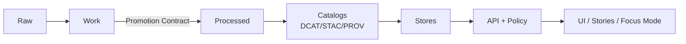

<!--
GOVERNED ARTIFACT NOTICE
File: .github/PULL_REQUEST_TEMPLATE.md (or equivalent)
This template is part of the KFM trust boundary. Changes affect governance behavior.
If you change meaning (not just phrasing), route through governance review (CODEOWNERS + CI gates).

Quick invariants 🧭:
- KFM is provenance-first and fails closed by default.
- Truth path must remain intact (no bypass):
  Raw → Work → Processed → Catalogs → Stores → Governed API (+ Policy) → UI/Stories/Focus Mode
- If receipts/catalogs/citations are missing, the system must deny/abstain.
-->

# 🚀 Pull Request — KFM Governed Change


> [!IMPORTANT]
> **Governed path only:** UI/AI must never query DB/storage directly. Everything goes through the governed API + policy boundary.  
> **Evidence-first:** If you can’t cite it, don’t ship it.  
> **Fail-closed:** Missing receipts/catalogs/citations/policy inputs must deny/abstain.

---

## 🧭 Summary

**What changed and why?**
- **Goal:** <!-- e.g., Improve dataset search relevance / Fix tile rendering / Add new Story Node -->
- **User impact:** <!-- who benefits, what’s improved -->
- **Risk level:** ☐ Low ☐ Medium ☐ High ☐ Critical  
- **Rollback plan:** <!-- how to revert safely; include release/commit/digest pointers if relevant -->

### ✅ Subsystems touched (check all that apply)

- ☐ 🧾 Receipts (run_record/run_manifest/spec_hash)  
- ☐ 🗂️ Catalogs (DCAT/STAC/PROV)  
- ☐ 🧊 Raw zone (`data/raw/`)  
- ☐ 🧪 Work zone (`data/work/`)  
- ☐ ✅ Processed zone (`data/processed/`)  
- ☐ 🧠 Stores (PostGIS / Neo4j / search / object store)  
- ☐ 🌐 API gateway (`src/server/`)  
- ☐ 📦 Pipelines (`pipelines/` or `src/pipelines/`)  
- ☐ 🧬 Graph (`src/graph/`)  
- ☐ 🖥️ Web UI (`web/`)  
- ☐ 📖 Story Nodes / docs (`docs/`)  
- ☐ 🛡️ Policy (`policy/` OPA/Rego)  
- ☐ 🧰 Tools/CI (`tools/`, `.github/`, `scripts/`)  
- ☐ 🔐 Infra/GitOps (`infra/`)  
- ☐ 🧠 Focus Mode (retrieval/grounding/citations)  

---

## 🧭 “Truth Path” touched?

_Check all that apply_

- ☐ Registry (dataset/watchers profiles) `data/registry/**`  
- ☐ Raw ingest `data/raw/**`  
- ☐ Work artifacts/receipts `data/work/**`  
- ☐ Processed artifacts `data/processed/**`  
- ☐ Catalog metadata `data/catalog/**`  
- ☐ Evidence bundles / digests `data/bundles/**` or OCI subjects  
- ☐ API/policy boundary (auth + redaction + cite-or-abstain)  
- ☐ UI / Story Nodes / Focus Mode  



---

## 🔗 Related issues / discussions

- Closes: #<!-- issue -->
- Related: #<!-- issue -->
- ADR / RFC / design doc: <!-- link(s) -->

---

## 🧩 Type of change

_Check all that apply_

- ☐ 🐛 Bug fix  
- ☐ ✨ Feature  
- ☐ ♻️ Refactor (no behavior change)  
- ☐ 🧪 Tests  
- ☐ 📝 Docs / content  
- ☐ 🗺️ Data addition / update  
- ☐ 🏭 Pipeline / ETL / promotion  
- ☐ 🧾 Catalogs / provenance  
- ☐ 🤖 Focus Mode / retrieval / grounding  
- ☐ 🔐 Security / governance policy  
- ☐ 🧱 Infra / CI / tooling  
- ☐ 🎨 UI/UX  

---

## 📦 Scope (folders impacted)

_Check folders impacted (helps reviewer routing)_

- ☐ `src/server/`  
- ☐ `src/pipelines/` or `pipelines/`  
- ☐ `src/graph/`  
- ☐ `src/shared/`  
- ☐ `web/`  
- ☐ `policy/`  
- ☐ `data/`  
- ☐ `docs/`  
- ☐ `tools/`  
- ☐ `scripts/`  
- ☐ `infra/`  
- ☐ `.github/`

### 🧷 Reviewer routing hints
- **Data/catalog/receipts:** reviewers comfortable with DCAT/STAC/PROV + checksums + Promotion Contract  
- **Geo performance:** PostGIS + tiles/indexing  
- **Policy:** OPA/Rego + regression tests  
- **Focus Mode:** evidence resolver + cite-or-abstain validator  
- **Infra:** GitOps + RBAC + network policy

---

## 🧪 Testing & validation

**What did you run?** (paste commands and results)

_Check all that apply_
- ☐ Unit tests  
- ☐ Integration tests  
- ☐ Lint / format  
- ☐ Typecheck  
- ☐ E2E (UI)  
- ☐ Policy tests (`opa test` / `conftest test`)  
- ☐ Receipts validation (run_manifest schema + checksums)  
- ☐ Catalog validation (DCAT/STAC/PROV + link-check)  
- ☐ Focus Mode eval / gold sets  
- ☐ Perf spot-check (tiles/search)  

### ✅ Commands
```bash
# paste commands you ran and any key output
```

### 📎 Evidence bundle (required for governed changes)
- **CI link / logs:** <!-- paste -->
- **Before/after proof (if relevant):** <!-- queries, screenshots, timings -->
- **Verification notes:** <!-- what changed, what remained invariant -->

---

## 🧾 Data / receipts / catalogs (fill out if any data path touched)

> [!IMPORTANT]
> Promotion is fail-closed. If receipts/catalogs/checksums are missing, promotion must deny.

### ✅ Dataset checklist
- ☐ dataset registered/updated (`data/registry/**`)
- ☐ raw manifest + checksums updated (`data/raw/<dataset_id>/**`)
- ☐ work run artifacts created (run_record + validation_report + run_manifest)
- ☐ processed artifacts immutable + checksums computed
- ☐ DCAT updated and validates (required)
- ☐ STAC updated and validates (if spatial assets exist)
- ☐ PROV updated and validates (required lineage)
- ☐ evidence bundle digest reference added (if bundles are used)
- ☐ fail-closed verified (missing proofs → blocked)
- ☐ sensitivity classification present and enforced

### 📌 Dataset details
- **Dataset ID:** `<!-- -->`
- **Run ID:** `<!-- -->`
- **Version ID / digest:** `<!-- -->`
- **License:** `<!-- -->`
- **Classification:** ☐ Public ☐ Internal ☐ Restricted  
- **Sensitivity flags:** ☐ sensitive_location ☐ culturally_sensitive ☐ pii_risk ☐ aggregate_only ☐ none  
- **DCAT:** `data/catalog/dcat/...`
- **STAC (if applicable):** `data/catalog/stac/...`
- **PROV:** `data/catalog/prov/...`
- **Receipts:** `data/work/.../run_manifest.json`

---

## 📖 Story / narrative changes (fill out if docs/story nodes changed)

### ✅ Story checklist
- ☐ correct template used (Story Node v3 / Universal Doc)
- ☐ every factual claim has citations (or explicit abstention)
- ☐ citations resolve to evidence views
- ☐ sensitivity reviewed (no restricted/sensitive-location leakage)
- ☐ stable IDs used where possible (dataset_id, version/digest refs)

### 🔎 Claim → source mapping (3+ key claims)
1) **Claim:** <!-- -->  
   **Evidence ref(s):** <!-- prov://… stac://… dcat://… doc://… graph://… -->  
2) **Claim:** <!-- -->  
   **Evidence ref(s):** <!-- -->  
3) **Claim:** <!-- -->  
   **Evidence ref(s):** <!-- -->  

---

## 🤖 Focus Mode (fill out if retrieval/grounding/policy changed)

### ✅ What changed?
- ☐ retrieval / embeddings  
- ☐ citation formatting / grounding  
- ☐ output validator (cite-or-abstain)  
- ☐ model runtime/config  
- ☐ refusal behavior / safety filtering  
- ☐ observability (audit/evidence chain)  

### 🧷 Grounding requirements
- ☐ citation-backed answers only (or abstain)
- ☐ refusal behavior verified when evidence missing
- ☐ no restricted/sensitive data leakage
- ☐ `audit_ref` always present

### 🧪 Test plan (minimum 3 example queries)
1) **Q:** <!-- -->  
   **Expected:** ☐ cite ☐ abstain  
   **Evidence refs:** <!-- -->  
2) **Q:** <!-- -->  
   **Expected:** ☐ cite ☐ abstain  
   **Evidence refs:** <!-- -->  
3) **Q:** <!-- -->  
   **Expected:** ☐ cite ☐ abstain  
   **Evidence refs:** <!-- -->  

---

## 🔐 Security / governance impact

_Check all that apply_
- ☐ no secrets/tokens added (verified)
- ☐ RBAC/permissions reviewed (least privilege)
- ☐ policy updated (OPA/Rego)
- ☐ fail-closed behavior preserved (missing proofs → deny)
- ☐ audit/evidence logging preserved
- ☐ threat model notes added (if meaningful)

**Security notes:** <!-- brief -->

---

## 🗄️ Database / migrations / indexing (if applicable)

- ☐ schema change  
- ☐ data migration  
- ☐ backfill job  
- ☐ index/tiles/search changes  

**Migration notes**
- Forward migration: <!-- -->
- Backward migration: <!-- -->
- Expected runtime: <!-- -->
- Risks: <!-- -->

---

## 🎨 UI/UX notes (if applicable)

- ☐ screenshots attached  
- ☐ responsive checked  
- ☐ accessibility checked (keyboard nav, contrast, labels)  
- ☐ map interactions validated (layers, timeline)  

**Before/after:** <!-- images/links -->

---

## ⚠️ Breaking changes

- ☐ None  
- ☐ Yes (details below)

**Breaking details**
- What breaks: <!-- -->
- Who is impacted: <!-- -->
- Migration path: <!-- -->
- Deprecation plan: <!-- -->

---

## ✅ Final checklist

- ☐ PR title is clear + scoped (e.g., `api:`, `web:`, `pipelines:`, `data:`)
- ☐ changes are reviewable (or split into follow-ups)
- ☐ tests added/updated as needed
- ☐ docs updated as needed
- ☐ no direct DB access added from UI (API remains the gate)
- ☐ receipts/catalogs updated when publishing/promotion changes occur
- ☐ cite-or-abstain preserved for Focus Mode
- ☐ fail-closed preserved end-to-end
- ☐ CARE-aligned handling confirmed if Indigenous/community data involved

---

<details>
<summary><strong>🧠 Reviewer notes (optional)</strong></summary>

- Suggested reviewers: @<!-- -->
- Areas to focus: <!-- risky logic / tricky behavior -->
- Follow-ups / TODOs: <!-- -->
- Known limitations: <!-- -->

</details>
