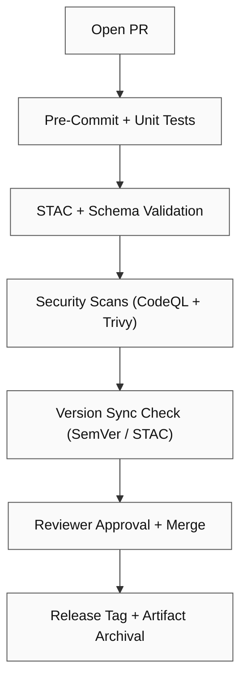

<div align="center">

# 🚀 Kansas Frontier Matrix — Pull Request Template

**Path:** `.github/PULL_REQUEST_TEMPLATE.md`  
**Purpose:** Guarantee every change is **documented, reproducible, versioned, validated, and auditable** — governed by the **Master Coder Protocol (MCP)**, **Semantic Versioning (SemVer)**, and KFM governance standards.

[](../.github/workflows/site.yml)
[](../.github/workflows/stac-validate.yml)
[](../.github/workflows/codeql.yml)
[](../.github/workflows/trivy.yml)
[](https://pre-commit.com/)
[](../docs/)
[](../LICENSE)

</div>

---

```yaml
---
template: "KFM Pull Request Template"
version: "v2.1.0"
last_updated: "2025-10-13"
authors: ["@bartytime4life", "@kfm-architecture", "@kfm-dataops"]
semver:
  bump: "auto-detect"
  allowed: ["patch", "minor", "major"]
  changelog_required: true
governance:
  reviewers_required: 2
  codeowners_check: true
security:
  actions_pinned: true
  trivy_scan_required: true
  codeql_scan_required: true
mcp:
  validation_required: true
  provenance_required: true
---
````

> <!-- Reviewer note: keep titles short & actionable. Use ADR links for non-trivial design decisions. -->

## 🧩 Summary

> Short description of what this PR does and *why*. Include motivation and measurable outcomes.

*Example:*
Adds STAC Items for **NOAA Climate (2020–2024)**, updates checksums, and connects layer to `web/config/layers.json`.

---

## 🔄 Related Issues / Discussions

* Closes #…
* Related: #…
* Discussion: …
* Project / Milestone: …
* ADR: `docs/adr/ADR-XXXX-<title>.md`

---

## 🧠 Type of Change *(select all that apply)*

* [ ] 🐛 **Bug Fix** — non-breaking fix resolving reproducible issue
* [ ] 💡 **Feature / Enhancement** — new functionality or workflow improvement
* [ ] 🗃️ **New Dataset / Integration** — new source, manifest, or STAC metadata
* [ ] 🧩 **Metadata Update** — STAC/schema documentation corrections
* [ ] 📖 **Documentation Update** — READMEs, guides, ADRs, or changelogs
* [ ] ⚙️ **CI/CD / Workflow** — GitHub Actions, automation, pre-commit
* [ ] 🔒 **Security / Validation** — CVE mitigation, checksum update, SBOM
* [ ] 🧹 **Refactor / Cleanup** — readability, structure, or naming
* [ ] 💥 **Breaking Change** — behavior or API contract change (see below)

---

## 🧮 Implementation Details

| Field                      | Description                                                    |
| :------------------------- | :------------------------------------------------------------- |
| **Affected Directories**   | e.g. `data/processed/hydro/`, `src/pipelines/`                 |
| **New Files Added**        | scripts, datasets, metadata; include relative paths            |
| **Dependencies Updated**   | pip/Node, lockfile, GitHub Actions pins                        |
| **Validation Performed**   | checksums verified, STAC validated, unit/integration tests     |
| **Backward Compatibility** | maintained or intentionally broken (document below)            |
| **Versioning Impact**      | see section below                                              |
| **Size / Scope**           | ~X files changed, ~Y insertions/deletions; risk: Low/Med/High  |
| **Rollback Plan**          | how to revert (tag/commit), cleanup steps, data rollback notes |
| **Data Migration**         | steps to rebuild/rehydrate data if schema changed              |

---

## 🧭 Versioning Summary (SemVer Alignment)

### 📦 Repository Version Bump

| Scope        | Proposed Version                           | Reason / Impact             |
| ------------ | ------------------------------------------ | --------------------------- |
| Repo Overall | `vX.Y.Z → vX.Y+1.Z`                        | Added new ETL datasets      |
| API          | `v1 → v2` (major) or `v1.3 → v1.4` (minor) | Endpoint change             |
| Web UI       | `v1.1 → v1.2`                              | Layer toggles or UI changes |
| Data STAC    | `v1.0.0 → v1.1.0`                          | Metadata schema update      |

* [ ] **PATCH** (bug/security fix)
* [ ] **MINOR** (backward-compatible feature)
* [ ] **MAJOR** (breaking change requiring migration)

**Tag/Release Checklist**

* [ ] Update `CHANGELOG.md`
* [ ] Update STAC Item `properties.version`
* [ ] Tag GitHub release (`vX.Y.Z`)
* [ ] Attach build artifacts (STAC, SARIF, SBOM, site bundle)
* [ ] Notify maintainers via Release Notes

---

## 📜 Changelog (Keep a Changelog Format)

```markdown
### Added
- NOAA Climate 2020–2024 STAC items; added to map layers.

### Changed
- Updated CRS for `soil_survey_1967` to EPSG:4326.
- Refactored `terrain_pipeline.py` to modular subfunctions.

### Fixed
- Hydrology accumulation bug in WhiteboxTools D8 step.

### Security
- Pinned `actions/setup-node@v4`; SBOM regenerated; Trivy scan passed.
```

---

## ✅ MCP + CI/CD Compliance

| MCP Principle       | Verification                                         |
| ------------------- | ---------------------------------------------------- |
| **Documentation**   | READMEs, STAC metadata, changelogs updated           |
| **Reproducibility** | Deterministic pipelines + checksum outputs           |
| **Open Standards**  | COG · GeoJSON · CSV/JSON · NetCDF only               |
| **Provenance**      | Source, license, checksum, and STAC lineage verified |
| **Auditability**    | CI logs + artifacts retained ≥ 90 days               |
| **Versioning**      | Semantic version updated across datasets + docs      |

---

## 🔍 Provenance / Data Lineage

* [ ] Updated `data/sources/*.json` with source URLs, license, `last_verified` date
* [ ] Added STAC `derived_from` / `dependencies` fields for lineage
* [ ] Verified checksums in `data/checksums/<domain>/*.sha256`

---

## 🧰 Validation Commands

```bash
# STAC validation
make stac-validate

# Pipeline rebuild
make hydro

# Checksums refresh
make checksums

# Unit / Integration tests
pre-commit run --all-files

# Docs build
make site && open _site/index.html
```

---

## 📎 Artifacts / Attachments

| Type                 | Path / Link                                |
| -------------------- | ------------------------------------------ |
| Logs                 | `data/work/logs/<domain>_etl_debug.log`    |
| Checksums            | `data/checksums/<domain>/*.sha256`         |
| STAC Items           | `data/stac/<domain>/*.json`                |
| Visuals / Thumbnails | `data/processed/metadata/<domain>/thumbs/` |
| Screenshots          | attach below                               |

---

## 🧪 Testing / QA Notes

* Test coverage: … %
* Steps for manual validation:

  1. …
  2. …
* Performance impacts: minimal / improved / N/A

---

## ♿ Accessibility (If UI Changes)

* [ ] Keyboard navigation and focus order verified
* [ ] Color contrast ≥ 4.5 : 1
* [ ] ARIA labels/roles validated
* [ ] `prefers-reduced-motion` respected

---

## 🔒 Security / License Review

* [ ] SBOM updated (`tools/sbom` or CI artifact)
* [ ] No new CVEs (CodeQL/Trivy)
* [ ] License compliance confirmed for new datasets
* [ ] Secrets verified absent (grep + secret-scan)
* [ ] GitHub Actions versions **pinned** (no `@latest`)

> **Pins & Secrets Mini-Audit**
>
> * Actions pinned by tag or SHA
> * No plaintext secrets committed
> * OIDC used for deployments (if applicable)

---

## 💥 Breaking Changes

| Component | Description                                    | Migration / Mitigation          |
| --------: | ---------------------------------------------- | ------------------------------- |
|       API | Deprecated `/api/v1/events` → `/api/v2/events` | See `docs/api_migration.md`     |
|   Dataset | Hydrology structure refactor                   | Rebuild using `make hydrology`  |
| Web Layer | Map config renamed                             | Update `layers.json` references |

---

## 🧾 Reviewer Versioning Checklist

| Step | Reviewer Action                                         | Status |
| ---: | ------------------------------------------------------- | :----: |
|    1 | Confirm all `version:` headers updated in changed files |    ☐   |
|    2 | Check CHANGELOG and STAC versions incremented           |    ☐   |
|    3 | Ensure release tag created (`vX.Y.Z`)                   |    ☐   |
|    4 | Verify CI/CD green                                      |    ☐   |
|    5 | Approve and merge                                       |    ☐   |

---

## 🧭 PR Validation Flow



---

## 📊 Release Notes (Preview)

* Add: NOAA Climate 2020–2024 STAC items and layers
* Change: CRS metadata correction for `soil_survey_1967`
* Security: Pin `actions/setup-node@v4` and attach SBOM

---

## 🕓 Version History (Template)

| Version | Date       | Author          | Summary                                   |
| ------: | ---------- | --------------- | ----------------------------------------- |
|  v2.1.0 | 2025-10-13 | KFM Maintainers | Risk/rollback/data-migration enhancements |
|  v2.0.0 | 2025-10-10 | KFM Maintainers | Full versioning + SemVer integration      |
|  v1.4.0 | 2025-09-15 | Core Docs       | Enhanced template to match MCP compliance |
|  v1.0.0 | 2025-07-01 | Project Launch  | Initial PR governance template            |

---

<div align="center">

### 🧭 Kansas Frontier Matrix

**“Every Pull Request Builds the Past, Present, and Future — Versioned Forever.”**

</div>
```
