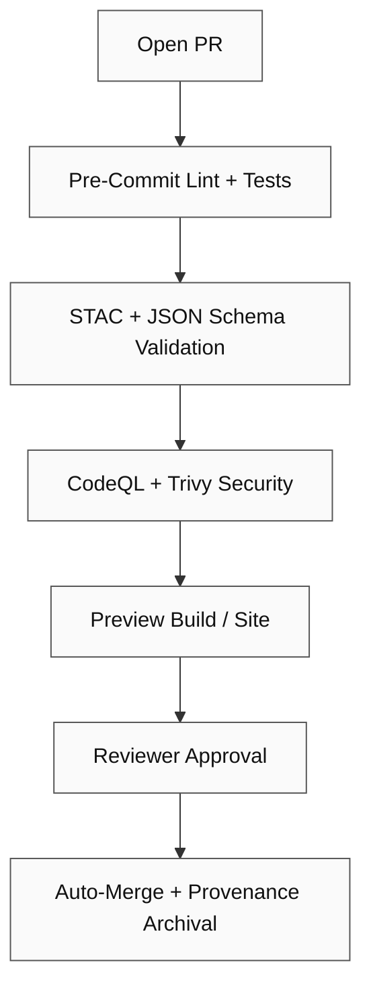

<div align="center">

# 🚀 Kansas Frontier Matrix — Pull Request Template

**Path:** `.github/PULL_REQUEST_TEMPLATE.md`

**Purpose:** Ensure every change to KFM is **documented, reproducible, validated, and auditable**,
in accordance with the **Master Coder Protocol (MCP)** and repository governance standards.

[](../.github/workflows/site.yml)
[](../.github/workflows/stac-validate.yml)
[](../.github/workflows/codeql.yml)
[](../.github/workflows/trivy.yml)
[](https://pre-commit.com/)
[](../docs/)
[](../LICENSE)

</div>

---

## 🧩 Summary

Concise description of what this PR changes and why.

> *Example:*
> Adds STAC Items for **NOAA Climate (2020–2024)**, updates checksums, and wires the layer into `layers.json`.

---

## 🔄 Related Issues / Discussions

Link to relevant GitHub issues, discussions, or project tasks.

* Closes #<id>
* Related: #<id>
* Discussion: <link>
* Project / Milestone: <link>

---

## 🧠 Type of Change

*Select all that apply:*

* [ ] 🐛 **Bug Fix** — non-breaking fix resolving a reproducible issue
* [ ] 💡 **Feature / Enhancement** — new functionality or workflow improvement
* [ ] 🗃️ **New Dataset / Integration** — new source, manifest, or STAC metadata
* [ ] 🧩 **Metadata Update** — STAC/schema documentation corrections
* [ ] 📖 **Documentation Update** — READMEs, guides, ADRs
* [ ] ⚙️ **CI/CD / Workflow** — Actions, pre-commit, or automation changes
* [ ] 🔒 **Security / Validation** — checksums, licenses, supply-chain updates
* [ ] 🧹 **Refactor / Cleanup** — readability, structure, or naming improvements
* [ ] 💥 **Breaking Change** — behavior or API contract change (see below)

---

## 🧮 Implementation Details

| Field                    | Description                                                     |
| :----------------------- | :-------------------------------------------------------------- |
| **Affected Directories** | (e.g. `data/processed/climate/`, `src/pipelines/`)              |
| **New Files Added**      | (scripts, datasets, metadata; include paths)                    |
| **Pipelines Modified**   | (e.g. `terrain_pipeline.py`, `climate_pipeline.py`)             |
| **Dependencies Updated** | (pip/Node; GitHub Actions pins)                                 |
| **Validation Performed** | (checksums verified, STAC/JSON Schema validated, tests passing) |

<details><summary><b>Changelog Snippet (Keep a Changelog / SemVer)</b></summary>

```markdown
### Added
- NOAA Climate 2020–2024 STAC items; wired to web layers

### Changed
- Updated `layers.json` to include climate overlays with temporal filters

### Fixed
- Corrected CRS metadata for `soil_survey_1967` item

### Security
- Bumped `actions/setup-node@v4` (pinned) and refreshed GH cache keys
```

</details>

---

## ✅ Checklist (MCP + CI/CD Compliance)

### 🧠 Documentation-First

* [ ] Updated or added `README.md` for affected directories
* [ ] Added/revised STAC metadata (Items/Collections)
* [ ] Updated `data/sources/*.json` manifests with `last_verified`

### 🔄 Reproducibility

* [ ] Ran `make <target>` successfully (list targets below in comments)
* [ ] Regenerated checksums for new/changed artifacts
* [ ] Outputs are deterministic (same input → same output)

### 🧩 Open Standards

* [ ] STAC validation passes (`stac-validator`)
* [ ] Only open formats used (COG, GeoTIFF, GeoJSON, CSV, JSON, NetCDF)
* [ ] Naming/schema follow MCP conventions

### 🔍 Provenance

* [ ] Source links in `data/sources/*.json` include citation + license
* [ ] Updated provenance chains for modified datasets
* [ ] SHA-256 checksums added/updated

### 🧾 Auditability

* [ ] All workflows green (site, stac-validate, codeql, trivy, pre-commit)
* [ ] Logs stored in `data/work/logs/` or linked as artifacts
* [ ] Peer review requested (`@core-maintainers`)

---

## 🧰 Validation Commands (Examples)

```bash
# Validate STAC structure
make stac-validate

# Rebuild specific pipeline
make terrain

# Compute / refresh checksums
make checksums

# Lint + unit tests
pre-commit run --all-files

# Build docs/site locally
make site && open _site/index.html
```

<details><summary><b>gh CLI / Advanced</b></summary>

```bash
# Trigger workflow manually
gh workflow run stac-validate.yml

# Inspect latest runs
gh run list

# Download validation artifact
gh run download --name "stac-report.json"
```

</details>

---

## 📎 Supporting Artifacts

| Type                 | Reference                                      |
| -------------------- | ---------------------------------------------- |
| Logs                 | `data/work/logs/<domain>_etl_debug.log`        |
| Checksums            | `data/checksums/<domain>/*.sha256`             |
| STAC Items           | `data/stac/<domain>/*.json`                    |
| Visuals / Thumbnails | `data/processed/metadata/<domain>/thumbnails/` |
| Screenshots          | (attach below)                                 |

---

## 🧪 Test & QA Notes

* Unit / integration test coverage: … %
* Manual QA steps:

  1. …
  2. …
* Performance considerations (if any): …

---

## 🧠 MCP Compliance Summary

| MCP Principle       | Implementation Verified                       |
| ------------------- | --------------------------------------------- |
| Documentation-first | 🗹 Updated README/metadata/manifest           |
| Reproducibility     | 🗹 Deterministic pipelines + checksum outputs |
| Open Standards      | 🗹 Formats adhere to public specs             |
| Provenance          | 🗹 Source, checksum, and STAC links verified  |
| Auditability        | 🗹 CI/SARIF logs retained and green           |

---

## ♿ Accessibility (If UI Changes)

* [ ] Keyboard navigation verified (focus order, skip links)
* [ ] Color contrast ≥ 4.5 : 1 (light/dark)
* [ ] ARIA roles/labels added or updated
* [ ] `prefers-reduced-motion` respected

---

## 🔒 Security / Licensing

* [ ] No secrets committed; env handled via Actions › Secrets
* [ ] Licenses verified for datasets and code dependencies
* [ ] SBOM / supply-chain reviewed (actions pinned, dependencies scanned)
* [ ] CVE scan clean (CodeQL / Trivy)

---

## 💥 Breaking Changes (If Any)

Describe the breaking change and the migration steps required.

* **Impact:** (who / what breaks)
* **Migration:** (step-by-step)
* **Deprecation Period:** (date / version)

---

## 🔖 Labels & Automation

Suggested labels for triage and automation:
`area:data`, `area:web`, `type:feature`, `type:bug`, `security`, `docs`, `priority:p1`, `good-first-issue`

---

## 🧩 Reviewer Checklist (Maintainers)

* [ ] All CI workflows pass
* [ ] No schema violations detected
* [ ] Checksums verified and updated
* [ ] Documentation conforms to MCP standards
* [ ] Code readability + formatting confirmed
* [ ] Datasets linked in STAC catalog
* [ ] License / provenance validated
* [ ] (If UI) Accessibility verified

---

## 🧭 PR Validation Flow (Reference)



---

## 📊 Release Notes (Preview)

Optional short entry for the CHANGELOG / Release Notes.

* Add: NOAA Climate 2020–2024 STAC items and layers
* Change: CRS metadata corrections for `soil_survey_1967`
* Security: Pin `actions/setup-node@v4` and refresh caches

---

## ✍️ Additional Comments

(Notes for reviewers, edge cases, known limitations, follow-ups, or backport plans.)

---

<div align="center">

### 🧭 Kansas Frontier Matrix

**“Every Pull Request Builds the Past, Present, and Future.”**

</div>
