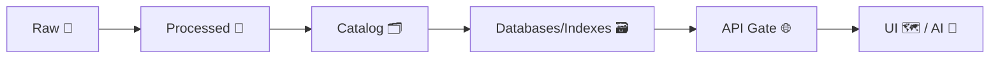

<!--
👋 Thanks for contributing to Kansas Frontier Matrix (KFM)!

Quick vibe check 🧭:
- KFM is **provenance-first** (“the map behind the map”) and **fails closed** by default 🔒
- Anything that touches data/AI must keep the “truth path” intact:
  Raw ➜ Processed ➜ Catalog ➜ Databases ➜ API ➜ UI/AI ✅
  (No bypassing the governed API layer 🚫)

If metadata/provenance is missing, the system should **block** (“fail closed”) ⛔
-->

# 🚀 Pull Request

`provenance-first` 🧾 `fail-closed` 🔒 `no-source-no-answer` 📎 `truth-path-enforced` 🧭

> [!IMPORTANT]
> **Governed path only:** UI/AI must never query DB/storage directly. Everything goes through the API gate 🌐  
> **Evidence-first:** If you can’t cite it, don’t ship it 📌

---

## 🧭 Summary
**What changed & why?**  
- **Goal:** <!-- e.g., Improve dataset search relevance / Fix tile rendering / Add new story node -->
- **User impact:** <!-- who benefits, what’s improved -->
- **Risk level:** ☐ Low ☐ Medium ☐ High  
- **Rollback plan:** <!-- how to revert safely if needed -->

### 🧩 “Truth Path” touched?
_Check all that apply_
- ☐ Raw ingest (`data/raw/`) 🧊
- ☐ Processing transforms (`data/processed/`) 🧼
- ☐ Catalog metadata (`data/catalog/`) 🗂️
- ☐ Provenance logs (`data/provenance/`) 🧾
- ☐ Runtime store (PostGIS/Neo4j/index/object storage) 🗃️
- ☐ API layer (policy + adapters) 🌐
- ☐ UI / Focus Mode 🤖🗺️



---

## 🔗 Related Issues / Discussions
- Closes: #<!-- issue -->
- Related: #<!-- issue -->
- Docs / ADR / RFC: <!-- link(s) -->

---

## 🧩 Type of Change
_Check all that apply_
- ☐ 🐛 Bug fix
- ☐ ✨ Feature
- ☐ ♻️ Refactor (no behavior change)
- ☐ 🧪 Tests
- ☐ 📝 Docs / content
- ☐ 🗺️ Data addition / update
- ☐ 🏭 Pipeline / ETL
- ☐ 🤖 AI / Focus Mode
- ☐ 🔐 Security / governance policy
- ☐ 🧱 Infra / CI / tooling
- ☐ 🎨 UI/UX

---

## 📦 Scope
_Check folders impacted (helps reviewers route faster)_
- ☐ `api/` 🧠 (FastAPI backend)
- ☐ `web/` 🖥️ (React + TypeScript UI)
- ☐ `pipelines/` 🏭 (ETL / jobs / transforms)
- ☐ `data/raw/` 🧊 (immutable source snapshots)
- ☐ `data/processed/` 🧼 (cleaned/standardized outputs)
- ☐ `data/catalog/` 🗂️ (STAC/DCAT metadata)
- ☐ `data/provenance/` 🧾 (W3C PROV lineage logs)
- ☐ `docs/` 📚 (architecture, stories, guides)
- ☐ `.github/` 🧰 (templates, workflows)

### 🧷 Reviewer routing hints
- **Data / provenance heavy:** tag a reviewer comfortable with STAC/DCAT + W3C PROV 🧾
- **Geo performance:** tag someone who knows PostGIS + tiles/indexing 🗺️
- **AI changes:** tag Focus Mode owners + governance reviewer 🤖🔐

---

## 🧪 Testing & Validation
**What did you run?** (paste commands + results)

_Check all that apply_
- ☐ Unit tests
- ☐ Integration tests
- ☐ Lint / format
- ☐ Typecheck
- ☐ E2E (UI)
- ☐ Pipeline dry-run / sample dataset run
- ☐ Load / perf spot-check (tiles/search) ⚡

### ✅ Commands (examples)
```bash
# api
# pytest
# ruff check .
# mypy .

# web
# npm test
# npm run lint
# npm run typecheck
# npm run build

# pipelines (example)
# python -m pipelines.run --dataset <id> --dry-run

# containers (example)
# docker compose up --build
```

### 📎 Evidence bundle (required)
- **CI link / test output:** <!-- paste -->
- **Screenshots / recordings (UI/map):** <!-- paste -->
- **Before/after query or tile proof (if relevant):** <!-- paste -->
- **Perf notes (if relevant):** <!-- what changed + quick measurement -->

> [!TIP]
> If this PR changes tiles/search performance, include a quick “before vs after” note (even a simple local benchmark) ⚡

---

## 🗺️ Data & Provenance
> [!IMPORTANT]
> KFM is “evidence-first.” If metadata/provenance is missing, the system should **block** (“fail closed”) ⛔  
> **No raw → UI bypass** and **no DB direct access from web** 🚫

### ✅ Dataset changes checklist
- ☐ Raw source snapshot added/updated in `data/raw/` **OR** referenced with immutable pointer 🧊
- ☐ Processed outputs in `data/processed/` match the transformation spec 🧼
- ☐ Catalog metadata updated in `data/catalog/` (**STAC items + DCAT dataset record**) 🗂️
- ☐ Provenance log updated/added in `data/provenance/` (**W3C PROV lineage**) 🧾
- ☐ **License** captured + compatible ⚖️
- ☐ **Sensitivity classification** set (public/restricted/confidential) 🔐
- ☐ Checksums / manifests updated (if applicable) 🧷
- ☐ “Fail closed” verified (missing metadata ➜ blocked) 🔒

### 📌 Dataset details
- **Dataset ID:** `<!-- e.g., ks_hydrology_1880 -->`
- **Temporal coverage:** <!-- start/end -->
- **Spatial coverage:** <!-- bbox / region -->
- **License:** <!-- e.g., CC-BY 4.0 / Public Domain -->
- **Sensitivity:** ☐ Public ☐ Restricted ☐ Confidential
- **Catalog record:** `data/catalog/<!-- path -->`
- **Provenance file:** `data/provenance/<!-- path -->`

### 🧾 Provenance “truth path” proof (paste paths)
- Raw: `data/raw/...`
- Processed: `data/processed/...`
- Catalog: `data/catalog/...`
- Provenance: `data/provenance/...`
- API endpoint(s): `GET /...` / `POST /...` (no direct DB) 🌐

---

## 📝 Story / Narrative Changes
_(Fill this out if you changed docs, story nodes, timelines, interpretive claims, etc.)_

### ✅ Story checklist
- ☐ Story includes clear sources (footnotes / references / `sources.json` / front matter) 📚
- ☐ Claims are tied to citations (**No Source, No Answer**) 📎
- ☐ Any sensitive cultural material flagged appropriately (CARE-aligned handling) 🪶
- ☐ Dates/places/entities are linkable (stable IDs where possible) 🧩

### 🔎 Claim → Source mapping (3+ key claims)
1) **Claim:** <!-- -->  
   **Source:** <!-- -->  
2) **Claim:** <!-- -->  
   **Source:** <!-- -->  
3) **Claim:** <!-- -->  
   **Source:** <!-- -->

---

## 🤖 AI / Focus Mode
_(Fill this out if anything in retrieval, embeddings, prompting, citations, policy, or model runtime changed.)_

### ✅ What changed?
- ☐ Prompt / policy changes 🧠
- ☐ Retrieval / embeddings 🔎
- ☐ Citation formatting / grounding 📎
- ☐ Model config / runtime (e.g., Ollama) 🧰
- ☐ Safety filtering / refusal behavior 🛡️
- ☐ Observability (logging/traces for evidence chain) 🧾

### 🧷 Grounding requirements
- ☐ AI responses remain citation-backed (**No Source, No Answer**) 📎
- ☐ Refusal behavior verified when evidence is missing 🔒
- ☐ AI outputs don’t leak restricted/confidential data 🛑
- ☐ Model behavior reviewed for bias/overconfidence risks (where applicable) ⚠️

### 🧪 Test plan (minimum 3 example queries)
1) **Q:** <!-- -->  
   **Expected:** <!-- -->  
   **Sources used:** <!-- -->  
2) **Q:** <!-- -->  
   **Expected:** <!-- -->  
   **Sources used:** <!-- -->  
3) **Q:** <!-- -->  
   **Expected:** <!-- -->  
   **Sources used:** <!-- -->

> [!NOTE]
> If Focus Mode touches high-stakes interpretation (health, safety, legal, culturally sensitive material), include extra validation + tighter refusal checks 🧯

---

## 🔐 Security / Governance Impact
_Check all that apply_
- ☐ No secrets/tokens added (✅ verified)
- ☐ RBAC/permissions reviewed (least privilege) 🧷
- ☐ OPA policies updated (if relevant) 🛡️
- ☐ “Fail closed” behavior preserved (missing metadata ➜ blocked) 🔒
- ☐ Audit/provenance logging still captured 🧾
- ☐ Threat model notes added (if meaningful) 🧠

**Security notes:** <!-- brief -->

---

## 🗄️ Database / Migrations / Indexing
_(If applicable)_
- ☐ Schema change 🧱
- ☐ Data migration 🔁
- ☐ Backfill job 🏗️
- ☐ Index changes (tiles/search performance) ⚡

### 🧬 Migration notes
- **Forward migration:** <!-- steps -->
- **Backward migration:** <!-- steps -->
- **Expected runtime:** <!-- estimate -->
- **Risks:** <!-- -->

---

## 🎨 UI/UX Notes
_(If applicable)_
- ☐ Screenshots attached 🖼️
- ☐ Mobile/responsive checked 📱
- ☐ Accessibility checked (keyboard nav, contrast, labels) ♿
- ☐ Map interactions validated (layers, timeline, 2D/3D if relevant) 🗺️

**Before/After:** <!-- images/links -->

### 🧭 UX acceptance checks
- ☐ Navigation is consistent + predictable 🧭
- ☐ Empty/error/loading states handled (fail closed UX) 🔒
- ☐ No confusing “answers” without citations in UI 🤖📎

---

## ⚠️ Breaking Changes
- ☐ None ✅
- ☐ Yes (describe below) 🚨

### Breaking details
- **What breaks:** <!-- -->
- **Who is impacted:** <!-- -->
- **Migration path:** <!-- -->
- **Deprecation plan (if any):** <!-- -->

---

## ✅ Final Checklist
- ☐ PR title is clear + scoped (e.g., `api:`, `web:`, `pipelines:`, `data:`) 🏷️
- ☐ Changes are reviewable (or split into follow-ups) 👀
- ☐ Docs updated where needed 📚
- ☐ Tests added/updated where needed 🧪
- ☐ Data changes include license + provenance + catalog metadata 🧾
- ☐ No direct DB access added from UI (API remains the gate 🌐) 🔒
- ☐ “Fail closed” behavior preserved end-to-end 🔐
- ☐ If Indigenous/community data is involved: CARE-aligned handling confirmed 🪶

---

<details>
<summary>🧠 Reviewer Notes (optional)</summary>

- Suggested reviewers: @<!-- -->
- Areas to focus: <!-- tricky logic, risky changes -->
- Follow-ups / TODOs: <!-- -->
- Known limitations: <!-- -->

</details>

<!--
📚 Internal references used to shape this template (project + method guidance):
- Kansas Frontier Matrix (KFM) – Comprehensive System Documentation  [oai_citation:0‡Kansas Frontier Matrix Comprehensive System Documentation.pdf](sediment://file_00000000ef40722faf17987b69730695)
- Indigenous Statistics (CARE / Indigenous Data Sovereignty context)  [oai_citation:1‡Indigenous Statistics.pdf](sediment://file_0000000033ec72308e1f791a79f61bfe)
- AI/ML Best Practices & Pitfalls (risk, rigor, evaluation mindset)  [oai_citation:2‡Artificial Intelligence & Machine Learning in Health Care & Medical Sciences.pdf](sediment://file_0000000036fc71fda445161776f735db)
- Professional Web Design (usability/accessibility mindset)  [oai_citation:3‡professional-web-design-techniques-and-templates.pdf](sediment://file_000000000acc71f8b2e5128c030179fc)
- Learn to Code HTML & CSS (frontend structure + maintainability mindset)  [oai_citation:4‡learn-to-code-html-and-css-develop-and-style-websites.pdf](sediment://file_00000000ed6471fdb0ecead71e051444)
- Node.js fundamentals (server/runtime awareness)  [oai_citation:5‡Node.js-React-CSS-HTML.pdf](sediment://file_00000000b09c71f8b277cb19b9f597b2)
-->