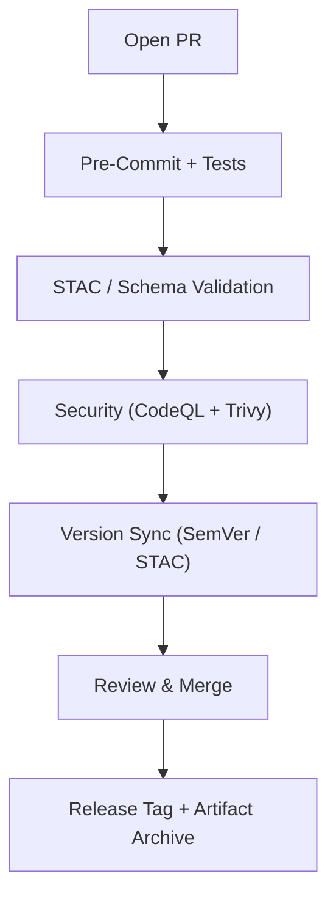

<div align="center">

# 🚀 **Kansas Frontier Matrix — Pull Request Template**

**Path:** `.github/PULL_REQUEST_TEMPLATE.md`
**Purpose:** Ensure every change is **documented · reproducible · versioned · validated · auditable** under
**Master Coder Protocol (MCP)** · **Semantic Versioning (SemVer)** · **KFM Governance Standards**

[](./workflows/site.yml)
[](./workflows/stac-validate.yml)
[](./workflows/codeql.yml)
[](./workflows/trivy.yml)
[](https://pre-commit.com/)
[](../docs/)

</div>

---

## 🧹 Summary

Describe what this PR changes and why — **motivation** + **measurable outcomes**.
**Example:** Adds STAC Items for NOAA Climate (2020–2024) and updates `web/config/layers.json`.

---

## 🛄 Linked Issues / Discussions

| Type              | Reference                      | Notes                |
| ----------------- | ------------------------------ | -------------------- |
| 𞳲 **Issue**      | Closes #…                      |                      |
| 💬 **Discussion** | #…                             | Context / background |
| 📘 **ADR**        | `docs/adr/ADR-####-<title>.md` | Decision rationale   |

---

## 🧠 Type of Change

> Select **one or more** labels when opening the PR.

* [ ] 🐛 **Bug Fix** — resolve reproducible defect
* [ ] 💡 **Feature / Enhancement** — new functionality or workflow
* [ ] 🗃️ **Dataset / Integration** — new source · manifest · STAC metadata
* [ ] 📖 **Documentation** — READMEs · guides · ADRs
* [ ] ⚙️ **CI/CD** — automation · pre-commit · workflows
* [ ] 🔒 **Security / Validation** — CVE fix · checksum · SBOM
* [ ] 🪩 **Refactor / Cleanup** — readability · structure
* [ ] 💥 **Breaking Change** — API / schema migration required

---

## 🧰 Implementation Summary

| Field             | Description                                      |
| ----------------- | ------------------------------------------------ |
| **Affected Dirs** | `data/processed/hydro/` · `src/pipelines/`       |
| **New Files**     | Scripts · datasets · metadata                    |
| **Deps Updated**  | pip / Node · Action pins                         |
| **Validation**    | STAC · JSON Schema · unit/integration tests      |
| **Compatibility** | Maintained / broken                              |
| **Scope**         | ≈ X files · Y insertions · Risk Low / Med / High |
| **Rollback Plan** | Tag · cleanup · data revert                      |
| **Migration**     | Rebuild if schema changed                        |

---

## 🧭 Versioning (SemVer)

| Domain           | Change            | New Version           |
| ---------------- | ----------------- | --------------------- |
| **Repo Overall** | Minor feature add | `vX.Y.Z → vX.(Y+1).Z` |
| **API**          | Endpoint update   | `v1.3 → v1.4`         |
| **Web UI**       | UI toggle changes | `v1.1 → v1.2`         |
| **Data (STAC)**  | Metadata update   | `v1.0.0 → v1.1.0`     |

**Release Checklist**

* [ ] CHANGELOG updated
* [ ] STAC version bumped
* [ ] Tag `vX.Y.Z` created
* [ ] Artifacts attached
* [ ] Maintainers notified

---

## 📜 Changelog (Sample)

### Added

* NOAA Climate 2020–2024 STAC Items · map integration

### Changed

* Reprojected `soil_survey_1967` → `EPSG:4326`

### Fixed

* Hydrology accumulation bug (D8 step)

### Security

* Pinned `actions/setup-node@v4` · SBOM regen · Trivy passed

---

## ✅ MCP / CI Compliance

| Principle              | Verification                        |
| ---------------------- | ----------------------------------- |
| 📖 **Documentation**   | READMEs · STAC · CHANGELOG          |
| 🧱 **Reproducibility** | Deterministic pipelines + checksums |
| 🌐 **Open Standards**  | COG · GeoJSON · CSV/JSON · NetCDF   |
| 🗒️ **Provenance**     | Source · License · STAC lineage     |
| 🕵️ **Auditability**   | CI logs + artifacts (≥ 90 days)     |
| 📏 **Versioning**      | SemVer applied to all domains       |

---

## 🔍 Provenance / Data Lineage

* Updated `data/sources/*.json` (`url` · `license` · `last_verified`)
* Added STAC `derived_from` / `dependencies` fields
* Verified checksums → `data/checksums/<domain>/`

---

## 🧰 Validation Commands

```bash
pre-commit run --all-files
make stac-validate
make checksums
make site && open _site/index.html
# domain ETL example
make hydro
```

---

## 📌 Artifacts / Attachments

| Type        | Path / Link                                |
| ----------- | ------------------------------------------ |
| Logs        | `data/work/logs/<domain>_etl_debug.log`    |
| Checksums   | `data/checksums/<domain>/*.sha256`         |
| STAC Items  | `data/stac/<domain>/*.json`                |
| Visuals     | `data/processed/metadata/<domain>/thumbs/` |
| Screenshots | *(attach below)*                           |

---

## 🧪 Testing / QA

| Item               | Result                   |
| ------------------ | ------------------------ |
| Coverage           | %                        |
| Performance Impact | Minimal / Improved / N·A |
| Manual Steps       | 1️⃣ …  2️⃣ …             |

---

## ♿ Accessibility (UI Changes)

| Check                   | Status |
| ----------------------- | :----: |
| Keyboard Navigation     |    ☑   |
| Color Contrast ≥ 4.5:1  |    ☑   |
| ARIA Labels / Roles     |    ☑   |
| Respects Reduced Motion |    ☑   |

---

## 🔒 Security / License Review

| Audit Item                  | Status |
| --------------------------- | :----: |
| SBOM Updated                |    ☑   |
| No new CVEs (CodeQL/Trivy)  |    ☑   |
| License Compliance          |    ☑   |
| Secrets Scan / OIDC         |    ☑   |
| Actions Pinned (no @latest) |    ☑   |

**Mini-Audit Summary:** All actions pinned ✔ · No plaintext secrets ✔ · OIDC deployments active ✔

---

## 💥 Breaking Changes

| Component | Description                       | Migration / Mitigation          |
| --------- | --------------------------------- | ------------------------------- |
| API       | `/api/v1/events → /api/v2/events` | See `docs/api_migration.md`     |
| Dataset   | Hydrology schema refactor         | `make hydrology`                |
| Web Layer | Map config rename                 | Update `web/config/layers.json` |

---

## 🗒️ Reviewer Checklist

| # | Action                          | Done |
| - | ------------------------------- | :--: |
| 1 | Verify version headers          |   ☑  |
| 2 | Check CHANGELOG / STAC versions |   ☑  |
| 3 | Confirm release tag created     |   ☑  |
| 4 | Ensure CI is green              |   ☑  |
| 5 | Approve and merge               |   ☑  |

---

## 🧭 Validation Flow



---

## 🕓 Version History

| Version | Date       | Author            | Summary                                 |
| ------- | ---------- | ----------------- | --------------------------------------- |
| v2.3.1  | 2025-10-15 | KFM Maintainers   | MCP-DL v6.3 alignment · fenced Mermaid  |
| v2.3.0  | 2025-10-15 | KFM Maintainers   | Polished tables · visual layout upgrade |
| v2.2.0  | 2025-10-14 | KFM Maintainers   | MCP-DL v6.2 alignment · checksum fields |
| v2.1.0  | 2025-10-13 | Core Docs         | Risk / rollback sections enhanced       |
| v2.0.0  | 2025-10-10 | Architecture Team | SemVer integration baseline             |
| v1.0.0  | 2025-07-01 | Project Launch    | Initial template release                |

---

<div align="center">

### 🧭 Kansas Frontier Matrix

"“Every Pull Request builds the past, present, and future — versioned forever.”"

</div>
