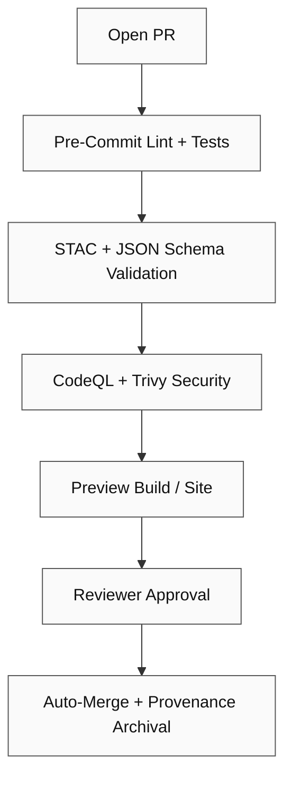

<div align="center">

# 🚀 Kansas Frontier Matrix — Pull Request Template

**Path:** `.github/PULL_REQUEST_TEMPLATE.md`
**Purpose:** Make every change **documented, reproducible, validated, versioned, and auditable** per **Master Coder Protocol (MCP)** and repo governance.

[](../.github/workflows/site.yml)
[](../.github/workflows/stac-validate.yml)
[](../.github/workflows/codeql.yml)
[](../.github/workflows/trivy.yml)
[](https://pre-commit.com/)
[](../docs/)
[](../LICENSE)

</div>

---

```yaml
---
template: "KFM Pull Request"
version: "v1.4.0"                       # template version
last_updated: "2025-10-10"
required_labels: ["triage", "semver", "domain"]
governance:
  required_reviews: 2
  codeowners_enforced: true
  branch: "main"
security:
  actions_pinned: true
  allow_secrets_from_forks: false
---
```

## 🧩 Summary

> Concise description of what this PR changes and why.

*Example:* Adds STAC Items for **NOAA Climate (2020–2024)**, updates checksums, and wires the layer into `web/config/layers.json`.

---

## 🔄 Related Issues / Discussions

* Closes #…
* Related: #…
* Discussion: …
* Project / Milestone: …
* ADR (Architecture Decision Record): `docs/adr/ADR-XXXX-<title>.md` (if applicable)

---

## 🧠 Type of Change

*Select all that apply:*

* [ ] 🐛 **Bug Fix** — non-breaking fix resolving a reproducible issue
* [ ] 💡 **Feature / Enhancement** — new functionality or workflow improvement
* [ ] 🗃️ **New Dataset / Integration** — new source, manifest, or STAC metadata
* [ ] 🧩 **Metadata Update** — STAC/schema documentation corrections
* [ ] 📖 **Documentation Update** — READMEs, guides, ADRs
* [ ] ⚙️ **CI/CD / Workflow** — Actions, pre-commit, or automation changes
* [ ] 🔒 **Security / Validation** — checksums, licenses, SBOM/supply-chain
* [ ] 🧹 **Refactor / Cleanup** — readability, structure, or naming
* [ ] 💥 **Breaking Change** — behavior or API contract change (see below)

---

## 🧮 Implementation Details

| Field                    | Description                                                   |
| :----------------------- | :------------------------------------------------------------ |
| **Affected Directories** | e.g. `data/processed/climate/`, `src/pipelines/`              |
| **New Files Added**      | scripts, datasets, metadata; include paths                    |
| **Pipelines Modified**   | e.g. `terrain_pipeline.py`, `climate_pipeline.py`             |
| **Dependencies Updated** | pip/Node updates; GitHub Actions pins                         |
| **Validation Performed** | checksums verified; STAC/JSON Schema validated; tests passing |
| **Performance/Costs**    | runtime, memory, cache impacts; storage growth estimates      |
| **Data Quality Checks**  | missingness, CRS, spatial joins, value ranges                 |

<details><summary><b>Changelog Snippet (Keep a Changelog + SemVer)</b></summary>

```markdown
### Added
- NOAA Climate 2020–2024 STAC items; wired to web layers

### Changed
- Updated `layers.json` to include climate overlays with temporal filters

### Fixed
- Corrected CRS metadata for `soil_survey_1967` item

### Security
- Pinned `actions/setup-node@v4` + refreshed caches; SBOM attached to release
```

</details>

---

## 🧭 Versioning (SemVer) & Release Impact

> Declare the *proposed* version change(s). Maintainers confirm during review.

**Repo SemVer Impact:**

* [ ] `PATCH` (fixes only)
* [ ] `MINOR` (backward-compatible feature)
* [ ] `MAJOR` (breaking changes)

**Domains Affected:**

* API: bump? `v… → v…`
* Datasets (STAC `properties.version` updated):

  * [ ] Climate
  * [ ] Hydrology
  * [ ] Treaties/Deeds
  * [ ] Topo/Overlays
  * [ ] Other: …

**Models:** `docs/model_card.md` updated with **model version**, dataset snapshot, training hash
**Release Notes (preview):** (see end of template)

---

## 📦 Dataset & STAC Impact (if datasets involved)

| Dataset / Item Path                     | Change Type | `properties.version` | License | Source URL | Checksum (.sha256) |
| --------------------------------------- | ----------- | -------------------- | ------- | ---------- | ------------------ |
| `data/stac/climate/noaa_2020_2024.json` | Add/Update  | v…                   | …       | …          | ✅                  |
| …                                       | …           | …                    | …       | …          | …                  |

* [ ] Updated `data/sources/*.json` with `last_verified` date & citation
* [ ] Rebuilt COG/GeoJSON with deterministic settings (reprojection to EPSG:4326, internal tiling)
* [ ] Regenerated checksums in `checksums/`

---

## ✅ MCP + CI/CD Compliance Checklist

### 🧠 Documentation-First

* [ ] READMEs updated for affected directories
* [ ] STAC Items/Collections added/updated (valid JSON)
* [ ] ADR authored/updated if design change

### 🔄 Reproducibility

* [ ] `make <targets>` executed successfully (list below)
* [ ] Deterministic outputs confirmed (same input → same output)
* [ ] Environment pinned (Dockerfile/requirements/lockfiles)

### 🧩 Open Standards

* [ ] STAC validation passes (`make stac-validate`)
* [ ] Only open formats (COG, GeoTIFF, GeoJSON, CSV/JSON, NetCDF)
* [ ] Naming/schema follow KFM/MCP conventions

### 🔍 Provenance

* [ ] Sources cited with license in `data/sources/*.json`
* [ ] STAC `derived_from` populated; lineage documented
* [ ] SHA-256 checksums added/updated

### 🧾 Auditability

* [ ] All workflows green (site, stac-validate, codeql, trivy, pre-commit)
* [ ] Logs uploaded as artifacts or stored under `data/work/logs/`
* [ ] Peer review requested from CODEOWNERS

### 🔒 Security & Supply Chain

* [ ] No secrets in code; Actions secrets used where needed
* [ ] Actions pinned by tag/commit; SBOM generated (if build)
* [ ] CodeQL + Trivy scans clean (no new High/Critical)

---

## 🧰 Validation Commands (Examples)

```bash
# Validate STAC structure
make stac-validate

# Rebuild specific pipeline
make terrain

# Compute / refresh checksums
make checksums

# Lint + unit tests
pre-commit run --all-files

# Build docs/site locally
make site && open _site/index.html
```

<details><summary><b>gh CLI / Advanced</b></summary>

```bash
# Trigger workflow manually
gh workflow run stac-validate.yml

# Inspect latest runs
gh run list

# Download validation artifact
gh run download --name "stac-report.json"
```

</details>

---

## 📎 Supporting Artifacts

| Type                 | Reference                                      |
| -------------------- | ---------------------------------------------- |
| Logs                 | `data/work/logs/<domain>_etl_debug.log`        |
| Checksums            | `data/checksums/<domain>/*.sha256`             |
| STAC Items           | `data/stac/<domain>/*.json`                    |
| Visuals / Thumbnails | `data/processed/metadata/<domain>/thumbnails/` |
| Screenshots          | (attach below)                                 |

---

## 🧪 Test & QA Notes

* Unit / integration test coverage: … %
* Manual QA steps:

  1. …
  2. …
* Performance impacts / budgets: …

---

## ♿ Accessibility (If UI Changes)

* [ ] Keyboard navigation verified (focus order, skip links)
* [ ] Color contrast ≥ 4.5 : 1 (light/dark)
* [ ] ARIA roles/labels added or updated
* [ ] `prefers-reduced-motion` respected

---

## 🔒 Security / Licensing

* [ ] Dataset and code licenses verified / recorded
* [ ] SBOM reviewed / attached to release (if build artifact)
* [ ] CVE scan clean (CodeQL / Trivy)
* [ ] DCO/Signoff present (if required by repo policy)

---

## 💥 Breaking Changes (If Any)

**Impact:** (who / what breaks)
**Migration:** (step-by-step)
**Deprecation Period:** (date / version)
**Backports:** (release branches to target, if any)

---

## 🔖 Labels & Automation

Suggested labels:
`area:data`, `area:web`, `type:feature`, `type:bug`, `security`, `docs`, `priority:p1`, `good-first-issue`, `semver:patch|minor|major`

---

## 🧩 Reviewer Checklist (Maintainers)

* [ ] All CI workflows pass
* [ ] No schema violations detected
* [ ] Checksums verified and updated
* [ ] Documentation conforms to MCP standards
* [ ] Code readability + formatting confirmed
* [ ] Datasets linked/updated in STAC catalog
* [ ] License / provenance validated
* [ ] (If UI) Accessibility verified
* [ ] Version bump rationale (SemVer) validated; release notes ready

---

## 🧭 PR Validation Flow (Reference)



---

## 📊 Release Notes (Preview)

Short entry for CHANGELOG / Release:

* Add: NOAA Climate 2020–2024 STAC items and layers
* Change: CRS metadata corrections for `soil_survey_1967`
* Security: Pin `actions/setup-node@v4`, refresh caches, attach SBOM

---

## ✍️ Additional Comments

(Notes for reviewers, edge cases, known limitations, follow-ups, or backport plan.)

---

<div align="center">

### 🧭 Kansas Frontier Matrix

**“Every Pull Request Builds the Past, Present, and Future.”**

</div>
