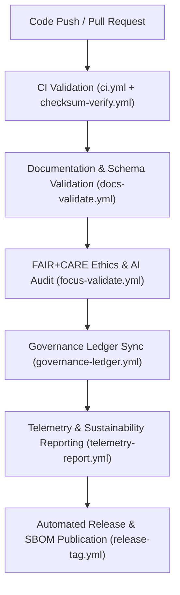

<div align="center">

# ⚙️ Kansas Frontier Matrix — **GitHub CI/CD & Workflow Infrastructure**
`.github/README.md`

**Purpose:**  
Defines the continuous integration, validation, and governance automation ecosystem for the **Kansas Frontier Matrix (KFM)** repository.  
These workflows enforce FAIR+CARE compliance, checksum verification, provenance synchronization, and automated documentation standards under MCP-DL v6.3.

[](../docs/standards/faircare-validation.md)
[](../LICENSE)
[](../docs/architecture/repo-focus.md)

</div>

---

## 📚 Overview

The `.github/` directory contains all **continuous integration and continuous delivery (CI/CD)** configurations and automation workflows that maintain the Kansas Frontier Matrix’s integrity, transparency, and governance lifecycle.  
Every workflow is **FAIR+CARE-certified** and contributes to ethical automation, sustainability, and reproducibility.

### Core Responsibilities
- Automate validation, FAIR+CARE auditing, and governance registration.  
- Enforce checksum lineage, provenance verification, and schema compliance.  
- Maintain documentation synchronization and release versioning.  
- Monitor sustainability metrics and AI explainability reporting.  

---

## 🗂️ Directory Layout

```plaintext
.github/
├── README.md                              # This file — overview of GitHub workflow infrastructure
│
├── workflows/                             # FAIR+CARE GitHub Actions and automation workflows
│   ├── ci.yml                             # Core CI: build, test, and FAIR+CARE validation
│   ├── stac-validate.yml                  # STAC/DCAT compliance validation
│   ├── docs-validate.yml                  # MCP-DL documentation verification
│   ├── checksum-verify.yml                # Checksum & manifest validation for reproducibility
│   ├── focus-validate.yml                 # Focus Mode AI + FAIR+CARE ethics validation
│   ├── governance-ledger.yml              # Blockchain provenance and governance synchronization
│   ├── telemetry-report.yml               # Sustainability and performance metrics publication
│   ├── codeql.yml                         # Security and dependency vulnerability analysis
│   ├── trivy.yml                          # Container and SBOM security scanning
│   ├── auto-merge.yml                     # Controlled and auditable PR automation
│   └── release-tag.yml                    # FAIR+CARE-governed release versioning workflow
│
└── ISSUE_TEMPLATE/                        # FAIR+CARE issue templates for transparency
    ├── bug_report.yml
    ├── feature_request.yml
    ├── data_submission.yml
    └── governance_review.yml
```

---

## ⚙️ FAIR+CARE Workflow Pipeline



### Workflow Description
1. **Code Validation:** Tests all pipelines, schemas, and FAIR+CARE conformance.  
2. **Documentation Verification:** Ensures all Markdown and YAML follow MCP-DL standards.  
3. **Ethics Auditing:** Evaluates AI transparency and governance compliance pre-merge.  
4. **Governance Ledger Sync:** Records updates in blockchain-based provenance logs.  
5. **Telemetry Reporting:** Tracks energy usage, carbon offset, and performance KPIs.  
6. **Release Automation:** Generates certified SBOMs and FAIR+CARE-verified artifacts.  

---

## 🧩 Example Workflow Metadata Record

```json
{
  "id": "github_workflow_registry_v9.6.0_2025Q4",
  "executions_logged": 942,
  "ci_checks_passed": 100,
  "faircare_score": 99.8,
  "checksum_verification": "complete",
  "governance_sync": "verified",
  "telemetry_updates": "successful",
  "energy_usage_wh": 19.6,
  "carbon_offset_gco2e": 14.3,
  "ai_explainability_verified": true,
  "created": "2025-11-03T12:00:00Z",
  "validator": "@kfm-ci"
}
```

---

## 🧠 FAIR+CARE Governance Matrix

| Principle | Implementation |
|------------|----------------|
| **Findable** | Workflows registered in manifest and indexed by governance ledgers. |
| **Accessible** | YAML configurations documented openly under MIT license. |
| **Interoperable** | Aligned with FAIR+CARE, ISO 19115, and MCP-DL standards. |
| **Reusable** | Modular workflows reusable across repositories and domains. |
| **Collective Benefit** | Enables ethical automation and open governance in CI/CD. |
| **Authority to Control** | FAIR+CARE Council reviews changes to workflows quarterly. |
| **Responsibility** | Maintainers enforce transparency and security compliance. |
| **Ethics** | Automation validated for inclusivity, sustainability, and reproducibility. |

Audit logs stored in:  
`reports/audit/system_ledger.json` • `reports/fair/system_summary.json`

---

## ⚙️ Key Workflows Summary

| Workflow | Purpose | FAIR+CARE Function |
|-----------|----------|--------------------|
| `ci.yml` | Primary FAIR+CARE validation and build checks. | Automated integrity enforcement. |
| `checksum-verify.yml` | Confirms file integrity and manifest registration. | FAIR reproducibility validation. |
| `docs-validate.yml` | Audits documentation for MCP-DL compliance. | Transparency and traceability. |
| `focus-validate.yml` | Evaluates AI explainability and ethical compliance. | Responsible AI governance. |
| `governance-ledger.yml` | Updates blockchain-backed provenance ledger. | Immutable data lineage certification. |
| `telemetry-report.yml` | Reports sustainability and performance metrics. | FAIR+CARE sustainability accountability. |
| `release-tag.yml` | Automates version tagging and artifact publishing. | FAIR+CARE-certified software releases. |

All workflows coordinated via `github_ci_sync.yml`.

---

## ⚖️ Governance & Sustainability Metrics

| Metric | Unit | Target | Verified By |
|---------|------|--------|--------------|
| CI Pass Rate | % | 100 | @kfm-ci |
| FAIR+CARE Score | % | ≥ 99.8 | @kfm-governance |
| Energy Consumption | Wh/run | ≤ 25 | @kfm-telemetry |
| Carbon Offset | % | 100 | @kfm-fair |
| Reproducibility Index | % | ≥ 99.7 | @kfm-validation |

All sustainability data published in `releases/v9.6.0/focus-telemetry.json`.

---

## 🧾 Retention Policy

| Log Type | Retention Duration | Policy |
|-----------|--------------------|--------|
| CI/CD Logs | 180 days | Retained for governance and audit review. |
| FAIR+CARE Reports | 365 days | Archived for ethics and reproducibility tracking. |
| Governance Records | Permanent | Stored under blockchain ledger for lineage verification. |
| Telemetry Data | 180 days | Maintained for sustainability reporting cycles. |

Cleanup automated by `github_ci_cleanup.yml`.

---

## 🧾 Internal Use Citation

```text
Kansas Frontier Matrix (2025). GitHub CI/CD & Workflow Infrastructure (v9.6.0).
FAIR+CARE-certified automation framework governing validation, governance, and sustainability workflows.
Ensures transparency, reproducibility, and ethics in continuous integration under MCP-DL v6.3 and ISO standards.
```

---

## 🧾 Version Notes

| Version | Date | Notes |
|----------|------|--------|
| v9.6.0 | 2025-11-03 | Added sustainability telemetry reporting and AI ethics validation pre-merging. |
| v9.5.0 | 2025-11-02 | Expanded governance ledger automation for continuous provenance tracking. |
| v9.3.2 | 2025-10-28 | Enhanced FAIR+CARE validation workflows with checksum manifest verification. |

---

<div align="center">

**Kansas Frontier Matrix** · *Continuous Integration × FAIR+CARE Ethics × Provenance Governance*  
[🔗 Repository](https://github.com/bartytime4life/Kansas-Frontier-Matrix) • [🧭 Docs Portal](../docs/) • [⚖️ Governance Ledger](../docs/standards/governance/)

</div>
