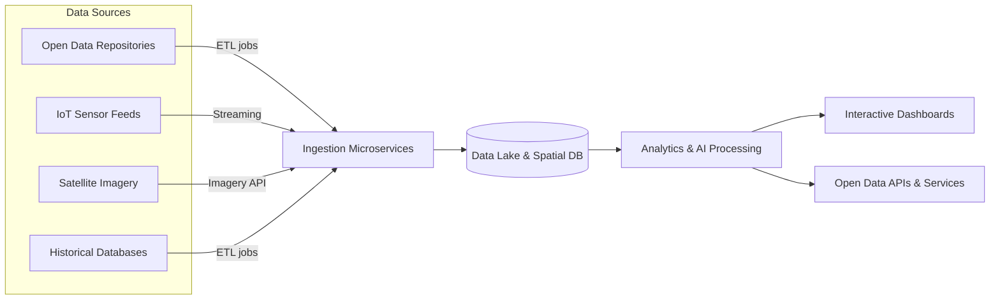

<!--
📍 File: .github/README.md
Purpose: Project-facing README shown on GitHub for both developers + public visitors.
-->

# Kansas Frontier Matrix (KFM) 🚀🌻


> **An integrated open-data and analytics platform** connecting Kansas’s environment, infrastructure, and communities — breaking down data silos to drive informed decision-making and transparency.

---

## ✨ What is KFM?

KFM is a unified **data + geospatial + analytics** ecosystem designed to:

- 🧩 **Unify data** across agencies, domains, and formats (tabular, geospatial, imagery, streams)
- 🔍 **Make data discoverable** via a metadata catalog and search
- 🧠 **Generate insights** using GIS analysis + ML/AI pipelines
- 🌐 **Deliver access** via dashboards, APIs, and open data downloads
- 🧾 **Support transparency** for public stakeholders and internal decision-makers

---

## 📌 Quick Links

- 🧭 [Vision & Mission](#-vision-and-mission)
- 🏗️ [Architecture Overview](#️-architecture-overview)
- 🖥️ [Tech Stack](#️-tech-stack)
- ⚙️ [Installation & Setup](#️-installation--setup-developers)
- 📊 [Public Dashboards](#-public-dashboards)
- 🌐 [Open Data & APIs](#-open-data-and-api-access)
- 🤝 [Contributing](#-contributing)
- ❓ [FAQ](#-faq)
- 💬 [Support](#-support)
- 📜 [License](#-license)

---

## 📖 Table of Contents

- [🎯 Vision and Mission](#-vision-and-mission)
- [🏗️ Architecture Overview](#️-architecture-overview)
- [🖥️ Tech Stack](#️-tech-stack)
- [⚙️ Installation & Setup (Developers)](#️-installation--setup-developers)
- [📊 Public Dashboards](#-public-dashboards)
- [🌐 Open Data and API Access](#-open-data-and-api-access)
- [🤝 Contributing](#-contributing)
- [❓ FAQ](#-faq)
- [💬 Support](#-support)
- [📜 License](#-license)

---

## 🎯 Vision and Mission

The **Kansas Frontier Matrix (KFM)** is an integrated data and analytics platform that unifies diverse information about Kansas’s environment, infrastructure, and communities into a coherent system.

**Mission:** Break down data silos, encourage evidence-based decision-making, and ensure transparency for stakeholders at all levels.

**Vision:** Become the central hub for Kansas’s data-driven innovation — where agencies coordinate with better insight, and where citizens, researchers, and businesses access previously siloed data to drive civic engagement and informed decision-making.

In short, KFM leverages **cloud**, **GIS**, and **AI** technologies responsibly to connect people with the information they need and unlock the full value of Kansas’s data resources for the benefit of all.

---

## 🏗️ Architecture Overview

KFM’s system architecture follows a **layered, modular design** for maximum scalability and maintainability.

At a high level:

- Sources ⟶ Ingestion ⟶ Storage ⟶ Analytics/AI ⟶ Dashboards + APIs
- Built as **microservices** (ingestion, processing, mapping, analytics, etc.)
- Uses **open standards** to keep everything interoperable
- Uses a **single source of truth** approach to reduce duplication

### 🔑 Key Architecture Layers



### 🧠 Why this architecture?
- ✅ Add new datasets without redesigning everything
- ✅ Scale tiers independently (storage ≠ compute ≠ API)
- ✅ Treat GIS as a first-class citizen (spatial DB + map services)
- ✅ Support both batch (ETL) and streaming ingestion (IoT)
- ✅ Serve both humans (dashboards) and systems (APIs)

---

## 🖥️ Tech Stack

KFM is built on a modern, **polyglot** stack balancing enterprise reliability and open-source flexibility.

### ☁️ Cloud & Infrastructure
- AWS or Azure (compute + storage + managed services)
- IaC: Terraform / CloudFormation
- Containers: Docker 🐳
- Orchestration: Kubernetes ☸️ (or ECS/Fargate equivalents)

### 🗄️ Data Storage & Databases
- Data Lake: S3 / Azure Data Lake (imagery, files, streams)
- Spatial DB: PostgreSQL + PostGIS 🗺️
- Search/Metadata Index: Elasticsearch (or alternative)

### 🔄 Data Integration & ETL
- Orchestration: Apache Airflow (or Step Functions)
- Streaming: Kafka (or Kinesis)
- Processing: Python (pandas, GeoPandas, GDAL/OGR)

### 🗺️ GIS & Mapping
- GIS Server: ArcGIS Enterprise **or** GeoServer
- Standards: OGC WMS / WFS (tiles + features)
- Spatial tooling: ArcPy, QGIS processing, Python GIS libs

### 🛰️ Remote Sensing & Big Data
- Raster formats: COGs (Cloud Optimized GeoTIFFs)
- Distributed compute: Spark + spatial extensions
- Prototyping: Google Earth Engine (optional)

### 🤖 AI/ML Analytics
- Frameworks: TensorFlow / PyTorch
- Training & MLOps: SageMaker / Azure ML
- Collaboration: JupyterHub notebooks

### 🌐 API Layer
- REST: Node.js/Express or Python Flask/FastAPI
- Optional: GraphQL for complex query patterns
- Docs: OpenAPI/Swagger
- Security: OAuth2 for protected resources

### 🎛️ Front-End & Visualization
- SPA: React + TypeScript ⚛️
- Charts: D3 / Plotly
- Accessibility: WCAG 2.1 AA

---

## ⚙️ Installation & Setup (Developers)

> Want to run KFM locally or contribute? Start here 👇

### 1) ✅ Prerequisites
Install:
- Git
- Docker (Docker Desktop recommended)
- Node.js + npm (LTS, e.g., Node 18.x)
- Python 3.8+ (venv/Conda optional)

### 2) 📥 Clone the Repository
```bash
git clone https://github.com/KansasDataGov/KFM-Project.git
cd KFM-Project
```

### 3) 🧩 Configuration (.env)
Copy sample env files:
```bash
cp .env.example .env
```

Repeat for any service folder that includes its own `.env.example`.

> Some features may require API keys (e.g., Map tiles, external feeds). You can run without them initially.

### 4) 🐳 Launch with Docker Compose
```bash
docker-compose up --build
```

If successful, you’ll typically have:
- 🗄️ Postgres/PostGIS: `localhost:5432`
- 🌐 API: `http://localhost:5000`
- 🖥️ Web Portal: `http://localhost:3000` (or `:8080` depending on config)

**Helpful commands**
```bash
docker-compose up -d
docker-compose logs -f <service>
docker-compose ps
```

### 5) 🌐 Verify Locally
- Web Portal: `http://localhost:3000`
- API (example): `GET http://localhost:5000/api/datasets`

---

## 📊 Public Dashboards

KFM’s public dashboards allow users — citizens, policymakers, researchers, and developers — to explore Kansas data through:

- 🗺️ Interactive maps (layer toggles, pan/zoom, drill-down)
- 📈 Linked charts & trends (time series, breakdowns)
- 🎛️ Filters (dates, geography, categories)
- 📱 Responsive UI (mobile + tablet friendly)
- ♿ Accessibility-friendly experiences (WCAG-aligned)

Example dashboard themes:
- 🌿 Environment
- 🚧 Transportation
- 💼 Economy
- 🏥 Public Health
- 🎓 Education

---

## 🌐 Open Data and API Access

### 🧭 Open Data Portal (Dataset Catalog)
Users can browse/search datasets with rich metadata:
- Description + source agency
- Coverage and update cadence
- Methods/notes
- Licensing details

Common download formats:
- CSV / Excel
- GeoJSON / Shapefile
- GeoTIFF (imagery/raster)

Large datasets (e.g., LiDAR) may offer alternate delivery methods (cloud links or request-based access).

### 🔌 APIs for Developers
- Public datasets via REST endpoints
- GIS services via ArcGIS REST and/or OGC WMS/WFS
- Optional unified API layer for higher-level operations (aggregation, joins, on-demand analysis)

Docs will be provided via:
- 📘 OpenAPI/Swagger
- 🧪 Interactive API explorer
- 🧩 Example requests + code snippets

---

## 🤝 Contributing

KFM is open-source, and contributions are welcome! 🙌

### 🔁 Workflow
- PR-based development via GitHub
- `main` stays stable
- Feature branches merge via review

### 🧼 Standards
- Python: PEP8-style conventions
- JS/TS: ESLint + Prettier (if configured)
- Add tests when feasible
- Keep docs updated when behavior changes

### ✅ Guidelines
- Discuss large changes via Issues/Discussions first
- Use descriptive branch names (e.g., `feature/add-traffic-ingest`)
- Include context and screenshots/logs when relevant
- Be responsive during review (we’ll do the same)

> If available, see: `CONTRIBUTING.md` and `CODE_OF_CONDUCT.md`.

---

## ❓ FAQ

### Who can use KFM? Is it free?
Yes — KFM is designed for everyone and is intended to be free for public access. Some advanced API usage may require keys for monitoring, but public datasets are open by default.

### What kinds of data are included?
KFM integrates:
- Environmental (weather, water, land cover)
- Infrastructure (roads, utilities, broadband)
- Socio-economic (census, indicators)
- Public safety and alerting (where appropriate)

### Dashboards vs Open Data Portal — what’s the difference?
- **Dashboards** = visual exploration (maps + charts + filters)
- **Open Data Portal** = dataset discovery + downloads + API endpoints

### Is KFM open source?
Yes. Contributions can include code, docs, dataset suggestions, dashboard feedback, and tooling improvements.

---

## 💬 Support

Need help?

- 🧾 Check the docs in the repo (if present)
- 🐛 Open a GitHub Issue for bugs or feature requests
- 💬 Join the community chat (Slack/Discord/forum link if available)
- ✉️ Contact maintainers (project-specific contact info if available)

---

## 📜 License

This project is licensed under the **MIT License**.

> Note: Individual datasets may have their own licensing and usage policies. The MIT license applies to the KFM platform code.

---

<p align="center">Made with ❤️ by the Kansas Frontier Matrix team — unlocking data for a better Kansas.</p>