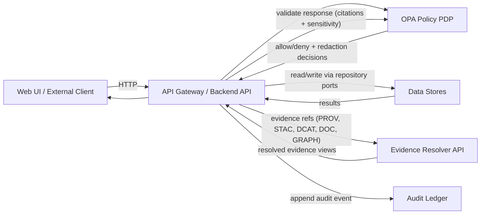
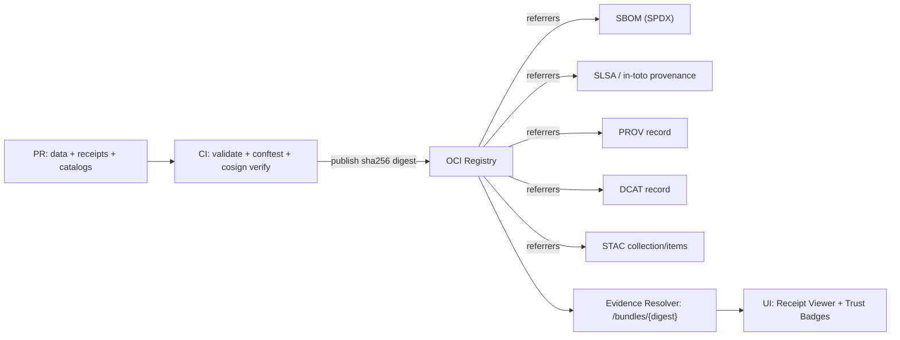

# .github/ — KFM GitHub Operations, Governance & CI Gates


> **Why this file exists**
>
> This `.github/README.md` is the **single source of truth for repo governance and CI enforcement**:
> what must exist in `.github/`, which checks are mandatory, and what rules are **non‑negotiable**.
> It is written to be readable by humans *and* actionable for CI, CODEOWNERS, and policy review.
>
> **Change impact:** Treat changes to this file as **production changes** (governance surface).

---

## 📌 Quick Links

> Paths are **KFM‑standard expectations**. If your repo differs, keep the **boundaries** identical even if names differ.

- **Project root README**: `../README.md`
- **GitHub Actions workflows**: `./workflows/`
- **CODEOWNERS**: `./CODEOWNERS` *(required)*
- **Docs**: `../docs/` *(not confirmed in repo — expected for KFM)*
- **Architecture**: `../docs/architecture/` *(not confirmed in repo — expected)*
- **Governance**: `../docs/governance/` *(not confirmed in repo — expected)*
- **Contracts & schemas**: `../contracts/` *(not confirmed in repo — expected: Promotion Contract, Run Manifest schema, catalog minimums)*
- **Policies (OPA/Rego + Conftest)**: `../policy/` *(path name may differ — verify in repo)*
- **Data zones**: `../data/` *(path name may differ — verify in repo)*
- **Catalogs**: `../data/catalog/` *(preferred per KFM examples; your repo may use `../catalog/` — verify)*
- **Infra / GitOps**: `../infra/` *(not confirmed in repo — expected for KFM)*
- **Scripts**: `../scripts/` *(not confirmed in repo — expected: validators + acceptance harness wrappers)*

---

## 🧭 Table of Contents

- [Governance Header](#-governance-header-treat-as-production)
- [Non‑Negotiables](#-nonnegotiables-kfm-invariants)
- [Trust Membrane](#-trust-membrane--how-requests-flow)
- [Promotion Contract, Receipts, and Digest Pinning](#-promotion-contract-receipts--digest-pinning-failclosed)
- [OCI Evidence Bundles & Provenance Hub](#-oci-evidence-bundles--provenance-hub)
- [What MUST Live in `.github/`](#-what-must-live-in-github)
- [Expected Repo Directory Layout](#-expected-repo-directory-layout-kfm-standard)
- [CI Gates](#-ci-gates--the-kfm-no-merge-without-proof-standard)
- [Policy-as-Code](#-policy-as-code-opa--conftest--default-deny)
- [Evidence & Audit Guarantees](#-evidence--audit-guarantees)
- [Data Zones & Promotion Gates](#-data-zones--promotion-gates-raw--work--processed)
- [Sensitivity Handling](#-sensitivity-handling-fair--care-enforced)
- [PR Workflow](#-pr-workflow-mandatory)
- [Supply Chain](#-supply-chain-release--deploy-hard-requirement)
- [When CI Fails](#-when-ci-fails--quick-diagnosis)
- [Reference Docs](#-reference-docs-authority-ladder)
- [Definition of Done](#-definition-of-done-for-githubreadmemd)

---

## 🧾 Governance Header (treat as production)

| Field | Value |
|---|---|
| Document | `.github/README.md` |
| Status | **Governed** (changes require review) |
| Applies to | GitHub Actions, branch protections, CODEOWNERS, templates, supply chain attestations, promotion contract enforcement |
| Version | `v1.3.0` *(update aligns to Feb‑2026 Promotion Contract / receipts / OCI provenance hub patterns)* |
| Effective date | **2026-02-14** |
| Review cadence | **Quarterly** + **out‑of‑band for security advisories/toolchain changes** |
| Owners | Defined in `.github/CODEOWNERS` *(required)* |
| Review triggers | Any change touching `policy/`, `.github/workflows/`, `contracts/`, catalogs, receipts, Story Nodes, or validators |

> **Fail‑closed governance rule:** If a required enforcement surface is missing (policy, catalogs, receipts, contract tests), the system **denies** promotion/merge/release by default.

---

## 🔒 Non‑Negotiables (KFM invariants)

These are not “guidelines.” They are **contracts** that CI + policy must enforce.

1. **Trust membrane**
   - UI and external clients **never** access databases directly.
   - All access is via **governed API gateway + policy decision point (OPA/Conftest)**.
   - Backend core logic **never bypasses repository interfaces** to talk to storage.

2. **Fail‑closed policy**
   - **Default deny** at policy boundaries (runtime + CI).
   - Missing policy input / missing receipts / missing catalogs / missing citations → **deny**.

3. **Promotion Contract is mandatory**
   - Promotion is **Raw → Work → Processed**.
   - Promotion requires:
     - **run manifest / run receipt** (aka run record) + validation report
     - deterministic **checksums**
     - required catalogs (**DCAT always; STAC/PROV as applicable**)
     - policy labels + redaction provenance (if sensitive)
   - No contract → no publish.

4. **Deterministic identity & digest pinning**
   - Every promoted artifact has a stable identity:
     - `spec_hash` (deterministic spec identity) **and**
     - content digest(s) (e.g., `sha256`) for produced artifacts
   - Wherever possible, refer to immutable digests (e.g., OCI `@sha256:...`) rather than mutable tags.

5. **Focus Mode must cite or abstain**
   - Any factual answer must include citations, or the system must abstain.
   - Every Focus Mode answer produces an **audit_ref** and supports evidence resolution endpoints.

6. **Contract‑first APIs (governed OpenAPI)**
   - Treat OpenAPI as a governed artifact: changes require review + contract tests.
   - `/api/v1` has a **no‑breaking‑change gate**.

7. **Workflow security is part of governance**
   - Branch protection + required status checks are mandatory.
   - Workflows run with **least privilege** and avoid unsafe triggers for untrusted PRs.
   - Third‑party Actions are pinned and controlled by CODEOWNERS.

---

## 🧱 Trust Membrane — How Requests Flow



**Key enforcement principle:** If a path bypasses the gateway or bypasses policy → it is a **design defect** and a **CI failure**.

---

## 🧩 Promotion Contract, Receipts & Digest Pinning (fail‑closed)

> **Promotion Contract** is the canonical *merge‑blocking* rule set: what must be present to publish datasets, layers, Story Nodes, docs, and artifacts.

### ✅ Required promotion artifacts (baseline)

| Artifact | Required | Canonical location (preferred) | Notes |
|---|---:|---|---|
| Raw manifest (immutable) | ✅ | `data/raw/<dataset>/manifest.yml` | Must capture license + expected files + checksums + sensitivity label |
| Deterministic checksums | ✅ | `data/**/checksums.*` | Applies to inputs and outputs |
| Run manifest / run receipt *(run record)* | ✅ | `data/work/<dataset>/run_manifest.json` *(or `run_record.json`)* | Must include inputs/outputs digests + `spec_hash` + code identity |
| Validation report | ✅ | `data/work/<dataset>/validation_report.json` | Includes schema, geometry, temporal, license/policy checks |
| PROV record | ✅ | `data/catalog/prov/<dataset>/run_*.json` | Links raw → processed derivatives |
| DCAT record | ✅ | `data/catalog/dcat/<dataset>.json` | License + attribution + restrictions |
| STAC collection/items | ◻︎ conditional | `data/catalog/stac/<dataset>/**` | Required when spatial assets are published |
| Audit ledger event | ✅ | runtime service | Promotion event must be recorded (tamper‑evident chain) |

### 🔐 Digest pinning (recommended default)

- When publishing bundles (data + catalogs + receipts), prefer referencing the immutable digest:
  - `registry.example.org/kfm/bundles/example_dataset@sha256:<digest>`
- Avoid mutable tags for governance‑critical lookups (tags are allowed as *aliases*, not as provenance roots).

### 🧾 Run manifest schema (illustrative excerpt)

```json
{
  "run_id": "run_2026-02-14T12:34:56Z",
  "dataset_id": "example_dataset",
  "spec_hash": "sha256:...",
  "inputs": [{"uri":"data/raw/example.csv","sha256":"..."}],
  "code": {"git_sha":"...","image":"kfm/pipeline@sha256:..."},
  "outputs": [{"uri":"data/processed/example.parquet","sha256":"..."}],
  "validation_report": "data/work/example/validation_report.json",
  "prov_ref": "data/catalog/prov/example/run_....json",
  "policy": {"sensitivity":"public|restricted|culturally_sensitive|pii_risk", "tags":["..."]},
  "attestations": {"sbom_ref":"...", "slsa_provenance_ref":"...", "rekor_proof_ref":"..."}
}
```

> Naming note: KFM documents use **run record / run receipt / run manifest** for the same concept. This repo standard treats them as the same governed object: validate against the canonical schema regardless of filename.

---

## 📦 OCI Evidence Bundles & Provenance Hub

KFM supports publishing a dataset + its evidence as a **single typed OCI artifact** (“evidence bundle”), with attached referrers for catalogs/receipts/attestations.



**Repo expectation:**
- CI must be able to resolve a bundle digest into its attached artifacts (SBOM, provenance, catalogs, receipts).
- Policy must enforce **digest match** and deny if referrers/attestations are missing when required.

---

## 🗂️ What MUST Live in `.github/`

This directory is where KFM’s repo‑level governance becomes enforceable.

### Required files and folders

Legend: ✅ required • 🟦 required for release/publish • 🟨 recommended

| Path | Required | Purpose | Governed impact |
|---|---:|---|---|
| `.github/README.md` | ✅ | This governance document | High |
| `.github/CODEOWNERS` | ✅ | Enforced review ownership | High |
| `.github/workflows/ci.yml` | ✅ | PR gates: docs/stories/contracts/catalogs/receipts/policy/build | High |
| `.github/workflows/policy-regression.yml` | ✅ | OPA + Conftest regression suite (default deny) | High |
| `.github/workflows/release.yml` | 🟦 | Releases only when gates pass; attestations; signing | High |
| `.github/workflows/supply-chain.yml` | 🟦 | SBOM + SLSA/in‑toto provenance + signature verification | High |
| `.github/workflows/api-contract.yml` | ✅ | OpenAPI “governed artifact” + no breaking change gate | High |
| `.github/actions/kfm-acceptance-harness/` | ✅ | Reusable CI module for validators + cosign + `spec_hash` checks | High |
| `.github/PULL_REQUEST_TEMPLATE.md` | ✅ | PR checklist for governance compliance | Medium |
| `.github/ISSUE_TEMPLATE/` | ✅ | Structured governance-friendly issues | Medium |
| `.github/SECURITY.md` | ✅ | Responsible disclosure + reporting | Medium |
| `.github/dependabot.yml` | 🟨 | Dependency visibility + updates | Medium |
| `.github/renovate.json` *(optional alt to dependabot)* | 🟨 | Alternative dependency automation | Medium |

> If any ✅ item is missing, open an issue labeled `governance-gap` and block releases until resolved.

---

## 🧭 Expected Repo Directory Layout (KFM standard)

> Canonical layout matches KFM’s Raw→Work→Processed pipeline and catalog placement.  
> If your repo differs, keep the *boundaries* identical even if names differ.

```text
repo-root/
├─ .github/                        # CI + governance enforcement (this folder)
├─ docs/                           # governed docs, Story Nodes, runbooks, ADRs
├─ contracts/                      # Promotion Contract + schemas (run manifest, catalog minimums)
├─ policy/                         # OPA/Rego + Conftest tests (default deny)
├─ data/
│  ├─ raw/                         # immutable acquisitions + manifests + checksums
│  ├─ work/                        # normalized/validated intermediates + receipts + validation reports
│  ├─ processed/                   # publishable, policy-labeled outputs (CI-only writes)
│  └─ catalog/
│     ├─ dcat/                     # dataset discovery + licensing metadata
│     ├─ stac/                     # spatial asset collections + items
│     └─ prov/                     # lineage: activities/entities/agents
├─ src/                            # backend API (ports/adapters enforced)
├─ web/                            # React/TS UI (no direct DB calls)
├─ scripts/                        # lint/validate scripts executed by CI + local wrappers
└─ infra/                          # deployment (k8s/helm/gitops)
```

> **Boundary rule:** regardless of layout, **frontend never talks to DB**; **core backend uses repository interfaces**; **all access is policy‑governed**.

---

## ✅ CI Gates (GitHub Actions) — The KFM “No‑Merge Without Proof” Standard

### Minimum CI hardening set (required)

CI must validate:

- **Docs & Story Nodes**
  - Markdown lint + link-check + template/schema validator
  - Story Node v3 validator + citation resolvability checks

- **Contracts**
  - Promotion Contract schema + run manifest schema + catalog minimums schema validate
  - API contract diff: OpenAPI is a governed artifact (no breaking changes on `/api/v1`)

- **Data**
  - STAC/DCAT/PROV validation
  - checksums & deterministic build outputs
  - run manifest/receipt validation (including `spec_hash`)

- **Policy**
  - `opa test` (unit tests)
  - `conftest test` (policy pack regression; promotion guard rules)

- **Supply chain (release)**
  - SBOM (SPDX recommended)
  - SLSA/in‑toto provenance attestation
  - signature verification (cosign/rekor where used)

### CI Gate Matrix

| Gate | What it protects | Typical checks | Required on PR? |
|---|---|---|---:|
| `docs` | governed documentation integrity | markdown lint, link-check, doc build receipt (if enabled) | ✅ |
| `stories` | Story Node validity + evidence | schema validation, citation resolvability | ✅ |
| `contracts` | global interoperability | schema validate Promotion Contract + run manifest + catalog minimums | ✅ |
| `catalogs` | dataset discovery + provenance | STAC/DCAT/PROV validate; link-check clean | ✅ |
| `receipts` | promotion correctness | run manifest schema + `spec_hash` + checksum verification | ✅ |
| `policy` | governance safety | OPA tests + Conftest promotion guard suite | ✅ |
| `api-contract` | compatibility | OpenAPI diff; no breaking changes on `/api/v1` | ✅ |
| `build` | deployability | container builds + smoke tests | ✅ |
| `security` | repo hygiene | secret scan, dependency scan, pinned actions | 🟨 recommended |
| `supply-chain` | artifact integrity | SBOM + provenance + signature verify | 🟦 release required |

---

## 🧪 Example CI Workflow (reference skeleton)

> This is a **reference baseline**. Adjust paths as needed, but **do not weaken gates**.  
> **Security rule:** pin third‑party Actions and set least‑privilege `permissions`.

```yaml
name: ci
on:
  pull_request:
  push:

permissions: read-all

jobs:
  docs:
    runs-on: ubuntu-latest
    steps:
      - uses: actions/checkout@v4  # pin by SHA in production
      - run: ./scripts/lint_docs.sh
      - run: ./scripts/validate_story_nodes.sh
      - run: ./scripts/doc_build_receipt.sh  # optional: deterministic doc digest + receipt

  contracts:
    runs-on: ubuntu-latest
    steps:
      - uses: actions/checkout@v4
      - run: ./scripts/validate_contracts.sh  # JSON Schema: promotion + run manifest + catalog minimums

  catalogs:
    runs-on: ubuntu-latest
    steps:
      - uses: actions/checkout@v4
      - run: ./scripts/validate_catalogs.sh   # DCAT/STAC/PROV + link-check

  receipts:
    runs-on: ubuntu-latest
    needs: [contracts]
    steps:
      - uses: actions/checkout@v4
      - run: ./scripts/validate_receipts.sh   # run manifest schema + spec_hash + checksums

  policy:
    runs-on: ubuntu-latest
    steps:
      - uses: actions/checkout@v4
      - run: opa test policy -v
      - run: conftest test . -p policy/conftest  # promotion guard regression suite

  api-contract:
    runs-on: ubuntu-latest
    steps:
      - uses: actions/checkout@v4
      - run: ./scripts/openapi_no_breaking_changes.sh  # /api/v1 gate

  build:
    runs-on: ubuntu-latest
    needs: [docs, contracts, catalogs, receipts, policy, api-contract]
    steps:
      - uses: actions/checkout@v4
      - run: docker build -t kfm-api ./src
      - run: docker build -t kfm-web ./web
      - run: ./scripts/smoke_tests.sh
```

---

## ⚖️ Policy-as-Code (OPA + Conftest) — Default Deny

### Focus Mode output validation (baseline)

```rego
package kfm.ai
default allow := false

# Require citations AND sensitivity approval.
allow if {
  input.answer.has_citations == true
  input.answer.sensitivity_ok == true
}
```

### Promotion guard (illustrative)

```rego
package kfm.promotion
default allow := false

# Allow promotion only when required governed artifacts exist and validate.
allow if {
  input.run_manifest.valid == true
  input.catalogs.dcat.valid == true
  input.catalogs.prov.valid == true
  # STAC required when spatial assets are present:
  not input.catalogs.stac.required
} else if {
  input.run_manifest.valid == true
  input.catalogs.dcat.valid == true
  input.catalogs.prov.valid == true
  input.catalogs.stac.required
  input.catalogs.stac.valid == true
}
```

> **Fail‑closed rule:** if required keys are missing, policies must deny.

---

## 🧾 Evidence & Audit Guarantees

### Evidence resolution acceptance criteria

- Every citation reference must be resolvable via an API endpoint using stable schemes:
  - `prov://`, `stac://`, `dcat://`, `doc://`, `graph://`
- A KFM-quality UX means:
  - Given any `citation.ref` in a Focus Mode answer, the UI can resolve it to a human‑readable evidence view in **≤ 2 API calls**.
- System returns `answer_markdown` with citations and `audit_ref`; auditors can resolve `audit_ref` to an evidence pack.

### Audit record schema (excerpt)

```json
{
  "$schema": "https://json-schema.org/draft/2020-12/schema",
  "$id": "https://kfm.example.org/schema/audit_record.json",
  "type": "object",
  "required": ["audit_ref", "timestamp", "event_type", "subject", "event_hash"],
  "properties": {
    "audit_ref": { "type": "string" },
    "timestamp": { "type": "string", "format": "date-time" },
    "event_type": { "type": "string" },
    "actor": { "type": "object", "additionalProperties": true },
    "subject": { "type": "object", "additionalProperties": true },
    "evidence_refs": { "type": "array", "items": { "type": "string" } },
    "prev_hash": { "type": "string" },
    "event_hash": { "type": "string" }
  }
}
```

---

## 🧬 Data Zones & Promotion Gates (Raw → Work → Processed)

### What each zone means

| Zone | Allowed contents | Who can read | Who can publish |
|---|---|---|---|
| `raw/` | acquired source artifacts + deterministic manifests/checksums | internal + reviewers (by policy) | nobody |
| `work/` | normalized + validated intermediates, redaction transforms, run manifests/receipts | internal + reviewers (by policy) | nobody |
| `processed/` | publishable, policy-labeled datasets and derivatives | public/reviewer/admin depending on policy | CI only |

### Promotion checklist (CI-enforced)

- [ ] Row-level schema validation (required fields; type coercion documented)
- [ ] Geometry validity + bounds checks
- [ ] Temporal consistency checks
- [ ] License + attribution captured in DCAT; restrictions encoded in policy
- [ ] Provenance completeness: every promoted artifact has a PROV chain + deterministic checksum
- [ ] Run manifest/receipt exists + validates; includes `spec_hash` + artifact digests + code identity
- [ ] Policy labels defined; restricted fields/locations redacted per rules
- [ ] Catalogs emitted (DCAT always; STAC/PROV as applicable) and link-check clean
- [ ] API contract tests pass for at least one representative query
- [ ] Backfill strategy documented (if applicable)
- [ ] Human approval recorded if sensitivity != public

---

## 🧯 Sensitivity Handling (FAIR + CARE, enforced)

KFM must treat some data as sensitive (examples include private ownership, precise archaeological site locations, and some health/public-safety indicators). Sensitivity handling requires:

- policy labels at dataset/record/field level
- derivative datasets with explicit redaction provenance
- fail‑closed policy checks

**Repo rule:** do not merge PRs that introduce sensitive material without explicit policy labels + redaction evidence.

---

## 🧰 Local Dev + Smoke Tests (recommended baseline)

> These commands are a *recommended baseline*; adjust to match your repo’s actual tooling.

### Quickstart

1. Copy env file:
   - `cp .env.example .env` *(if present)*
2. Start:
   - `docker compose up --build`
3. Confirm:
   - UI: `http://localhost:3000`
   - API docs: `http://localhost:8000/docs`

### Smoke tests (minimum)

- [ ] API health endpoint returns 200
- [ ] OPA reachable and returns expected deny/allow decisions
- [ ] “Focus Mode” endpoint denies answers without citations (policy test)
- [ ] A sample citation can be resolved to an evidence view
- [ ] Promotion guard Conftest suite runs locally (`conftest test ...`)

---

## 🧾 PR Workflow (mandatory)

### Branch protection (required)

- No direct pushes to protected branches
- No force push
- PR required + review required
- Required checks: `docs`, `stories`, `contracts`, `catalogs`, `receipts`, `policy`, `api-contract`, `build`
- `.github/workflows/**`, `policy/**`, `contracts/**`, `data/**`, `docs/**` must be CODEOWNED and require explicit approval
- Signed commits/tags are strongly recommended for governance integrity

### PR Checklist (copy into `.github/PULL_REQUEST_TEMPLATE.md`)

- [ ] No UI-to-DB direct access introduced (trust membrane preserved)
- [ ] Promotion Contract requirements satisfied (receipts + checksums + catalogs + policy labels)
- [ ] Story Nodes validate and citations resolve
- [ ] OPA + Conftest tests pass; default deny preserved
- [ ] Sensitive data reviewed; policy labels + redaction provenance present where needed
- [ ] `/api/v1` has no breaking changes (if API touched)
- [ ] CI gates all green; no bypass

---

## 🧷 Issue Templates (recommended set)

Create structured issue templates so governance becomes easy, not optional:

- `bug_report.yml` — defects with reproduction + expected evidence
- `feature_request.yml` — new capability proposals with acceptance criteria
- `data_source_request.yml` — ingestion profile request with licensing + sensitivity
- `promotion_request.yml` — request to promote dataset/version to `processed/` with receipts
- `policy_change.yml` — policy change proposal with tests + deny-by-default impact
- `story_node_proposal.yml` — new Story Node idea with sources + claims list
- `security_report.yml` — private vulnerability channel instructions

---

## 🧑‍⚖️ CODEOWNERS (required)

Minimum recommended ownership map:

| Area | Suggested owners |
|---|---|
| `.github/workflows/**` | platform + security owners |
| `.github/actions/**` | platform + security owners |
| `contracts/**` | governance + data stewardship owners |
| `policy/**` | governance + security owners |
| `data/**` | data stewardship owners |
| `src/**` | backend owners |
| `web/**` | frontend owners |
| `docs/**` | documentation stewards |

> Owners are governance enforcement. Missing CODEOWNERS = missing trust.

---

## 🔐 Supply Chain (release + deploy hard requirement)

**Rule:** Publish versioned container images and/or OCI evidence bundles **only if all gates pass**.

Minimum release artifacts:
- SBOM (SPDX recommended)
- SLSA/in‑toto provenance attestation
- Versioned container images and/or dataset bundles (digest pinned)
- Signature verification policy (cosign/rekor where used)

---

## 🚨 When CI Fails — Quick Diagnosis

| Failure | Usually means | Fix |
|---|---|---|
| `validate_contracts` | Promotion Contract / schema mismatch | update schema + samples; keep fail-closed |
| `validate_catalogs` | missing/invalid DCAT/STAC/PROV | add/repair catalogs; ensure link-check clean |
| `validate_receipts` | run manifest missing fields / checksum mismatch | regenerate receipts deterministically; fix `spec_hash` logic |
| `conftest test` | policy regression | update policy/tests; do not weaken default deny |
| `opa test` | policy unit test failure | fix policy inputs, add tests for new cases |
| `openapi_no_breaking_changes` | `/api/v1` breaking change | bump version strategy or refactor to `/api/v2` |
| `doc_build_receipt` | docs are non-deterministic | set `SOURCE_DATE_EPOCH`; pin tooling; remove unstable inputs |
| `build` | Dockerfile/path issues | align contexts; update CI paths; fix smoke tests |

---

## 📚 Reference Docs (authority ladder)

If something conflicts:
1) The **Non‑Negotiables** win  
2) Policy remains **fail‑closed**  
3) Escalate via ADR (Architecture Decision Record) instead of weakening gates

**Primary authority sources (by design):**
- KFM Next‑Gen Blueprint & Primary Guide (internal draft)
- KFM Comprehensive Data Source Integration Blueprint
- KFM “New Ideas Feb‑2026” integration patterns (Promotion Contract, Run Manifest schema, Provenance Guard, Acceptance Harness, OCI referrers)
- KFM governance + ethics + sovereignty docs *(expected in `docs/governance/`, not confirmed in repo)*

---

## ✅ Definition of Done (for `.github/README.md`)

This document is “done” when:

- [ ] Every ✅ required `.github` item exists in repo
- [ ] Branch protections require PRs + CODEOWNERS + required checks
- [ ] CI gates run on every PR: docs/stories/contracts/catalogs/receipts/policy/api-contract/build
- [ ] OPA + Conftest enforce default deny + cite-or-abstain + promotion guard rules
- [ ] Supply chain attestations exist for releases (SBOM + SLSA/in‑toto + signature policy)
- [ ] Contributors can run the checks locally via `scripts/` equivalents (including Conftest suite)

---

<details>
<summary><strong>Appendix: GitHub Actions hardening (security hygiene)</strong></summary>

- Pin third-party Actions by commit SHA (avoid mutable tags).
- Use least-privilege `GITHUB_TOKEN` permissions per job (default read-only).
- Avoid risky triggers for untrusted PRs (be cautious with `pull_request_target`).
- Enable secret scanning / push protection and dependency scanning (Dependabot or equivalent).
- Require PR reviews for `.github/workflows/**`, `policy/**`, `contracts/**`.
- Prefer GitHub App identities for automation over long-lived PATs (where applicable).
</details>
