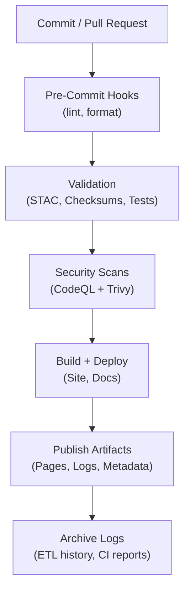
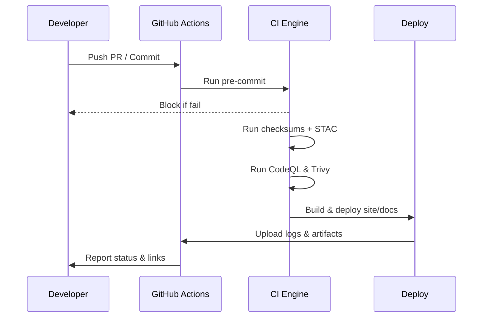

# 🤖 **Kansas Frontier Matrix — Automation & Governance**

`📁 .github/workflows/README.md`

**Mission:** Document and enforce the **GitHub-based automation (CI/CD)** and **project governance** for the Kansas Frontier Matrix (KFM). This ensures all code, data, and documentation changes are **validated**, **auditable**, **secure**, and **aligned with Master Coder Protocol (MCP)**.

---

📚 **Table of Contents**

* [🧰 Overview](#overview)
* [🔄 CI/CD Workflow Overview](#cicd-workflow-overview)
* [🗾 Validation Flow (CI Lifecycle)](#validation-flow-ci-lifecycle)
* [⚙️ Core Workflows](#core-workflows)
* [🛡 Governance & Roles](#governance--roles)
* [🧲 MCP Compliance Matrix](#mcp-compliance-matrix)
* [🤝 Contribution Notes](#contribution-notes)
* [🗳 Metadata & Provenance](#metadata--provenance)
* [📂 Related Documentation](#related-documentation)
* [🗓 Version History](#version-history)

---

## 🧰 Overview

KFM's `.github/` directory governs automated workflows, branch security, and contributor practices. It enforces MCP standards by validating every change through **CI checks**, **metadata audits**, **provenance logging**, and **governance policies**.

Key design goals:

* **Integrity:** All PRs must pass tests, STAC validation, checksums, and review.
* **Reproducibility:** Makefile + pinned actions + container digests.
* **Security:** CodeQL, Trivy, and OIDC permissions.
* **Governance:** CODEOWNERS, PR templates, required reviews.
* **Auditability:** CI logs, versioned artifacts, changelogs.

All workflows run in **GitHub Actions** with logs publicly accessible.

---

## 🔄 CI/CD Workflow Overview

<!-- END OF MERMAID -->

> Each push/PR triggers a CI pipeline: pre-commit → validation → security → build → archive.

---

## 🗳 Validation Flow (CI Lifecycle)

<!-- END OF MERMAID -->

> PRs to `dev` must pass all CI jobs. Merges to `main` must originate from successful, audited runs.

---

## ⚙️ Core Workflows

| **Workflow**        | **Trigger**       | **Role**                   | **Validation / Task**                    |
| ------------------- | ----------------- | -------------------------- | ---------------------------------------- |
| `pre-commit.yml`    | PR                | Lint, format, test         | Runs Black, Ruff, Markdownlint, etc.     |
| `stac-validate.yml` | PR, Push          | STAC, JSON Schema          | Uses `stac-validator`, schema check      |
| `checksums.yml`     | Data push         | Data integrity             | Computes and compares SHA-256s           |
| `fetch.yml`         | Schedule / Manual | Data ingestion             | Loads remote sources from manifest files |
| `site.yml`          | Merge to main     | Build & deploy             | Builds docs, pushes to GitHub Pages      |
| `codeql.yml`        | PR, Schedule      | Static analysis (security) | CodeQL SARIF scan                        |
| `trivy.yml`         | Weekly            | CVE scanner                | Trivy audit of images/dependencies       |
| `auto-merge.yml`    | Post-Checks       | PR merge automation        | Merges PRs that pass all required checks |

---

## 🛡 Governance & Roles

**Branch Strategy:**

* `main`: production, protected, release-only.
* `dev`: integration branch for PRs.
* `feature/*`: short-lived development.

**Protections:**

* ✅ Required checks: pre-commit, STAC, tests, security.
* ✅ At least 1 codeowner review.
* ✅ Signed commits.
* ✅ Semantic commit messages (Conventional Commits).

**CODEOWNERS Roles:**

| **Team**           | **Responsibilities**                           |
| ------------------ | ---------------------------------------------- |
| `@kfm-maintainers` | Approve releases, maintain roadmap             |
| `@kfm-security`    | Review CI workflows, secrets, security configs |
| `@kfm-docs`        | Validate all documentation changes             |
| `@kfm-data`        | Approve data pipeline and ETL modifications    |
| `@kfm-web`         | Web app / frontend (MapLibre, timeline, React) |

> Governance Committee audits documentation quarterly and reviews backlog biweekly.

---

## 🧲 MCP Compliance Matrix

| **MCP Principle**   | **Implementation**                                                   |
| ------------------- | -------------------------------------------------------------------- |
| Documentation-First | PR templates, code comments, updated READMEs before merge            |
| Reproducibility     | Makefile, pinned versions, deterministic output, SHA-256 logs        |
| Provenance          | Git history, CODEOWNERS, changelogs, hash-stamped logs               |
| Auditability        | All artifacts logged; STAC and checksum audits weekly; auto-check CI |
| Open Standards      | YAML, STAC, JSON Schema, Mermaid, Markdown                           |

---

## 🤝 Contribution Notes

* Fork off `dev` and submit PRs there.
* Run `pre-commit` before pushing.
* Write semantic commits (`feat:`, `fix:`, etc.).
* All changes must update docs (README or SOPs).
* Use PR template: fill in purpose, tests, changelog, dataset refs.

### ✅ PR Checklist

* [ ] CI green (pre-commit, STAC, tests, security)
* [ ] Docs updated
* [ ] Tests (if applicable) written or updated
* [ ] PR reviewed by appropriate CODEOWNERs
* [ ] Semantic + signed commits
* [ ] Issue or backlog item referenced

---

## 🗳 Metadata & Provenance

* **Document:** `.github/workflows/README.md`
* **License:** MIT (code), CC-BY 4.0 (docs)
* **Maintainers:** `@kfm-docs`, `@kfm-security`, `@kfm-architecture`
* **Standards:** MCP-DL v6.3

---

## 📂 Related Documentation

| Path                         | Description                              |
| ---------------------------- | ---------------------------------------- |
| `docs/architecture/ci-cd.md` | Detailed CI/CD system design             |
| `docs/standards/security.md` | Security policy + permissions hardening  |
| `docs/notes/backlog.md`      | Governance-tracked issues + enhancements |
| `.github/CODEOWNERS`         | Review team configuration                |

---

## 🗓 Version History

| Version | Date       | Summary                                                 |
| ------- | ---------- | ------------------------------------------------------- |
| v1.1    | 2025-10-16 | Full KFM house-style upgrade, metadata, TOC, compliance |
| v1.0    | 2025-10-04 | Initial governance + CI/CD automation README            |

---

✨ **Kansas Frontier Matrix** — "Automation with Integrity. Validation with Provenance." ✨  
`.github/workflows/README.md` — The GitHub automation and governance anchor for the project.

