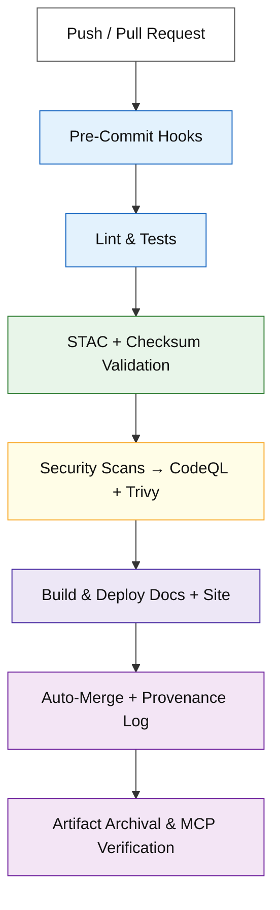
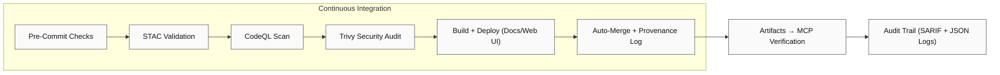

<div align="center">

# ⚙️ Kansas Frontier Matrix — GitHub Automation & Governance

**Path:** `.github/`

**Mission:** Serve as the **central automation and governance hub**
for the **Kansas Frontier Matrix (KFM)** — ensuring
**reproducibility**, **security**, **provenance**, and **MCP compliance**
across all datasets, pipelines, and documentation.

[](../.github/workflows/site.yml)
[](../.github/workflows/stac-validate.yml)
[](../.github/workflows/codeql.yml)
[](../.github/workflows/trivy.yml)
[](https://pre-commit.com/)
[](../docs/)
[](../LICENSE)

</div>

---

## 🧭 Overview

The `.github/` directory defines **how KFM automates, validates, governs, and secures**
its entire system lifecycle using **GitHub Actions**, **pre-commit hooks**, and
**Master Coder Protocol (MCP)** standards.

Automation ensures the repository remains:
✅ **Deterministic** 🔍 **Traceable** 🔐 **Secure** 🧾 **Self-Documenting** 🧮 **MCP-Verified**

Every commit, workflow, dataset, and artifact becomes part of the **verifiable chain of reproducibility**.

---

## 🧱 Directory Layout

```bash
.github/
├── workflows/
│   ├── site.yml               # Build & deploy docs and site (GitHub Pages)
│   ├── stac-validate.yml      # Validate STAC collections/items & JSON Schemas
│   ├── codeql.yml             # Static analysis for Python/JS
│   ├── trivy.yml              # Container vulnerability scans (CVE reports)
│   ├── pre-commit.yml         # Linting + style enforcement + unit tests
│   └── auto-merge.yml         # Automatically merge passing PRs
│
├── ISSUE_TEMPLATE/
│   ├── bug_report.md          # Structured bug report (logs + env info)
│   ├── feature_request.md     # Enhancement proposals
│   └── data_request.md        # Dataset addition or change request
│
├── PULL_REQUEST_TEMPLATE.md   # MCP-aligned PR checklist (reproducibility, provenance)
└── FUNDING.yml                # Funding + sponsor links
```

---

## ⚙️ Core Workflows

| Workflow            | Purpose                                          | Trigger            | Output                     |
| ------------------- | ------------------------------------------------ | ------------------ | -------------------------- |
| `site.yml`          | Builds & deploys documentation, site, and web UI | push → main        | `_site/ → GitHub Pages`    |
| `stac-validate.yml` | Validates STAC catalogs + schemas                | push, pull_request | `stac-report.json`         |
| `codeql.yml`        | Runs CodeQL static analysis (security audit)     | schedule, push     | CodeQL Dashboard           |
| `trivy.yml`         | Scans Docker + dependencies for CVEs             | push, pull_request | SARIF vulnerability report |
| `pre-commit.yml`    | Runs lint, format, tests, and spellcheck         | pull_request       | Pre-commit log             |
| `auto-merge.yml`    | Merges PRs when all checks pass                  | post-check success | Merged PR + audit trail    |

💡 **Note:** All actions are **pinned** (`@v3` or commit SHA) for deterministic execution and verifiable builds.

---

## 🧩 CI/CD Flow Visualization



---

## 🧮 MCP Compliance Matrix

| MCP Principle             | Implementation in `.github/`                                     |
| ------------------------- | ---------------------------------------------------------------- |
| **Documentation-First**   | Every workflow includes inline comments and version tracking.    |
| **Reproducibility**       | Pinned dependencies ensure reproducible builds and artifacts.    |
| **Provenance**            | SHA-256 checksums and STAC validations establish lineage.        |
| **Auditability**          | CI logs, SARIF, and build artifacts serve as verifiable records. |
| **Open Standards**        | YAML + JSON Schema + STAC 1.0.x adopted universally.             |
| **Accessibility**         | Workflow statuses and logs are publicly viewable.                |
| **Security Transparency** | CodeQL & Trivy reports bundled in release artifacts.             |

---

## 🧾 Issue & Pull Request Governance

### ✅ Pull Request Checklist

* [x] Documentation updated and linked
* [x] STAC and checksum validation passed
* [x] CodeQL & Trivy scans clear
* [x] Unit + integration tests passed
* [x] MCP reproducibility verified
* [x] Provenance metadata attached

### 🧩 Issue Templates

| Template               | Purpose                                                      |
| ---------------------- | ------------------------------------------------------------ |
| 🐞 **Bug Report**      | Capture reproducible errors with environment + logs          |
| 💡 **Feature Request** | Describe desired feature, benefit, and use case              |
| 🗺️ **Data Request**   | Propose dataset inclusion with license + source verification |

---

## 🔒 Security & Maintenance Policy

| Focus Area             | Policy / Action                                  |
| ---------------------- | ------------------------------------------------ |
| **Secrets**            | Stored only in Settings → Secrets → Actions      |
| **Weekly Scans**       | Automated CodeQL + Trivy each Sunday             |
| **Peer Review**        | Minimum two approvals for workflow edits         |
| **Branch Rules**       | Require signed commits + passing checks          |
| **Dependency Hygiene** | Monthly automated dependency updates             |
| **Audit Retention**    | Logs, SARIF, and STAC reports retained ≥ 90 days |

🔐 **Security Posture:**
Zero-trust enforced — workflows cannot access external repos or secrets unless explicitly declared and reviewed.

---

## 🧠 Maintainer Guidelines

1. 🧩 **Modular Workflows** — One purpose per YAML
2. 🧾 **Document Everything** — Comments + changelog per workflow
3. 🔒 **Pin Versions** — No `@latest`; always tag or pin SHA
4. 🚦 **Fail Fast** — Explicit exit codes and human-readable logs
5. 🧪 **Test Locally** — Use `act` or `gh workflow run` before merge
6. 🧰 **Cache Wisely** — Use `actions/cache@v3` for dependencies
7. 🔁 **Audit Regularly** — Run `gh workflow view` monthly to confirm compliance

---

## 🧭 Workflow Dependency Graph



---

## 💻 CLI Utilities

```bash
# 🔍 Run pre-commit checks
pre-commit install
pre-commit run --all-files

# 🧪 Trigger workflow manually
gh workflow run site.yml

# 📜 List latest workflow runs
gh run list

# 🧾 Download artifact from last run
gh run download --name "stac-report.json"
```

---

## 🕓 Version History

| Version | Date       | Summary                                          |
| ------- | ---------- | ------------------------------------------------ |
| v1.0.0  | 2025-10-04 | Initial CI/CD governance structure               |
| v1.1.0  | 2025-10-06 | Added workflow documentation & diagrams          |
| v1.2.0  | 2025-10-07 | Enhanced MCP compliance + STAC reporting         |
| v1.3.0  | 2025-10-08 | Introduced security policy & auto-merge          |
| v1.4.0  | 2025-10-09 | Added dependency graph, CLI examples, and badges |

---

<div align="center">

### ⚙️ Kansas Frontier Matrix — Automation with Integrity

“.github/” orchestrates **reproducibility, verification, and governance**
across every dataset, pipeline, and artifact — the heartbeat of MCP compliance.

🧭 Every workflow · Every commit · Every result — **Proven and reproducible.**

</div>
