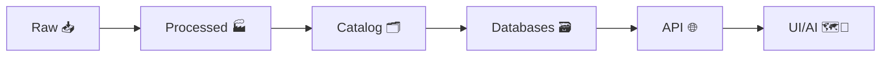

<div align="center">

<picture>
  <source media="(prefers-reduced-motion: reduce)" srcset="docs/assets/kfm-seal-320.png">
  
</picture>

# 🧰 `.github` — Community Health & Automation for **Kansas Frontier Matrix (KFM)** 🚧

  <br/>

  <!-- Status / Safety -->
  
  
  

  <br/>

  <!-- Repo badges -->
  
  
  
  
</div>

> 🧭 **Start here:** this folder is where we codify *how we collaborate* and *what must be true before anything ships*.  
> ✅ Templates + ✅ Policies + ✅ CI/CD gates = **governed contributions**.

---

## 🚧 Under Construction (Read First)

This `.github/` directory is actively being assembled into **Governance-as-Code**. Expect some churn while we lock:
- ✅ contribution templates that **ask for evidence**
- ✅ workflows that validate **metadata + provenance**
- ✅ policy checks that **fail closed** (no silent bypasses)

### ✅ Current vs Planned (Live Checklist)

- [x] Baseline structure + README guidance 📘  
- [ ] `PULL_REQUEST_TEMPLATE.md` with governance gates ✅  
- [ ] Issue Forms (`ISSUE_TEMPLATE/*.yml`) for ingest / map / contract / bug 🧾  
- [ ] `CODEOWNERS` rules for “high blast radius” areas 👀  
- [ ] `dependabot.yml` for dependency hygiene 🔄  
- [ ] CI workflows (lint/test/build) ⚙️  
- [ ] Contract + schema validation (OpenAPI / JSON Schema) 📜  
- [ ] Catalog validation (STAC / DCAT) 🗂️  
- [ ] Provenance validation (PROV / JSON-LD) 🧾  
- [ ] Security scanning (CodeQL / secret scanning / SBOM) 🔐  
- [ ] Policy-as-code gates (OPA) ⚖️  

> 🔥 **Treat changes here like production infrastructure.**  
> A tiny YAML change can unblock—or break—every PR.

---

## 🔗 Quick Links

- ⬅️ **Project Overview:** [`../README.md`](../README.md)
- 🧱 **Architecture & Standards:** [`../docs/`](../docs/)
- 🧪 **Tests:** [`../tests/`](../tests/)
- 🔧 **Tooling & Validators:** [`../tools/`](../tools/)
- ⚙️ **Workflows:** [`./workflows/`](./workflows/)
- 🧩 **Composite Actions:** [`./actions/`](./actions/)
- 📝 **Issue Templates:** [`./ISSUE_TEMPLATE/`](./ISSUE_TEMPLATE/)
- 🔐 **Security Policy:** [`../SECURITY.md`](../SECURITY.md) *(if present)*

---

## 📁 What Lives in `.github/` (and why it matters)

This directory holds GitHub-native **community health + automation**.

```text
.github/
├─ assets/                      🖼️ Images/GIFs used by .github markdown
├─ ISSUE_TEMPLATE/              🧾 Issue forms & templates
├─ PULL_REQUEST_TEMPLATE.md     ✅ PR checklist + governance gates
├─ workflows/                   ⚙️ GitHub Actions (CI/CD + governance checks)
├─ actions/                     🧩 Composite actions shared across workflows
├─ dependabot.yml               🔄 Automated dependency updates
├─ CODEOWNERS                   👀 Review ownership rules
└─ FUNDING.yml                  💖 Sponsorship links (optional)
```

### 🖼️ `.github/assets/` (Brand + UX)
We keep README visuals here so they’re versioned, reviewable, and consistent.
- ✅ Use **PNG** for crisp static graphics
- ✅ Use **GIF** for safe animations (GitHub READMEs don’t run CSS/JS animations)
- ✅ Keep assets small (optimize & resize) to protect page load and mobile readers 📱

---

## 🧭 KFM “Truth Path” (Why GitHub Automation Matters)

KFM is built around a non‑negotiable flow of evidence → governed artifacts → user experiences:



### ✅ Non‑Negotiables We Enforce via GitHub (Templates + CI)

- 🧾 **Provenance-first**: nothing moves downstream without **STAC + DCAT + PROV** metadata.
- 🛑 **Fail‑closed**: missing checks block merges (no “ship now, fix later”).
- 🔒 **Classification propagation**: outputs can’t be less restricted than inputs.
- ♻️ **Deterministic pipelines**: idempotent, config‑driven, logged, re‑runnable.
- 🧱 **API boundary**: UI/AI does **not** query PostGIS/Neo4j directly—API is the enforcement layer.
- 🧠 **Focus Mode constraints**: AI outputs must be traceable to cataloged evidence (“map behind the map”).

---

## 🧩 Glossary Mini‑Pack (KFM Terms You’ll See in Templates)

- **Catalogs** 🗂️: **STAC** (assets), **DCAT** (dataset discovery), **PROV** (lineage)
- **Contract artifact** 📜: versioned schema/spec (JSON Schema, OpenAPI, GraphQL SDL, UI config)
- **Evidence artifact** 🧪: derived output registered in catalogs **before** use in UI/narratives
- **Story Node** 📚: narrative artifact that is machine‑ingestible and provenance‑linked
- **Focus Mode** 🎯: Story Node + map/timeline context, constrained to provenance‑linked content

---

## 🧾 Issues: The “Front Door” for Work

We prefer work to start as an issue when it’s:
- 🧭 new dataset ingest / cataloging
- 🗺 map layer additions or styling changes
- 🧠 AI/Focus Mode behavior changes
- 🧱 contract / schema changes
- 🔥 anything that could break governance guarantees

### 🧷 Issue Writing Rules (Keeps Us Fast)
- ✅ **One problem per issue**
- 🧩 Include **context + expected outcome**
- 🧾 Include **evidence links** (datasets, docs, screenshots) when relevant
- 🏷️ Use labels (see below) to route the issue correctly

---

## ✅ Pull Requests: What “Good” Looks Like Here

### 🏷️ PR Title Style
Use a clear prefix + short summary:

- `feat(api): add dataset search filter for bbox + time`
- `fix(pipeline): make ingest idempotent for ks_hydrology_1880`
- `docs(governance): clarify classification propagation rules`
- `data(catalog): register new STAC collection + DCAT dataset`

### 📦 Minimum PR Payload
Your PR should include:
- **What changed** and **why**
- **Proof** (tests, screenshots, sample outputs, validation logs)
- **Risk notes** (breaking changes, migrations, data backfills)
- **Docs updates** when behavior/contracts change

> 🧠 If it changes a **contract** (schema/API/UI config), it must include:  
> ✅ version bump, ✅ validator updates, ✅ migration notes (if needed)

---

## 🏷️ Labels Taxonomy (Recommended)

<details>
<summary><b>Click to expand label guide</b> 🏷️</summary>

### Type
- `type:bug` 🐛
- `type:feature` ✨
- `type:docs` 📚
- `type:data` 🧱
- `type:security` 🔐
- `type:chore` 🧹

### Area
- `area:api` ⚙️
- `area:web` 🗺️
- `area:pipelines` ♻️
- `area:catalog` 🗂️
- `area:provenance` 🧾
- `area:graph` 🕸️
- `area:governance` ⚖️
- `area:ai` 🎯
- `area:data-sovereignty` 🪶 *(for Indigenous data governance / CARE-aligned work)*

### Priority / Status
- `priority:p0` 🔥 / `priority:p1` ⚡ / `priority:p2` 🧊
- `status:blocked` ⛔ / `status:needs-review` 👀 / `status:ready` ✅

</details>

---

## ⚙️ CI/CD & Governance Gates (What Workflows Should Do)

Even if filenames evolve, the intent stays consistent:

### ✅ Quality Gates
- 🧹 formatting / lint
- 🧪 unit + integration tests
- 🔍 type checking (where applicable)
- 📜 contract validation (OpenAPI/GraphQL/JSON Schema)
- 🗂️ catalog validation (**STAC / DCAT**)
- 🧾 provenance validation (**PROV / JSON‑LD**)

### 🔐 Security Gates
- 🧯 secret scanning / dependency scanning
- 🧾 SBOM generation/verification
- 🔒 policy checks (governance / classification propagation)

### 📚 Docs Gates
- docs build validation (so published docs don’t break)
- link checks (optional but recommended)

### 🛰️ Telemetry (Optional but Powerful)
Some workflows may export CI + governance telemetry artifacts to support:
- audit trails ✅
- performance tracking 📈
- sustainability reporting 🌱 (where applicable)

---

## 🧩 Editing Templates & Workflows Safely

### ✅ When changing `.github/workflows/*`
- Prefer small PRs (one workflow change at a time)
- Validate YAML locally (lint) if tooling exists
- Keep workflows **deterministic** and **cache-safe**
- Pin third‑party actions by version (and ideally by SHA for critical workflows)
- Avoid “magic” environment differences: workflows should be reproducible from a clean checkout ♻️

### ✅ When changing issue/PR templates
- Optimize for *fewer back-and-forth comments*
- Ask for:
  - reproduction steps (bugs)
  - expected behavior (features)
  - evidence links (data + Story Nodes)
  - validation checklist (catalog/provenance)

---

## 🔐 Secrets & Sensitive Data

- 🚫 Never commit secrets (API keys, tokens, private URLs, credentials)
- ✅ Use `.env.example` as the only commit-safe env reference
- ✅ Store secrets in GitHub Secrets / environment protection rules
- 🧯 If you accidentally commit a secret:
  1) rotate it immediately  
  2) open a security issue (or private report if available)  
  3) scrub history if required  

---

## 🗺️ Map/UI Changes: Extra Review Expectations

When a PR affects UI map rendering or narrative display:
- ♿ confirm accessibility (contrast, font sizes, keyboard nav where relevant)
- 🧭 confirm legend/units/scale semantics are correct
- 🧾 confirm every displayed claim/layer has traceable provenance
- 🧪 include screenshots (before/after) + minimal test coverage where feasible

---

## 🪶 Data Ethics & Indigenous Data Sovereignty (When Applicable)

KFM includes Indigenous history and land-related materials. When work touches Indigenous data:
- ✅ prefer community-backed context over deficit framing  
- ✅ document permissions/terms clearly (licenses + access boundaries)
- ✅ treat “open” ≠ “unrestricted” (governance still applies)
- ✅ label and route review via `area:data-sovereignty` 🪶

> 🏁 Goal: **fast collaboration without sacrificing trust.**  
> If it can’t be traced, validated, and reproduced… it doesn’t merge. ✅

---
