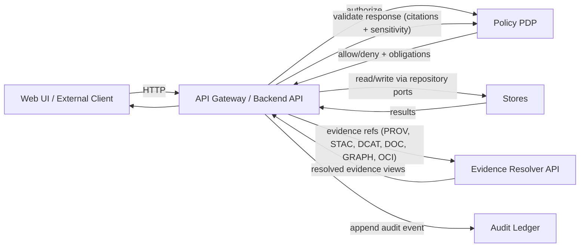
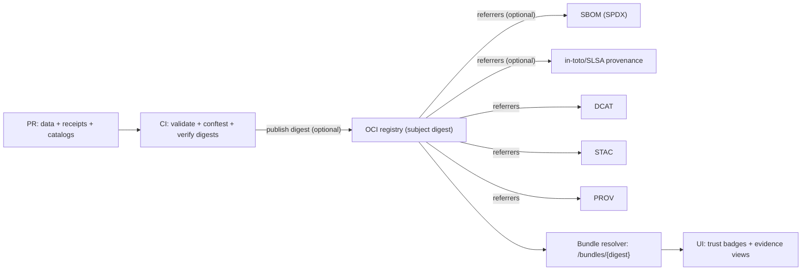

<!--
GOVERNED ARTIFACT NOTICE
FILE: .github/README.md
This README defines repo governance + CI enforcement surfaces. Changes are production changes.
If you change meaning (not just phrasing), route through governance review (CODEOWNERS + CI gates).
-->

# .github/ — KFM GitHub Operations, Governance & CI Gates


> [!IMPORTANT]
> **Why this file exists**
>
> This `.github/README.md` is the **single source of truth for repo governance and CI enforcement**:
> what must exist in `.github/`, which checks are mandatory, and which rules are **non-negotiable**.
>
> **Change impact:** Treat changes to this file as **production changes** (governance surface).

---

## 📌 Quick links

> Paths are KFM-standard expectations. If your repo differs, keep the boundaries identical even if names differ.

- **Repo root README**: `../README.md`
- **Workflows**: `./workflows/`
- **CODEOWNERS (required)**: `./CODEOWNERS`
- **Security policy**: `./SECURITY.md`
- **PR template**: `./PULL_REQUEST_TEMPLATE.md`
- **Release drafter**: `./release-drafter.yml`
- **Dependabot**: `./dependabot.yml`
- **Docs governance**: `../docs/README.md`
- **Data governance**: `../data/README.md`
- **Backend governance**: `../src/README.md`
- **Web UI governance**: `../web/README.md` *(or `../web/README.md` if UI lives under `web/`)*
- **Tools (validators)**: `../tools/README.md`
- **Tests (trust gates)**: `../tests/README.md`
- **Releases (immutable shipping records)**: `../releases/README.md`
- **Policies (OPA/Rego + Conftest)**: `../policy/` *(path name may differ)*
- **Contracts/schemas**: `../contracts/` *(or `../schemas/` as canonical alt)*
- **Infra/GitOps**: `../infra/` *(if present)*
- **Watchers**: `../watchers/` *(optional; governed if present)*
- **Scripts**: `../scripts/` *(thin runners + wrappers; governed if present)*

---

## 🧭 Table of contents

- [Governance header](#-governance-header-treat-as-production)
- [Change summary](#-change-summary-what-changed-in-v150)
- [Non-negotiables](#-nonnegotiables-kfm-invariants)
- [Trust membrane](#-trust-membrane--how-requests-flow)
- [Canonical addressing and evidence resolver contract](#-canonical-addressing--evidence-resolver-contract)
- [Promotion contract, receipts, and digest pinning](#-promotion-contract-receipts--digest-pinning-failclosed)
- [OCI evidence bundles and provenance hub](#-oci-evidence-bundles--provenance-hub)
- [Toolchain pinning and security advisory response](#-toolchain-pinning--security-advisory-response)
- [Branch protections and GitHub settings](#-branch-protections-and-github-settings-required)
- [What must live in `.github/`](#-what-must-live-in-github)
- [Expected repo directory layout](#-expected-repo-directory-layout-kfm-standard)
- [CI gates](#-ci-gates--the-kfm-no-merge-without-proof-standard)
- [Policy-as-code](#-policy-as-code-opa--conftest--default-deny)
- [Evidence and audit guarantees](#-evidence--audit-guarantees)
- [Data zones and promotion gates](#-data-zones--promotion-gates-raw--work--processed)
- [Sensitivity handling](#-sensitivity-handling-fair--care-enforced)
- [Watchers and automation governance](#-watchers--automation-governance)
- [PR workflow](#-pr-workflow-mandatory)
- [Supply chain](#-supply-chain-release--deploy-hard-requirement)
- [When CI fails](#-when-ci-fails--quick-diagnosis)
- [Reference docs](#-reference-docs-authority-ladder)
- [Definition of done](#-definition-of-done-for-githubreadmemd)
- [Appendix](#appendix)

---

## 🧾 Governance header (treat as production)

| Field | Value |
|---|---|
| Document | `.github/README.md` |
| Status | **Governed** (changes require review) |
| Applies to | workflows, branch protections, CODEOWNERS, templates, release gating, promotion contract enforcement |
| Version | `v1.5.0` |
| Effective date | **2026-02-14** |
| Review cadence | quarterly + out-of-band for security advisories/toolchain changes |
| Owners | defined in `.github/CODEOWNERS` *(required)* |
| Review triggers | changes touching `policy/`, `.github/workflows/`, `contracts/`/`schemas/`, catalogs/receipts, Story Nodes/docs validators, release tooling |

> [!WARNING]
> **Fail-closed governance rule:** If a required enforcement surface is missing (policy, receipts, catalogs, contract tests), the system denies promotion/merge/release by default.

---

## 🧷 Change summary (what changed in v1.5.0)

- Consolidated governance references to the updated repo-level READMEs:
  - `data/README.md`, `docs/README.md`, `src/README.md`, `tools/README.md`, `tests/README.md`, `releases/README.md`.
- Hardened “GitHub settings” section into a branch-protection checklist (required status checks, CODEOWNERS, signed commits recommended, no bypass).
- Made receipts first-class across CI and release gating:
  - run manifests + checksums + `spec_hash` semantics are explicitly merge-blocking.
- Clarified release record expectations: `releases/` is immutable and is verified by the same validators/gates.
- Added explicit mapping from CI gates → local commands (no CI-only magic).
- Tightened kill-switch semantics: publish/promote/release surfaces must deny when enabled.

---

## 🔒 Non-negotiables (KFM invariants)

These are not guidelines. They are contracts CI + policy must enforce.

1) **Trust membrane**
- UI/external clients never access databases or object storage directly.
- All access is via governed API gateway + policy decision point.
- Backend core logic never bypasses repository interfaces to talk to storage.

2) **Fail-closed policy**
- Default deny at policy boundaries (runtime + CI).
- Missing policy input / missing receipts / missing catalogs / missing citations → deny.

3) **Promotion Contract is mandatory**
- Promotion is Raw → Work → Processed.
- Promotion requires:
  - run manifest/receipt + validation report
  - deterministic checksums
  - catalogs (DCAT always; STAC conditional; PROV required)
  - policy labels + redaction provenance when sensitive
- No contract → no publish.

4) **Deterministic identity and digest pinning**
- Promoted artifacts have stable identity:
  - `spec_hash` for governed specs, and
  - content digests (sha256) for produced artifacts.
- Prefer immutable digests (`@sha256:…`) over mutable tags.

5) **Focus Mode must cite or abstain**
- Any factual answer includes citations or abstains.
- Every answer emits `audit_ref`.
- Citation refs must resolve (or deny safely) via evidence resolver.

6) **Contract-first APIs**
- OpenAPI is governed: changes require review + contract tests.
- `/api/v1` has a no-breaking-change gate.

7) **Workflow security is governance**
- Branch protection + required checks mandatory.
- Workflows least-privilege.
- Third-party actions pinned by commit SHA.
- Prefer OIDC/GitHub Apps over long-lived PATs.

---

## 🧱 Trust membrane — how requests flow



**Key rule:** any path that bypasses gateway or policy is a design defect and a CI failure.

---

## 🔗 Canonical addressing and evidence resolver contract

### Canonical address hierarchy
1) **Digest address** (governance root; immutable)
   - `oci://…@sha256:<digest>` (when bundles exist)
2) **Gateway resolver URL** (stable UI fetch)
   - `/api/v1/bundles/sha256:<digest>` (illustrative)
3) **Storage URL** (implementation detail; not provenance root)

### Evidence resolver acceptance criteria
- Every citation ref is resolvable via stable schemes:
  - `prov://`, `stac://`, `dcat://`, `doc://`, `graph://`, `oci://` (optional)
- UI can resolve any `citation.ref` in ≤ 2 API calls.
- Fail-closed:
  - missing target → 404
  - unauthorized/policy deny → 403 (non-leaky denial codes)

---

## 🧩 Promotion contract, receipts, and digest pinning (fail-closed)

### Required promotion artifacts (baseline)

| Artifact | Required | Canonical location (preferred) | Notes |
|---|---:|---|---|
| Raw manifest | ✅ | `data/raw/<dataset>/manifest.yml` | license + expected inputs + checksums + sensitivity |
| Checksums | ✅ | `data/**/checksums.sha256` | raw + processed integrity |
| Run record | ✅ | `data/work/<dataset>/runs/<run_id>/run_record.json` | inputs/outputs + code identity |
| Validation report | ✅ | `data/work/<dataset>/runs/<run_id>/validation_report.json` | schema/geo/time/license/policy |
| Run manifest (receipt) | ✅ | `data/work/<dataset>/runs/<run_id>/run_manifest.json` | Promotion Contract proof |
| DCAT | ✅ | `data/catalog/dcat/<dataset>.json` | required for all promoted datasets |
| STAC | ◻︎ conditional | `data/catalog/stac/<dataset>/**` | required when spatial assets exist |
| PROV | ✅ | `data/catalog/prov/<dataset>/run_<run_id>.json` | required lineage |
| Promotion audit event | ✅ | audit ledger | append-only; tamper-evident where supported |

### spec_hash semantics
- `spec_hash = sha256(JCS(spec))` (RFC 8785 canonical JSON)
- store `spec_schema_id` and `spec_recipe_version` for comparability.

---

## 📦 OCI evidence bundles and provenance hub



---

## 🧷 Toolchain pinning and security advisory response

- Pin third-party actions by commit SHA.
- Pin OPA, Conftest, Cosign, ORAS, and catalog validators.
- Tool upgrades require PR + regression tests + (if behavior changes) ADR entry.

> Tooling is governance surface: unpinned toolchains can silently weaken fail-closed.

---

## 🛡️ Branch protections and GitHub settings (required)

These settings are part of governance and should be enforced in repo settings.

### Required branch protections (for protected branches, e.g., `main`)
- Require pull request reviews (≥ 1; higher for governance surfaces)
- Require CODEOWNERS reviews
- Require status checks to pass before merging
- Require branches to be up to date before merging (recommended)
- Require conversation resolution before merging (recommended)
- Disallow force pushes
- Disallow deletions (recommended)
- Restrict who can push to protected branches (recommended)
- Allow merge only via PR (no direct pushes)

### Required status checks (minimum set)
- `docs`
- `stories`
- `contracts`
- `receipts`
- `catalogs`
- `policy`
- `api-contract`
- `build`

Optional/Recommended:
- `security`
- `supply-chain`
- `e2e` (nightly/pre-release)
- `watchers` (if watchers exist)

---

## 🗂️ What must live in `.github/`

Legend: ✅ required • 🟦 release required • 🟨 recommended • 🧭 optional

| Path | Required | Purpose |
|---|---:|---|
| `.github/README.md` | ✅ | governance SSoT |
| `.github/CODEOWNERS` | ✅ | review ownership |
| `.github/SECURITY.md` | ✅ | private reporting policy |
| `.github/PULL_REQUEST_TEMPLATE.md` | ✅ | PR governance checklist |
| `.github/workflows/ci.yml` | ✅ | required PR gates |
| `.github/workflows/policy-regression.yml` | ✅ | default deny regressions |
| `.github/workflows/api-contract.yml` | ✅ | `/api/v1` compatibility gate |
| `.github/workflows/release.yml` | 🟦 | release orchestration |
| `.github/workflows/supply-chain.yml` | 🟦 | SBOM/attestations verification |
| `.github/release-drafter.yml` | 🟨 | release notes automation |
| `.github/dependabot.yml` | 🟨 | dependency updates |
| `.github/workflows/watchers.yml` | 🧭 | watcher governance (if used) |

---

## 🧭 Expected repo directory layout (KFM standard)

```text
repo-root/
├─ .github/                              # CI workflows + repo governance (CODEOWNERS, templates, gated checks)
├─ docs/                                 # Governed documentation hub (standards, ADRs, runbooks, story nodes)
├─ contracts/                            # Promotion Contract + schemas (or use ./schemas/ as canonical alternative)
├─ policy/                               # OPA/Rego source + tests + bundles (default-deny; explicit allow)
├─ data/                                 # Governed data zones + catalogs/provenance
│  ├─ raw/                               # Immutable captures/manifests (never served)
│  ├─ work/                              # Regeneratable intermediates + receipts/validation (never served)
│  ├─ processed/                         # Publishable artifacts (servable; immutable per version)
│  └─ catalog/                           # Served catalogs (validated + cross-linked)
│     ├─ dcat/                           # DCAT publish index (datasets/distributions)
│     ├─ stac/                           # STAC discovery catalog (collections/items)
│     └─ prov/                           # PROV lineage bundles (run-linked)
├─ src/                                  # Backend + pipelines + graph (clean layers, ports/adapters, policy enforced)
├─ web/                                  # React/TS UI (trust membrane: network only via API/services)
├─ tools/                                # Tooling packs (policy, docs rendering, supply-chain, CI helpers)
├─ tests/                                # Repo-wide tests (unit/integration/contract/policy/ui/focus)
├─ scripts/                              # Optional: local wrappers + admin helpers (kept CI-parity where possible)
├─ watchers/                             # Optional: watcher registry (schedules/triggers) if not under data/registry
└─ infra/                                # Optional: deployment/GitOps (k8s/helm/argocd, secrets patterns, runbooks)
```

---

## ✅ CI gates — the KFM “no merge without proof” standard

### Gate matrix

| Gate | Protects | Must fail closed on |
|---|---|---|
| `docs` | governed docs integrity | lint/link/template failures |
| `stories` | Story Node validity | missing headings/citations/unresolvable refs |
| `contracts` | schema interoperability | Promotion Contract/receipt schema invalid |
| `receipts` | promotion correctness | missing/invalid run manifests; checksum mismatch |
| `catalogs` | discovery + provenance | invalid DCAT/STAC/PROV; broken cross-links |
| `policy` | governance safety | OPA/Conftest regression; allow-by-default drift |
| `api-contract` | API stability | breaking changes in `/api/v1` |
| `build` | deployability | build/smoke failures |

### Local parity (no CI-only magic)
Contributors should be able to run the same checks locally via `scripts/` or `tools/`.
Recommended entrypoint: `make verify` (repo-dependent).

---

## ⚖️ Policy-as-code (OPA + Conftest) — default deny

```rego
package kfm.ai
default allow := false

allow if {
  input.answer.has_citations == true
  input.answer.sensitivity_ok == true
}
```

Promotion guard (illustrative):

```rego
package kfm.promotion
default allow := false

allow if {
  input.run_manifest.valid
  input.catalogs.dcat.valid
  input.catalogs.prov.valid
  not input.catalogs.stac.required
} else if {
  input.run_manifest.valid
  input.catalogs.dcat.valid
  input.catalogs.prov.valid
  input.catalogs.stac.required
  input.catalogs.stac.valid
}
```

---

## 🧾 Evidence and audit guarantees

- governed responses include `audit_ref`
- citations resolve via evidence resolver (or deny safely)
- audit ledger is append-only; promotion events recorded
- evidence refs point to processed artifacts and catalogs (not raw/work)

---

## 🧬 Data zones and promotion gates (Raw → Work → Processed)

Promotion checklist is CI-enforced:
- license + attribution captured
- sensitivity classification present
- schema/geo/time validation passes
- checksums computed and verified
- run manifest exists and validates (spec_hash semantics included)
- catalogs emitted and validate (DCAT always; STAC conditional; PROV required)
- audit event recorded
- human approval recorded if classification != public

---

## 🧯 Sensitivity handling (FAIR + CARE)

- policy labels at dataset/record/field level
- derived datasets for redaction/generalization with PROV provenance
- deny on missing classification (fail closed)
- never leak sensitive coordinates or restricted fields in UI or evidence views

---

## 🛰️ Watchers and automation governance

If watchers exist:
- registry must be schema-validated and CODEOWNED
- conditional requests where possible
- material runs emit receipts (run manifests)
- kill switch applies to watcher PR automation and publish steps

---

## 🧾 PR workflow (mandatory)

- PR required; no direct pushes to protected branches
- CODEOWNERS enforced for governance surfaces:
  - `.github/**`, `policy/**`, `contracts/**`/`schemas/**`, `data/**`, `docs/**`, `releases/**`
- required checks must pass; no bypass
- signed commits/tags recommended for governance integrity

---

## 🔐 Supply chain (release and deploy)

Release/publish only when all gates pass. Prefer digest-addressed artifacts.
When enabled, attach/verify:
- SBOM (SPDX)
- provenance attestations (in-toto/SLSA)
- signatures (cosign/rekor)

Release records live in `releases/` and are immutable.

---

## 🚨 When CI fails — quick diagnosis

| Failure | Usually means | Fix |
|---|---|---|
| `contracts` | schema mismatch | update schema + fixtures; keep fail closed |
| `catalogs` | invalid DCAT/STAC/PROV | repair catalogs; fix cross-links |
| `receipts` | run manifest invalid / checksum mismatch | regenerate deterministically; fix spec_hash logic |
| `policy` | policy regression | update policy + tests; do not weaken deny |
| `api-contract` | `/api/v1` breaking change | refactor or bump to `/api/v2` |
| `docs/stories` | template/citation failures | fix headings/citations/resolution |
| `build` | build/smoke failures | align Docker contexts; fix env wiring |

---

## 📚 Reference docs (authority ladder)

If something conflicts:
1) non-negotiables win  
2) policy remains default deny  
3) escalate via ADR instead of weakening gates

Primary sources (internal drafts):
- KFM Next-Gen Blueprint & Primary Guide (2026-02-12)
- KFM Comprehensive Data Source Integration Blueprint (2026-02-12)
- Feb-2026 integration patterns: spec_hash, receipts, digest pinning, evidence bundles, kill switch

---

## ✅ Definition of done (for `.github/README.md`)

- [ ] required `.github` items exist
- [ ] branch protections enforce PR + CODEOWNERS + required checks
- [ ] CI gates run on every PR and fail closed
- [ ] policy default deny preserved and regression-tested
- [ ] promotion contract enforced via receipts + catalogs + checksums
- [ ] contributors can run checks locally (parity with CI)
- [ ] releases are immutable and verifiable via `releases/`

---

## Appendix

<details>
<summary><strong>Appendix: GitHub Actions hardening checklist</strong></summary>

- pin third-party actions by commit SHA
- least-privilege `GITHUB_TOKEN` permissions per job
- avoid `pull_request_target` unless absolutely necessary
- secret scanning / push protection and dependency scanning enabled
- use OIDC for cloud/registry auth where possible
- separate read-only PR validation from publish/release jobs
</details>
