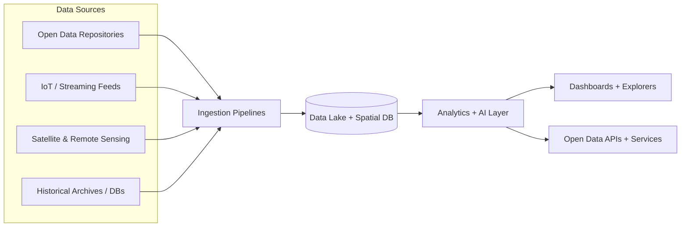

<!--
📍 File: .github/README.md
Kansas Frontier Matrix (KFM) — Project Overview for Developers + Public
-->

# Kansas Frontier Matrix (KFM) 🚀🌻

<!-- 🔧 Replace <ORG>/<REPO> in badges once finalized -->


> **An open, GIS-first data + analytics platform** connecting Kansas’s environment, infrastructure, and communities — breaking down data silos to drive evidence-based decisions and public transparency.

---

## 🧭 What is KFM?

KFM is a **pipeline → catalog → databases → API → UI** platform that transforms raw files into **trustworthy, explorable knowledge** — including maps, datasets, historical narratives, and AI-assisted analysis.

It’s designed for:
- 🏛️ **Agencies**: coordination, decision support, internal analytics
- 🧑‍🏫 **Educators & researchers**: reproducible data + stories + citations
- 🧑‍💻 **Developers**: clean APIs, standards-based GIS services, predictable workflows
- 🌎 **The public**: dashboards, download portals, transparent provenance

---

## 📚 Table of Contents

- [🕰️ History & Roadmap](#️-history--roadmap)
- [🧭 Core Principles](#-core-principles)
- [🏗️ Architecture Overview](#️-architecture-overview)
- [📦 Monorepo Layout](#-monorepo-layout)
- [🧰 Tech Stack](#-tech-stack)
- [⚙️ Installation & Setup](#️-installation--setup)
- [🔐 Governance, Privacy & Security](#-governance-privacy--security)
- [🧩 Standards & Interoperability](#-standards--interoperability)
- [📊 Public Dashboards & Open Data](#-public-dashboards--open-data)
- [📖 Stories & Historical Narratives](#-stories--historical-narratives)
- [🤝 Contributing](#-contributing)
- [❓ FAQ](#-faq)
- [💬 Support](#-support)
- [📜 License](#-license)

---

## 🕰️ History & Roadmap

KFM is built on the earlier **KFM 2.0** foundation and evolves the concept into a unified blueprint that combines:
- 🛠️ technical implementation (data systems, GIS, AI, remote sensing)
- 🧾 policy + governance (open standards, stakeholder integration, ethics)
- 🌐 public-facing tools (dashboards, visualizations, interactive web tools)

### 🗺️ Implementation phases (from the blueprint)

> Dates reflect the current planning roadmap and can be refined as execution progresses.

- **Phase 0 — Initiation (Q1 2026)** 🧭  
  Blueprint approval, team formation, initial cloud environments, governance/policy framework.
- **Phase 1 — Core Infrastructure & Data Integration (Q2–Q4 2026)** 🗄️  
  Base architecture, ingestion framework, initial datasets, metadata catalog, internal prototype dashboards.
- **Phase 2 — Analytics & Advanced Features (Q1–Q3 2027)** 🧠  
  ML/AI integration, advanced processing, performance scaling.
- **Phase 3 — Public Launch “KFM 3.0” (Q4 2027)** 🌐  
  Public portal deployment with polished dashboards + open data catalog, public communications, support channels.
- **Phase 4 — Iteration & Expansion (2028+) 🔁**  
  Dataset growth, UX & performance improvements, collaborations (hackathons, research projects), long-term sustainment.

---

## 🧭 Core Principles

KFM is not just “a data portal.” It’s an **accountable, provenance-first system**.

### 🧬 Provenance-first (“the map behind the map”)
- Every dataset, layer, story, and AI-assisted output should be traceable back to original sources.
- The platform emphasizes reproducibility and auditability.

### ✅ Canonical pipeline order (no shortcuts)
KFM enforces a predictable flow:

```mermaid
flowchart LR
  R[Raw] --> P[Processed] --> C[Catalog + Metadata] --> V[Provenance (W3C PROV)]
  V --> D[(Databases: PostGIS + Graph)]
  D --> A[API Layer]
  A --> U[UI: Dashboards + Stories + Tools]
```

### 🧯 “Fail closed” governance by default
If a policy check fails, KFM blocks the action (e.g., missing license/metadata → CI fails → no merge).  
This keeps the platform trustworthy as it scales.

### 🌱 FAIR + CARE by design
KFM bakes ethical and open-data principles into architecture and workflow:
- **FAIR**: Findable, Accessible, Interoperable, Reusable
- **CARE**: Collective Benefit, Authority to Control, Responsibility, Ethics

---

## 🏗️ Architecture Overview

KFM uses a layered, modular architecture:
- **Data ingestion** → **unified repository** → **analytics/AI** → **APIs** → **apps**
- Microservices for ingestion, processing, mapping, analytics, etc.
- Loose coupling + open standards + “single source of truth”

### 🔑 High-level flow



### 🔒 Access pattern (important)
- The **UI never directly touches databases**.
- All access is mediated by APIs, validation, and policy enforcement layers.

---

## 📦 Monorepo Layout

KFM’s comprehensive blueprint describes a monorepo approach where code, pipelines, data, provenance, and docs live together:

```text
📦 Kansas-Frontier-Matrix/
├── api/                       # Backend API (e.g., FastAPI)
├── web/                       # Frontend (React + TypeScript)
├── pipelines/                 # ETL pipelines / processing scripts
├── data/
│   ├── raw/                   # Immutable source snapshots
│   ├── processed/             # Standardized outputs
│   ├── catalog/               # STAC items, DCAT dataset records
│   └── provenance/            # W3C PROV lineage logs
└── docs/                      # Documentation + narratives / stories
```

---

## 🧰 Tech Stack

KFM is intentionally polyglot and modular.

### ☁️ Cloud & Infrastructure
- Cloud provider: AWS or Azure
- IaC: Terraform / CloudFormation
- Containers: Docker 🐳
- Orchestration: Kubernetes ☸️ (or cloud-native equivalents)
- Observability: centralized logs + metrics (ELK/Prometheus or cloud services)

### 🗄️ Storage & Databases
- Data Lake: S3 / Azure Data Lake (files, imagery, logs)
- Spatial DB: PostgreSQL + PostGIS 🗺️
- Graph/context linking (optional): Neo4j or equivalent
- Search index: Elasticsearch or equivalent

### 🔄 Data Engineering
- Orchestration: Airflow (or managed workflows)
- Streaming: Kafka/Kinesis-class tools
- Processing: Python (pandas, GeoPandas, GDAL/OGR)

### 🛰️ GIS & Remote Sensing
- GIS server: ArcGIS Enterprise or GeoServer
- Raster delivery: Cloud Optimized GeoTIFF (COGs)
- Distributed compute: Spark + spatial extensions (as needed)

### 🤖 Analytics & AI
- Frameworks: PyTorch / TensorFlow
- Notebooks: JupyterHub
- MLOps: SageMaker / Azure ML style pipelines

### 🌐 APIs & UI
- REST + JSON APIs
- Optional GraphQL for complex queries
- Auth: OAuth2 for protected resources
- Frontend: React + TypeScript ⚛️
- Visuals: maps + charts (Leaflet/Mapbox/Esri JS API + Plotly/D3)

---

## ⚙️ Installation & Setup

> Developer setup is designed around reproducible environments and automation.

### ✅ Prerequisites
Install:
- Git
- Docker + Docker Compose
- Node.js (LTS) + npm
- Python 3.8+

### 📥 Clone
```bash
git clone https://github.com/<ORG>/<REPO>.git
cd <REPO>
```

### 🧩 Configure environment variables
```bash
cp .env.example .env
```

Repeat for any service folder that includes its own `.env.example`.

### 🐳 Run the stack
```bash
docker-compose up --build
```

### 🔎 Verify services
- **Web UI**: check compose logs for the exact port (commonly `http://localhost:3000`)
- **API docs (Swagger UI)**: commonly `http://localhost:8000/docs` (FastAPI default)
- **GraphQL (if enabled)**: commonly `http://localhost:8000/graphql`

### 🧪 Tests (example pattern)
```bash
docker-compose exec api pytest
```

<details>
<summary>🛠️ Troubleshooting tips (ports, volumes, resources)</summary>

- **Port conflicts**: if you already run Postgres locally, remap container ports in `docker-compose.yml`.
- **Docker memory**: large datasets need more RAM; increase Docker Desktop memory if containers are slow/killed.
- **Volume permissions**: ensure `data/` is writable on your host OS.
- **Rebuild after dependency changes**:
  ```bash
  docker-compose build
  docker-compose up --build
  ```

</details>

---

## 🔐 Governance, Privacy & Security

KFM follows an “**open by default, protected where required**” approach.

### 🧾 Data governance (how data gets in)
- Each dataset has a **steward/owner** responsible for accuracy and updates.
- Every dataset must include rich metadata (source, last update, update frequency, contact info, etc.).
- Metadata standards include **DCAT** (and potentially ISO 19115 for geospatial metadata).
- Data lifecycle policies support archiving/deprecation without losing historical records.
- Open licensing by default (e.g., Creative Commons Attribution) unless restricted by agreements.

### 🕵️ Privacy by design (PII minimization)
- Most datasets should be aggregate/non-personal.
- If sensitive datasets exist, KFM enforces strict access controls and anonymization.
- Personal data should be de-identified before inclusion in open catalogs.
- Privacy practices align with best-practice principles (e.g., FIPPs) and modern expectations.

### 🛡️ Security posture
- Mandatory security training, incident response planning, periodic audits.
- Access is logged and auditable; sensitive dataset access can be tracked per user.

---

## 🧩 Standards & Interoperability

KFM is designed to plug into the broader GIS + open data ecosystem:

- 🗺️ **OGC standards**: WMS (maps), WFS (features), WCS (coverage/imagery)
- 🛰️ **STAC**: for remote sensing / spatiotemporal asset catalogs
- 🧾 **DCAT**: machine-readable dataset catalog export (harvestable to broader catalogs)
- 🔐 **OAuth2**: standard auth where required
- 📦 Common download formats: CSV, GeoJSON, Shapefile, KML, GeoTIFF

---

## 📊 Public Dashboards & Open Data

KFM’s public experience focuses on clarity, interactivity, and accessibility:
- 🗺️ map-driven dashboards
- 📈 charts and time-series exploration
- 🎛️ filters (geography, time, category)
- ♿ accessibility-minded UI patterns

### 🌐 Open Data Portal
- searchable dataset catalog with metadata
- downloads in common formats
- APIs for programmatic access

---

## 📖 Stories & Historical Narratives

A unique pillar of KFM is its “living atlas” concept:
- historical narratives sit beside maps and datasets
- stories carry metadata (author/date/sources)
- stories and datasets are version-controlled and reviewed via GitHub PRs

This bridges Kansas’s **past and present** — combining archives, spatial truth, and modern analytics.

---

## 🤝 Contributing

We welcome code, data, documentation, and story contributions 🙌

### 🧑‍💻 What you can contribute
- **Code**: API services, UI components, pipeline modules
- **Data**: new datasets, validations, catalog records, provenance logs
- **Stories**: historical narratives with citations and metadata
- **Docs**: architecture guides, runbooks, tutorials

### ✅ Contribution rules of thumb
- No “mystery data” — include licenses and sources
- Add metadata + provenance with datasets
- If checks fail, CI should block merges (“fail closed”)

<details>
<summary>✨ Suggested contribution flow</summary>

1. Fork the repo  
2. Create a branch: `feature/<short-name>`  
3. Make changes + add tests/docs  
4. Open a PR with:
   - what changed
   - why it changed
   - how to test
   - any data lineage + citations (if relevant)

</details>

---

## ❓ FAQ

### Is KFM open-source?
Yes — KFM is designed as an open, collaborative platform.

### Is KFM “just a GIS portal”?
No. KFM is a full pipeline–catalog–database–API–UI system with governance, provenance, and reproducibility built in.

### How does KFM ensure trust?
Provenance-first design: traceable sources, metadata standards, version control, and policy enforcement.

---

## 💬 Support

- 🐛 Report issues via GitHub Issues
- 💡 Propose enhancements via Discussions
- 📚 Explore `docs/` for architecture and governance details
- 🤝 Join the contributor community (links can be added here)

---

## 📜 License

MIT License (see `LICENSE`).

> Note: datasets may have their own licenses/terms; KFM’s governance model requires that licensing is documented and honored.

---

<p align="center">Made with ❤️ for Kansas — an open, living atlas of data, maps, and stories.</p>