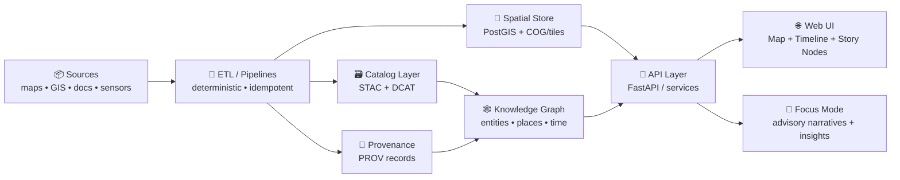
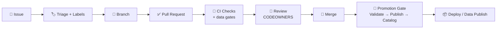

# 🤝 `.github/` — Collaboration & Automation Hub (Kansas Frontier Matrix)

[](#-how-to-contribute)
[](https://github.com/bartytime4life/Kansas-Frontier-Matrix/issues)
[](#-pull-requests)
[](https://github.com/bartytime4life/Kansas-Frontier-Matrix/actions/workflows/ci.yml)
[](https://github.com/bartytime4life/Kansas-Frontier-Matrix/actions/workflows/codeql.yml)
[](#-kfm-mdp--why-our-gates-are-strict)
[](#-data-promotion-gates-stacdcatprov)
[](#-security--privacy)
[](../LICENSE)

> [!NOTE]
> This README documents **how we collaborate on GitHub**: issues, pull requests, reviews, labels, protection rules, and automation.  
> ✅ Start with the project overview: **[`../README.md`](../README.md)**

---

## ⚡ Quick links

| Action | Link |
|---|---|
| 🐛 Report a bug | [Open bug report](https://github.com/bartytime4life/Kansas-Frontier-Matrix/issues/new?template=bug_report.yml) |
| ✨ Request a feature | [Open feature request](https://github.com/bartytime4life/Kansas-Frontier-Matrix/issues/new?template=feature_request.yml) |
| 🗺️ Request a data layer/source | [Request a layer/source](https://github.com/bartytime4life/Kansas-Frontier-Matrix/issues/new?template=data_layer_request.yml) |
| 🧰 Request a pipeline / automation | [Open pipeline request](https://github.com/bartytime4life/Kansas-Frontier-Matrix/issues/new?template=pipeline_request.yml) *(add if missing)* |
| 🎬 Request a Story Node (3D narrative) | [Open Story Node request](https://github.com/bartytime4life/Kansas-Frontier-Matrix/issues/new?template=story_node_request.yml) *(add if missing)* |
| ❓ Ask a question | [Ask a question](https://github.com/bartytime4life/Kansas-Frontier-Matrix/issues/new?template=question.yml) |
| 🧪 See CI runs | [GitHub Actions](https://github.com/bartytime4life/Kansas-Frontier-Matrix/actions) |
| 🔎 Catalog QA gate | [`catalog-qa.yml`](https://github.com/bartytime4life/Kansas-Frontier-Matrix/actions/workflows/catalog-qa.yml) *(add if missing)* |
| 🔐 Security policy | [`./SECURITY.md`](./SECURITY.md) *(add if missing)* |

> [!TIP]
> If a template link 404s, use the chooser: https://github.com/bartytime4life/Kansas-Frontier-Matrix/issues/new/choose

---

## 🧭 What we’re building (context in 20 seconds)

Kansas Frontier Matrix (KFM) is a **living atlas of Kansas** 🏛️🗺️ — integrating **historical archives**, **modern geospatial/sensor data**, and **future projections** into a single system that supports:
- interactive **maps + timelines** ⏳
- narrative **Story Mode / Story Nodes** 🎬
- an advisory **Focus Mode** AI assistant 🧠 (grounded + human-controlled)

KFM is intentionally **pipeline-driven**: data flows through a governed order (ETL → catalog → graph → API → UI), with validation gates that can’t be skipped. ✅



> [!IMPORTANT]
> This `.github/` folder is the **GitHub operations layer** for KFM — keep it clean, predictable, and boring (in the best way). ✅

---

## 🧩 What lives in `.github/`

This folder defines the “how we ship” layer: templates, workflows, routing, and governance. 🤖🧾

```text
📁 .github/
├─ 📁 workflows/                         # 🤖 CI/CD + automation
│  ├─ ci.yml                             # ✅ tests + lint + typecheck + build
│  ├─ codeql.yml                         # 🔐 CodeQL security scan
│  ├─ catalog-qa.yml                     # 🔎 STAC quick gate (data/** PRs)
│  ├─ stac-validate.yml                  # 🧾 full STAC validation (optional)
│  ├─ prov-validate.yml                  # 🧾 PROV validation (optional)
│  ├─ data-pipelines.yml                 # 🗺️ scheduled data refresh (optional)
│  ├─ pages.yml                          # 🌐 build/deploy docs/UI (optional)
│  ├─ release.yml                        # 🏷️ release packaging (optional)
│  └─ security.yml                       # 🔎 dependency + secret scans (optional)
├─ 📁 ISSUE_TEMPLATE/                    # 🧾 guided issue creation (issue forms)
│  ├─ bug_report.yml
│  ├─ feature_request.yml
│  ├─ data_layer_request.yml
│  ├─ pipeline_request.yml               # 🧰 add if missing
│  ├─ story_node_request.yml             # 🎬 add if missing
│  └─ question.yml
├─ 📄 PULL_REQUEST_TEMPLATE.md           # ✅ PR checklist & review prompts
├─ 📄 CODEOWNERS                         # 👀 review routing by area
├─ 📄 dependabot.yml                     # ♻️ dependency updates (recommended)
├─ 📄 labels.yml                         # 🏷️ canonical label taxonomy (recommended)
├─ 📄 release-drafter.yml                # 📝 auto-draft release notes (optional)
├─ 📄 SECURITY.md                        # 🔐 vuln reporting (recommended)
└─ 📄 README.md                          # 📍 you are here
```

> [!NOTE]
> If any of the files above don’t exist yet, this README acts as the **spec** for what we should add next.

---

## 🔁 Workflow: Issue → PR → Merge → Promote → Ship



### 🧠 Working agreements (short + strict)
- **If it changes behavior, it needs docs.** 📚  
- **If it changes data, it needs provenance.** 🧾🗺️  
- **If it touches `data/**`, it must pass Catalog QA.** 🔎✅  
- **If CI fails, we don’t merge.** 🤖🚫  
- **If it’s unclear, open an issue first.** 🧭  

---

## 🧱 KFM-MDP & why our gates are strict

KFM uses a governance-driven workflow (KFM-MDP) where **validation is a first-class citizen**:
- data moves through **staging → validation → atomic publish**
- failures trigger **rollbacks** (or kill-switch behavior) instead of pushing broken catalogs
- catalogs must remain **federation-ready** (indexers hate missing `license/providers/stac_extensions`)

> [!TIP]
> Treat metadata like code: **schema drift** is a bug. 🐛

---

## 🛡️ Branch protection & merge strategy

Configured in **Repo Settings** (not files). Recommended guardrails:

- ✅ Require PRs (no direct pushes to `main`)
- ✅ Require status checks (CI + security + data gates)
- ✅ Require at least **1–2 approvals** (CODEOWNERS if relevant)
- ✅ Require “Resolve conversations” before merge
- ✅ Block force-pushes to protected branches
- ✅ Prefer **Squash merge** (or **Rebase merge** if you enforce linear history)

### ✅ Recommended required checks (baseline)
- `ci` ✅
- `codeql` 🔐 *(if enabled)*
- `catalog-qa` 🔎 *(required when `data/**` changes)*

> [!TIP]
> If you enable auto-merge, only allow it when **all required checks** pass.

---

## 🧾 Issues

Use issues for **everything**: bugs, data layers, UI changes, pipeline improvements, docs, research notes.

### ✅ Before filing
- Search existing issues/PRs
- Add screenshots (UI), logs (pipelines), or minimal repro (code)
- For geospatial requests: include **time range** + **spatial extent** (bbox, county, township/range, etc.)
- For catalog/pipeline requests: include **dataset id**, **expected STAC/DCAT shape**, and **provenance needs**

### 🏷️ Recommended issue categories (labels)
- `type:bug` 🐛 — something broken
- `type:feature` ✨ — new capability
- `type:data` 🗺️ — new layer/source, ingestion, catalog updates
- `type:pipeline` 🧰 — ETL/automation/schedulers/validators
- `type:docs` 📚 — documentation improvements
- `type:story` 🎬 — Story Nodes / narrative layer
- `type:chore` 🧹 — refactor, tooling, dependencies
- `type:security` 🔐 — security-related changes *(avoid public details; see below)*

---

## ✅ Pull Requests

PRs should be **small, reviewable, and testable**.

### 🌿 Branch naming
- `feat/<short-scope>` — new features
- `fix/<short-scope>` — bug fixes
- `data/<source-or-layer>` — data/catalog changes
- `pipe/<pipeline-or-validator>` — pipeline/CI/automation work
- `docs/<topic>` — documentation

### 🧪 PR must include
- A clear summary (“what + why”)
- Testing notes (unit/integration/manual)
- Docs updates **if behavior changes**
- Data provenance notes **if layers change** (see below)

### 📏 PR size guideline
Prefer < **400 lines** changed unless there’s a strong reason.

### 🧾 PR description essentials (geo-specific)
Include:
- **EPSG / CRS** (and whether you used STAC `proj:*` fields)
- **bbox** (or named region)
- **time coverage** (year / range / undated)
- **format** (COG/GeoJSON/tiles/etc.)
- **preview proof** (screenshot + zoom level)
- **catalog impact**: which `collection.json` / `catalog.json` was updated

> [!IMPORTANT]
> Link issues in the PR body using: `Closes #123` ✅  
> This auto-closes issues on merge and keeps history tidy.

---

## 👀 Reviews & ownership

### ✅ CODEOWNERS = routing
- CODEOWNERS live in **[`./CODEOWNERS`](./CODEOWNERS)** 👀  
- If you’re unsure who owns an area, open an issue with `status:needs-triage` and we’ll route it.

### 🤝 Review etiquette
- Review **the change**, not the person.
- Ask for evidence: screenshots, logs, benchmarks, repro steps.
- Prefer “suggestion” comments over blockers when possible.
- If you request changes, be explicit: **what** and **why**.

---

## 🏷️ Label taxonomy (keep it consistent)

Use prefixes so filters, search, and boards stay sane:

- `type:*` → intent (bug/feature/data/pipeline/story/docs/chore/security)
- `area:*` → subsystem
  - `area:pipeline` 🧰
  - `area:catalog` 🗃️
  - `area:stac` 🧾
  - `area:prov` 🧾
  - `area:graph` 🕸️
  - `area:ai` 🧠
  - `area:web` 🌐
  - `area:db` 🗄️
  - `area:story` 🎬
  - `area:docs` 📚
- `priority:*` → urgency (`p0`, `p1`, `p2`)
- `status:*` → workflow state (`blocked`, `needs-info`, `ready`, `in-progress`)
- `good-first-issue` 🌱 → newcomer-friendly

> [!TIP]
> Keep labels **predictable**. “Cute” labels are fun… until boards become unusable. 😅

---

## 🤖 Automation & required checks

### ✅ What CI should do (minimum bar)
- Lint + formatting checks
- Unit tests (fast)
- Type checking (where applicable)
- Build (web + CLI tooling)
- Optional: integration tests for pipelines (nightly or on-demand)

### 🔎 Catalog QA (STAC quick gate) — fast PR filter

This is a **high-ROI** gate that runs on PRs touching `data/**` (and validator code). It prevents broken catalogs from merging.

**Checks (fast):**
- `license` must exist and be non-empty ✅  
- `providers` must be a non-empty array ✅  
- `stac_extensions` must exist (warn if empty; can fail on warn) ✅  
- top-level `links[].href` are checked via HEAD/GET ✅  

**Reference implementation (recommended):**
- Script: `tools/validation/catalog_qa/run_catalog_qa.py`
- Config (optional): `tools/validation/catalog_qa/config.yml`
- CI: `.github/workflows/catalog-qa.yml`

**Local usage:**
```bash
python3 tools/validation/catalog_qa/run_catalog_qa.py \
  --root data/ \
  --glob "**/collection.json" \
  --fail-on-warn
```

> [!TIP]
> Catalog QA is a **quick gate**. It’s not a substitute for full JSON-Schema validation — it’s the “stop bad PRs early” filter. 🧯

---

## 🚦 Data promotion gates (STAC/DCAT/PROV)

KFM data isn’t “done” when files exist. It’s done when it’s **discoverable + trustworthy**:

- **STAC**: Items/Collections for geospatial assets (COGs, tiles, quicklooks, etc.)
- **DCAT**: Dataset-level roll-ups and distributions for portal/federation
- **PROV**: a traceable chain from raw → processed → published

### ✅ Promotion checklist (what reviewers should look for)
- [ ] Catalog QA passed 🔎✅
- [ ] Full schema validation ran (STAC/DCAT/PROV) 🧾✅ *(nightly or manual OK)*
- [ ] Atomic publish / staging approach documented 📦
- [ ] Rollback story exists (kill-switch or rollback tag) 🧯
- [ ] Links in catalog are reachable 🔗✅

---

## 🔐 Security & privacy

- Never commit secrets (tokens, keys, credentials)
- Use GitHub Secrets + environment variables
- For vulnerabilities: open a **private** report (or follow `SECURITY.md` if present)

### 🧭 Data sensitivity rule
If a dataset contains **sensitive locations** (e.g., culturally sensitive sites):
- generalize location precision (mask/jitter/grid indexing)
- do not publish exact coordinates unless explicitly allowed by governance policy

> [!CAUTION]
> Don’t paste sensitive endpoints, server IPs, or access patterns in public issues.

---

## 🗺️ Data & layer contribution rules (non-negotiable)

### ✅ Provenance checklist (required)
Any new/updated dataset **must** include:

- Source name + link (or archive reference)
- License/terms (or “unknown” with rationale)
- Spatial reference (EPSG) and units
- Time coverage (single year, range, or “undated”)
- Processing steps (georef points count, resampling, simplification, etc.)
- Checksums (recommended) and version stamp

> [!WARNING]
> If we can’t explain where the data came from and how it was processed, we can’t trust it — and it won’t ship.

### 🧱 Preferred formats
- Raster: **COG** (Cloud-Optimized GeoTIFF) ✅
- Vector: **GeoJSON** (or GeoPackage/Shapefile when justified)
- Interchange for Google Earth: **KML/KMZ** (regionated if large)
- Tiles: vector/raster tiles only when needed for UX/performance

### 🧾 STAC projection metadata (recommended for rigor)
When applicable, include STAC **Projection Extension** fields in Items/Collections:
- `proj:code` (e.g., `EPSG:4326`)
- `proj:bbox`, `proj:geometry`
- `proj:shape`, `proj:transform` (rasters)

> [!TIP]
> Prefer **Stable** STAC extensions for “production” catalogs; warn when an extension is Pilot/Proposal. 🧾🟢

---

## 🧠 AI / analytics contributions (keep it scientific)

We accept AI/ML contributions when they are:
- Transparent (inputs/outputs + limitations)
- Evaluated (not vibes)
- Reproducible (seeded, versioned, documented)

### 🧭 Focus Mode rules (human-first)
- Focus Mode is **advisory** (never autonomous)
- Outputs should be grounded in KFM sources where possible
- Sensitive topics must follow CARE-aligned filters (generalize/omit precise sensitive info)
- AI-generated content must be labeled, and citations provided when available

### 🧾 Required artifacts for ML-ish PRs
- A short **dataset note** (what, where from, known biases)
- An **evaluation note** (metrics + what “good” means)
- A **model/experiment card** in `mcp/model_cards/` (or equivalent)

---

## 🌐 Frontend contributions (maps + time + story)

UI work should keep these goals in mind:
- Layer toggles + strong legend behavior 🗺️
- Timeline/time slider that filters layers cleanly ⏳
- Progressive loading for heavy data (tiles, regionated KML, etc.)
- Accessibility + responsive layouts 📱🖥️
- Story Nodes should be deterministic (camera path, timing, fades) 🎬

---

## ✅ Definition of Done

Use this as the final self-check before requesting review:

- [ ] Issue is linked (or clearly explained why not)
- [ ] Tests added/updated (or explained why not)
- [ ] Docs updated (README/ARCHITECTURE/SOP) if behavior changed
- [ ] Data provenance included (if data touched)
- [ ] Catalog QA passed (if `data/**` touched)
- [ ] No secrets in commits, logs, or screenshots
- [ ] Reviewer can reproduce locally (steps included)

---

## 📚 Project reference library (the “why” behind our standards)

<details>
<summary><strong>📖 Expand the full reading map (project files)</strong></summary>

### 🧭 Canonical KFM design docs
- `docs/architecture/Kansas Frontier Matrix (KFM) – Comprehensive Engineering Design.docx`
- `docs/notes/Latest Ideas.docx`

### 🗺️ GIS, geoprocessing, remote sensing
- `docs/library/python-geospatial-analysis-cookbook.pdf`
- `docs/library/making-maps-a-visual-guide-to-map-design-for-gis.pdf`
- `docs/library/Cloud-Based Remote Sensing with Google Earth Engine-Fundamentals and Applications.pdf`
- `docs/library/Mobile Mapping_ Space, Cartography and the Digital - 9789048535217.pdf`

### 🌐 Web + graphics + 3D
- `docs/library/responsive-web-design-with-html5-and-css3.pdf`
- `docs/library/webgl-programming-guide-interactive-3d-graphics-programming-with-webgl.pdf`

### 📈 Statistics, experiments, modeling discipline
- `docs/library/Understanding Statistics & Experimental Design.pdf`
- `docs/library/regression-analysis-with-python.pdf`
- `docs/library/Regression analysis using Python - slides-linear-regression.pdf`
- `docs/library/graphical-data-analysis-with-r.pdf`
- `docs/library/think-bayes-bayesian-statistics-in-python.pdf`

### 🧪 Simulation, optimization, advanced math
- `docs/library/Scientific Modeling and Simulation_ A Comprehensive NASA-Grade Guide.pdf`
- `docs/library/Generalized Topology Optimization for Structural Design.pdf`
- `docs/library/Spectral Geometry of Graphs.pdf`

### 🧰 Engineering foundations (systems, DBs, tooling)
- `docs/library/PostgreSQL Notes for Professionals - PostgreSQLNotesForProfessionals.pdf`
- `docs/library/Scalable Data Management for Future Hardware.pdf`
- `docs/library/concurrent-real-time-and-distributed-programming-in-java-threads-rtsj-and-rmi.pdf`
- `docs/library/Data Spaces.pdf`

### 🧑‍⚖️ Ethics & governance
- `docs/library/Introduction to Digital Humanism.pdf`
- `docs/library/Principles of Biological Autonomy - book_9780262381833.pdf`
- `docs/library/On the path to AI Law’s prophecies and the conceptual foundations of the machine learning age.pdf`

### 🧱 General programming shelf (bundles)
- `docs/library/A programming Books.pdf`
- `docs/library/B-C programming Books.pdf`
- `docs/library/D-E programming Books.pdf`
- `docs/library/F-H programming Books.pdf`
- `docs/library/I-L programming Books.pdf`
- `docs/library/M-N programming Books.pdf`
- `docs/library/O-R programming Books.pdf`
- `docs/library/S-T programming Books.pdf`
- `docs/library/U-X programming Books.pdf`

</details>

---

## 🧑‍💻 Maintainers & ownership

- CODEOWNERS live in **[`./CODEOWNERS`](./CODEOWNERS)** 👀  
- If you’re unsure who owns an area, open an issue with `status:needs-triage` and we’ll route it.

---

## 🧾 Next “missing but expected” files

If they don’t exist yet, consider adding:

- `SECURITY.md` 🔐 (vulnerability reporting)
- `CONTRIBUTING.md` 🤝 (expanded dev setup + conventions)
- `docs/ARCHITECTURE.md` 🧱 (system boundaries + runtime diagram)
- `.github/workflows/ci.yml` ✅ (lint/test/build)
- `.github/workflows/catalog-qa.yml` 🔎 (STAC quick gate)
- `.github/PULL_REQUEST_TEMPLATE.md` ✅ (checklist)
- `.github/dependabot.yml` ♻️ (dependency updates)
- `.github/labels.yml` 🏷️ (label source of truth)
- `.github/release-drafter.yml` 📝 (release notes automation)

---

## 🙌 How to contribute

1. Pick an issue (or open one) 🧾  
2. Claim it (comment) ✍️  
3. Create a branch 🌿  
4. Open a PR ✅  
5. Iterate with review feedback 👀  
6. Merge when checks are green 🤖🟢  

---

**Thanks for building the Matrix.** 🧭🗺️✨