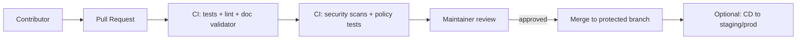

# Kansas Frontier Matrix (KFM) — `.github/` (CI/CD + Contribution Gates)

> This folder is part of KFM’s **governance membrane**: it holds GitHub-native automation and templates that help ensure changes (code, data, and docs) remain **validated, provenance-linked, and policy-compliant** before they reach `main`.

---

## 📘 Overview

### Purpose
The `.github/` directory centralizes **contribution gates** and repo automation (CI checks, review scaffolding, and optional issue/PR templates) so that:
- **Every pull request** is validated by automation (tests + lint + governance checks).
- Documentation changes remain **template-aligned** (emoji-section headings, required sections, valid citations/refs, link integrity).
- Sensitive data governance expectations are enforced consistently at review time.

### Scope
**In scope (this folder typically contains):**
- GitHub Actions workflows under `.github/workflows/` (CI and optionally CD).
- PR and issue templates that route contributors through required checklists and governance expectations.

**Out of scope (handled elsewhere in the repo):**
- System architecture details: see `docs/` (architecture, governance, standards).
- Data pipeline + catalogs: see `data/` + `docs/` (Truth Path, STAC/DCAT/PROV).
- Source code and service config: see `src/`, `web/`, `docker-compose.yml`, etc.

### Audience
- Contributors opening PRs (docs, data, code).
- Reviewers / maintainers enforcing KFM governance and release quality.
- Governance reviewers (FAIR+CARE / sovereignty / ethics reviewers) when changes touch sensitive topics or data.

### Definitions (KFM-specific)
- **Governed document:** a Markdown file that follows an approved template structure and is subject to CI validation.
- **Truth Path:** the staged data lifecycle from raw → processed → published outputs (with validation gates + provenance).
- **Focus Mode:** an AI-assisted Q&A interface that must use verified KFM data and provide citations.
- **IDS / Indigenous Data Sovereignty:** Indigenous peoples’ right to control data about their peoples, lands, and cultures; includes special handling for sensitive knowledge and Indigenous participation in governance.

### Key artifacts & references (start here)
> Prefer canonical docs + checklists over “tribal knowledge.”

- `docs/MASTER_GUIDE_v13.md` *(canonical repo structure + pipeline sequencing; path/name expected per standards)*
- `docs/standards/` *(Markdown + work protocols, assistant usage rules)*
- `docs/ci/` and `docs/ci/checklists/` *(PR + validation checklists; required gates)*
- `docs/governance/` *(ROOT_GOVERNANCE, ETHICS, SOVEREIGNTY policies)*
- `docs/templates/` *(TEMPLATE__KFM_UNIVERSAL_DOC, TEMPLATE__STORY_NODE_V3, etc.)*

> [!IMPORTANT]
> KFM treats documentation as **governed**: CI may reject a PR if Markdown structure, headings, citations/references, links, or sensitivity handling do not conform to the required standards.

---

## 🗂️ Directory Layout

This README documents **`.github/`**. Common contents include:

| Area | Path | What it’s for |
|---|---|---|
| Workflows | `.github/workflows/` | CI pipelines (tests, linting, Markdown validation, security scans, OPA policy tests). |
| PR template | `.github/PULL_REQUEST_TEMPLATE.md` | Enforces PR metadata + links to required checklists and governance prompts. |
| Issue templates | `.github/ISSUE_TEMPLATE/` | Structured bug/feature/data-submission templates (optional). |
| Repo automation | `.github/dependabot.yml` | Dependency update automation (optional). |

Related (outside `.github/`) but frequently referenced by workflows/templates:

| Area | Path | What it’s for |
|---|---|---|
| CI guidance + checklists | `docs/ci/` | How CI gates work; validation rules; PR checklist(s). |
| Governance | `docs/governance/` | Sensitivity, ethics, sovereignty rules; approval requirements. |
| Templates | `docs/templates/` | Governed doc templates (universal docs, story nodes, API extension docs). |

---

## 🧭 Context

KFM is designed so that **quality and trust are enforced programmatically**:
- Every commit/PR passes through CI gates (tests, linting/formatting, doc validation, and security scanning).
- Documentation governance is validated automatically (required sections, emoji headings, reference integrity, no broken links).
- Policy rules are testable (e.g., OPA policy tests) and can be used to block invalid or non-compliant changes.

This is the practical meaning of the **governance membrane**: external contributions can be accepted, but only after automated checks + maintainer approval confirm the change does not compromise integrity.

---

## 🗺️ Diagrams

### PR gating path (high-level)

---

## 🧪 Validation & CI/CD

### What CI is expected to enforce
CI should be treated as **required** for merge. Common gates described in KFM docs include:

- ✅ **Test suite** (backend/frontend/unit/integration as applicable)
- ✅ **Linters + formatters** for code
- ✅ **Markdown linter/validator** for governed docs
  - Confirms required sections exist (e.g., Overview, Version History)
  - Confirms emoji headings match the registry
  - Confirms citations/refs are consistent and links aren’t broken
- ✅ **Security checks**
  - Static analysis, dependency vulnerability scans
  - Secret scanning / “no secrets in repo” expectations
- ✅ **Policy tests** (e.g., `opa test` for Rego rules) to ensure governance rules behave as intended

> [!NOTE]
> The goal is not “green CI at all costs.” The goal is **traceable correctness**: if it’s not standard, it doesn’t progress.

### Data + documentation contribution gates
When a PR includes **data, story nodes, or metadata**, CI should also support gates such as:
- Presence of required metadata (e.g., DCAT record, sensitivity tags where needed)
- Data validation tests (schemas, checksums, expected outputs)
- Checklist-driven review prompts for sensitive/sovereignty-relevant content

### Local workflow tips (before opening a PR)
Use this as a minimal pre-flight checklist:

- [ ] Run local checks where available (e.g., `pre-commit run --all-files`)
- [ ] Preview Markdown rendering (GitHub/VSCode)
- [ ] Verify links + references
- [ ] Update **🕰️ Version History** for non-trivial doc changes
- [ ] If touching sensitive content, confirm governance handling + reviewers are flagged

---

## ⚖️ FAIR+CARE & Governance

KFM governance is shaped by **FAIR + CARE** and Indigenous Data Sovereignty expectations:
- **FAIR:** Findable, Accessible, Interoperable, Reusable
- **CARE:** Collective Benefit, Authority to Control, Responsibility, Ethics

Implications for `.github/` automation and templates:
- PR workflows should prompt contributors to include provenance/metadata (and not ship “naked facts”).
- Review templates should flag when specialized review is required (e.g., sovereignty-sensitive content).
- CI/policy checks should support protective handling (e.g., sensitivity metadata, policy-enforced access controls, and safeguards like coordinate blurring where required by governance decisions).

### Disclosure
If AI assistance was used to draft or modify governed documentation, note that in the relevant **Version History** entry (and ensure the content is still evidence-backed and policy-compliant).

---

## 🕰️ Version History

| Version | Date (YYYY-MM-DD) | Summary of Changes | Author |
|---|---:|---|---|
| v1.0 | 2026-02-09 | Initial `.github/README.md` describing KFM CI/CD and contribution governance gates. | KFM Maintainers (AI-assisted draft) |